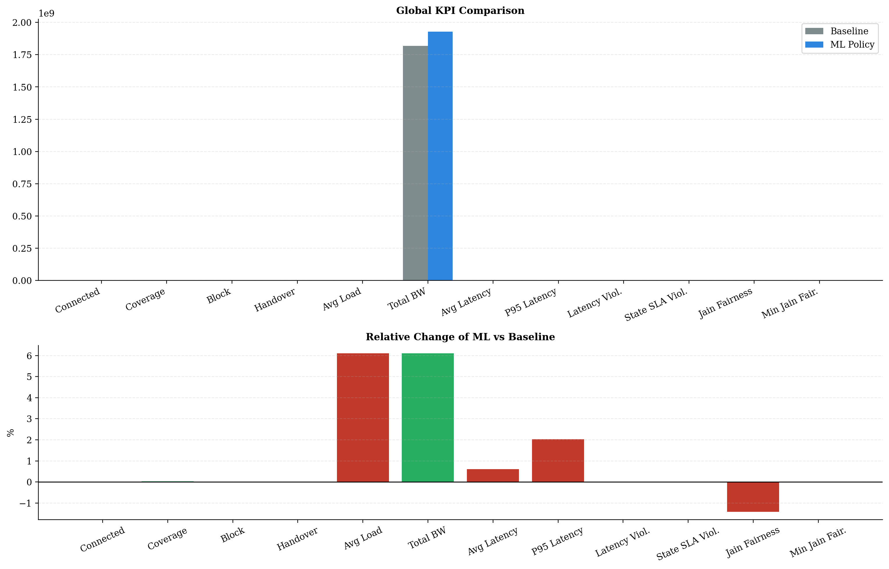
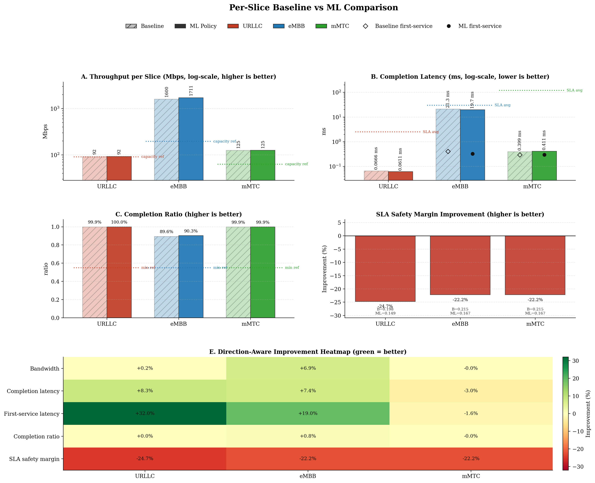
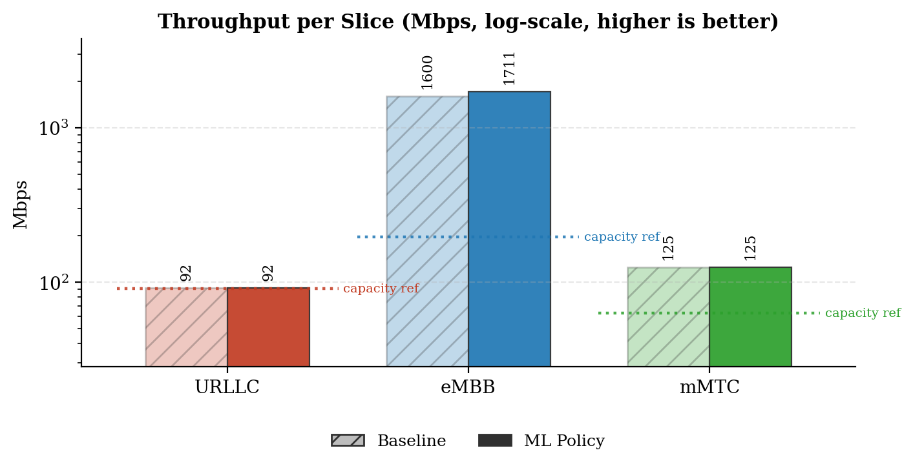
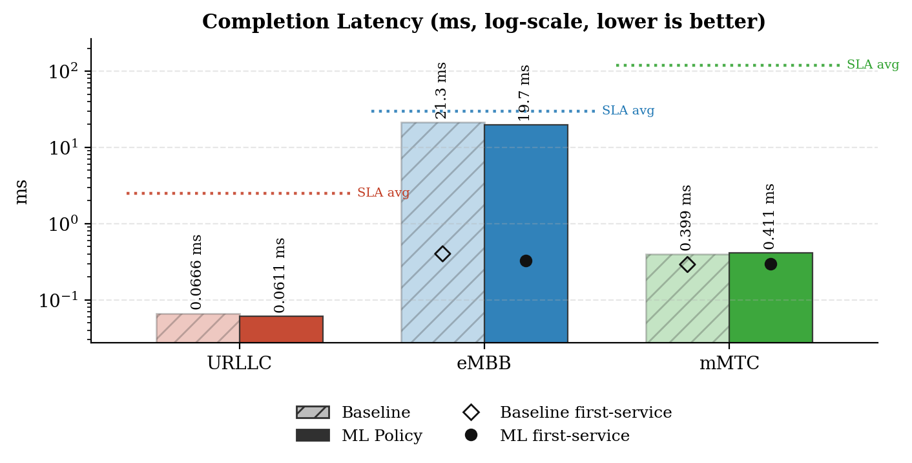
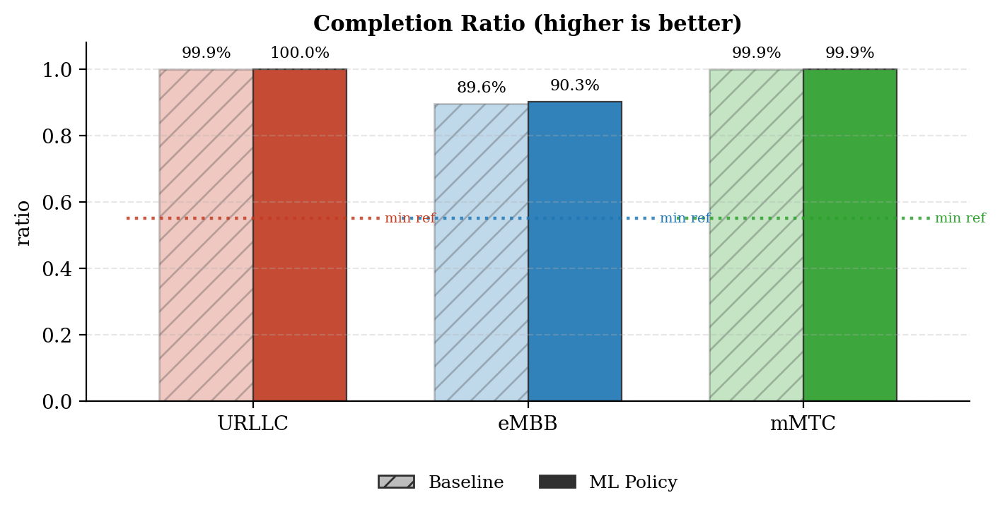
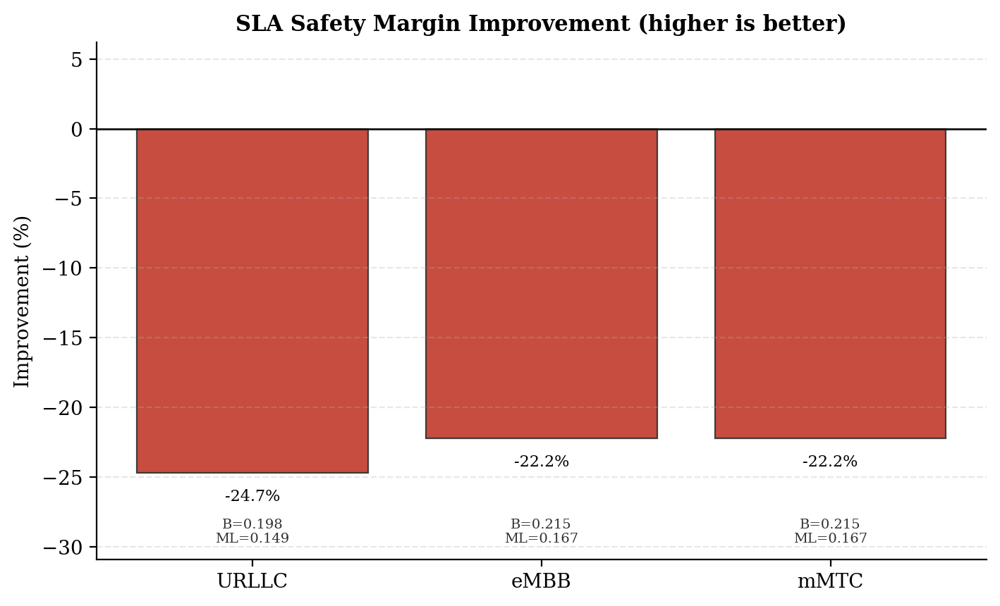
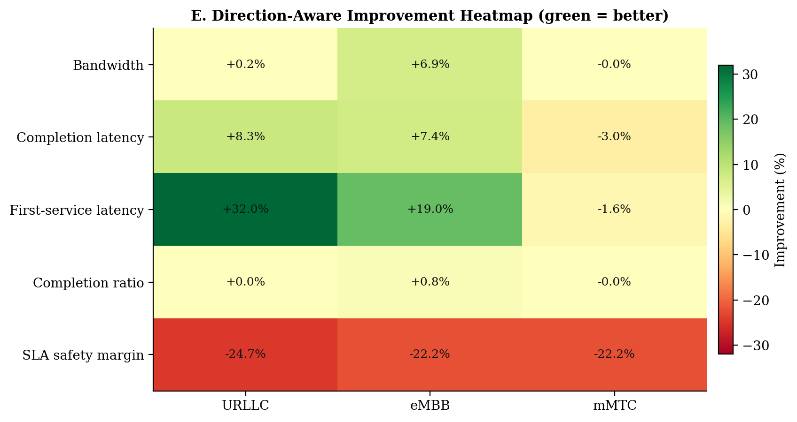
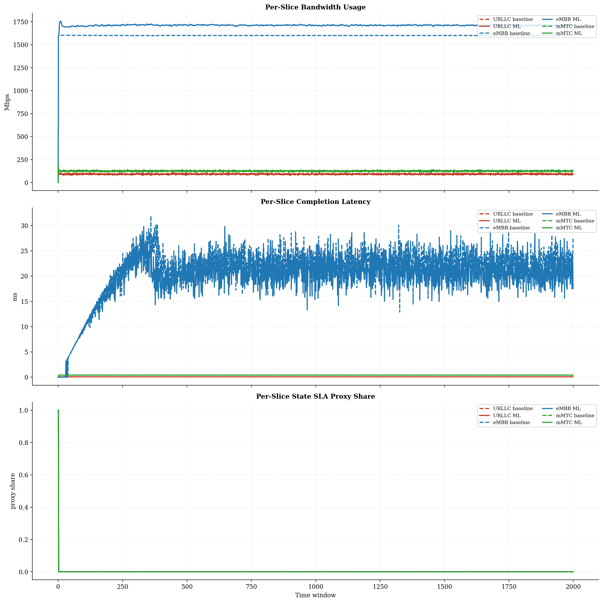
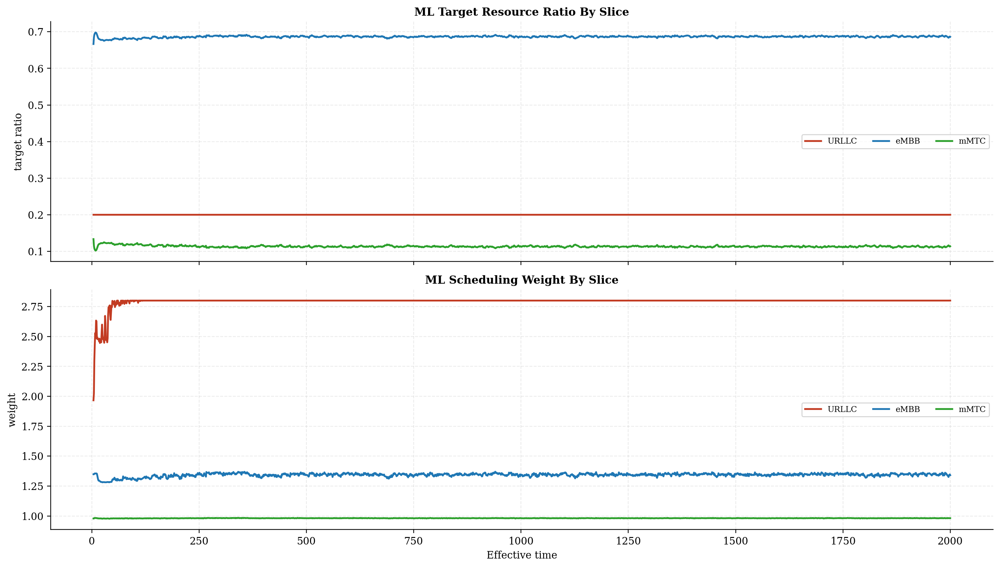
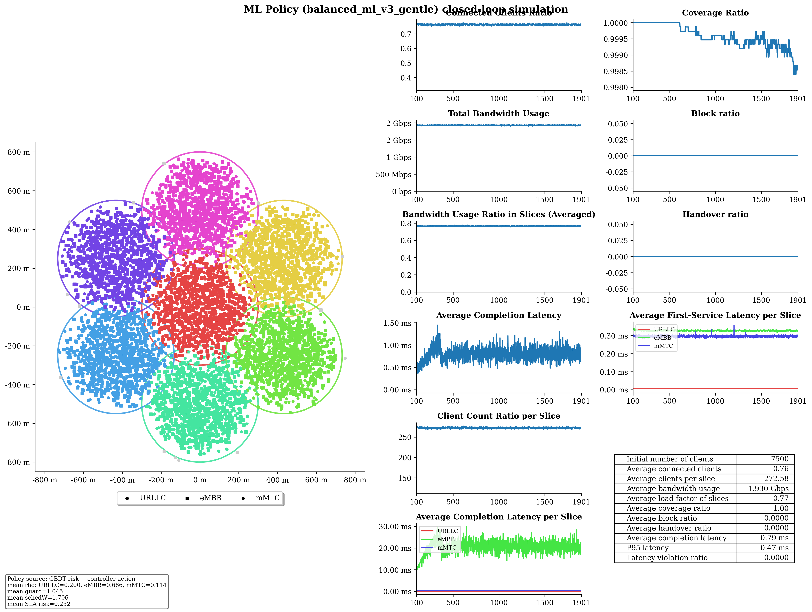

# Baseline vs ML Policy Report

## Run Summary

- Timestamp: `2026-05-08T23:40:47`
- Config: `C:\Users\LENOVO\Downloads\5G-Network-Slicing-main\5G-Network-Slicing-with-GBDT-ML-Policy\slicesim\scenario-heavy.yml`
- Model: `C:\Users\LENOVO\Downloads\5G-Network-Slicing-main\5G-Network-Slicing-with-GBDT-ML-Policy\models\sla_risk_gbdt`
- Controller type: `gbdt`
- Controller preset: `balanced_ml_v3_gentle`
- Broker enabled: `True`
- Broker preset: `forecasting_balanced`
- Seed: `1234`

## Global KPI Comparison

| metric | baseline | ml_policy | delta_ml_minus_baseline | delta_pct |
|---|---|---|---|---|
| connected_clients_ratio | 0.7629 | 0.7627 | -0.0002 | -0.0205 |
| coverage_ratio | 0.9993 | 0.9995 | 0.0002 | 0.0249 |
| block_ratio | 0.0000 | 0.0000 | 0.0000 | 0.0000 |
| handover_ratio | 0.0000 | 0.0000 | 0.0000 | 0.0000 |
| avg_slice_load_ratio | 0.7211 | 0.7651 | 0.0440 | 6.1041 |
| total_bandwidth_usage | 1817186113.9191 | 1928108737.3978 | 110922623.4787 | 6.1041 |
| avg_latency_ms | 0.7673 | 0.7720 | 0.0046 | 0.6016 |
| p95_latency_ms | 0.4604 | 0.4697 | 0.0093 | 2.0220 |
| latency_violation_ratio | 0.0000 | 0.0000 | 0.0000 | 0.0000 |
| avg_state_sla_violation_share | 0.0010 | 0.0010 | 0.0000 | 0.0000 |
| bandwidth_jain_fairness | 0.4260 | 0.4200 | -0.0060 | -1.4106 |
| bandwidth_jain_fairness_min | 0.3333 | 0.3333 | 0.0000 | 0.0000 |

## Per-Slice Summary

| slice_name | avg_bandwidth_usage_mbps_baseline | avg_bandwidth_usage_mbps_ml | avg_bandwidth_usage_mbps_delta | avg_served_bandwidth_baseline | avg_served_bandwidth_ml | avg_served_bandwidth_delta | avg_completion_latency_ms_baseline | avg_completion_latency_ms_ml | avg_completion_latency_ms_delta | avg_first_service_latency_ms_baseline | avg_first_service_latency_ms_ml | avg_first_service_latency_ms_delta | avg_recorded_first_service_latency_ms_baseline | avg_recorded_first_service_latency_ms_ml | avg_recorded_first_service_latency_ms_delta | avg_bandwidth_share_baseline | avg_bandwidth_share_ml | avg_bandwidth_share_delta | zero_bandwidth_window_share_baseline | zero_bandwidth_window_share_ml | zero_bandwidth_window_share_delta | completion_ratio_baseline | completion_ratio_ml | completion_ratio_delta | completion_latency_violation_ratio_baseline | completion_latency_violation_ratio_ml | completion_latency_violation_ratio_delta | first_service_latency_violation_ratio_baseline | first_service_latency_violation_ratio_ml | first_service_latency_violation_ratio_delta | request_latency_violation_event_ratio_baseline | request_latency_violation_event_ratio_ml | request_latency_violation_event_ratio_delta | avg_state_sla_violation_share_baseline | avg_state_sla_violation_share_ml | avg_state_sla_violation_share_delta | avg_sla_safety_margin_baseline | avg_sla_safety_margin_ml | avg_sla_safety_margin_delta | avg_sla_safety_margin_improvement_pct |
|---|---|---|---|---|---|---|---|---|---|---|---|---|---|---|---|---|---|---|---|---|---|---|---|---|---|---|---|---|---|---|---|---|---|---|---|---|---|---|---|---|
| URLLC | 92.0191 | 92.2248 | 0.2058 | 339695.5490 | 340015.5351 | 319.9860 | 0.0666 | 0.0611 | -0.0055 | 0.0080 | 0.0054 | -0.0026 | 0.0080 | 0.0054 | -0.0026 | 0.0511 | 0.0483 | -0.0028 | 0.0000 | 0.0000 | 0.0000 | 0.9995 | 0.9995 | 0.0000 | 0.0000 | 0.0000 | 0.0000 | 0.0000 | 0.0000 | 0.0000 | 0.0000 | 0.0000 | 0.0000 | 0.0010 | 0.0010 | 0.0000 | 0.1979 | 0.1490 | -0.0489 | -24.7178 |
| eMBB | 1599.7832 | 1710.5454 | 110.7622 | 370735.8148 | 399989.0803 | 29253.2654 | 21.2782 | 19.7049 | -1.5733 | 0.4024 | 0.3259 | -0.0765 | 0.4059 | 0.3279 | -0.0780 | 0.8800 | 0.8868 | 0.0068 | 0.0005 | 0.0005 | 0.0000 | 0.8956 | 0.9026 | 0.0070 | 0.0000 | 0.0000 | 0.0000 | 0.0000 | 0.0000 | 0.0000 | 0.0000 | 0.0000 | 0.0000 | 0.0010 | 0.0010 | 0.0000 | 0.2153 | 0.1674 | -0.0478 | -22.2259 |
| mMTC | 125.3839 | 125.3385 | -0.0454 | 225095.4781 | 224835.8786 | -259.5995 | 0.3989 | 0.4109 | 0.0121 | 0.2914 | 0.2961 | 0.0047 | 0.2916 | 0.2962 | 0.0047 | 0.0690 | 0.0650 | -0.0040 | 0.0005 | 0.0005 | 0.0000 | 0.9990 | 0.9990 | -0.0000 | 0.0000 | 0.0000 | 0.0000 | 0.0000 | 0.0000 | 0.0000 | 0.0000 | 0.0000 | 0.0000 | 0.0010 | 0.0010 | 0.0000 | 0.2153 | 0.1674 | -0.0478 | -22.2259 |

## Per-Base-Station Summary

| base_station_id | avg_bandwidth_usage_mbps_baseline | avg_bandwidth_usage_mbps_ml | avg_bandwidth_usage_mbps_delta | avg_bandwidth_usage_mbps_delta_pct | avg_capacity_mbps_baseline | avg_capacity_mbps_ml | avg_capacity_mbps_delta | avg_capacity_mbps_delta_pct | avg_load_ratio_baseline | avg_load_ratio_ml | avg_load_ratio_delta | avg_load_ratio_delta_pct | avg_remaining_capacity_ratio_baseline | avg_remaining_capacity_ratio_ml | avg_remaining_capacity_ratio_delta | avg_remaining_capacity_ratio_delta_pct | avg_request_count_per_window_baseline | avg_request_count_per_window_ml | avg_request_count_per_window_delta | avg_request_count_per_window_delta_pct | total_request_count_baseline | total_request_count_ml | total_request_count_delta | total_request_count_delta_pct | avg_requested_usage_mbps_per_window_baseline | avg_requested_usage_mbps_per_window_ml | avg_requested_usage_mbps_per_window_delta | avg_requested_usage_mbps_per_window_delta_pct | avg_clients_seen_per_window_baseline | avg_clients_seen_per_window_ml | avg_clients_seen_per_window_delta | avg_clients_seen_per_window_delta_pct | avg_connected_events_per_window_baseline | avg_connected_events_per_window_ml | avg_connected_events_per_window_delta | avg_connected_events_per_window_delta_pct | avg_disconnected_events_per_window_baseline | avg_disconnected_events_per_window_ml | avg_disconnected_events_per_window_delta | avg_disconnected_events_per_window_delta_pct | avg_state_sla_violation_share_baseline | avg_state_sla_violation_share_ml | avg_state_sla_violation_share_delta | avg_state_sla_violation_share_delta_pct | avg_sla_safety_margin_baseline | avg_sla_safety_margin_ml | avg_sla_safety_margin_delta | avg_sla_safety_margin_delta_pct | avg_sla_breach_count_per_window_baseline | avg_sla_breach_count_per_window_ml | avg_sla_breach_count_per_window_delta | avg_sla_breach_count_per_window_delta_pct |
|---|---|---|---|---|---|---|---|---|---|---|---|---|---|---|---|---|---|---|---|---|---|---|---|---|---|---|---|---|---|---|---|---|---|---|---|---|---|---|---|---|---|---|---|---|---|---|---|---|---|---|---|---|
| BS_0 | 292.8289 | 319.4476 | 26.6187 | 9.0902 | 420.0000 | 420.0000 | 0.0000 | 0.0000 | 0.6972 | 0.7606 | 0.0634 | 9.0902 | 0.3028 | 0.2394 | -0.0634 | -20.9314 | 127.9585 | 128.6345 | 0.6760 | 0.5283 | 255917.0000 | 257269.0000 | 1352.0000 | 0.5283 | 308.2114 | 337.9310 | 29.7196 | 9.6426 | 1070.9325 | 1071.0665 | 0.1340 | 0.0125 | 127.9650 | 128.6385 | 0.6735 | 0.5263 | 127.5635 | 128.2225 | 0.6590 | 0.5166 | 0.0010 | 0.0010 | 0.0000 | 0.0000 | 0.2095 | 0.1613 | -0.0482 | -23.0106 | 0.0030 | 0.0030 | 0.0000 | 0.0000 |
| BS_1 | 254.3288 | 268.7159 | 14.3871 | 5.6569 | 350.0000 | 350.0000 | 0.0000 | 0.0000 | 0.7267 | 0.7678 | 0.0411 | 5.6569 | 0.2733 | 0.2322 | -0.0411 | -15.0381 | 121.1745 | 121.6430 | 0.4685 | 0.3866 | 242349.0000 | 243286.0000 | 937.0000 | 0.3866 | 270.5299 | 286.0848 | 15.5550 | 5.7498 | 1070.7020 | 1072.4830 | 1.7810 | 0.1663 | 121.1810 | 121.6585 | 0.4775 | 0.3940 | 120.7585 | 121.2460 | 0.4875 | 0.4037 | 0.0010 | 0.0010 | 0.0000 | 0.0000 | 0.2095 | 0.1613 | -0.0482 | -23.0106 | 0.0030 | 0.0030 | 0.0000 | 0.0000 |
| BS_2 | 254.7006 | 268.6687 | 13.9682 | 5.4841 | 350.0000 | 350.0000 | 0.0000 | 0.0000 | 0.7277 | 0.7676 | 0.0399 | 5.4841 | 0.2723 | 0.2324 | -0.0399 | -14.6571 | 122.9390 | 123.4905 | 0.5515 | 0.4486 | 245878.0000 | 246981.0000 | 1103.0000 | 0.4486 | 270.4015 | 286.9670 | 16.5655 | 6.1262 | 1071.8200 | 1070.1415 | -1.6785 | -0.1566 | 122.9570 | 123.5020 | 0.5450 | 0.4432 | 122.5550 | 123.0920 | 0.5370 | 0.4382 | 0.0010 | 0.0010 | 0.0000 | 0.0000 | 0.2095 | 0.1613 | -0.0482 | -23.0106 | 0.0030 | 0.0030 | 0.0000 | 0.0000 |
| BS_3 | 254.3620 | 267.2973 | 12.9353 | 5.0854 | 350.0000 | 350.0000 | 0.0000 | 0.0000 | 0.7267 | 0.7637 | 0.0370 | 5.0854 | 0.2733 | 0.2363 | -0.0370 | -13.5253 | 122.5205 | 122.5090 | -0.0115 | -0.0094 | 245041.0000 | 245018.0000 | -23.0000 | -0.0094 | 269.6025 | 285.0361 | 15.4336 | 5.7246 | 1071.0045 | 1071.6400 | 0.6355 | 0.0593 | 122.5325 | 122.5160 | -0.0165 | -0.0135 | 122.1240 | 122.1095 | -0.0145 | -0.0119 | 0.0010 | 0.0010 | 0.0000 | 0.0000 | 0.2095 | 0.1613 | -0.0482 | -23.0106 | 0.0030 | 0.0030 | 0.0000 | 0.0000 |
| BS_4 | 254.0839 | 268.1737 | 14.0898 | 5.5453 | 350.0000 | 350.0000 | 0.0000 | 0.0000 | 0.7260 | 0.7662 | 0.0403 | 5.5453 | 0.2740 | 0.2338 | -0.0403 | -14.6897 | 120.6085 | 120.4775 | -0.1310 | -0.1086 | 241217.0000 | 240955.0000 | -262.0000 | -0.1086 | 270.0354 | 285.2733 | 15.2380 | 5.6430 | 1071.5805 | 1069.7385 | -1.8420 | -0.1719 | 120.6445 | 120.4855 | -0.1590 | -0.1318 | 120.2350 | 120.0805 | -0.1545 | -0.1285 | 0.0010 | 0.0010 | 0.0000 | 0.0000 | 0.2095 | 0.1613 | -0.0482 | -23.0106 | 0.0030 | 0.0030 | 0.0000 | 0.0000 |
| BS_5 | 254.8831 | 269.0155 | 14.1324 | 5.5447 | 350.0000 | 350.0000 | 0.0000 | 0.0000 | 0.7282 | 0.7686 | 0.0404 | 5.5447 | 0.2718 | 0.2314 | -0.0404 | -14.8579 | 122.0425 | 122.4390 | 0.3965 | 0.3249 | 244085.0000 | 244878.0000 | 793.0000 | 0.3249 | 270.4406 | 286.9715 | 16.5309 | 6.1126 | 1068.7335 | 1069.8000 | 1.0665 | 0.0998 | 122.0710 | 122.4520 | 0.3810 | 0.3121 | 121.6665 | 122.0435 | 0.3770 | 0.3099 | 0.0010 | 0.0010 | 0.0000 | 0.0000 | 0.2095 | 0.1613 | -0.0482 | -23.0106 | 0.0030 | 0.0030 | 0.0000 | 0.0000 |
| BS_6 | 251.9989 | 266.7901 | 14.7911 | 5.8695 | 350.0000 | 350.0000 | 0.0000 | 0.0000 | 0.7200 | 0.7623 | 0.0423 | 5.8695 | 0.2800 | 0.2377 | -0.0423 | -15.0928 | 111.6585 | 111.7295 | 0.0710 | 0.0636 | 223317.0000 | 223459.0000 | 142.0000 | 0.0636 | 269.0390 | 286.0134 | 16.9744 | 6.3093 | 1069.9590 | 1071.7250 | 1.7660 | 0.1651 | 111.6660 | 111.7415 | 0.0755 | 0.0676 | 111.2480 | 111.3290 | 0.0810 | 0.0728 | 0.0010 | 0.0010 | 0.0000 | 0.0000 | 0.2095 | 0.1613 | -0.0482 | -23.0106 | 0.0030 | 0.0030 | 0.0000 | 0.0000 |

## Per-Base-Station Slice SLA Summary

| base_station_id | slice_name | avg_bandwidth_usage_mbps_baseline | avg_bandwidth_usage_mbps_ml | avg_bandwidth_usage_mbps_delta | avg_bandwidth_usage_mbps_delta_pct | avg_slice_capacity_mbps_baseline | avg_slice_capacity_mbps_ml | avg_slice_capacity_mbps_delta | avg_slice_capacity_mbps_delta_pct | avg_slice_load_ratio_baseline | avg_slice_load_ratio_ml | avg_slice_load_ratio_delta | avg_slice_load_ratio_delta_pct | avg_remaining_capacity_ratio_baseline | avg_remaining_capacity_ratio_ml | avg_remaining_capacity_ratio_delta | avg_remaining_capacity_ratio_delta_pct | avg_request_count_per_window_baseline | avg_request_count_per_window_ml | avg_request_count_per_window_delta | avg_request_count_per_window_delta_pct | total_request_count_baseline | total_request_count_ml | total_request_count_delta | total_request_count_delta_pct | avg_requested_usage_mbps_per_window_baseline | avg_requested_usage_mbps_per_window_ml | avg_requested_usage_mbps_per_window_delta | avg_requested_usage_mbps_per_window_delta_pct | avg_clients_seen_per_window_baseline | avg_clients_seen_per_window_ml | avg_clients_seen_per_window_delta | avg_clients_seen_per_window_delta_pct | avg_state_sla_violation_share_baseline | avg_state_sla_violation_share_ml | avg_state_sla_violation_share_delta | avg_state_sla_violation_share_delta_pct | avg_sla_safety_margin_baseline | avg_sla_safety_margin_ml | avg_sla_safety_margin_delta | avg_sla_safety_margin_delta_pct | avg_sla_breach_count_per_window_baseline | avg_sla_breach_count_per_window_ml | avg_sla_breach_count_per_window_delta | avg_sla_breach_count_per_window_delta_pct |
|---|---|---|---|---|---|---|---|---|---|---|---|---|---|---|---|---|---|---|---|---|---|---|---|---|---|---|---|---|---|---|---|---|---|---|---|---|---|---|---|---|---|---|---|---|---|
| BS_0 | URLLC | 15.4145 | 15.4233 | 0.0089 | 0.0575 | 84.0000 | 84.0000 | 0.0000 | 0.0000 | 0.1835 | 0.1836 | 0.0001 | 0.0575 | 0.8165 | 0.8164 | -0.0001 | -0.0129 | 45.4060 | 45.2890 | -0.1170 | -0.2577 | 90812.0000 | 90578.0000 | -234.0000 | -0.2577 | 15.4145 | 15.4233 | 0.0089 | 0.0575 | 138.1420 | 137.5350 | -0.6070 | -0.4394 | 0.0010 | 0.0010 | 0.0000 | 0.0000 | 0.1979 | 0.1490 | -0.0489 | -24.7178 | 0.0010 | 0.0010 | 0.0000 | 0.0000 |
| BS_0 | eMBB | 259.5548 | 286.1061 | 26.5513 | 10.2296 | 260.4000 | 289.4922 | 29.0922 | 11.1721 | 0.9968 | 0.9883 | -0.0085 | -0.8526 | 0.0032 | 0.0117 | 0.0085 | 261.8184 | 3.3315 | 3.7215 | 0.3900 | 11.7064 | 6663.0000 | 7443.0000 | 780.0000 | 11.7064 | 274.9295 | 304.5794 | 29.6500 | 10.7846 | 607.5270 | 607.8340 | 0.3070 | 0.0505 | 0.0010 | 0.0010 | 0.0000 | 0.0000 | 0.2153 | 0.1674 | -0.0478 | -22.2259 | 0.0010 | 0.0010 | 0.0000 | 0.0000 |
| BS_0 | mMTC | 17.8596 | 17.9182 | 0.0585 | 0.3278 | 75.6000 | 46.5078 | -29.0922 | -38.4817 | 0.2362 | 0.3859 | 0.1496 | 63.3422 | 0.7638 | 0.6141 | -0.1496 | -19.5923 | 79.2210 | 79.6240 | 0.4030 | 0.5087 | 158442.0000 | 159248.0000 | 806.0000 | 0.5087 | 17.8675 | 17.9282 | 0.0607 | 0.3399 | 325.2635 | 325.6975 | 0.4340 | 0.1334 | 0.0010 | 0.0010 | 0.0000 | 0.0000 | 0.2153 | 0.1674 | -0.0478 | -22.2259 | 0.0010 | 0.0010 | 0.0000 | 0.0000 |
| BS_1 | URLLC | 12.9480 | 13.0322 | 0.0842 | 0.6503 | 63.0000 | 69.9860 | 6.9860 | 11.0889 | 0.2055 | 0.1862 | -0.0193 | -9.3956 | 0.7945 | 0.8138 | 0.0193 | 2.4306 | 38.1040 | 38.3790 | 0.2750 | 0.7217 | 76208.0000 | 76758.0000 | 550.0000 | 0.7217 | 12.9480 | 13.0322 | 0.0842 | 0.6503 | 118.0000 | 118.0815 | 0.0815 | 0.0691 | 0.0010 | 0.0010 | 0.0000 | 0.0000 | 0.1979 | 0.1490 | -0.0489 | -24.7178 | 0.0010 | 0.0010 | 0.0000 | 0.0000 |
| BS_1 | eMBB | 223.3551 | 237.6275 | 14.2723 | 6.3900 | 224.0000 | 240.0459 | 16.0459 | 7.1634 | 0.9971 | 0.9899 | -0.0072 | -0.7248 | 0.0029 | 0.0101 | 0.0072 | 251.0614 | 2.8895 | 3.0985 | 0.2090 | 7.2331 | 5779.0000 | 6197.0000 | 418.0000 | 7.2331 | 239.5463 | 254.9886 | 15.4423 | 6.4465 | 626.1855 | 627.9790 | 1.7935 | 0.2864 | 0.0010 | 0.0010 | 0.0000 | 0.0000 | 0.2153 | 0.1674 | -0.0478 | -22.2259 | 0.0010 | 0.0010 | 0.0000 | 0.0000 |
| BS_1 | mMTC | 18.0256 | 18.0563 | 0.0306 | 0.1699 | 63.0000 | 39.9681 | -23.0319 | -36.5586 | 0.2861 | 0.4526 | 0.1665 | 58.2008 | 0.7139 | 0.5474 | -0.1665 | -23.3268 | 80.1810 | 80.1655 | -0.0155 | -0.0193 | 160362.0000 | 160331.0000 | -31.0000 | -0.0193 | 18.0355 | 18.0640 | 0.0285 | 0.1581 | 326.5165 | 326.4225 | -0.0940 | -0.0288 | 0.0010 | 0.0010 | 0.0000 | 0.0000 | 0.2153 | 0.1674 | -0.0478 | -22.2259 | 0.0010 | 0.0010 | 0.0000 | 0.0000 |
| BS_2 | URLLC | 12.8392 | 13.1114 | 0.2722 | 2.1200 | 63.0000 | 69.9860 | 6.9860 | 11.0889 | 0.2038 | 0.1873 | -0.0165 | -8.0722 | 0.7962 | 0.8127 | 0.0165 | 2.0662 | 37.8670 | 38.5235 | 0.6565 | 1.7337 | 75734.0000 | 77047.0000 | 1313.0000 | 1.7337 | 12.8392 | 13.1114 | 0.2722 | 2.1200 | 116.1270 | 117.1010 | 0.9740 | 0.8387 | 0.0010 | 0.0010 | 0.0000 | 0.0000 | 0.1979 | 0.1490 | -0.0489 | -24.7178 | 0.0010 | 0.0010 | 0.0000 | 0.0000 |
| BS_2 | eMBB | 223.3771 | 237.1383 | 13.7612 | 6.1605 | 224.0000 | 239.8590 | 15.8590 | 7.0799 | 0.9972 | 0.9886 | -0.0086 | -0.8616 | 0.0028 | 0.0114 | 0.0086 | 308.9889 | 2.8900 | 3.0985 | 0.2085 | 7.2145 | 5780.0000 | 6197.0000 | 417.0000 | 7.2145 | 239.0692 | 255.4269 | 16.3577 | 6.8422 | 619.1515 | 618.1760 | -0.9755 | -0.1576 | 0.0010 | 0.0010 | 0.0000 | 0.0000 | 0.2153 | 0.1674 | -0.0478 | -22.2259 | 0.0010 | 0.0010 | 0.0000 | 0.0000 |
| BS_2 | mMTC | 18.4843 | 18.4191 | -0.0652 | -0.3527 | 63.0000 | 40.1550 | -22.8450 | -36.2619 | 0.2934 | 0.4596 | 0.1662 | 56.6382 | 0.7066 | 0.5404 | -0.1662 | -23.5179 | 82.1820 | 81.8685 | -0.3135 | -0.3815 | 164364.0000 | 163737.0000 | -627.0000 | -0.3815 | 18.4931 | 18.4287 | -0.0644 | -0.3482 | 336.5415 | 334.8645 | -1.6770 | -0.4983 | 0.0010 | 0.0010 | 0.0000 | 0.0000 | 0.2153 | 0.1674 | -0.0478 | -22.2259 | 0.0010 | 0.0010 | 0.0000 | 0.0000 |
| BS_3 | URLLC | 12.1357 | 12.0818 | -0.0539 | -0.4438 | 63.0000 | 69.9860 | 6.9860 | 11.0889 | 0.1926 | 0.1726 | -0.0200 | -10.3767 | 0.8074 | 0.8274 | 0.0200 | 2.4758 | 35.7690 | 35.5855 | -0.1835 | -0.5130 | 71538.0000 | 71171.0000 | -367.0000 | -0.5130 | 12.1357 | 12.0818 | -0.0539 | -0.4438 | 113.3460 | 112.9575 | -0.3885 | -0.3428 | 0.0010 | 0.0010 | 0.0000 | 0.0000 | 0.1979 | 0.1490 | -0.0489 | -24.7178 | 0.0010 | 0.0010 | 0.0000 | 0.0000 |
| BS_3 | eMBB | 223.3667 | 236.4025 | 13.0359 | 5.8361 | 224.0000 | 239.6228 | 15.6228 | 6.9744 | 0.9972 | 0.9865 | -0.0106 | -1.0673 | 0.0028 | 0.0135 | 0.0106 | 376.4093 | 2.8615 | 3.0920 | 0.2305 | 8.0552 | 5723.0000 | 6184.0000 | 461.0000 | 8.0552 | 238.5978 | 254.1304 | 15.5326 | 6.5100 | 611.3465 | 612.3530 | 1.0065 | 0.1646 | 0.0010 | 0.0010 | 0.0000 | 0.0000 | 0.2153 | 0.1674 | -0.0478 | -22.2259 | 0.0010 | 0.0010 | 0.0000 | 0.0000 |
| BS_3 | mMTC | 18.8597 | 18.8129 | -0.0467 | -0.2477 | 63.0000 | 40.3912 | -22.6088 | -35.8869 | 0.2994 | 0.4666 | 0.1672 | 55.8665 | 0.7006 | 0.5334 | -0.1672 | -23.8699 | 83.8900 | 83.8315 | -0.0585 | -0.0697 | 167780.0000 | 167663.0000 | -117.0000 | -0.0697 | 18.8690 | 18.8238 | -0.0452 | -0.2395 | 346.3120 | 346.3295 | 0.0175 | 0.0051 | 0.0010 | 0.0010 | 0.0000 | 0.0000 | 0.2153 | 0.1674 | -0.0478 | -22.2259 | 0.0010 | 0.0010 | 0.0000 | 0.0000 |
| BS_4 | URLLC | 12.4814 | 12.4320 | -0.0494 | -0.3962 | 63.0000 | 69.9860 | 6.9860 | 11.0889 | 0.1981 | 0.1776 | -0.0205 | -10.3366 | 0.8019 | 0.8224 | 0.0205 | 2.5538 | 36.7105 | 36.5025 | -0.2080 | -0.5666 | 73421.0000 | 73005.0000 | -416.0000 | -0.5666 | 12.4814 | 12.4320 | -0.0494 | -0.3962 | 114.0000 | 114.3070 | 0.3070 | 0.2693 | 0.0010 | 0.0010 | 0.0000 | 0.0000 | 0.1979 | 0.1490 | -0.0489 | -24.7178 | 0.0010 | 0.0010 | 0.0000 | 0.0000 |
| BS_4 | eMBB | 223.3774 | 237.5479 | 14.1705 | 6.3438 | 224.0000 | 239.9229 | 15.9229 | 7.1084 | 0.9972 | 0.9901 | -0.0072 | -0.7171 | 0.0028 | 0.0099 | 0.0072 | 257.2524 | 2.8855 | 3.0865 | 0.2010 | 6.9659 | 5771.0000 | 6173.0000 | 402.0000 | 6.9659 | 239.3206 | 254.6379 | 15.3174 | 6.4004 | 627.7125 | 625.7290 | -1.9835 | -0.3160 | 0.0010 | 0.0010 | 0.0000 | 0.0000 | 0.2153 | 0.1674 | -0.0478 | -22.2259 | 0.0010 | 0.0010 | 0.0000 | 0.0000 |
| BS_4 | mMTC | 18.2251 | 18.1938 | -0.0313 | -0.1720 | 63.0000 | 40.0911 | -22.9089 | -36.3633 | 0.2893 | 0.4547 | 0.1654 | 57.1715 | 0.7107 | 0.5453 | -0.1654 | -23.2710 | 81.0125 | 80.8885 | -0.1240 | -0.1531 | 162025.0000 | 161777.0000 | -248.0000 | -0.1531 | 18.2334 | 18.2034 | -0.0299 | -0.1641 | 329.8680 | 329.7025 | -0.1655 | -0.0502 | 0.0010 | 0.0010 | 0.0000 | 0.0000 | 0.2153 | 0.1674 | -0.0478 | -22.2259 | 0.0010 | 0.0010 | 0.0000 | 0.0000 |
| BS_5 | URLLC | 13.9874 | 13.9665 | -0.0209 | -0.1493 | 63.0000 | 69.9860 | 6.9860 | 11.0889 | 0.2220 | 0.1996 | -0.0225 | -10.1141 | 0.7780 | 0.8004 | 0.0225 | 2.8864 | 41.1680 | 41.0840 | -0.0840 | -0.2040 | 82336.0000 | 82168.0000 | -168.0000 | -0.2040 | 13.9874 | 13.9665 | -0.0209 | -0.1493 | 129.0000 | 128.6075 | -0.3925 | -0.3043 | 0.0010 | 0.0010 | 0.0000 | 0.0000 | 0.1979 | 0.1490 | -0.0489 | -24.7178 | 0.0010 | 0.0010 | 0.0000 | 0.0000 |
| BS_5 | eMBB | 223.3671 | 237.4572 | 14.0901 | 6.3080 | 224.0000 | 240.3019 | 16.3019 | 7.2776 | 0.9972 | 0.9881 | -0.0090 | -0.9067 | 0.0028 | 0.0119 | 0.0090 | 320.0181 | 2.9165 | 3.0885 | 0.1720 | 5.8975 | 5833.0000 | 6177.0000 | 344.0000 | 5.8975 | 238.9166 | 255.4046 | 16.4880 | 6.9012 | 621.1240 | 620.9420 | -0.1820 | -0.0293 | 0.0010 | 0.0010 | 0.0000 | 0.0000 | 0.2153 | 0.1674 | -0.0478 | -22.2259 | 0.0010 | 0.0010 | 0.0000 | 0.0000 |
| BS_5 | mMTC | 17.5285 | 17.5917 | 0.0632 | 0.3605 | 63.0000 | 39.7121 | -23.2879 | -36.9649 | 0.2782 | 0.4437 | 0.1655 | 59.4865 | 0.7218 | 0.5563 | -0.1655 | -22.9311 | 77.9580 | 78.2665 | 0.3085 | 0.3957 | 155916.0000 | 156533.0000 | 617.0000 | 0.3957 | 17.5366 | 17.6003 | 0.0637 | 0.3632 | 318.6095 | 320.2505 | 1.6410 | 0.5151 | 0.0010 | 0.0010 | 0.0000 | 0.0000 | 0.2153 | 0.1674 | -0.0478 | -22.2259 | 0.0010 | 0.0010 | 0.0000 | 0.0000 |
| BS_6 | URLLC | 12.2129 | 12.1776 | -0.0353 | -0.2890 | 63.0000 | 69.9860 | 6.9860 | 11.0889 | 0.1939 | 0.1740 | -0.0198 | -10.2378 | 0.8061 | 0.8260 | 0.0198 | 2.4619 | 35.8535 | 35.8705 | 0.0170 | 0.0474 | 71707.0000 | 71741.0000 | 34.0000 | 0.0474 | 12.2129 | 12.1776 | -0.0353 | -0.2890 | 107.5125 | 108.1010 | 0.5885 | 0.5474 | 0.0010 | 0.0010 | 0.0000 | 0.0000 | 0.1979 | 0.1490 | -0.0489 | -24.7178 | 0.0010 | 0.0010 | 0.0000 | 0.0000 |
| BS_6 | eMBB | 223.3850 | 238.2659 | 14.8809 | 6.6615 | 224.0000 | 240.6455 | 16.6455 | 7.4310 | 0.9973 | 0.9901 | -0.0072 | -0.7194 | 0.0027 | 0.0099 | 0.0072 | 261.3129 | 2.9530 | 3.0930 | 0.1400 | 4.7409 | 5906.0000 | 6186.0000 | 280.0000 | 4.7409 | 240.4166 | 257.4828 | 17.0662 | 7.0986 | 667.3965 | 668.6055 | 1.2090 | 0.1812 | 0.0010 | 0.0010 | 0.0000 | 0.0000 | 0.2153 | 0.1674 | -0.0478 | -22.2259 | 0.0010 | 0.0010 | 0.0000 | 0.0000 |
| BS_6 | mMTC | 16.4011 | 16.3466 | -0.0545 | -0.3321 | 63.0000 | 39.3685 | -23.6315 | -37.5104 | 0.2603 | 0.4159 | 0.1555 | 59.7498 | 0.7397 | 0.5841 | -0.1555 | -21.0297 | 72.8520 | 72.7660 | -0.0860 | -0.1180 | 145704.0000 | 145532.0000 | -172.0000 | -0.1180 | 16.4095 | 16.3531 | -0.0564 | -0.3439 | 295.0500 | 295.0185 | -0.0315 | -0.0107 | 0.0010 | 0.0010 | 0.0000 | 0.0000 | 0.2153 | 0.1674 | -0.0478 | -22.2259 | 0.0010 | 0.0010 | 0.0000 | 0.0000 |

## Resource Allocation Summary

| slice_name | baseline_state_ratio | ml_state_ratio | ml_action_target_ratio_mean | ml_action_target_ratio_min | ml_action_target_ratio_max | ml_scheduling_weight_mean | ml_admission_guard_factor_mean | target_ratio_delta_vs_baseline_state |
|---|---|---|---|---|---|---|---|---|
| URLLC | 0.1829 | 0.2000 | 0.2000 | 0.2000 | 0.2000 | 2.7936 | 1.0839 | 0.0171 |
| eMBB | 0.6371 | 0.6864 | 0.6865 | 0.6629 | 0.7000 | 1.3429 | 1.0427 | 0.0493 |
| mMTC | 0.1800 | 0.1137 | 0.1135 | 0.1000 | 0.1371 | 0.9812 | 1.0082 | -0.0665 |

## Visual Comparison

### Global KPI View

### Per-Slice View

### Per-Slice Panel Images

#### Throughput per Slice

#### Latency per Slice

#### Completion Ratio

#### SLA Safety Margin Improvement

#### Improvement Heatmap

### Per-Slice Time-Series View

### ML Action Distribution

### ML Policy Simulation Snapshot

## Metric Notes

- `avg_state_sla_violation_share` is the per-slice state-level SLA violation ratio averaged from simulator state frames.
- `avg_sla_safety_margin` is the average distance to the active SLA boundary. Higher is better; negative means violation.
- `avg_sla_safety_margin_improvement_pct` is `(ML margin - baseline margin) / abs(baseline margin) * 100`.
- `request_latency_violation_event_ratio`, `completion_latency_violation_ratio`, and `first_service_latency_violation_ratio` are client-level latency-only metrics.
- A latency value of `0` can mean no recorded latency event for that slice/window. Check `completion_ratio` and request/completion counts before interpreting it as perfect latency.
- `bandwidth_jain_fairness` is Jain's fairness index over per-slice bandwidth usage per time window. Higher is more balanced, with `1.0` meaning equal usage across slices.

## Trade-off Notes

- URLLC completion latency changed by -0.01 ms and SLA safety margin changed by -0.0489 (-24.7%).
- eMBB average bandwidth usage changed by 110.762 Mbps and completion ratio changed by 0.0070.
- mMTC first-service latency changed by 0.00 ms and completion ratio changed by -0.0000.
- URLLC recorded first-service latency changed by -0.00 ms on windows with actual first-service events.
- Classic trade-off snapshot: if URLLC improved by 0.01 ms in latency, eMBB bandwidth moved by 110.762 Mbps.

## Artifacts

- Baseline raw states: `C:\Users\LENOVO\Downloads\5G-Network-Slicing-main\5G-Network-Slicing-with-GBDT-ML-Policy\FINAL_OUTPUT_heavy_seed1234_20260508_223937\baseline_run\baseline_states.csv`
- ML raw states: `C:\Users\LENOVO\Downloads\5G-Network-Slicing-main\5G-Network-Slicing-with-GBDT-ML-Policy\FINAL_OUTPUT_heavy_seed1234_20260508_223937\ml_run\online_states_raw.csv`
- ML broker forecasts: `C:\Users\LENOVO\Downloads\5G-Network-Slicing-main\5G-Network-Slicing-with-GBDT-ML-Policy\FINAL_OUTPUT_heavy_seed1234_20260508_223937\ml_run\online_broker_forecasts.csv`
- ML broker feedback: `C:\Users\LENOVO\Downloads\5G-Network-Slicing-main\5G-Network-Slicing-with-GBDT-ML-Policy\FINAL_OUTPUT_heavy_seed1234_20260508_223937\ml_run\online_broker_feedback.csv`
- Comparison CSV (global): `C:\Users\LENOVO\Downloads\5G-Network-Slicing-main\5G-Network-Slicing-with-GBDT-ML-Policy\FINAL_OUTPUT_heavy_seed1234_20260508_223937\global_kpi_comparison.csv`
- Comparison CSV (per-slice): `C:\Users\LENOVO\Downloads\5G-Network-Slicing-main\5G-Network-Slicing-with-GBDT-ML-Policy\FINAL_OUTPUT_heavy_seed1234_20260508_223937\per_slice_comparison.csv`
- Comparison CSV (per-base-station): `C:\Users\LENOVO\Downloads\5G-Network-Slicing-main\5G-Network-Slicing-with-GBDT-ML-Policy\FINAL_OUTPUT_heavy_seed1234_20260508_223937\per_base_station_comparison.csv`
- Comparison CSV (per-base-station-slice): `C:\Users\LENOVO\Downloads\5G-Network-Slicing-main\5G-Network-Slicing-with-GBDT-ML-Policy\FINAL_OUTPUT_heavy_seed1234_20260508_223937\per_base_station_slice_comparison.csv`
- Resource allocation CSV: `C:\Users\LENOVO\Downloads\5G-Network-Slicing-main\5G-Network-Slicing-with-GBDT-ML-Policy\FINAL_OUTPUT_heavy_seed1234_20260508_223937\resource_allocation_summary.csv`
- ML action time-series CSV: `C:\Users\LENOVO\Downloads\5G-Network-Slicing-main\5G-Network-Slicing-with-GBDT-ML-Policy\FINAL_OUTPUT_heavy_seed1234_20260508_223937\ml_action_ratio_timeseries.csv`
- Global KPI plot: `C:\Users\LENOVO\Downloads\5G-Network-Slicing-main\5G-Network-Slicing-with-GBDT-ML-Policy\FINAL_OUTPUT_heavy_seed1234_20260508_223937\baseline_vs_ml_global_kpis.png`
- Per-slice bar plot: `C:\Users\LENOVO\Downloads\5G-Network-Slicing-main\5G-Network-Slicing-with-GBDT-ML-Policy\FINAL_OUTPUT_heavy_seed1234_20260508_223937\baseline_vs_ml_per_slice_bars.png`
- Per-slice vector plot (SVG): `C:\Users\LENOVO\Downloads\5G-Network-Slicing-main\5G-Network-Slicing-with-GBDT-ML-Policy\FINAL_OUTPUT_heavy_seed1234_20260508_223937\baseline_vs_ml_per_slice_bars.svg`
- Per-slice panel plot (Throughput per Slice): `C:\Users\LENOVO\Downloads\5G-Network-Slicing-main\5G-Network-Slicing-with-GBDT-ML-Policy\FINAL_OUTPUT_heavy_seed1234_20260508_223937\baseline_vs_ml_per_slice_bars_throughput.png`
- Per-slice panel plot (Latency per Slice): `C:\Users\LENOVO\Downloads\5G-Network-Slicing-main\5G-Network-Slicing-with-GBDT-ML-Policy\FINAL_OUTPUT_heavy_seed1234_20260508_223937\baseline_vs_ml_per_slice_bars_latency.png`
- Per-slice panel plot (Completion Ratio): `C:\Users\LENOVO\Downloads\5G-Network-Slicing-main\5G-Network-Slicing-with-GBDT-ML-Policy\FINAL_OUTPUT_heavy_seed1234_20260508_223937\baseline_vs_ml_per_slice_bars_completion_ratio.png`
- Per-slice panel plot (SLA Safety Margin Improvement): `C:\Users\LENOVO\Downloads\5G-Network-Slicing-main\5G-Network-Slicing-with-GBDT-ML-Policy\FINAL_OUTPUT_heavy_seed1234_20260508_223937\baseline_vs_ml_per_slice_bars_sla_margin_improvement.png`
- Per-slice panel plot (Improvement Heatmap): `C:\Users\LENOVO\Downloads\5G-Network-Slicing-main\5G-Network-Slicing-with-GBDT-ML-Policy\FINAL_OUTPUT_heavy_seed1234_20260508_223937\baseline_vs_ml_per_slice_bars_improvement_heatmap.png`
- Per-slice time-series plot: `C:\Users\LENOVO\Downloads\5G-Network-Slicing-main\5G-Network-Slicing-with-GBDT-ML-Policy\FINAL_OUTPUT_heavy_seed1234_20260508_223937\baseline_vs_ml_timeseries.png`
- ML action distribution plot: `C:\Users\LENOVO\Downloads\5G-Network-Slicing-main\5G-Network-Slicing-with-GBDT-ML-Policy\FINAL_OUTPUT_heavy_seed1234_20260508_223937\ml_action_distribution.png`
- ML policy simulation graph: `C:\Users\LENOVO\Downloads\5G-Network-Slicing-main\5G-Network-Slicing-with-GBDT-ML-Policy\FINAL_OUTPUT_heavy_seed1234_20260508_223937\ml_run\ml_policy_simulation.png`
