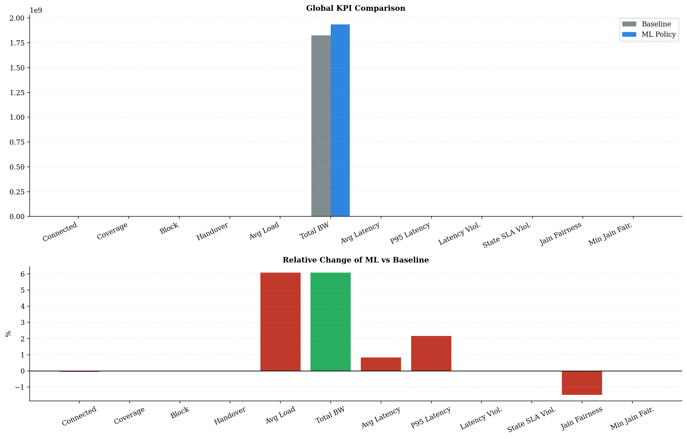
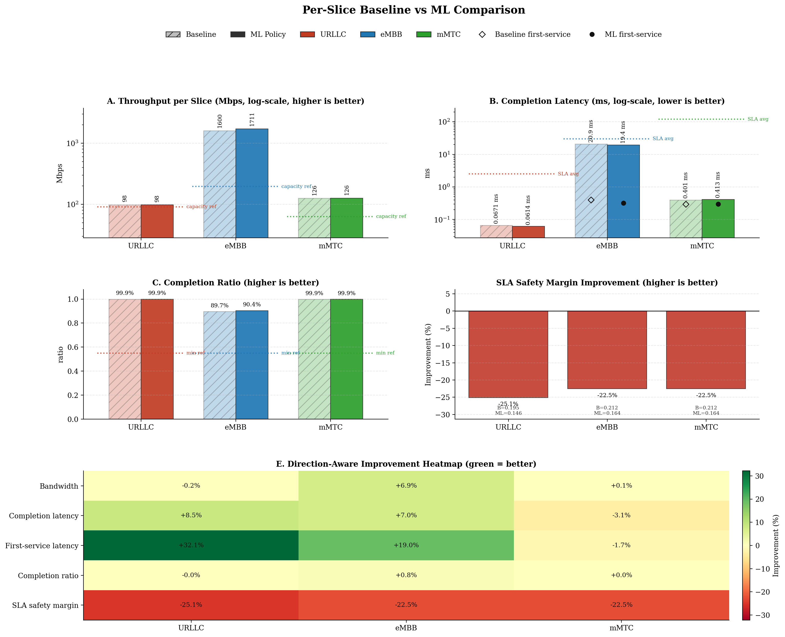
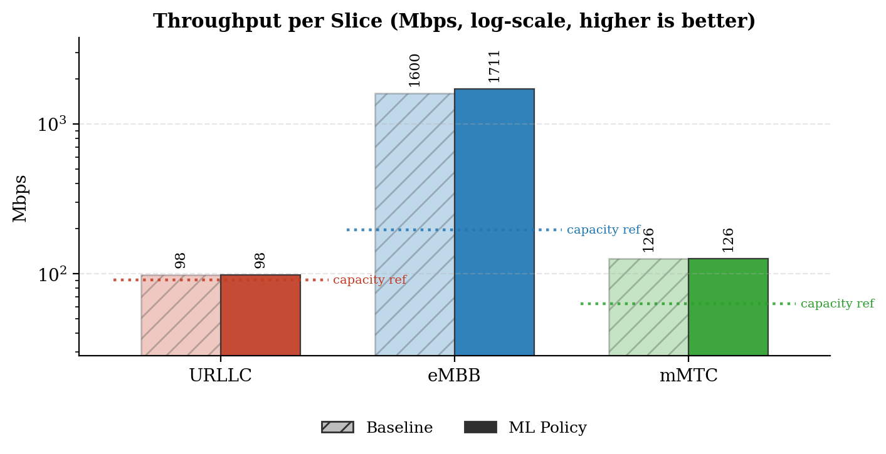
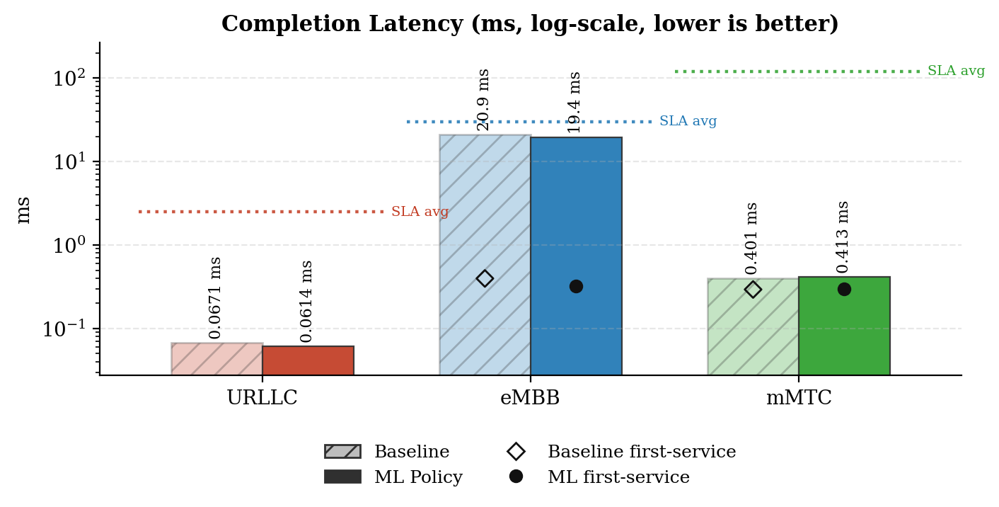
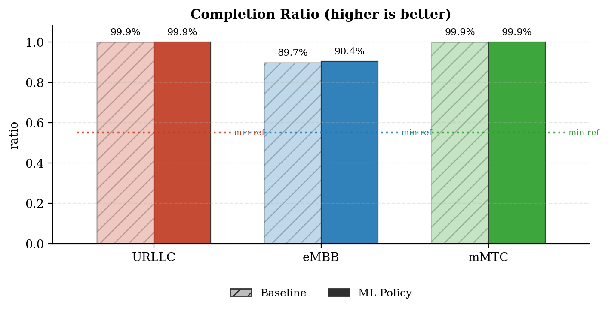
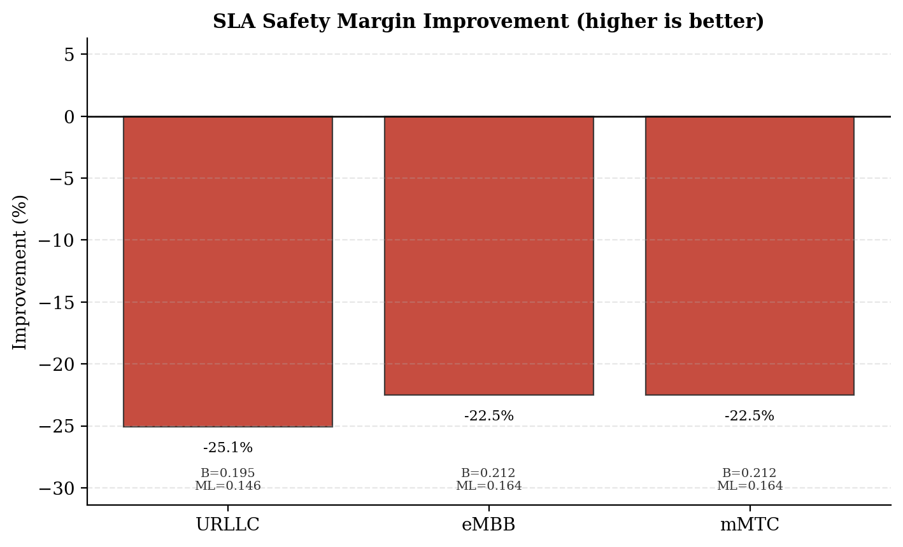
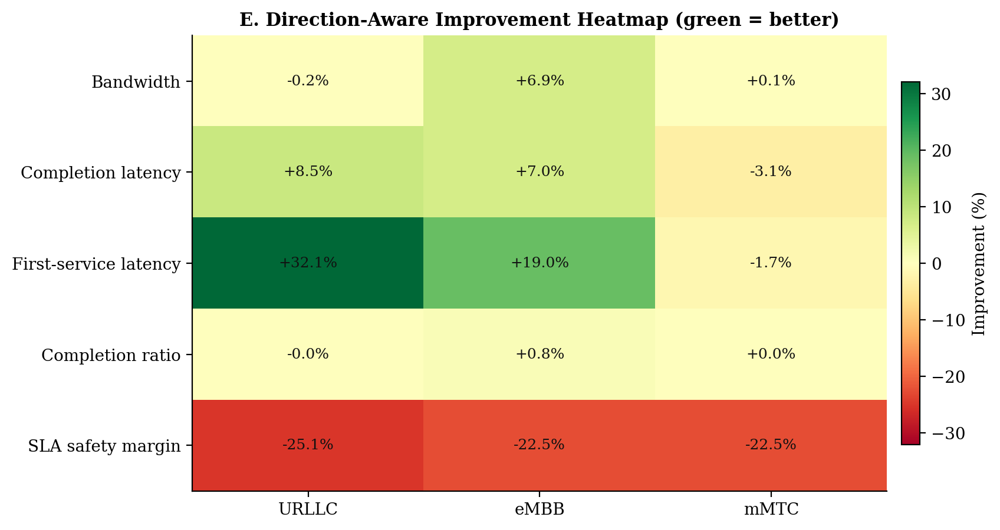
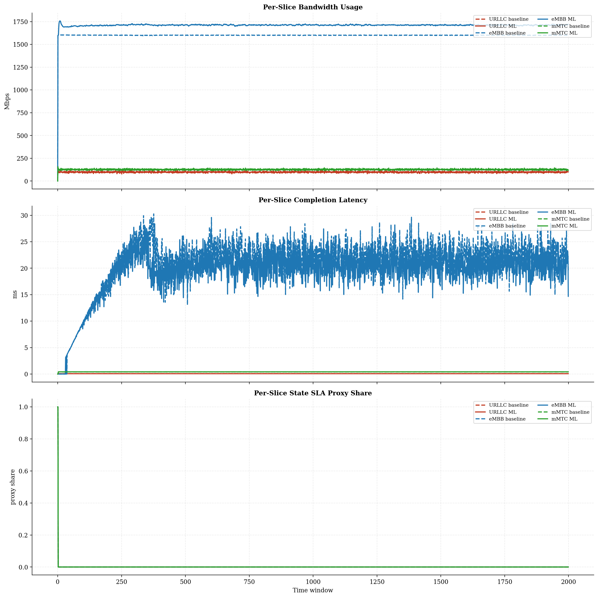
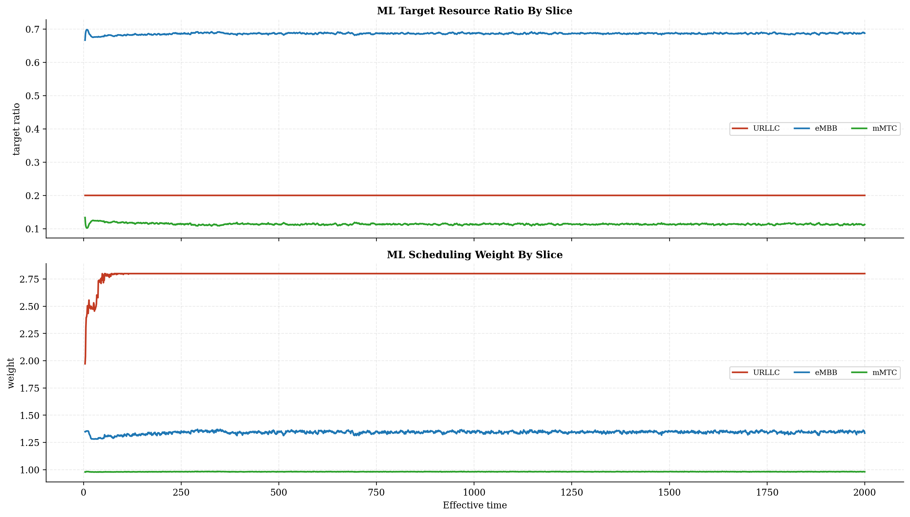
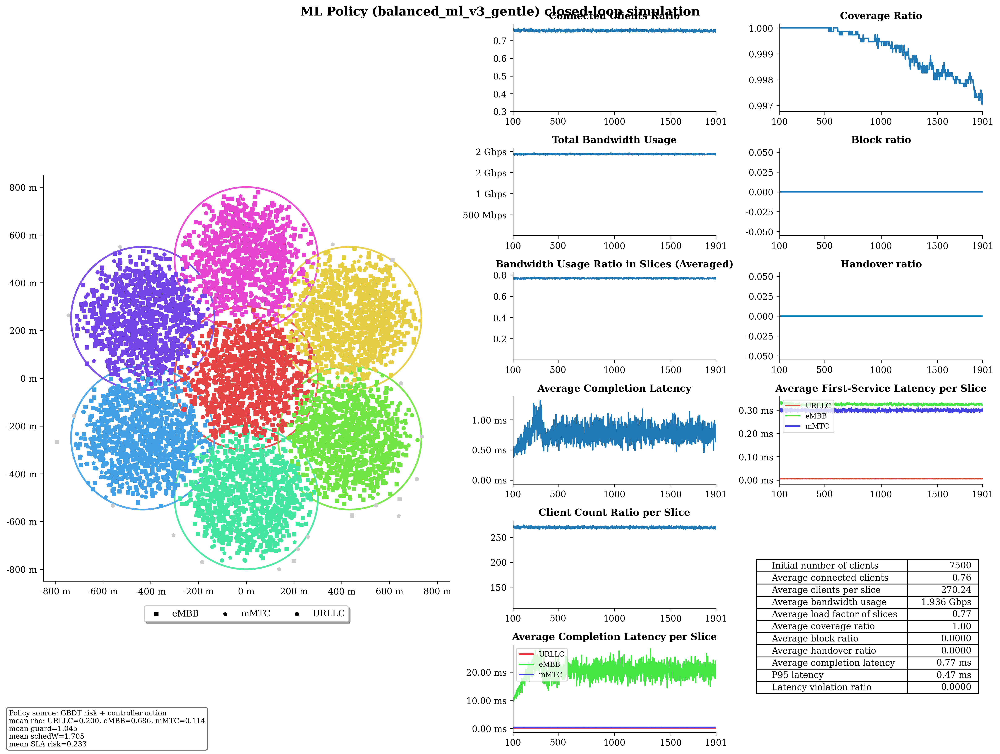

# Baseline vs ML Policy Report

## Run Summary

- Timestamp: `2026-05-08T13:14:01`
- Config: `C:\Users\LENOVO\Downloads\5G-Network-Slicing-main\5G-Network-Slicing-with-GBDT-ML-Policy\slicesim\scenario-heavy.yml`
- Model: `C:\Users\LENOVO\Downloads\5G-Network-Slicing-main\5G-Network-Slicing-with-GBDT-ML-Policy\models\sla_risk_gbdt`
- Controller type: `gbdt`
- Controller preset: `balanced_ml_v3_gentle`
- Broker enabled: `True`
- Broker preset: `forecasting_balanced`
- Seed: `123`

## Global KPI Comparison

| metric | baseline | ml_policy | delta_ml_minus_baseline | delta_pct |
|---|---|---|---|---|
| connected_clients_ratio | 0.7566 | 0.7562 | -0.0004 | -0.0533 |
| coverage_ratio | 0.9994 | 0.9991 | -0.0003 | -0.0312 |
| block_ratio | 0.0000 | 0.0000 | 0.0000 | 0.0000 |
| handover_ratio | 0.0000 | 0.0000 | 0.0000 | 0.0000 |
| avg_slice_load_ratio | 0.7239 | 0.7679 | 0.0440 | 6.0776 |
| total_bandwidth_usage | 1824129354.4798 | 1934991741.7404 | 110862387.2605 | 6.0776 |
| avg_latency_ms | 0.7446 | 0.7508 | 0.0062 | 0.8322 |
| p95_latency_ms | 0.4642 | 0.4742 | 0.0100 | 2.1616 |
| latency_violation_ratio | 0.0000 | 0.0000 | 0.0000 | 0.0000 |
| avg_state_sla_violation_share | 0.0010 | 0.0010 | 0.0000 | 0.0000 |
| bandwidth_jain_fairness | 0.4291 | 0.4227 | -0.0063 | -1.4750 |
| bandwidth_jain_fairness_min | 0.3333 | 0.3333 | 0.0000 | 0.0000 |

## Per-Slice Summary

| slice_name | avg_bandwidth_usage_mbps_baseline | avg_bandwidth_usage_mbps_ml | avg_bandwidth_usage_mbps_delta | avg_served_bandwidth_baseline | avg_served_bandwidth_ml | avg_served_bandwidth_delta | avg_completion_latency_ms_baseline | avg_completion_latency_ms_ml | avg_completion_latency_ms_delta | avg_first_service_latency_ms_baseline | avg_first_service_latency_ms_ml | avg_first_service_latency_ms_delta | avg_recorded_first_service_latency_ms_baseline | avg_recorded_first_service_latency_ms_ml | avg_recorded_first_service_latency_ms_delta | avg_bandwidth_share_baseline | avg_bandwidth_share_ml | avg_bandwidth_share_delta | zero_bandwidth_window_share_baseline | zero_bandwidth_window_share_ml | zero_bandwidth_window_share_delta | completion_ratio_baseline | completion_ratio_ml | completion_ratio_delta | completion_latency_violation_ratio_baseline | completion_latency_violation_ratio_ml | completion_latency_violation_ratio_delta | first_service_latency_violation_ratio_baseline | first_service_latency_violation_ratio_ml | first_service_latency_violation_ratio_delta | request_latency_violation_event_ratio_baseline | request_latency_violation_event_ratio_ml | request_latency_violation_event_ratio_delta | avg_state_sla_violation_share_baseline | avg_state_sla_violation_share_ml | avg_state_sla_violation_share_delta | avg_sla_safety_margin_baseline | avg_sla_safety_margin_ml | avg_sla_safety_margin_delta | avg_sla_safety_margin_improvement_pct |
|---|---|---|---|---|---|---|---|---|---|---|---|---|---|---|---|---|---|---|---|---|---|---|---|---|---|---|---|---|---|---|---|---|---|---|---|---|---|---|---|---|
| URLLC | 98.3359 | 98.1437 | -0.1923 | 340011.0474 | 339983.2483 | -27.7990 | 0.0671 | 0.0614 | -0.0057 | 0.0083 | 0.0056 | -0.0027 | 0.0083 | 0.0056 | -0.0027 | 0.0543 | 0.0512 | -0.0032 | 0.0000 | 0.0000 | 0.0000 | 0.9995 | 0.9995 | -0.0000 | 0.0000 | 0.0000 | 0.0000 | 0.0000 | 0.0000 | 0.0000 | 0.0000 | 0.0000 | 0.0000 | 0.0010 | 0.0010 | 0.0000 | 0.1948 | 0.1459 | -0.0489 | -25.0942 |
| eMBB | 1599.7019 | 1710.6589 | 110.9570 | 377042.9351 | 406784.6713 | 29741.7362 | 20.8835 | 19.4313 | -1.4523 | 0.3976 | 0.3222 | -0.0754 | 0.4010 | 0.3245 | -0.0765 | 0.8766 | 0.8837 | 0.0071 | 0.0005 | 0.0005 | 0.0000 | 0.8969 | 0.9039 | 0.0069 | 0.0000 | 0.0000 | 0.0000 | 0.0000 | 0.0000 | 0.0000 | 0.0000 | 0.0000 | 0.0000 | 0.0010 | 0.0010 | 0.0000 | 0.2123 | 0.1644 | -0.0478 | -22.5286 |
| mMTC | 126.0915 | 126.1892 | 0.0977 | 224949.0250 | 224833.9588 | -115.0661 | 0.4011 | 0.4135 | 0.0123 | 0.2936 | 0.2985 | 0.0049 | 0.2937 | 0.2986 | 0.0049 | 0.0691 | 0.0652 | -0.0039 | 0.0005 | 0.0005 | 0.0000 | 0.9990 | 0.9990 | 0.0000 | 0.0000 | 0.0000 | 0.0000 | 0.0000 | 0.0000 | 0.0000 | 0.0000 | 0.0000 | 0.0000 | 0.0010 | 0.0010 | 0.0000 | 0.2123 | 0.1644 | -0.0478 | -22.5286 |

## Per-Base-Station Summary

| base_station_id | avg_bandwidth_usage_mbps_baseline | avg_bandwidth_usage_mbps_ml | avg_bandwidth_usage_mbps_delta | avg_bandwidth_usage_mbps_delta_pct | avg_capacity_mbps_baseline | avg_capacity_mbps_ml | avg_capacity_mbps_delta | avg_capacity_mbps_delta_pct | avg_load_ratio_baseline | avg_load_ratio_ml | avg_load_ratio_delta | avg_load_ratio_delta_pct | avg_remaining_capacity_ratio_baseline | avg_remaining_capacity_ratio_ml | avg_remaining_capacity_ratio_delta | avg_remaining_capacity_ratio_delta_pct | avg_request_count_per_window_baseline | avg_request_count_per_window_ml | avg_request_count_per_window_delta | avg_request_count_per_window_delta_pct | total_request_count_baseline | total_request_count_ml | total_request_count_delta | total_request_count_delta_pct | avg_requested_usage_mbps_per_window_baseline | avg_requested_usage_mbps_per_window_ml | avg_requested_usage_mbps_per_window_delta | avg_requested_usage_mbps_per_window_delta_pct | avg_clients_seen_per_window_baseline | avg_clients_seen_per_window_ml | avg_clients_seen_per_window_delta | avg_clients_seen_per_window_delta_pct | avg_connected_events_per_window_baseline | avg_connected_events_per_window_ml | avg_connected_events_per_window_delta | avg_connected_events_per_window_delta_pct | avg_disconnected_events_per_window_baseline | avg_disconnected_events_per_window_ml | avg_disconnected_events_per_window_delta | avg_disconnected_events_per_window_delta_pct | avg_state_sla_violation_share_baseline | avg_state_sla_violation_share_ml | avg_state_sla_violation_share_delta | avg_state_sla_violation_share_delta_pct | avg_sla_safety_margin_baseline | avg_sla_safety_margin_ml | avg_sla_safety_margin_delta | avg_sla_safety_margin_delta_pct | avg_sla_breach_count_per_window_baseline | avg_sla_breach_count_per_window_ml | avg_sla_breach_count_per_window_delta | avg_sla_breach_count_per_window_delta_pct |
|---|---|---|---|---|---|---|---|---|---|---|---|---|---|---|---|---|---|---|---|---|---|---|---|---|---|---|---|---|---|---|---|---|---|---|---|---|---|---|---|---|---|---|---|---|---|---|---|---|---|---|---|---|
| BS_0 | 292.1147 | 319.3241 | 27.2093 | 9.3146 | 420.0000 | 420.0000 | 0.0000 | 0.0000 | 0.6955 | 0.7603 | 0.0648 | 9.3146 | 0.3045 | 0.2397 | -0.0648 | -21.2764 | 125.4830 | 126.2630 | 0.7800 | 0.6216 | 250966.0000 | 252526.0000 | 1560.0000 | 0.6216 | 307.3271 | 336.8401 | 29.5130 | 9.6031 | 1070.0510 | 1069.5555 | -0.4955 | -0.0463 | 125.4855 | 126.2680 | 0.7825 | 0.6236 | 125.0860 | 125.8575 | 0.7715 | 0.6168 | 0.0010 | 0.0010 | 0.0000 | 0.0000 | 0.2064 | 0.1583 | -0.0482 | -23.3355 | 0.0030 | 0.0030 | 0.0000 | 0.0000 |
| BS_1 | 255.4403 | 268.8278 | 13.3875 | 5.2409 | 350.0000 | 350.0000 | 0.0000 | 0.0000 | 0.7298 | 0.7681 | 0.0382 | 5.2409 | 0.2702 | 0.2319 | -0.0382 | -14.1577 | 126.3830 | 126.4105 | 0.0275 | 0.0218 | 252766.0000 | 252821.0000 | 55.0000 | 0.0218 | 272.0964 | 286.5570 | 14.4605 | 5.3145 | 1071.7115 | 1070.1815 | -1.5300 | -0.1428 | 126.4025 | 126.4255 | 0.0230 | 0.0182 | 125.9925 | 126.0320 | 0.0395 | 0.0314 | 0.0010 | 0.0010 | 0.0000 | 0.0000 | 0.2064 | 0.1583 | -0.0482 | -23.3355 | 0.0030 | 0.0030 | 0.0000 | 0.0000 |
| BS_2 | 256.6550 | 270.2362 | 13.5812 | 5.2916 | 350.0000 | 350.0000 | 0.0000 | 0.0000 | 0.7333 | 0.7721 | 0.0388 | 5.2916 | 0.2667 | 0.2279 | -0.0388 | -14.5494 | 129.2185 | 128.8165 | -0.4020 | -0.3111 | 258437.0000 | 257633.0000 | -804.0000 | -0.3111 | 271.5447 | 287.8448 | 16.3000 | 6.0027 | 1070.3075 | 1069.7525 | -0.5550 | -0.0519 | 129.2275 | 128.8265 | -0.4010 | -0.3103 | 128.8205 | 128.4200 | -0.4005 | -0.3109 | 0.0010 | 0.0010 | 0.0000 | 0.0000 | 0.2064 | 0.1583 | -0.0482 | -23.3355 | 0.0030 | 0.0030 | 0.0000 | 0.0000 |
| BS_3 | 252.9296 | 267.8370 | 14.9074 | 5.8939 | 350.0000 | 350.0000 | 0.0000 | 0.0000 | 0.7227 | 0.7652 | 0.0426 | 5.8939 | 0.2773 | 0.2348 | -0.0426 | -15.3573 | 113.3060 | 112.9255 | -0.3805 | -0.3358 | 226612.0000 | 225851.0000 | -761.0000 | -0.3358 | 270.1236 | 287.8978 | 17.7742 | 6.5800 | 1072.8675 | 1067.6790 | -5.1885 | -0.4836 | 113.3290 | 112.9335 | -0.3955 | -0.3490 | 112.9120 | 112.5165 | -0.3955 | -0.3503 | 0.0010 | 0.0010 | 0.0000 | 0.0000 | 0.2064 | 0.1583 | -0.0482 | -23.3355 | 0.0030 | 0.0030 | 0.0000 | 0.0000 |
| BS_4 | 256.9626 | 270.8485 | 13.8859 | 5.4039 | 350.0000 | 350.0000 | 0.0000 | 0.0000 | 0.7342 | 0.7739 | 0.0397 | 5.4039 | 0.2658 | 0.2261 | -0.0397 | -14.9251 | 129.7080 | 129.8705 | 0.1625 | 0.1253 | 259416.0000 | 259741.0000 | 325.0000 | 0.1253 | 272.5876 | 288.4924 | 15.9048 | 5.8348 | 1068.1150 | 1072.5110 | 4.3960 | 0.4116 | 129.7290 | 129.8935 | 0.1645 | 0.1268 | 129.3345 | 129.4930 | 0.1585 | 0.1226 | 0.0010 | 0.0010 | 0.0000 | 0.0000 | 0.2064 | 0.1583 | -0.0482 | -23.3355 | 0.0030 | 0.0030 | 0.0000 | 0.0000 |
| BS_5 | 254.2324 | 268.4270 | 14.1946 | 5.5833 | 350.0000 | 350.0000 | 0.0000 | 0.0000 | 0.7264 | 0.7669 | 0.0406 | 5.5833 | 0.2736 | 0.2331 | -0.0406 | -14.8219 | 120.8595 | 121.4425 | 0.5830 | 0.4824 | 241719.0000 | 242885.0000 | 1166.0000 | 0.4824 | 270.3047 | 286.8548 | 16.5501 | 6.1227 | 1072.5950 | 1073.1310 | 0.5360 | 0.0500 | 120.8780 | 121.4600 | 0.5820 | 0.4815 | 120.4610 | 121.0515 | 0.5905 | 0.4902 | 0.0010 | 0.0010 | 0.0000 | 0.0000 | 0.2064 | 0.1583 | -0.0482 | -23.3355 | 0.0030 | 0.0030 | 0.0000 | 0.0000 |
| BS_6 | 255.7946 | 269.4912 | 13.6966 | 5.3545 | 350.0000 | 350.0000 | 0.0000 | 0.0000 | 0.7308 | 0.7700 | 0.0391 | 5.3545 | 0.2692 | 0.2300 | -0.0391 | -14.5391 | 125.8105 | 126.2080 | 0.3975 | 0.3160 | 251621.0000 | 252416.0000 | 795.0000 | 0.3160 | 271.6981 | 286.5067 | 14.8086 | 5.4504 | 1070.0095 | 1070.5100 | 0.5005 | 0.0468 | 125.8245 | 126.2155 | 0.3910 | 0.3108 | 125.4170 | 125.8170 | 0.4000 | 0.3189 | 0.0010 | 0.0010 | 0.0000 | 0.0000 | 0.2064 | 0.1583 | -0.0482 | -23.3355 | 0.0030 | 0.0030 | 0.0000 | 0.0000 |

## Per-Base-Station Slice SLA Summary

| base_station_id | slice_name | avg_bandwidth_usage_mbps_baseline | avg_bandwidth_usage_mbps_ml | avg_bandwidth_usage_mbps_delta | avg_bandwidth_usage_mbps_delta_pct | avg_slice_capacity_mbps_baseline | avg_slice_capacity_mbps_ml | avg_slice_capacity_mbps_delta | avg_slice_capacity_mbps_delta_pct | avg_slice_load_ratio_baseline | avg_slice_load_ratio_ml | avg_slice_load_ratio_delta | avg_slice_load_ratio_delta_pct | avg_remaining_capacity_ratio_baseline | avg_remaining_capacity_ratio_ml | avg_remaining_capacity_ratio_delta | avg_remaining_capacity_ratio_delta_pct | avg_request_count_per_window_baseline | avg_request_count_per_window_ml | avg_request_count_per_window_delta | avg_request_count_per_window_delta_pct | total_request_count_baseline | total_request_count_ml | total_request_count_delta | total_request_count_delta_pct | avg_requested_usage_mbps_per_window_baseline | avg_requested_usage_mbps_per_window_ml | avg_requested_usage_mbps_per_window_delta | avg_requested_usage_mbps_per_window_delta_pct | avg_clients_seen_per_window_baseline | avg_clients_seen_per_window_ml | avg_clients_seen_per_window_delta | avg_clients_seen_per_window_delta_pct | avg_state_sla_violation_share_baseline | avg_state_sla_violation_share_ml | avg_state_sla_violation_share_delta | avg_state_sla_violation_share_delta_pct | avg_sla_safety_margin_baseline | avg_sla_safety_margin_ml | avg_sla_safety_margin_delta | avg_sla_safety_margin_delta_pct | avg_sla_breach_count_per_window_baseline | avg_sla_breach_count_per_window_ml | avg_sla_breach_count_per_window_delta | avg_sla_breach_count_per_window_delta_pct |
|---|---|---|---|---|---|---|---|---|---|---|---|---|---|---|---|---|---|---|---|---|---|---|---|---|---|---|---|---|---|---|---|---|---|---|---|---|---|---|---|---|---|---|---|---|---|
| BS_0 | URLLC | 14.8937 | 14.9016 | 0.0079 | 0.0527 | 84.0000 | 84.0000 | 0.0000 | 0.0000 | 0.1773 | 0.1774 | 0.0001 | 0.0527 | 0.8227 | 0.8226 | -0.0001 | -0.0114 | 43.7295 | 43.8525 | 0.1230 | 0.2813 | 87459.0000 | 87705.0000 | 246.0000 | 0.2813 | 14.8937 | 14.9016 | 0.0079 | 0.0527 | 137.3920 | 137.3430 | -0.0490 | -0.0357 | 0.0010 | 0.0010 | 0.0000 | 0.0000 | 0.1948 | 0.1459 | -0.0489 | -25.0942 | 0.0010 | 0.0010 | 0.0000 | 0.0000 |
| BS_0 | eMBB | 259.5773 | 286.7329 | 27.1556 | 10.4615 | 260.4000 | 289.5480 | 29.1480 | 11.1936 | 0.9968 | 0.9902 | -0.0066 | -0.6632 | 0.0032 | 0.0098 | 0.0066 | 209.2609 | 3.3250 | 3.6695 | 0.3445 | 10.3609 | 6650.0000 | 7339.0000 | 689.0000 | 10.3609 | 274.7815 | 304.2380 | 29.4565 | 10.7200 | 612.5730 | 611.6945 | -0.8785 | -0.1434 | 0.0010 | 0.0010 | 0.0000 | 0.0000 | 0.2123 | 0.1644 | -0.0478 | -22.5286 | 0.0010 | 0.0010 | 0.0000 | 0.0000 |
| BS_0 | mMTC | 17.6437 | 17.6896 | 0.0459 | 0.2600 | 75.6000 | 46.4520 | -29.1480 | -38.5556 | 0.2334 | 0.3813 | 0.1480 | 63.4000 | 0.7666 | 0.6187 | -0.1480 | -19.3010 | 78.4285 | 78.7410 | 0.3125 | 0.3985 | 156857.0000 | 157482.0000 | 625.0000 | 0.3985 | 17.6519 | 17.7005 | 0.0486 | 0.2756 | 320.0860 | 320.5180 | 0.4320 | 0.1350 | 0.0010 | 0.0010 | 0.0000 | 0.0000 | 0.2123 | 0.1644 | -0.0478 | -22.5286 | 0.0010 | 0.0010 | 0.0000 | 0.0000 |
| BS_1 | URLLC | 12.8839 | 12.7928 | -0.0911 | -0.7072 | 63.0000 | 69.9860 | 6.9860 | 11.0889 | 0.2045 | 0.1828 | -0.0217 | -10.6160 | 0.7955 | 0.8172 | 0.0217 | 2.7292 | 37.9285 | 37.6865 | -0.2420 | -0.6380 | 75857.0000 | 75373.0000 | -484.0000 | -0.6380 | 12.8839 | 12.7928 | -0.0911 | -0.7072 | 116.6320 | 116.0965 | -0.5355 | -0.4591 | 0.0010 | 0.0010 | 0.0000 | 0.0000 | 0.1948 | 0.1459 | -0.0489 | -25.0942 | 0.0010 | 0.0010 | 0.0000 | 0.0000 |
| BS_1 | eMBB | 223.3295 | 236.7958 | 13.4662 | 6.0298 | 224.0000 | 239.4369 | 15.4369 | 6.8915 | 0.9970 | 0.9889 | -0.0081 | -0.8091 | 0.0030 | 0.0111 | 0.0081 | 269.5181 | 2.9040 | 3.0780 | 0.1740 | 5.9917 | 5808.0000 | 6156.0000 | 348.0000 | 5.9917 | 239.9748 | 254.5149 | 14.5401 | 6.0590 | 602.1515 | 601.6805 | -0.4710 | -0.0782 | 0.0010 | 0.0010 | 0.0000 | 0.0000 | 0.2123 | 0.1644 | -0.0478 | -22.5286 | 0.0010 | 0.0010 | 0.0000 | 0.0000 |
| BS_1 | mMTC | 19.2269 | 19.2393 | 0.0123 | 0.0641 | 63.0000 | 40.5771 | -22.4229 | -35.5919 | 0.3052 | 0.4751 | 0.1699 | 55.6685 | 0.6948 | 0.5249 | -0.1699 | -24.4519 | 85.5505 | 85.6460 | 0.0955 | 0.1116 | 171101.0000 | 171292.0000 | 191.0000 | 0.1116 | 19.2377 | 19.2493 | 0.0116 | 0.0601 | 352.9280 | 352.4045 | -0.5235 | -0.1483 | 0.0010 | 0.0010 | 0.0000 | 0.0000 | 0.2123 | 0.1644 | -0.0478 | -22.5286 | 0.0010 | 0.0010 | 0.0000 | 0.0000 |
| BS_2 | URLLC | 14.3223 | 14.0148 | -0.3075 | -2.1470 | 63.0000 | 69.9860 | 6.9860 | 11.0889 | 0.2273 | 0.2003 | -0.0271 | -11.9120 | 0.7727 | 0.7997 | 0.0271 | 3.5048 | 41.9810 | 41.2560 | -0.7250 | -1.7270 | 83962.0000 | 82512.0000 | -1450.0000 | -1.7270 | 14.3223 | 14.0148 | -0.3075 | -2.1470 | 126.7725 | 126.1105 | -0.6620 | -0.5222 | 0.0010 | 0.0010 | 0.0000 | 0.0000 | 0.1948 | 0.1459 | -0.0489 | -25.0942 | 0.0010 | 0.0010 | 0.0000 | 0.0000 |
| BS_2 | eMBB | 223.3373 | 237.1869 | 13.8496 | 6.2012 | 224.0000 | 239.5894 | 15.5894 | 6.9595 | 0.9970 | 0.9899 | -0.0071 | -0.7119 | 0.0030 | 0.0101 | 0.0071 | 239.9149 | 2.8985 | 3.0935 | 0.1950 | 6.7276 | 5797.0000 | 6187.0000 | 390.0000 | 6.7276 | 238.2184 | 254.7858 | 16.5674 | 6.9547 | 601.9290 | 601.9390 | 0.0100 | 0.0017 | 0.0010 | 0.0010 | 0.0000 | 0.0000 | 0.2123 | 0.1644 | -0.0478 | -22.5286 | 0.0010 | 0.0010 | 0.0000 | 0.0000 |
| BS_2 | mMTC | 18.9955 | 19.0345 | 0.0390 | 0.2053 | 63.0000 | 40.4246 | -22.5754 | -35.8339 | 0.3015 | 0.4719 | 0.1703 | 56.4980 | 0.6985 | 0.5281 | -0.1703 | -24.3885 | 84.3390 | 84.4670 | 0.1280 | 0.1518 | 168678.0000 | 168934.0000 | 256.0000 | 0.1518 | 19.0041 | 19.0442 | 0.0401 | 0.2110 | 341.6060 | 341.7030 | 0.0970 | 0.0284 | 0.0010 | 0.0010 | 0.0000 | 0.0000 | 0.2123 | 0.1644 | -0.0478 | -22.5286 | 0.0010 | 0.0010 | 0.0000 | 0.0000 |
| BS_3 | URLLC | 13.9169 | 13.8291 | -0.0878 | -0.6305 | 63.0000 | 69.9860 | 6.9860 | 11.0889 | 0.2209 | 0.1976 | -0.0233 | -10.5472 | 0.7791 | 0.8024 | 0.0233 | 2.9905 | 40.9040 | 40.6275 | -0.2765 | -0.6760 | 81808.0000 | 81255.0000 | -553.0000 | -0.6760 | 13.9169 | 13.8291 | -0.0878 | -0.6305 | 125.7335 | 125.5285 | -0.2050 | -0.1630 | 0.0010 | 0.0010 | 0.0000 | 0.0000 | 0.1948 | 0.1459 | -0.0489 | -25.0942 | 0.0010 | 0.0010 | 0.0000 | 0.0000 |
| BS_3 | eMBB | 223.4001 | 238.4423 | 15.0422 | 6.7333 | 224.0000 | 241.0727 | 17.0727 | 7.6218 | 0.9973 | 0.9891 | -0.0083 | -0.8289 | 0.0027 | 0.0109 | 0.0083 | 308.6795 | 2.9125 | 3.1625 | 0.2500 | 8.5837 | 5825.0000 | 6325.0000 | 500.0000 | 8.5837 | 240.5863 | 258.4944 | 17.9080 | 7.4435 | 661.3725 | 658.7665 | -2.6060 | -0.3940 | 0.0010 | 0.0010 | 0.0000 | 0.0000 | 0.2123 | 0.1644 | -0.0478 | -22.5286 | 0.0010 | 0.0010 | 0.0000 | 0.0000 |
| BS_3 | mMTC | 15.6126 | 15.5655 | -0.0471 | -0.3015 | 63.0000 | 38.9413 | -24.0587 | -38.1885 | 0.2478 | 0.4004 | 0.1526 | 61.5661 | 0.7522 | 0.5996 | -0.1526 | -20.2840 | 69.4895 | 69.1355 | -0.3540 | -0.5094 | 138979.0000 | 138271.0000 | -708.0000 | -0.5094 | 15.6204 | 15.5744 | -0.0461 | -0.2949 | 285.7615 | 283.3840 | -2.3775 | -0.8320 | 0.0010 | 0.0010 | 0.0000 | 0.0000 | 0.2123 | 0.1644 | -0.0478 | -22.5286 | 0.0010 | 0.0010 | 0.0000 | 0.0000 |
| BS_4 | URLLC | 15.2146 | 15.2944 | 0.0799 | 0.5249 | 63.0000 | 69.9860 | 6.9860 | 11.0889 | 0.2415 | 0.2185 | -0.0230 | -9.5080 | 0.7585 | 0.7815 | 0.0230 | 3.0273 | 44.8590 | 44.9755 | 0.1165 | 0.2597 | 89718.0000 | 89951.0000 | 233.0000 | 0.2597 | 15.2146 | 15.2944 | 0.0799 | 0.5249 | 138.4890 | 138.3280 | -0.1610 | -0.1163 | 0.0010 | 0.0010 | 0.0000 | 0.0000 | 0.1948 | 0.1459 | -0.0489 | -25.0942 | 0.0010 | 0.0010 | 0.0000 | 0.0000 |
| BS_4 | eMBB | 223.3284 | 237.1531 | 13.8248 | 6.1903 | 224.0000 | 239.7166 | 15.7166 | 7.0163 | 0.9970 | 0.9893 | -0.0077 | -0.7749 | 0.0030 | 0.0107 | 0.0077 | 257.6541 | 2.9145 | 3.0455 | 0.1310 | 4.4948 | 5829.0000 | 6091.0000 | 262.0000 | 4.4948 | 238.9448 | 254.7881 | 15.8433 | 6.6305 | 592.6680 | 597.2935 | 4.6255 | 0.7805 | 0.0010 | 0.0010 | 0.0000 | 0.0000 | 0.2123 | 0.1644 | -0.0478 | -22.5286 | 0.0010 | 0.0010 | 0.0000 | 0.0000 |
| BS_4 | mMTC | 18.4197 | 18.4009 | -0.0187 | -0.1017 | 63.0000 | 40.2974 | -22.7026 | -36.0359 | 0.2924 | 0.4575 | 0.1651 | 56.4766 | 0.7076 | 0.5425 | -0.1651 | -23.3349 | 81.9345 | 81.8495 | -0.0850 | -0.1037 | 163869.0000 | 163699.0000 | -170.0000 | -0.1037 | 18.4282 | 18.4099 | -0.0183 | -0.0994 | 336.9580 | 336.8895 | -0.0685 | -0.0203 | 0.0010 | 0.0010 | 0.0000 | 0.0000 | 0.2123 | 0.1644 | -0.0478 | -22.5286 | 0.0010 | 0.0010 | 0.0000 | 0.0000 |
| BS_5 | URLLC | 12.9139 | 13.0747 | 0.1608 | 1.2455 | 63.0000 | 69.9860 | 6.9860 | 11.0889 | 0.2050 | 0.1868 | -0.0182 | -8.8609 | 0.7950 | 0.8132 | 0.0182 | 2.2846 | 38.0480 | 38.3540 | 0.3060 | 0.8042 | 76096.0000 | 76708.0000 | 612.0000 | 0.8042 | 12.9139 | 13.0747 | 0.1608 | 1.2455 | 116.7385 | 117.1750 | 0.4365 | 0.3739 | 0.0010 | 0.0010 | 0.0000 | 0.0000 | 0.1948 | 0.1459 | -0.0489 | -25.0942 | 0.0010 | 0.0010 | 0.0000 | 0.0000 |
| BS_5 | eMBB | 223.3818 | 237.3820 | 14.0002 | 6.2674 | 224.0000 | 240.0370 | 16.0370 | 7.1594 | 0.9972 | 0.9889 | -0.0083 | -0.8354 | 0.0028 | 0.0111 | 0.0083 | 301.8645 | 2.8950 | 3.0920 | 0.1970 | 6.8048 | 5790.0000 | 6184.0000 | 394.0000 | 6.8048 | 239.4440 | 255.8015 | 16.3576 | 6.8315 | 626.1805 | 625.5555 | -0.6250 | -0.0998 | 0.0010 | 0.0010 | 0.0000 | 0.0000 | 0.2123 | 0.1644 | -0.0478 | -22.5286 | 0.0010 | 0.0010 | 0.0000 | 0.0000 |
| BS_5 | mMTC | 17.9368 | 17.9703 | 0.0335 | 0.1870 | 63.0000 | 39.9770 | -23.0230 | -36.5444 | 0.2847 | 0.4503 | 0.1656 | 58.1653 | 0.7153 | 0.5497 | -0.1656 | -23.1519 | 79.9165 | 79.9965 | 0.0800 | 0.1001 | 159833.0000 | 159993.0000 | 160.0000 | 0.1001 | 17.9469 | 17.9785 | 0.0317 | 0.1765 | 329.6760 | 330.4005 | 0.7245 | 0.2198 | 0.0010 | 0.0010 | 0.0000 | 0.0000 | 0.2123 | 0.1644 | -0.0478 | -22.5286 | 0.0010 | 0.0010 | 0.0000 | 0.0000 |
| BS_6 | URLLC | 14.1907 | 14.2363 | 0.0455 | 0.3208 | 63.0000 | 69.9860 | 6.9860 | 11.0889 | 0.2252 | 0.2034 | -0.0218 | -9.6918 | 0.7748 | 0.7966 | 0.0218 | 2.8178 | 41.7595 | 41.9190 | 0.1595 | 0.3819 | 83519.0000 | 83838.0000 | 319.0000 | 0.3819 | 14.1907 | 14.2363 | 0.0455 | 0.3208 | 128.8640 | 128.9245 | 0.0605 | 0.0469 | 0.0010 | 0.0010 | 0.0000 | 0.0000 | 0.1948 | 0.1459 | -0.0489 | -25.0942 | 0.0010 | 0.0010 | 0.0000 | 0.0000 |
| BS_6 | eMBB | 223.3475 | 236.9659 | 13.6184 | 6.0974 | 224.0000 | 239.8973 | 15.8973 | 7.0970 | 0.9971 | 0.9877 | -0.0093 | -0.9366 | 0.0029 | 0.0123 | 0.0093 | 320.6043 | 2.8875 | 3.0855 | 0.1980 | 6.8571 | 5775.0000 | 6171.0000 | 396.0000 | 6.8571 | 239.2418 | 253.9715 | 14.7297 | 6.1568 | 610.8685 | 610.9105 | 0.0420 | 0.0069 | 0.0010 | 0.0010 | 0.0000 | 0.0000 | 0.2123 | 0.1644 | -0.0478 | -22.5286 | 0.0010 | 0.0010 | 0.0000 | 0.0000 |
| BS_6 | mMTC | 18.2564 | 18.2891 | 0.0327 | 0.1793 | 63.0000 | 40.1167 | -22.8833 | -36.3227 | 0.2898 | 0.4567 | 0.1669 | 57.6097 | 0.7102 | 0.5433 | -0.1669 | -23.5060 | 81.1635 | 81.2035 | 0.0400 | 0.0493 | 162327.0000 | 162407.0000 | 80.0000 | 0.0493 | 18.2655 | 18.2989 | 0.0334 | 0.1828 | 330.2770 | 330.6750 | 0.3980 | 0.1205 | 0.0010 | 0.0010 | 0.0000 | 0.0000 | 0.2123 | 0.1644 | -0.0478 | -22.5286 | 0.0010 | 0.0010 | 0.0000 | 0.0000 |

## Resource Allocation Summary

| slice_name | baseline_state_ratio | ml_state_ratio | ml_action_target_ratio_mean | ml_action_target_ratio_min | ml_action_target_ratio_max | ml_scheduling_weight_mean | ml_admission_guard_factor_mean | target_ratio_delta_vs_baseline_state |
|---|---|---|---|---|---|---|---|---|
| URLLC | 0.1829 | 0.2000 | 0.2000 | 0.2000 | 0.2000 | 2.7936 | 1.0846 | 0.0171 |
| eMBB | 0.6371 | 0.6861 | 0.6862 | 0.6635 | 0.7000 | 1.3419 | 1.0430 | 0.0491 |
| mMTC | 0.1800 | 0.1139 | 0.1138 | 0.1000 | 0.1365 | 0.9810 | 1.0086 | -0.0662 |

## Visual Comparison

### Global KPI View

### Per-Slice View

### Per-Slice Panel Images

#### Throughput per Slice

#### Latency per Slice

#### Completion Ratio

#### SLA Safety Margin Improvement

#### Improvement Heatmap

### Per-Slice Time-Series View

### ML Action Distribution

### ML Policy Simulation Snapshot

## Metric Notes

- `avg_state_sla_violation_share` is the per-slice state-level SLA violation ratio averaged from simulator state frames.
- `avg_sla_safety_margin` is the average distance to the active SLA boundary. Higher is better; negative means violation.
- `avg_sla_safety_margin_improvement_pct` is `(ML margin - baseline margin) / abs(baseline margin) * 100`.
- `request_latency_violation_event_ratio`, `completion_latency_violation_ratio`, and `first_service_latency_violation_ratio` are client-level latency-only metrics.
- A latency value of `0` can mean no recorded latency event for that slice/window. Check `completion_ratio` and request/completion counts before interpreting it as perfect latency.
- `bandwidth_jain_fairness` is Jain's fairness index over per-slice bandwidth usage per time window. Higher is more balanced, with `1.0` meaning equal usage across slices.

## Trade-off Notes

- URLLC completion latency changed by -0.01 ms and SLA safety margin changed by -0.0489 (-25.1%).
- eMBB average bandwidth usage changed by 110.957 Mbps and completion ratio changed by 0.0069.
- mMTC first-service latency changed by 0.00 ms and completion ratio changed by 0.0000.
- URLLC recorded first-service latency changed by -0.00 ms on windows with actual first-service events.
- Classic trade-off snapshot: if URLLC improved by 0.01 ms in latency, eMBB bandwidth moved by 110.957 Mbps.

## Artifacts

- Baseline raw states: `C:\Users\LENOVO\Downloads\5G-Network-Slicing-main\5G-Network-Slicing-with-GBDT-ML-Policy\FINAL_OUTPUT_heavy_seed123_20260508_112416\baseline_run\baseline_states.csv`
- ML raw states: `C:\Users\LENOVO\Downloads\5G-Network-Slicing-main\5G-Network-Slicing-with-GBDT-ML-Policy\FINAL_OUTPUT_heavy_seed123_20260508_112416\ml_run\online_states_raw.csv`
- ML broker forecasts: `C:\Users\LENOVO\Downloads\5G-Network-Slicing-main\5G-Network-Slicing-with-GBDT-ML-Policy\FINAL_OUTPUT_heavy_seed123_20260508_112416\ml_run\online_broker_forecasts.csv`
- ML broker feedback: `C:\Users\LENOVO\Downloads\5G-Network-Slicing-main\5G-Network-Slicing-with-GBDT-ML-Policy\FINAL_OUTPUT_heavy_seed123_20260508_112416\ml_run\online_broker_feedback.csv`
- Comparison CSV (global): `C:\Users\LENOVO\Downloads\5G-Network-Slicing-main\5G-Network-Slicing-with-GBDT-ML-Policy\FINAL_OUTPUT_heavy_seed123_20260508_112416\global_kpi_comparison.csv`
- Comparison CSV (per-slice): `C:\Users\LENOVO\Downloads\5G-Network-Slicing-main\5G-Network-Slicing-with-GBDT-ML-Policy\FINAL_OUTPUT_heavy_seed123_20260508_112416\per_slice_comparison.csv`
- Comparison CSV (per-base-station): `C:\Users\LENOVO\Downloads\5G-Network-Slicing-main\5G-Network-Slicing-with-GBDT-ML-Policy\FINAL_OUTPUT_heavy_seed123_20260508_112416\per_base_station_comparison.csv`
- Comparison CSV (per-base-station-slice): `C:\Users\LENOVO\Downloads\5G-Network-Slicing-main\5G-Network-Slicing-with-GBDT-ML-Policy\FINAL_OUTPUT_heavy_seed123_20260508_112416\per_base_station_slice_comparison.csv`
- Resource allocation CSV: `C:\Users\LENOVO\Downloads\5G-Network-Slicing-main\5G-Network-Slicing-with-GBDT-ML-Policy\FINAL_OUTPUT_heavy_seed123_20260508_112416\resource_allocation_summary.csv`
- ML action time-series CSV: `C:\Users\LENOVO\Downloads\5G-Network-Slicing-main\5G-Network-Slicing-with-GBDT-ML-Policy\FINAL_OUTPUT_heavy_seed123_20260508_112416\ml_action_ratio_timeseries.csv`
- Global KPI plot: `C:\Users\LENOVO\Downloads\5G-Network-Slicing-main\5G-Network-Slicing-with-GBDT-ML-Policy\FINAL_OUTPUT_heavy_seed123_20260508_112416\baseline_vs_ml_global_kpis.png`
- Per-slice bar plot: `C:\Users\LENOVO\Downloads\5G-Network-Slicing-main\5G-Network-Slicing-with-GBDT-ML-Policy\FINAL_OUTPUT_heavy_seed123_20260508_112416\baseline_vs_ml_per_slice_bars.png`
- Per-slice vector plot (SVG): `C:\Users\LENOVO\Downloads\5G-Network-Slicing-main\5G-Network-Slicing-with-GBDT-ML-Policy\FINAL_OUTPUT_heavy_seed123_20260508_112416\baseline_vs_ml_per_slice_bars.svg`
- Per-slice panel plot (Throughput per Slice): `C:\Users\LENOVO\Downloads\5G-Network-Slicing-main\5G-Network-Slicing-with-GBDT-ML-Policy\FINAL_OUTPUT_heavy_seed123_20260508_112416\baseline_vs_ml_per_slice_bars_throughput.png`
- Per-slice panel plot (Latency per Slice): `C:\Users\LENOVO\Downloads\5G-Network-Slicing-main\5G-Network-Slicing-with-GBDT-ML-Policy\FINAL_OUTPUT_heavy_seed123_20260508_112416\baseline_vs_ml_per_slice_bars_latency.png`
- Per-slice panel plot (Completion Ratio): `C:\Users\LENOVO\Downloads\5G-Network-Slicing-main\5G-Network-Slicing-with-GBDT-ML-Policy\FINAL_OUTPUT_heavy_seed123_20260508_112416\baseline_vs_ml_per_slice_bars_completion_ratio.png`
- Per-slice panel plot (SLA Safety Margin Improvement): `C:\Users\LENOVO\Downloads\5G-Network-Slicing-main\5G-Network-Slicing-with-GBDT-ML-Policy\FINAL_OUTPUT_heavy_seed123_20260508_112416\baseline_vs_ml_per_slice_bars_sla_margin_improvement.png`
- Per-slice panel plot (Improvement Heatmap): `C:\Users\LENOVO\Downloads\5G-Network-Slicing-main\5G-Network-Slicing-with-GBDT-ML-Policy\FINAL_OUTPUT_heavy_seed123_20260508_112416\baseline_vs_ml_per_slice_bars_improvement_heatmap.png`
- Per-slice time-series plot: `C:\Users\LENOVO\Downloads\5G-Network-Slicing-main\5G-Network-Slicing-with-GBDT-ML-Policy\FINAL_OUTPUT_heavy_seed123_20260508_112416\baseline_vs_ml_timeseries.png`
- ML action distribution plot: `C:\Users\LENOVO\Downloads\5G-Network-Slicing-main\5G-Network-Slicing-with-GBDT-ML-Policy\FINAL_OUTPUT_heavy_seed123_20260508_112416\ml_action_distribution.png`
- ML policy simulation graph: `C:\Users\LENOVO\Downloads\5G-Network-Slicing-main\5G-Network-Slicing-with-GBDT-ML-Policy\FINAL_OUTPUT_heavy_seed123_20260508_112416\ml_run\ml_policy_simulation.png`
