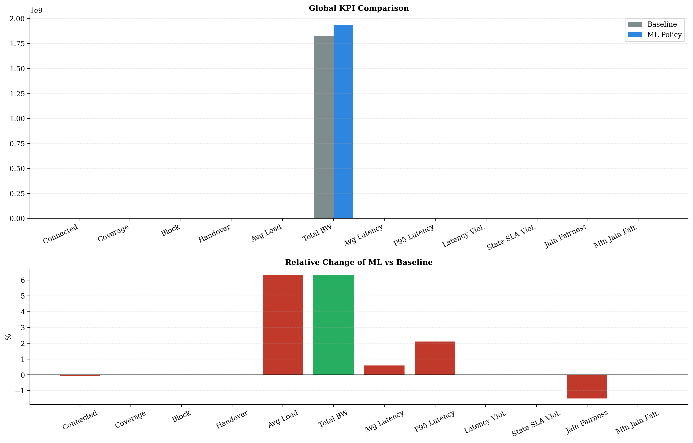
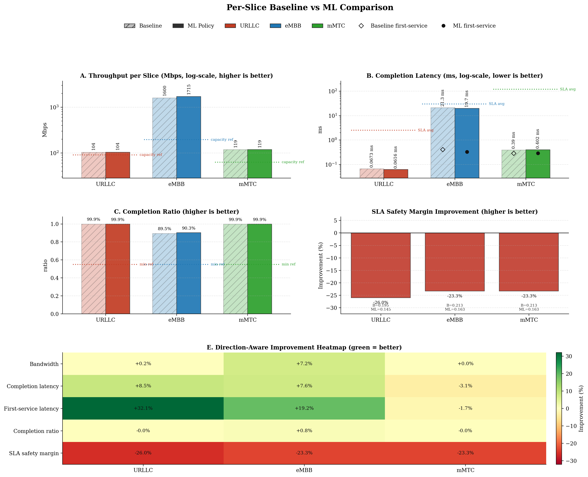
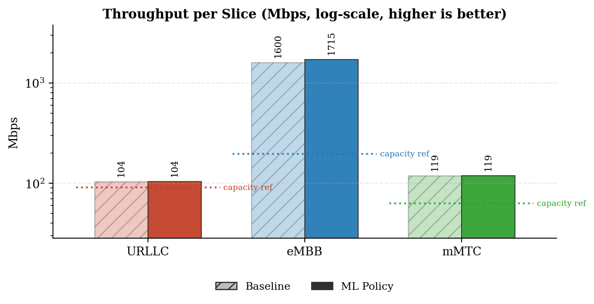
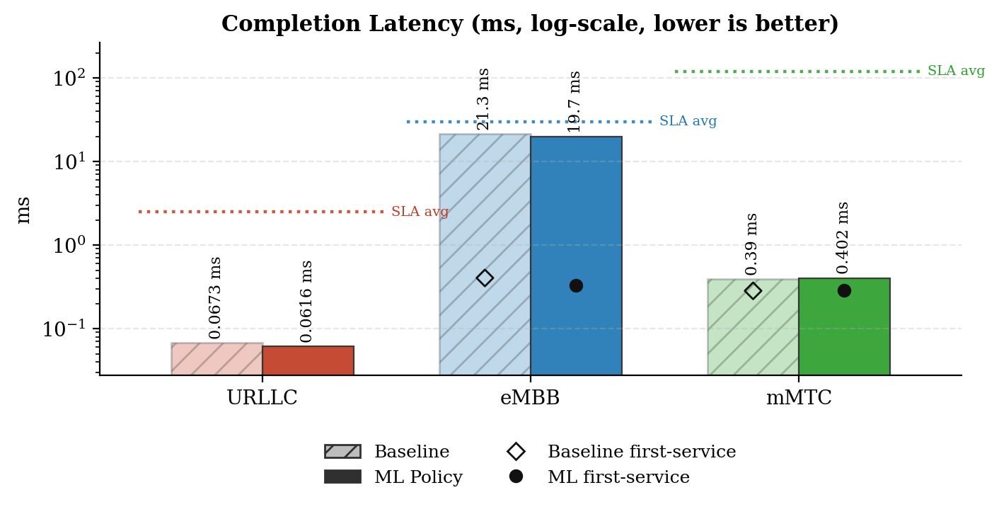
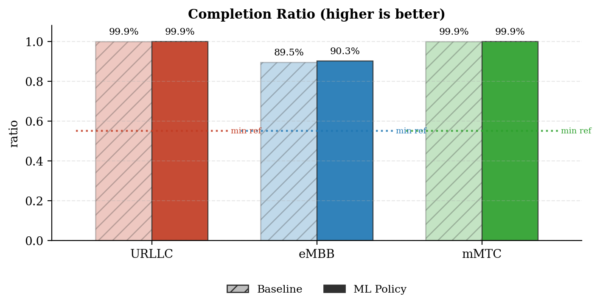
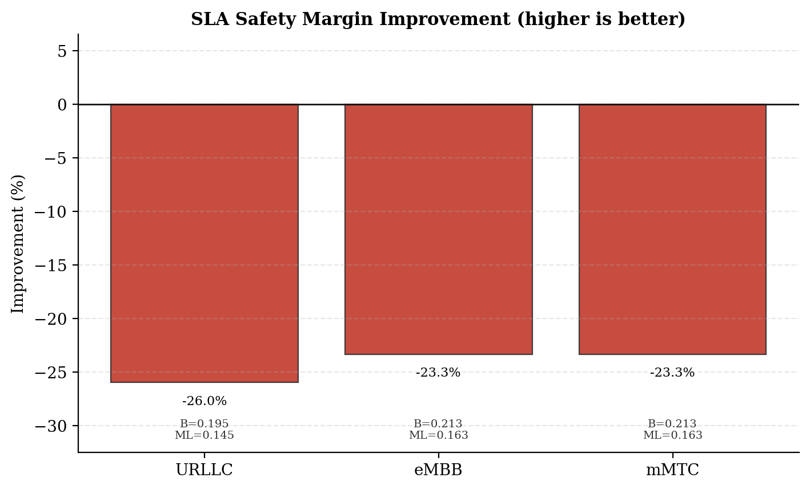
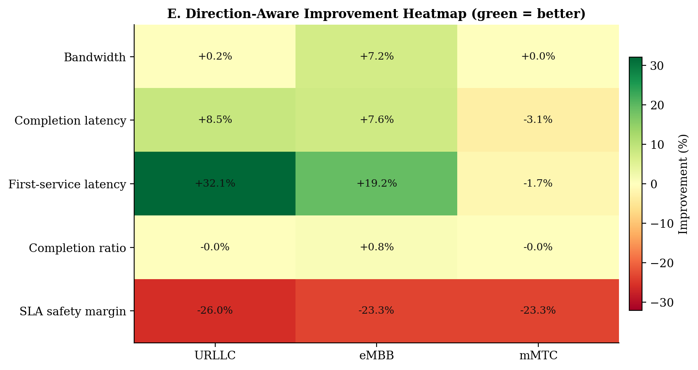
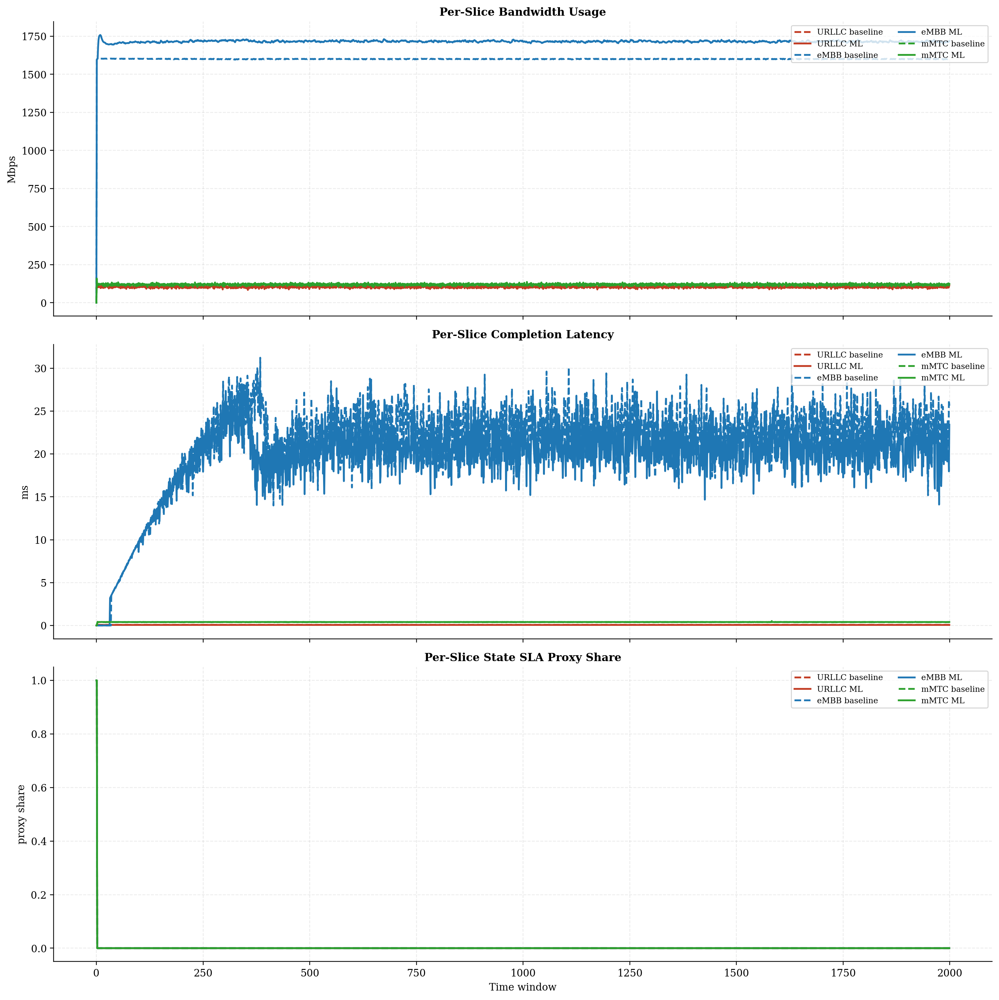
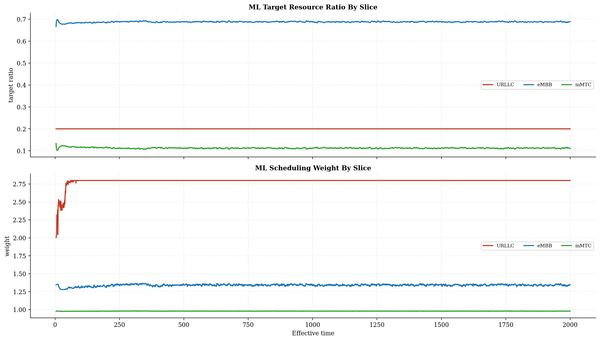
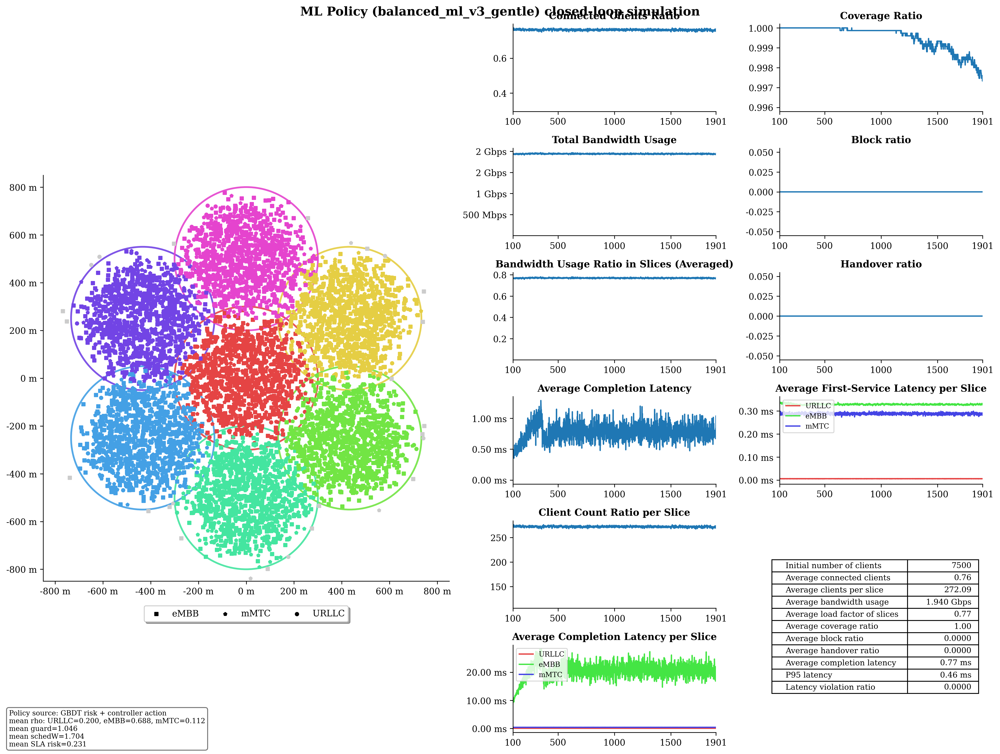

# Baseline vs ML Policy Report

## Run Summary

- Timestamp: `2026-05-08T15:12:16`
- Config: `C:\Users\LENOVO\Downloads\5G-Network-Slicing-main\5G-Network-Slicing-with-GBDT-ML-Policy\slicesim\scenario-heavy.yml`
- Model: `C:\Users\LENOVO\Downloads\5G-Network-Slicing-main\5G-Network-Slicing-with-GBDT-ML-Policy\models\sla_risk_gbdt`
- Controller type: `gbdt`
- Controller preset: `balanced_ml_v3_gentle`
- Broker enabled: `True`
- Broker preset: `forecasting_balanced`
- Seed: `256`

## Global KPI Comparison

| metric | baseline | ml_policy | delta_ml_minus_baseline | delta_pct |
|---|---|---|---|---|
| connected_clients_ratio | 0.7617 | 0.7613 | -0.0004 | -0.0587 |
| coverage_ratio | 0.9994 | 0.9994 | -0.0000 | -0.0002 |
| block_ratio | 0.0000 | 0.0000 | 0.0000 | 0.0000 |
| handover_ratio | 0.0000 | 0.0000 | 0.0000 | 0.0000 |
| avg_slice_load_ratio | 0.7234 | 0.7691 | 0.0457 | 6.3160 |
| total_bandwidth_usage | 1822910700.7581 | 1938046271.6042 | 115135570.8461 | 6.3160 |
| avg_latency_ms | 0.7466 | 0.7510 | 0.0044 | 0.5920 |
| p95_latency_ms | 0.4481 | 0.4575 | 0.0094 | 2.1050 |
| latency_violation_ratio | 0.0000 | 0.0000 | 0.0000 | 0.0000 |
| avg_state_sla_violation_share | 0.0010 | 0.0010 | 0.0000 | 0.0000 |
| bandwidth_jain_fairness | 0.4285 | 0.4221 | -0.0064 | -1.4890 |
| bandwidth_jain_fairness_min | 0.3333 | 0.3333 | 0.0000 | 0.0000 |

## Per-Slice Summary

| slice_name | avg_bandwidth_usage_mbps_baseline | avg_bandwidth_usage_mbps_ml | avg_bandwidth_usage_mbps_delta | avg_served_bandwidth_baseline | avg_served_bandwidth_ml | avg_served_bandwidth_delta | avg_completion_latency_ms_baseline | avg_completion_latency_ms_ml | avg_completion_latency_ms_delta | avg_first_service_latency_ms_baseline | avg_first_service_latency_ms_ml | avg_first_service_latency_ms_delta | avg_recorded_first_service_latency_ms_baseline | avg_recorded_first_service_latency_ms_ml | avg_recorded_first_service_latency_ms_delta | avg_bandwidth_share_baseline | avg_bandwidth_share_ml | avg_bandwidth_share_delta | zero_bandwidth_window_share_baseline | zero_bandwidth_window_share_ml | zero_bandwidth_window_share_delta | completion_ratio_baseline | completion_ratio_ml | completion_ratio_delta | completion_latency_violation_ratio_baseline | completion_latency_violation_ratio_ml | completion_latency_violation_ratio_delta | first_service_latency_violation_ratio_baseline | first_service_latency_violation_ratio_ml | first_service_latency_violation_ratio_delta | request_latency_violation_event_ratio_baseline | request_latency_violation_event_ratio_ml | request_latency_violation_event_ratio_delta | avg_state_sla_violation_share_baseline | avg_state_sla_violation_share_ml | avg_state_sla_violation_share_delta | avg_sla_safety_margin_baseline | avg_sla_safety_margin_ml | avg_sla_safety_margin_delta | avg_sla_safety_margin_improvement_pct |
|---|---|---|---|---|---|---|---|---|---|---|---|---|---|---|---|---|---|---|---|---|---|---|---|---|---|---|---|---|---|---|---|---|---|---|---|---|---|---|---|---|
| URLLC | 104.0225 | 104.2049 | 0.1824 | 340170.8394 | 340405.4789 | 234.6395 | 0.0673 | 0.0616 | -0.0057 | 0.0085 | 0.0058 | -0.0027 | 0.0085 | 0.0058 | -0.0027 | 0.0575 | 0.0542 | -0.0033 | 0.0000 | 0.0000 | 0.0000 | 0.9995 | 0.9995 | -0.0000 | 0.0000 | 0.0000 | 0.0000 | 0.0000 | 0.0000 | 0.0000 | 0.0000 | 0.0000 | 0.0000 | 0.0010 | 0.0010 | 0.0000 | 0.1953 | 0.1446 | -0.0508 | -25.9914 |
| eMBB | 1599.8091 | 1714.7352 | 114.9261 | 369686.1435 | 399729.8290 | 30043.6856 | 21.3016 | 19.6722 | -1.6295 | 0.4041 | 0.3266 | -0.0775 | 0.4070 | 0.3289 | -0.0780 | 0.8772 | 0.8844 | 0.0072 | 0.0005 | 0.0005 | 0.0000 | 0.8952 | 0.9027 | 0.0075 | 0.0000 | 0.0000 | 0.0000 | 0.0000 | 0.0000 | 0.0000 | 0.0000 | 0.0000 | 0.0000 | 0.0010 | 0.0010 | 0.0000 | 0.2128 | 0.1631 | -0.0497 | -23.3415 |
| mMTC | 119.0791 | 119.1062 | 0.0271 | 225010.1016 | 224885.3518 | -124.7498 | 0.3902 | 0.4024 | 0.0121 | 0.2833 | 0.2881 | 0.0048 | 0.2834 | 0.2883 | 0.0048 | 0.0653 | 0.0614 | -0.0039 | 0.0005 | 0.0005 | 0.0000 | 0.9990 | 0.9990 | -0.0000 | 0.0000 | 0.0000 | 0.0000 | 0.0000 | 0.0000 | 0.0000 | 0.0000 | 0.0000 | 0.0000 | 0.0010 | 0.0010 | 0.0000 | 0.2128 | 0.1631 | -0.0497 | -23.3415 |

## Per-Base-Station Summary

| base_station_id | avg_bandwidth_usage_mbps_baseline | avg_bandwidth_usage_mbps_ml | avg_bandwidth_usage_mbps_delta | avg_bandwidth_usage_mbps_delta_pct | avg_capacity_mbps_baseline | avg_capacity_mbps_ml | avg_capacity_mbps_delta | avg_capacity_mbps_delta_pct | avg_load_ratio_baseline | avg_load_ratio_ml | avg_load_ratio_delta | avg_load_ratio_delta_pct | avg_remaining_capacity_ratio_baseline | avg_remaining_capacity_ratio_ml | avg_remaining_capacity_ratio_delta | avg_remaining_capacity_ratio_delta_pct | avg_request_count_per_window_baseline | avg_request_count_per_window_ml | avg_request_count_per_window_delta | avg_request_count_per_window_delta_pct | total_request_count_baseline | total_request_count_ml | total_request_count_delta | total_request_count_delta_pct | avg_requested_usage_mbps_per_window_baseline | avg_requested_usage_mbps_per_window_ml | avg_requested_usage_mbps_per_window_delta | avg_requested_usage_mbps_per_window_delta_pct | avg_clients_seen_per_window_baseline | avg_clients_seen_per_window_ml | avg_clients_seen_per_window_delta | avg_clients_seen_per_window_delta_pct | avg_connected_events_per_window_baseline | avg_connected_events_per_window_ml | avg_connected_events_per_window_delta | avg_connected_events_per_window_delta_pct | avg_disconnected_events_per_window_baseline | avg_disconnected_events_per_window_ml | avg_disconnected_events_per_window_delta | avg_disconnected_events_per_window_delta_pct | avg_state_sla_violation_share_baseline | avg_state_sla_violation_share_ml | avg_state_sla_violation_share_delta | avg_state_sla_violation_share_delta_pct | avg_sla_safety_margin_baseline | avg_sla_safety_margin_ml | avg_sla_safety_margin_delta | avg_sla_safety_margin_delta_pct | avg_sla_breach_count_per_window_baseline | avg_sla_breach_count_per_window_ml | avg_sla_breach_count_per_window_delta | avg_sla_breach_count_per_window_delta_pct |
|---|---|---|---|---|---|---|---|---|---|---|---|---|---|---|---|---|---|---|---|---|---|---|---|---|---|---|---|---|---|---|---|---|---|---|---|---|---|---|---|---|---|---|---|---|---|---|---|---|---|---|---|---|
| BS_0 | 293.3915 | 321.2496 | 27.8581 | 9.4952 | 420.0000 | 420.0000 | 0.0000 | 0.0000 | 0.6986 | 0.7649 | 0.0663 | 9.4952 | 0.3014 | 0.2351 | -0.0663 | -22.0034 | 126.8985 | 127.7670 | 0.8685 | 0.6844 | 253797.0000 | 255534.0000 | 1737.0000 | 0.6844 | 309.1023 | 338.4240 | 29.3217 | 9.4861 | 1072.0175 | 1070.7810 | -1.2365 | -0.1153 | 126.9045 | 127.7730 | 0.8685 | 0.6844 | 126.4895 | 127.3650 | 0.8755 | 0.6922 | 0.0010 | 0.0010 | 0.0000 | 0.0000 | 0.2069 | 0.1569 | -0.0500 | -24.1751 | 0.0030 | 0.0030 | 0.0000 | 0.0000 |
| BS_1 | 254.8607 | 269.3167 | 14.4560 | 5.6721 | 350.0000 | 350.0000 | 0.0000 | 0.0000 | 0.7282 | 0.7695 | 0.0413 | 5.6721 | 0.2718 | 0.2305 | -0.0413 | -15.1946 | 121.1600 | 121.1235 | -0.0365 | -0.0301 | 242320.0000 | 242247.0000 | -73.0000 | -0.0301 | 270.7713 | 286.9592 | 16.1879 | 5.9784 | 1070.4925 | 1070.1810 | -0.3115 | -0.0291 | 121.1770 | 121.1290 | -0.0480 | -0.0396 | 120.7765 | 120.7120 | -0.0645 | -0.0534 | 0.0010 | 0.0010 | 0.0000 | 0.0000 | 0.2069 | 0.1569 | -0.0500 | -24.1751 | 0.0030 | 0.0030 | 0.0000 | 0.0000 |
| BS_2 | 255.8390 | 269.9059 | 14.0669 | 5.4983 | 350.0000 | 350.0000 | 0.0000 | 0.0000 | 0.7310 | 0.7712 | 0.0402 | 5.4983 | 0.2690 | 0.2288 | -0.0402 | -14.9392 | 125.6085 | 125.8600 | 0.2515 | 0.2002 | 251217.0000 | 251720.0000 | 503.0000 | 0.2002 | 271.6226 | 288.4673 | 16.8448 | 6.2015 | 1071.3320 | 1072.3150 | 0.9830 | 0.0918 | 125.6275 | 125.8995 | 0.2720 | 0.2165 | 125.2350 | 125.4910 | 0.2560 | 0.2044 | 0.0010 | 0.0010 | 0.0000 | 0.0000 | 0.2069 | 0.1569 | -0.0500 | -24.1751 | 0.0030 | 0.0030 | 0.0000 | 0.0000 |
| BS_3 | 255.4563 | 270.1102 | 14.6539 | 5.7364 | 350.0000 | 350.0000 | 0.0000 | 0.0000 | 0.7299 | 0.7717 | 0.0419 | 5.7364 | 0.2701 | 0.2283 | -0.0419 | -15.4996 | 123.2990 | 123.6500 | 0.3510 | 0.2847 | 246598.0000 | 247300.0000 | 702.0000 | 0.2847 | 271.1313 | 287.6257 | 16.4944 | 6.0835 | 1070.0435 | 1069.8880 | -0.1555 | -0.0145 | 123.3100 | 123.6720 | 0.3620 | 0.2936 | 122.9010 | 123.2645 | 0.3635 | 0.2958 | 0.0010 | 0.0010 | 0.0000 | 0.0000 | 0.2069 | 0.1569 | -0.0500 | -24.1751 | 0.0030 | 0.0030 | 0.0000 | 0.0000 |
| BS_4 | 254.7008 | 269.2013 | 14.5005 | 5.6932 | 350.0000 | 350.0000 | 0.0000 | 0.0000 | 0.7277 | 0.7691 | 0.0414 | 5.6932 | 0.2723 | 0.2309 | -0.0414 | -15.2158 | 121.1035 | 121.7250 | 0.6215 | 0.5132 | 242207.0000 | 243450.0000 | 1243.0000 | 0.5132 | 271.3512 | 287.2360 | 15.8848 | 5.8540 | 1071.2735 | 1072.8045 | 1.5310 | 0.1429 | 121.1360 | 121.7390 | 0.6030 | 0.4978 | 120.7210 | 121.3445 | 0.6235 | 0.5165 | 0.0010 | 0.0010 | 0.0000 | 0.0000 | 0.2069 | 0.1569 | -0.0500 | -24.1751 | 0.0030 | 0.0030 | 0.0000 | 0.0000 |
| BS_5 | 254.4295 | 268.8686 | 14.4390 | 5.6751 | 350.0000 | 350.0000 | 0.0000 | 0.0000 | 0.7269 | 0.7682 | 0.0413 | 5.6751 | 0.2731 | 0.2318 | -0.0413 | -15.1083 | 119.7990 | 119.2040 | -0.5950 | -0.4967 | 239598.0000 | 238408.0000 | -1190.0000 | -0.4967 | 270.5140 | 287.1655 | 16.6514 | 6.1555 | 1071.7685 | 1068.9365 | -2.8320 | -0.2642 | 119.8110 | 119.2215 | -0.5895 | -0.4920 | 119.4000 | 118.8050 | -0.5950 | -0.4983 | 0.0010 | 0.0010 | 0.0000 | 0.0000 | 0.2069 | 0.1569 | -0.0500 | -24.1751 | 0.0030 | 0.0030 | 0.0000 | 0.0000 |
| BS_6 | 254.2328 | 269.3939 | 15.1611 | 5.9635 | 350.0000 | 350.0000 | 0.0000 | 0.0000 | 0.7264 | 0.7697 | 0.0433 | 5.9635 | 0.2736 | 0.2303 | -0.0433 | -15.8312 | 118.1825 | 118.9645 | 0.7820 | 0.6617 | 236365.0000 | 237929.0000 | 1564.0000 | 0.6617 | 270.6482 | 287.2787 | 16.6304 | 6.1447 | 1068.6590 | 1070.6660 | 2.0070 | 0.1878 | 118.1985 | 118.9730 | 0.7745 | 0.6553 | 117.7810 | 118.5585 | 0.7775 | 0.6601 | 0.0010 | 0.0010 | 0.0000 | 0.0000 | 0.2069 | 0.1569 | -0.0500 | -24.1751 | 0.0030 | 0.0030 | 0.0000 | 0.0000 |

## Per-Base-Station Slice SLA Summary

| base_station_id | slice_name | avg_bandwidth_usage_mbps_baseline | avg_bandwidth_usage_mbps_ml | avg_bandwidth_usage_mbps_delta | avg_bandwidth_usage_mbps_delta_pct | avg_slice_capacity_mbps_baseline | avg_slice_capacity_mbps_ml | avg_slice_capacity_mbps_delta | avg_slice_capacity_mbps_delta_pct | avg_slice_load_ratio_baseline | avg_slice_load_ratio_ml | avg_slice_load_ratio_delta | avg_slice_load_ratio_delta_pct | avg_remaining_capacity_ratio_baseline | avg_remaining_capacity_ratio_ml | avg_remaining_capacity_ratio_delta | avg_remaining_capacity_ratio_delta_pct | avg_request_count_per_window_baseline | avg_request_count_per_window_ml | avg_request_count_per_window_delta | avg_request_count_per_window_delta_pct | total_request_count_baseline | total_request_count_ml | total_request_count_delta | total_request_count_delta_pct | avg_requested_usage_mbps_per_window_baseline | avg_requested_usage_mbps_per_window_ml | avg_requested_usage_mbps_per_window_delta | avg_requested_usage_mbps_per_window_delta_pct | avg_clients_seen_per_window_baseline | avg_clients_seen_per_window_ml | avg_clients_seen_per_window_delta | avg_clients_seen_per_window_delta_pct | avg_state_sla_violation_share_baseline | avg_state_sla_violation_share_ml | avg_state_sla_violation_share_delta | avg_state_sla_violation_share_delta_pct | avg_sla_safety_margin_baseline | avg_sla_safety_margin_ml | avg_sla_safety_margin_delta | avg_sla_safety_margin_delta_pct | avg_sla_breach_count_per_window_baseline | avg_sla_breach_count_per_window_ml | avg_sla_breach_count_per_window_delta | avg_sla_breach_count_per_window_delta_pct |
|---|---|---|---|---|---|---|---|---|---|---|---|---|---|---|---|---|---|---|---|---|---|---|---|---|---|---|---|---|---|---|---|---|---|---|---|---|---|---|---|---|---|---|---|---|---|
| BS_0 | URLLC | 17.7736 | 17.7700 | -0.0036 | -0.0203 | 84.0000 | 84.0000 | 0.0000 | 0.0000 | 0.2116 | 0.2115 | -0.0000 | -0.0203 | 0.7884 | 0.7885 | 0.0000 | 0.0054 | 52.2210 | 52.2565 | 0.0355 | 0.0680 | 104442.0000 | 104513.0000 | 71.0000 | 0.0680 | 17.7736 | 17.7700 | -0.0036 | -0.0203 | 156.2630 | 156.0115 | -0.2515 | -0.1609 | 0.0010 | 0.0010 | 0.0000 | 0.0000 | 0.1953 | 0.1446 | -0.0508 | -25.9914 | 0.0010 | 0.0010 | 0.0000 | 0.0000 |
| BS_0 | eMBB | 259.5795 | 287.3049 | 27.7254 | 10.6809 | 260.4000 | 290.3527 | 29.9527 | 11.5026 | 0.9968 | 0.9895 | -0.0074 | -0.7418 | 0.0032 | 0.0105 | 0.0074 | 234.6791 | 3.3440 | 3.7205 | 0.3765 | 11.2590 | 6688.0000 | 7441.0000 | 753.0000 | 11.2590 | 275.2816 | 304.4712 | 29.1895 | 10.6035 | 624.3075 | 622.5720 | -1.7355 | -0.2780 | 0.0010 | 0.0010 | 0.0000 | 0.0000 | 0.2128 | 0.1631 | -0.0497 | -23.3415 | 0.0010 | 0.0010 | 0.0000 | 0.0000 |
| BS_0 | mMTC | 16.0385 | 16.1748 | 0.1363 | 0.8500 | 75.6000 | 45.6473 | -29.9527 | -39.6199 | 0.2121 | 0.3549 | 0.1428 | 67.3036 | 0.7879 | 0.6451 | -0.1428 | -18.1232 | 71.3335 | 71.7900 | 0.4565 | 0.6400 | 142667.0000 | 143580.0000 | 913.0000 | 0.6400 | 16.0471 | 16.1829 | 0.1358 | 0.8461 | 291.4470 | 292.1975 | 0.7505 | 0.2575 | 0.0010 | 0.0010 | 0.0000 | 0.0000 | 0.2128 | 0.1631 | -0.0497 | -23.3415 | 0.0010 | 0.0010 | 0.0000 | 0.0000 |
| BS_1 | URLLC | 14.3724 | 14.4207 | 0.0483 | 0.3361 | 63.0000 | 69.9860 | 6.9860 | 11.0889 | 0.2281 | 0.2061 | -0.0221 | -9.6784 | 0.7719 | 0.7939 | 0.0221 | 2.8605 | 42.2420 | 42.3825 | 0.1405 | 0.3326 | 84484.0000 | 84765.0000 | 281.0000 | 0.3326 | 14.3724 | 14.4207 | 0.0483 | 0.3361 | 129.6745 | 130.0335 | 0.3590 | 0.2768 | 0.0010 | 0.0010 | 0.0000 | 0.0000 | 0.1953 | 0.1446 | -0.0508 | -25.9914 | 0.0010 | 0.0010 | 0.0000 | 0.0000 |
| BS_1 | eMBB | 223.3708 | 237.9133 | 14.5425 | 6.5105 | 224.0000 | 240.5365 | 16.5365 | 7.3824 | 0.9972 | 0.9891 | -0.0081 | -0.8151 | 0.0028 | 0.0109 | 0.0081 | 289.3876 | 2.9315 | 3.0885 | 0.1570 | 5.3556 | 5863.0000 | 6177.0000 | 314.0000 | 5.3556 | 239.2727 | 255.5462 | 16.2736 | 6.8013 | 630.5185 | 631.0345 | 0.5160 | 0.0818 | 0.0010 | 0.0010 | 0.0000 | 0.0000 | 0.2128 | 0.1631 | -0.0497 | -23.3415 | 0.0010 | 0.0010 | 0.0000 | 0.0000 |
| BS_1 | mMTC | 17.1175 | 16.9827 | -0.1348 | -0.7875 | 63.0000 | 39.4775 | -23.5225 | -37.3374 | 0.2717 | 0.4310 | 0.1593 | 58.6248 | 0.7283 | 0.5690 | -0.1593 | -21.8713 | 75.9865 | 75.6525 | -0.3340 | -0.4396 | 151973.0000 | 151305.0000 | -668.0000 | -0.4396 | 17.1263 | 16.9923 | -0.1340 | -0.7823 | 310.2995 | 309.1130 | -1.1865 | -0.3824 | 0.0010 | 0.0010 | 0.0000 | 0.0000 | 0.2128 | 0.1631 | -0.0497 | -23.3415 | 0.0010 | 0.0010 | 0.0000 | 0.0000 |
| BS_2 | URLLC | 14.5123 | 14.4736 | -0.0387 | -0.2665 | 63.0000 | 69.9860 | 6.9860 | 11.0889 | 0.2304 | 0.2068 | -0.0235 | -10.2192 | 0.7696 | 0.7932 | 0.0235 | 3.0586 | 42.7285 | 42.4820 | -0.2465 | -0.5769 | 85457.0000 | 84964.0000 | -493.0000 | -0.5769 | 14.5123 | 14.4736 | -0.0387 | -0.2665 | 128.5190 | 127.8505 | -0.6685 | -0.5202 | 0.0010 | 0.0010 | 0.0000 | 0.0000 | 0.1953 | 0.1446 | -0.0508 | -25.9914 | 0.0010 | 0.0010 | 0.0000 | 0.0000 |
| BS_2 | eMBB | 223.3506 | 237.3982 | 14.0476 | 6.2895 | 224.0000 | 240.0371 | 16.0371 | 7.1594 | 0.9971 | 0.9890 | -0.0081 | -0.8149 | 0.0029 | 0.0110 | 0.0081 | 280.2567 | 2.8830 | 3.1125 | 0.2295 | 7.9605 | 5766.0000 | 6225.0000 | 459.0000 | 7.9605 | 239.1260 | 255.9517 | 16.8257 | 7.0363 | 614.1550 | 615.1695 | 1.0145 | 0.1652 | 0.0010 | 0.0010 | 0.0000 | 0.0000 | 0.2128 | 0.1631 | -0.0497 | -23.3415 | 0.0010 | 0.0010 | 0.0000 | 0.0000 |
| BS_2 | mMTC | 17.9761 | 18.0341 | 0.0580 | 0.3225 | 63.0000 | 39.9769 | -23.0231 | -36.5445 | 0.2853 | 0.4519 | 0.1666 | 58.3918 | 0.7147 | 0.5481 | -0.1666 | -23.3133 | 79.9970 | 80.2655 | 0.2685 | 0.3356 | 159994.0000 | 160531.0000 | 537.0000 | 0.3356 | 17.9842 | 18.0420 | 0.0578 | 0.3213 | 328.6580 | 329.2950 | 0.6370 | 0.1938 | 0.0010 | 0.0010 | 0.0000 | 0.0000 | 0.2128 | 0.1631 | -0.0497 | -23.3415 | 0.0010 | 0.0010 | 0.0000 | 0.0000 |
| BS_3 | URLLC | 14.8423 | 14.9235 | 0.0812 | 0.5469 | 63.0000 | 69.9860 | 6.9860 | 11.0889 | 0.2356 | 0.2132 | -0.0224 | -9.4890 | 0.7644 | 0.7868 | 0.0224 | 2.9245 | 43.6765 | 43.9085 | 0.2320 | 0.5312 | 87353.0000 | 87817.0000 | 464.0000 | 0.5312 | 14.8423 | 14.9235 | 0.0812 | 0.5469 | 136.9565 | 137.0925 | 0.1360 | 0.0993 | 0.0010 | 0.0010 | 0.0000 | 0.0000 | 0.1953 | 0.1446 | -0.0508 | -25.9914 | 0.0010 | 0.0010 | 0.0000 | 0.0000 |
| BS_3 | eMBB | 223.3725 | 237.9246 | 14.5520 | 6.5147 | 224.0000 | 240.3487 | 16.3487 | 7.2985 | 0.9972 | 0.9899 | -0.0073 | -0.7337 | 0.0028 | 0.0101 | 0.0073 | 261.1775 | 2.9270 | 3.1520 | 0.2250 | 7.6871 | 5854.0000 | 6304.0000 | 450.0000 | 7.6871 | 239.0394 | 255.4304 | 16.3910 | 6.8570 | 619.0100 | 619.1365 | 0.1265 | 0.0204 | 0.0010 | 0.0010 | 0.0000 | 0.0000 | 0.2128 | 0.1631 | -0.0497 | -23.3415 | 0.0010 | 0.0010 | 0.0000 | 0.0000 |
| BS_3 | mMTC | 17.2415 | 17.2622 | 0.0207 | 0.1201 | 63.0000 | 39.6653 | -23.3347 | -37.0392 | 0.2737 | 0.4359 | 0.1623 | 59.2872 | 0.7263 | 0.5641 | -0.1623 | -22.3390 | 76.6955 | 76.5895 | -0.1060 | -0.1382 | 153391.0000 | 153179.0000 | -212.0000 | -0.1382 | 17.2496 | 17.2718 | 0.0222 | 0.1286 | 314.0770 | 313.6590 | -0.4180 | -0.1331 | 0.0010 | 0.0010 | 0.0000 | 0.0000 | 0.2128 | 0.1631 | -0.0497 | -23.3415 | 0.0010 | 0.0010 | 0.0000 | 0.0000 |
| BS_4 | URLLC | 13.9213 | 14.0087 | 0.0874 | 0.6275 | 63.0000 | 69.9860 | 6.9860 | 11.0889 | 0.2210 | 0.2002 | -0.0208 | -9.4134 | 0.7790 | 0.7998 | 0.0208 | 2.6701 | 40.8835 | 41.1405 | 0.2570 | 0.6286 | 81767.0000 | 82281.0000 | 514.0000 | 0.6286 | 13.9213 | 14.0087 | 0.0874 | 0.6275 | 127.2575 | 127.7895 | 0.5320 | 0.4181 | 0.0010 | 0.0010 | 0.0000 | 0.0000 | 0.1953 | 0.1446 | -0.0508 | -25.9914 | 0.0010 | 0.0010 | 0.0000 | 0.0000 |
| BS_4 | eMBB | 223.3858 | 237.7569 | 14.3711 | 6.4333 | 224.0000 | 240.2240 | 16.2240 | 7.2428 | 0.9973 | 0.9897 | -0.0076 | -0.7579 | 0.0027 | 0.0103 | 0.0076 | 275.6361 | 2.8765 | 3.1075 | 0.2310 | 8.0306 | 5753.0000 | 6215.0000 | 462.0000 | 8.0306 | 240.0257 | 255.7852 | 15.7595 | 6.5657 | 625.4885 | 626.1970 | 0.7085 | 0.1133 | 0.0010 | 0.0010 | 0.0000 | 0.0000 | 0.2128 | 0.1631 | -0.0497 | -23.3415 | 0.0010 | 0.0010 | 0.0000 | 0.0000 |
| BS_4 | mMTC | 17.3937 | 17.4357 | 0.0420 | 0.2416 | 63.0000 | 39.7900 | -23.2100 | -36.8412 | 0.2761 | 0.4390 | 0.1629 | 59.0040 | 0.7239 | 0.5610 | -0.1629 | -22.5034 | 77.3435 | 77.4770 | 0.1335 | 0.1726 | 154687.0000 | 154954.0000 | 267.0000 | 0.1726 | 17.4042 | 17.4421 | 0.0380 | 0.2181 | 318.5275 | 318.8180 | 0.2905 | 0.0912 | 0.0010 | 0.0010 | 0.0000 | 0.0000 | 0.2128 | 0.1631 | -0.0497 | -23.3415 | 0.0010 | 0.0010 | 0.0000 | 0.0000 |
| BS_5 | URLLC | 14.1139 | 14.1257 | 0.0118 | 0.0835 | 63.0000 | 69.9860 | 6.9860 | 11.0889 | 0.2240 | 0.2018 | -0.0222 | -9.9053 | 0.7760 | 0.7982 | 0.0222 | 2.8598 | 41.5420 | 41.4610 | -0.0810 | -0.1950 | 83084.0000 | 82922.0000 | -162.0000 | -0.1950 | 14.1139 | 14.1257 | 0.0118 | 0.0835 | 128.1510 | 128.2555 | 0.1045 | 0.0815 | 0.0010 | 0.0010 | 0.0000 | 0.0000 | 0.1953 | 0.1446 | -0.0508 | -25.9914 | 0.0010 | 0.0010 | 0.0000 | 0.0000 |
| BS_5 | eMBB | 223.3766 | 238.0257 | 14.6491 | 6.5580 | 224.0000 | 240.5773 | 16.5773 | 7.4006 | 0.9972 | 0.9894 | -0.0079 | -0.7876 | 0.0028 | 0.0106 | 0.0079 | 282.2150 | 2.9005 | 3.0995 | 0.1990 | 6.8609 | 5801.0000 | 6199.0000 | 398.0000 | 6.8609 | 239.4526 | 256.3165 | 16.8640 | 7.0427 | 635.7310 | 634.5180 | -1.2130 | -0.1908 | 0.0010 | 0.0010 | 0.0000 | 0.0000 | 0.2128 | 0.1631 | -0.0497 | -23.3415 | 0.0010 | 0.0010 | 0.0000 | 0.0000 |
| BS_5 | mMTC | 16.9390 | 16.7172 | -0.2218 | -1.3095 | 63.0000 | 39.4367 | -23.5633 | -37.4020 | 0.2689 | 0.4246 | 0.1557 | 57.9060 | 0.7311 | 0.5754 | -0.1557 | -21.2951 | 75.3565 | 74.6435 | -0.7130 | -0.9462 | 150713.0000 | 149287.0000 | -1426.0000 | -0.9462 | 16.9475 | 16.7232 | -0.2243 | -1.3236 | 307.8865 | 306.1630 | -1.7235 | -0.5598 | 0.0010 | 0.0010 | 0.0000 | 0.0000 | 0.2128 | 0.1631 | -0.0497 | -23.3415 | 0.0010 | 0.0010 | 0.0000 | 0.0000 |
| BS_6 | URLLC | 14.4867 | 14.4827 | -0.0040 | -0.0275 | 63.0000 | 69.9860 | 6.9860 | 11.0889 | 0.2299 | 0.2069 | -0.0230 | -10.0051 | 0.7701 | 0.7931 | 0.0230 | 2.9877 | 42.5010 | 42.4815 | -0.0195 | -0.0459 | 85002.0000 | 84963.0000 | -39.0000 | -0.0459 | 14.4867 | 14.4827 | -0.0040 | -0.0275 | 127.8445 | 127.4495 | -0.3950 | -0.3090 | 0.0010 | 0.0010 | 0.0000 | 0.0000 | 0.1953 | 0.1446 | -0.0508 | -25.9914 | 0.0010 | 0.0010 | 0.0000 | 0.0000 |
| BS_6 | eMBB | 223.3733 | 238.4116 | 15.0383 | 6.7324 | 224.0000 | 240.6501 | 16.6501 | 7.4331 | 0.9972 | 0.9907 | -0.0065 | -0.6555 | 0.0028 | 0.0093 | 0.0065 | 233.6399 | 2.8955 | 3.1030 | 0.2075 | 7.1663 | 5791.0000 | 6206.0000 | 415.0000 | 7.1663 | 239.7777 | 256.2875 | 16.5098 | 6.8855 | 643.3800 | 643.3965 | 0.0165 | 0.0026 | 0.0010 | 0.0010 | 0.0000 | 0.0000 | 0.2128 | 0.1631 | -0.0497 | -23.3415 | 0.0010 | 0.0010 | 0.0000 | 0.0000 |
| BS_6 | mMTC | 16.3728 | 16.4995 | 0.1267 | 0.7741 | 63.0000 | 39.3639 | -23.6361 | -37.5177 | 0.2599 | 0.4200 | 0.1601 | 61.5987 | 0.7401 | 0.5800 | -0.1601 | -21.6300 | 72.7860 | 73.3800 | 0.5940 | 0.8161 | 145572.0000 | 146760.0000 | 1188.0000 | 0.8161 | 16.3838 | 16.5084 | 0.1246 | 0.7607 | 297.4345 | 299.8200 | 2.3855 | 0.8020 | 0.0010 | 0.0010 | 0.0000 | 0.0000 | 0.2128 | 0.1631 | -0.0497 | -23.3415 | 0.0010 | 0.0010 | 0.0000 | 0.0000 |

## Resource Allocation Summary

| slice_name | baseline_state_ratio | ml_state_ratio | ml_action_target_ratio_mean | ml_action_target_ratio_min | ml_action_target_ratio_max | ml_scheduling_weight_mean | ml_admission_guard_factor_mean | target_ratio_delta_vs_baseline_state |
|---|---|---|---|---|---|---|---|---|
| URLLC | 0.1829 | 0.2000 | 0.2000 | 0.2000 | 0.2000 | 2.7924 | 1.0853 | 0.0171 |
| eMBB | 0.6371 | 0.6875 | 0.6876 | 0.6639 | 0.7000 | 1.3406 | 1.0437 | 0.0504 |
| mMTC | 0.1800 | 0.1126 | 0.1124 | 0.1000 | 0.1361 | 0.9793 | 1.0091 | -0.0676 |

## Visual Comparison

### Global KPI View

### Per-Slice View

### Per-Slice Panel Images

#### Throughput per Slice

#### Latency per Slice

#### Completion Ratio

#### SLA Safety Margin Improvement

#### Improvement Heatmap

### Per-Slice Time-Series View

### ML Action Distribution

### ML Policy Simulation Snapshot

## Metric Notes

- `avg_state_sla_violation_share` is the per-slice state-level SLA violation ratio averaged from simulator state frames.
- `avg_sla_safety_margin` is the average distance to the active SLA boundary. Higher is better; negative means violation.
- `avg_sla_safety_margin_improvement_pct` is `(ML margin - baseline margin) / abs(baseline margin) * 100`.
- `request_latency_violation_event_ratio`, `completion_latency_violation_ratio`, and `first_service_latency_violation_ratio` are client-level latency-only metrics.
- A latency value of `0` can mean no recorded latency event for that slice/window. Check `completion_ratio` and request/completion counts before interpreting it as perfect latency.
- `bandwidth_jain_fairness` is Jain's fairness index over per-slice bandwidth usage per time window. Higher is more balanced, with `1.0` meaning equal usage across slices.

## Trade-off Notes

- URLLC completion latency changed by -0.01 ms and SLA safety margin changed by -0.0508 (-26.0%).
- eMBB average bandwidth usage changed by 114.926 Mbps and completion ratio changed by 0.0075.
- mMTC first-service latency changed by 0.00 ms and completion ratio changed by -0.0000.
- URLLC recorded first-service latency changed by -0.00 ms on windows with actual first-service events.
- Classic trade-off snapshot: if URLLC improved by 0.01 ms in latency, eMBB bandwidth moved by 114.926 Mbps.

## Artifacts

- Baseline raw states: `C:\Users\LENOVO\Downloads\5G-Network-Slicing-main\5G-Network-Slicing-with-GBDT-ML-Policy\FINAL_OUTPUT_heavy_seed256_20260508_131625\baseline_run\baseline_states.csv`
- ML raw states: `C:\Users\LENOVO\Downloads\5G-Network-Slicing-main\5G-Network-Slicing-with-GBDT-ML-Policy\FINAL_OUTPUT_heavy_seed256_20260508_131625\ml_run\online_states_raw.csv`
- ML broker forecasts: `C:\Users\LENOVO\Downloads\5G-Network-Slicing-main\5G-Network-Slicing-with-GBDT-ML-Policy\FINAL_OUTPUT_heavy_seed256_20260508_131625\ml_run\online_broker_forecasts.csv`
- ML broker feedback: `C:\Users\LENOVO\Downloads\5G-Network-Slicing-main\5G-Network-Slicing-with-GBDT-ML-Policy\FINAL_OUTPUT_heavy_seed256_20260508_131625\ml_run\online_broker_feedback.csv`
- Comparison CSV (global): `C:\Users\LENOVO\Downloads\5G-Network-Slicing-main\5G-Network-Slicing-with-GBDT-ML-Policy\FINAL_OUTPUT_heavy_seed256_20260508_131625\global_kpi_comparison.csv`
- Comparison CSV (per-slice): `C:\Users\LENOVO\Downloads\5G-Network-Slicing-main\5G-Network-Slicing-with-GBDT-ML-Policy\FINAL_OUTPUT_heavy_seed256_20260508_131625\per_slice_comparison.csv`
- Comparison CSV (per-base-station): `C:\Users\LENOVO\Downloads\5G-Network-Slicing-main\5G-Network-Slicing-with-GBDT-ML-Policy\FINAL_OUTPUT_heavy_seed256_20260508_131625\per_base_station_comparison.csv`
- Comparison CSV (per-base-station-slice): `C:\Users\LENOVO\Downloads\5G-Network-Slicing-main\5G-Network-Slicing-with-GBDT-ML-Policy\FINAL_OUTPUT_heavy_seed256_20260508_131625\per_base_station_slice_comparison.csv`
- Resource allocation CSV: `C:\Users\LENOVO\Downloads\5G-Network-Slicing-main\5G-Network-Slicing-with-GBDT-ML-Policy\FINAL_OUTPUT_heavy_seed256_20260508_131625\resource_allocation_summary.csv`
- ML action time-series CSV: `C:\Users\LENOVO\Downloads\5G-Network-Slicing-main\5G-Network-Slicing-with-GBDT-ML-Policy\FINAL_OUTPUT_heavy_seed256_20260508_131625\ml_action_ratio_timeseries.csv`
- Global KPI plot: `C:\Users\LENOVO\Downloads\5G-Network-Slicing-main\5G-Network-Slicing-with-GBDT-ML-Policy\FINAL_OUTPUT_heavy_seed256_20260508_131625\baseline_vs_ml_global_kpis.png`
- Per-slice bar plot: `C:\Users\LENOVO\Downloads\5G-Network-Slicing-main\5G-Network-Slicing-with-GBDT-ML-Policy\FINAL_OUTPUT_heavy_seed256_20260508_131625\baseline_vs_ml_per_slice_bars.png`
- Per-slice vector plot (SVG): `C:\Users\LENOVO\Downloads\5G-Network-Slicing-main\5G-Network-Slicing-with-GBDT-ML-Policy\FINAL_OUTPUT_heavy_seed256_20260508_131625\baseline_vs_ml_per_slice_bars.svg`
- Per-slice panel plot (Throughput per Slice): `C:\Users\LENOVO\Downloads\5G-Network-Slicing-main\5G-Network-Slicing-with-GBDT-ML-Policy\FINAL_OUTPUT_heavy_seed256_20260508_131625\baseline_vs_ml_per_slice_bars_throughput.png`
- Per-slice panel plot (Latency per Slice): `C:\Users\LENOVO\Downloads\5G-Network-Slicing-main\5G-Network-Slicing-with-GBDT-ML-Policy\FINAL_OUTPUT_heavy_seed256_20260508_131625\baseline_vs_ml_per_slice_bars_latency.png`
- Per-slice panel plot (Completion Ratio): `C:\Users\LENOVO\Downloads\5G-Network-Slicing-main\5G-Network-Slicing-with-GBDT-ML-Policy\FINAL_OUTPUT_heavy_seed256_20260508_131625\baseline_vs_ml_per_slice_bars_completion_ratio.png`
- Per-slice panel plot (SLA Safety Margin Improvement): `C:\Users\LENOVO\Downloads\5G-Network-Slicing-main\5G-Network-Slicing-with-GBDT-ML-Policy\FINAL_OUTPUT_heavy_seed256_20260508_131625\baseline_vs_ml_per_slice_bars_sla_margin_improvement.png`
- Per-slice panel plot (Improvement Heatmap): `C:\Users\LENOVO\Downloads\5G-Network-Slicing-main\5G-Network-Slicing-with-GBDT-ML-Policy\FINAL_OUTPUT_heavy_seed256_20260508_131625\baseline_vs_ml_per_slice_bars_improvement_heatmap.png`
- Per-slice time-series plot: `C:\Users\LENOVO\Downloads\5G-Network-Slicing-main\5G-Network-Slicing-with-GBDT-ML-Policy\FINAL_OUTPUT_heavy_seed256_20260508_131625\baseline_vs_ml_timeseries.png`
- ML action distribution plot: `C:\Users\LENOVO\Downloads\5G-Network-Slicing-main\5G-Network-Slicing-with-GBDT-ML-Policy\FINAL_OUTPUT_heavy_seed256_20260508_131625\ml_action_distribution.png`
- ML policy simulation graph: `C:\Users\LENOVO\Downloads\5G-Network-Slicing-main\5G-Network-Slicing-with-GBDT-ML-Policy\FINAL_OUTPUT_heavy_seed256_20260508_131625\ml_run\ml_policy_simulation.png`
