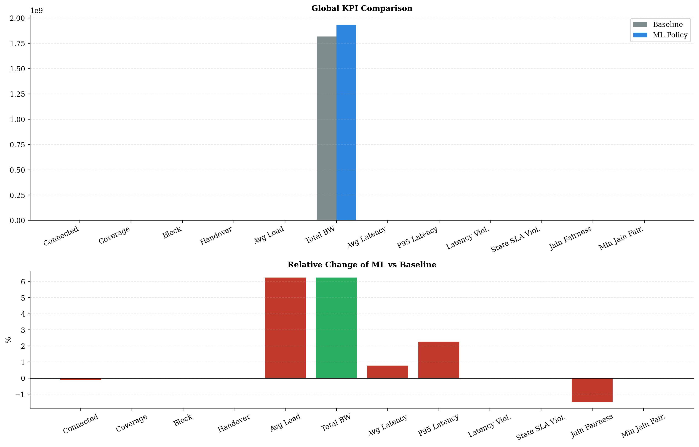
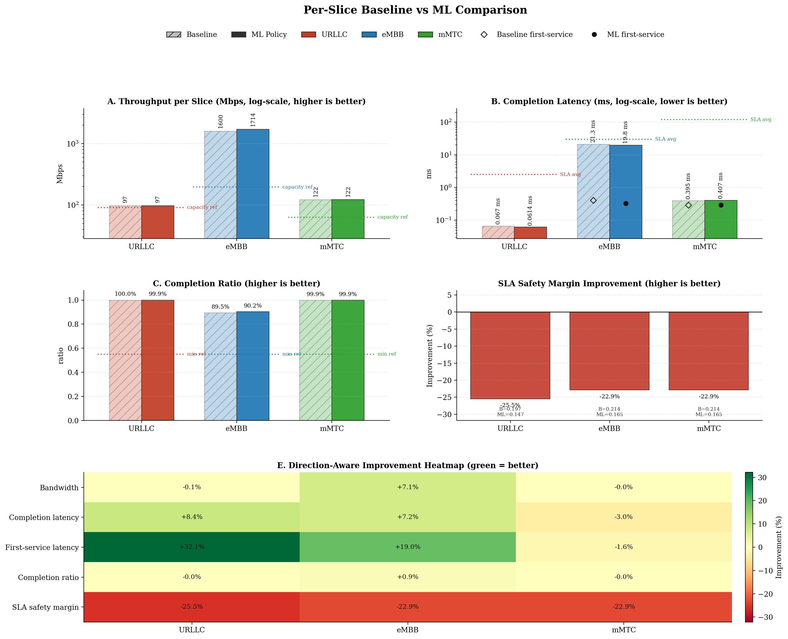
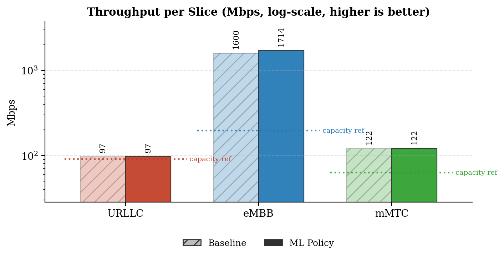
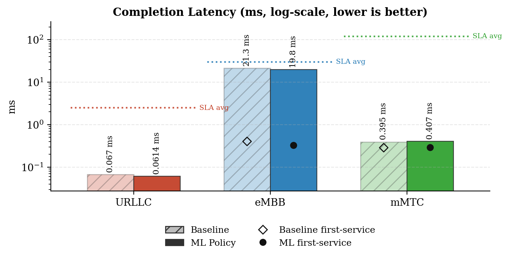
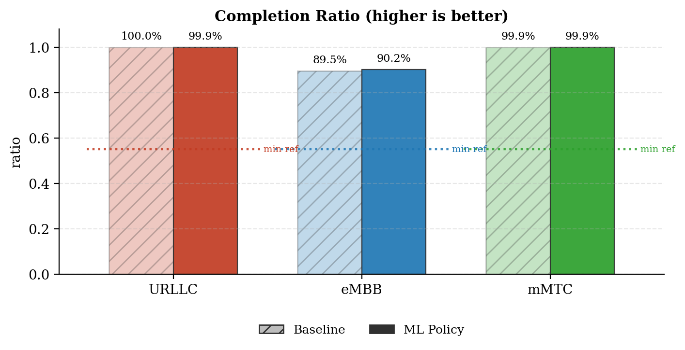
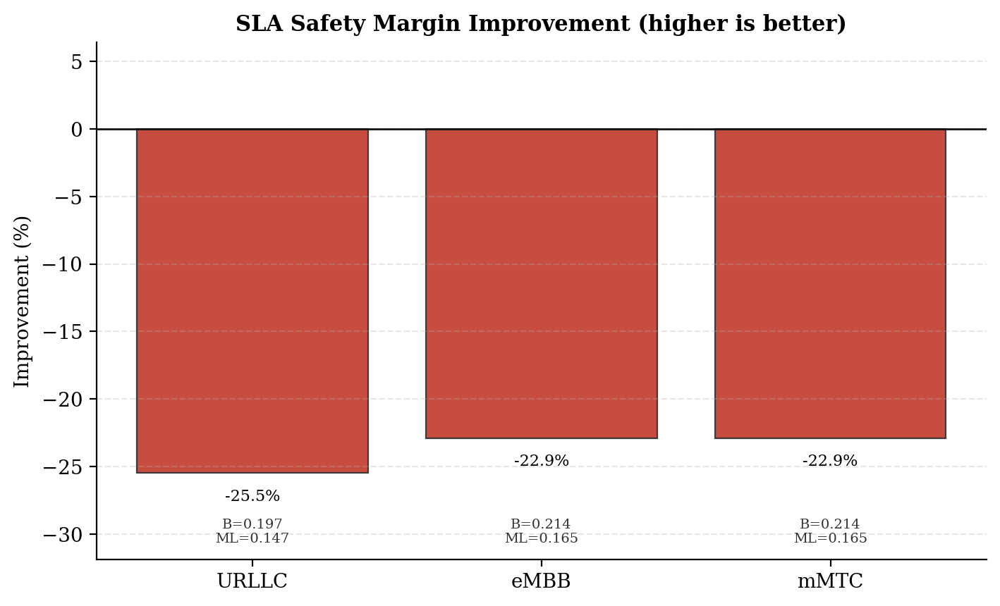
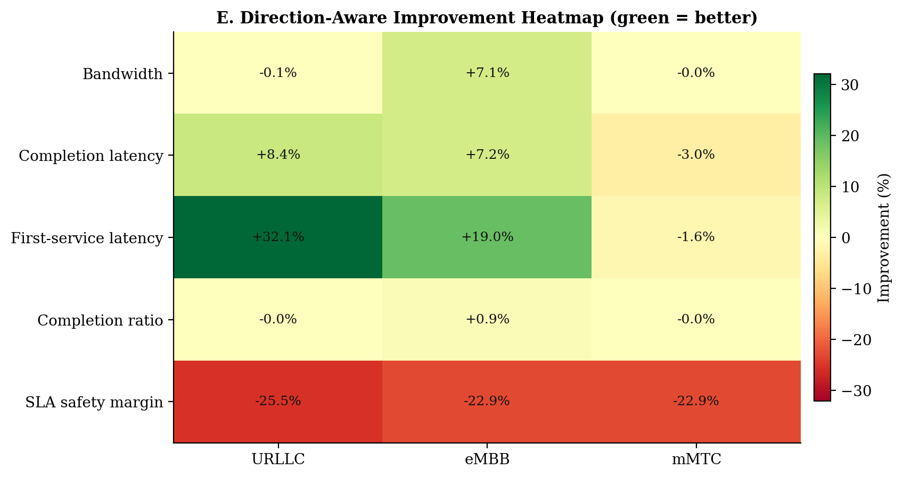
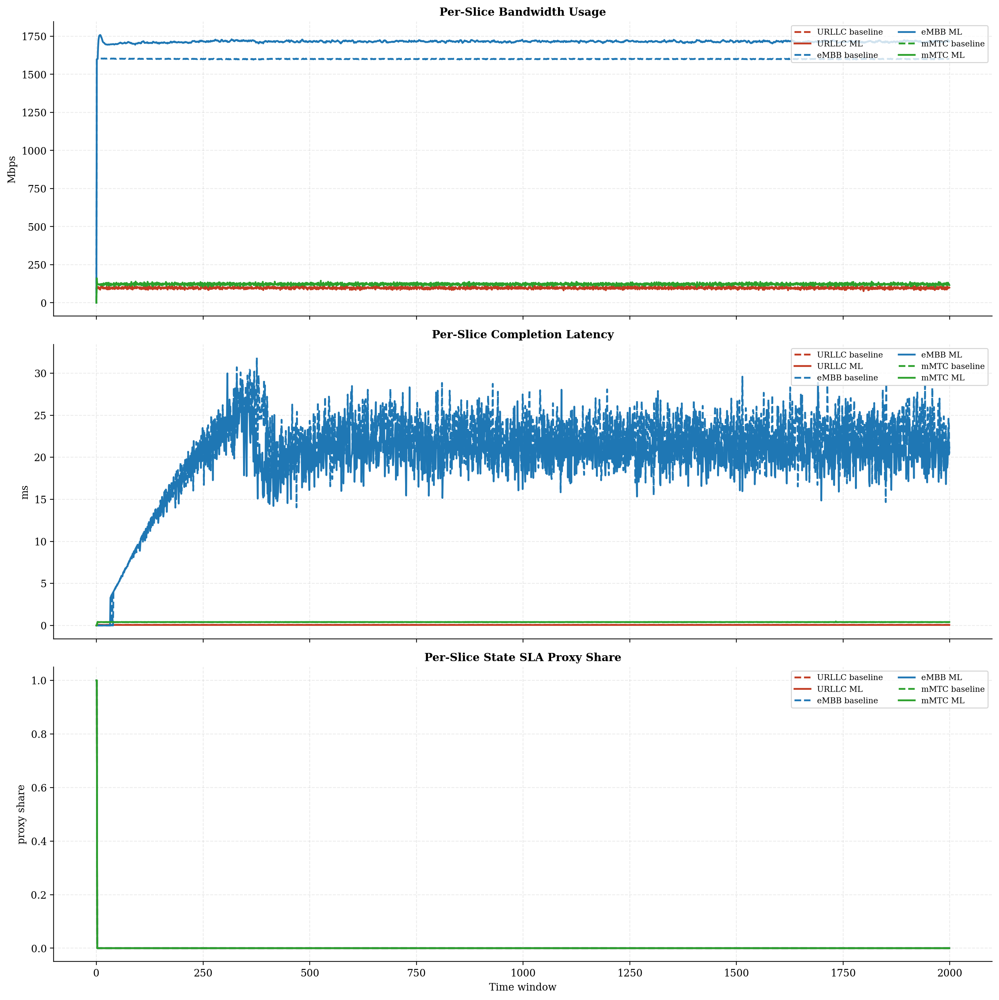
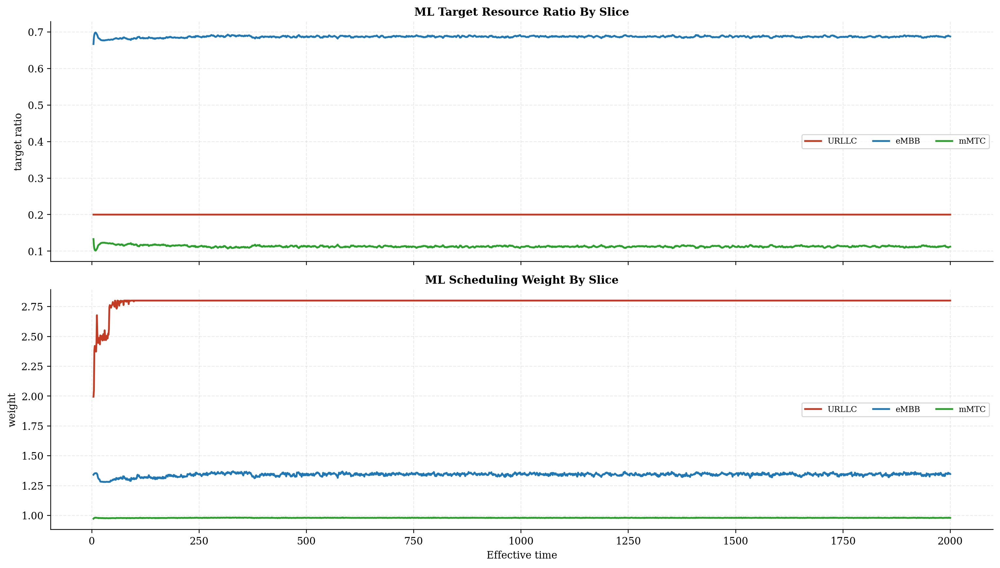
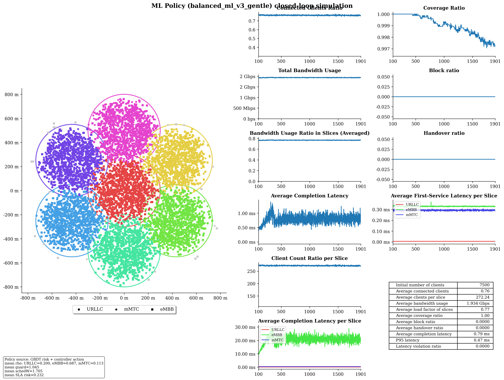

# Baseline vs ML Policy Report

## Run Summary

- Timestamp: `2026-05-08T03:55:42`
- Config: `C:\Users\LENOVO\Downloads\5G-Network-Slicing-main\5G-Network-Slicing-with-GBDT-ML-Policy\slicesim\scenario-heavy.yml`
- Model: `C:\Users\LENOVO\Downloads\5G-Network-Slicing-main\5G-Network-Slicing-with-GBDT-ML-Policy\models\sla_risk_gbdt`
- Controller type: `gbdt`
- Controller preset: `balanced_ml_v3_gentle`
- Broker enabled: `True`
- Broker preset: `forecasting_balanced`
- Seed: `42`

## Global KPI Comparison

| metric | baseline | ml_policy | delta_ml_minus_baseline | delta_pct |
|---|---|---|---|---|
| connected_clients_ratio | 0.7627 | 0.7618 | -0.0009 | -0.1185 |
| coverage_ratio | 0.9991 | 0.9990 | -0.0001 | -0.0147 |
| block_ratio | 0.0000 | 0.0000 | 0.0000 | 0.0000 |
| handover_ratio | 0.0000 | 0.0000 | 0.0000 | 0.0000 |
| avg_slice_load_ratio | 0.7219 | 0.7670 | 0.0452 | 6.2552 |
| total_bandwidth_usage | 1819120316.5960 | 1932909963.6740 | 113789647.0779 | 6.2552 |
| avg_latency_ms | 0.7590 | 0.7649 | 0.0059 | 0.7795 |
| p95_latency_ms | 0.4566 | 0.4670 | 0.0104 | 2.2757 |
| latency_violation_ratio | 0.0000 | 0.0000 | 0.0000 | 0.0000 |
| avg_state_sla_violation_share | 0.0010 | 0.0010 | 0.0000 | 0.0000 |
| bandwidth_jain_fairness | 0.4269 | 0.4205 | -0.0063 | -1.4824 |
| bandwidth_jain_fairness_min | 0.3333 | 0.3333 | 0.0000 | 0.0000 |

## Per-Slice Summary

| slice_name | avg_bandwidth_usage_mbps_baseline | avg_bandwidth_usage_mbps_ml | avg_bandwidth_usage_mbps_delta | avg_served_bandwidth_baseline | avg_served_bandwidth_ml | avg_served_bandwidth_delta | avg_completion_latency_ms_baseline | avg_completion_latency_ms_ml | avg_completion_latency_ms_delta | avg_first_service_latency_ms_baseline | avg_first_service_latency_ms_ml | avg_first_service_latency_ms_delta | avg_recorded_first_service_latency_ms_baseline | avg_recorded_first_service_latency_ms_ml | avg_recorded_first_service_latency_ms_delta | avg_bandwidth_share_baseline | avg_bandwidth_share_ml | avg_bandwidth_share_delta | zero_bandwidth_window_share_baseline | zero_bandwidth_window_share_ml | zero_bandwidth_window_share_delta | completion_ratio_baseline | completion_ratio_ml | completion_ratio_delta | completion_latency_violation_ratio_baseline | completion_latency_violation_ratio_ml | completion_latency_violation_ratio_delta | first_service_latency_violation_ratio_baseline | first_service_latency_violation_ratio_ml | first_service_latency_violation_ratio_delta | request_latency_violation_event_ratio_baseline | request_latency_violation_event_ratio_ml | request_latency_violation_event_ratio_delta | avg_state_sla_violation_share_baseline | avg_state_sla_violation_share_ml | avg_state_sla_violation_share_delta | avg_sla_safety_margin_baseline | avg_sla_safety_margin_ml | avg_sla_safety_margin_delta | avg_sla_safety_margin_improvement_pct |
|---|---|---|---|---|---|---|---|---|---|---|---|---|---|---|---|---|---|---|---|---|---|---|---|---|---|---|---|---|---|---|---|---|---|---|---|---|---|---|---|---|
| URLLC | 97.4304 | 97.3699 | -0.0604 | 339756.3006 | 340070.1570 | 313.8564 | 0.0670 | 0.0614 | -0.0056 | 0.0083 | 0.0056 | -0.0027 | 0.0083 | 0.0056 | -0.0027 | 0.0540 | 0.0508 | -0.0032 | 0.0000 | 0.0000 | 0.0000 | 0.9995 | 0.9995 | -0.0000 | 0.0000 | 0.0000 | 0.0000 | 0.0000 | 0.0000 | 0.0000 | 0.0000 | 0.0000 | 0.0000 | 0.0010 | 0.0010 | 0.0000 | 0.1970 | 0.1468 | -0.0502 | -25.4674 |
| eMBB | 1599.8053 | 1713.6734 | 113.8681 | 369639.8016 | 399453.4169 | 29813.6153 | 21.3075 | 19.7742 | -1.5333 | 0.4036 | 0.3270 | -0.0767 | 0.4071 | 0.3289 | -0.0782 | 0.8790 | 0.8862 | 0.0071 | 0.0005 | 0.0005 | 0.0000 | 0.8946 | 0.9024 | 0.0077 | 0.0000 | 0.0000 | 0.0000 | 0.0000 | 0.0000 | 0.0000 | 0.0000 | 0.0000 | 0.0000 | 0.0010 | 0.0010 | 0.0000 | 0.2144 | 0.1653 | -0.0491 | -22.8901 |
| mMTC | 121.8846 | 121.8666 | -0.0180 | 224929.5901 | 224937.3653 | 7.7753 | 0.3948 | 0.4068 | 0.0120 | 0.2876 | 0.2923 | 0.0046 | 0.2878 | 0.2924 | 0.0046 | 0.0670 | 0.0630 | -0.0039 | 0.0005 | 0.0005 | 0.0000 | 0.9990 | 0.9990 | -0.0000 | 0.0000 | 0.0000 | 0.0000 | 0.0000 | 0.0000 | 0.0000 | 0.0000 | 0.0000 | 0.0000 | 0.0010 | 0.0010 | 0.0000 | 0.2144 | 0.1653 | -0.0491 | -22.8901 |

## Per-Base-Station Summary

| base_station_id | avg_bandwidth_usage_mbps_baseline | avg_bandwidth_usage_mbps_ml | avg_bandwidth_usage_mbps_delta | avg_bandwidth_usage_mbps_delta_pct | avg_capacity_mbps_baseline | avg_capacity_mbps_ml | avg_capacity_mbps_delta | avg_capacity_mbps_delta_pct | avg_load_ratio_baseline | avg_load_ratio_ml | avg_load_ratio_delta | avg_load_ratio_delta_pct | avg_remaining_capacity_ratio_baseline | avg_remaining_capacity_ratio_ml | avg_remaining_capacity_ratio_delta | avg_remaining_capacity_ratio_delta_pct | avg_request_count_per_window_baseline | avg_request_count_per_window_ml | avg_request_count_per_window_delta | avg_request_count_per_window_delta_pct | total_request_count_baseline | total_request_count_ml | total_request_count_delta | total_request_count_delta_pct | avg_requested_usage_mbps_per_window_baseline | avg_requested_usage_mbps_per_window_ml | avg_requested_usage_mbps_per_window_delta | avg_requested_usage_mbps_per_window_delta_pct | avg_clients_seen_per_window_baseline | avg_clients_seen_per_window_ml | avg_clients_seen_per_window_delta | avg_clients_seen_per_window_delta_pct | avg_connected_events_per_window_baseline | avg_connected_events_per_window_ml | avg_connected_events_per_window_delta | avg_connected_events_per_window_delta_pct | avg_disconnected_events_per_window_baseline | avg_disconnected_events_per_window_ml | avg_disconnected_events_per_window_delta | avg_disconnected_events_per_window_delta_pct | avg_state_sla_violation_share_baseline | avg_state_sla_violation_share_ml | avg_state_sla_violation_share_delta | avg_state_sla_violation_share_delta_pct | avg_sla_safety_margin_baseline | avg_sla_safety_margin_ml | avg_sla_safety_margin_delta | avg_sla_safety_margin_delta_pct | avg_sla_breach_count_per_window_baseline | avg_sla_breach_count_per_window_ml | avg_sla_breach_count_per_window_delta | avg_sla_breach_count_per_window_delta_pct |
|---|---|---|---|---|---|---|---|---|---|---|---|---|---|---|---|---|---|---|---|---|---|---|---|---|---|---|---|---|---|---|---|---|---|---|---|---|---|---|---|---|---|---|---|---|---|---|---|---|---|---|---|---|
| BS_0 | 290.5315 | 318.1105 | 27.5789 | 9.4926 | 420.0000 | 420.0000 | 0.0000 | 0.0000 | 0.6917 | 0.7574 | 0.0657 | 9.4926 | 0.3083 | 0.2426 | -0.0657 | -21.3017 | 120.1495 | 119.9355 | -0.2140 | -0.1781 | 240299.0000 | 239871.0000 | -428.0000 | -0.1781 | 307.0887 | 335.7243 | 28.6356 | 9.3249 | 1070.3955 | 1068.6950 | -1.7005 | -0.1589 | 120.1535 | 119.9430 | -0.2105 | -0.1752 | 119.7440 | 119.5285 | -0.2155 | -0.1800 | 0.0010 | 0.0010 | 0.0000 | 0.0000 | 0.2086 | 0.1592 | -0.0494 | -23.7014 | 0.0030 | 0.0030 | 0.0000 | 0.0000 |
| BS_1 | 257.2861 | 270.8917 | 13.6056 | 5.2881 | 350.0000 | 350.0000 | 0.0000 | 0.0000 | 0.7351 | 0.7740 | 0.0389 | 5.2881 | 0.2649 | 0.2260 | -0.0389 | -14.6748 | 132.0120 | 132.4210 | 0.4090 | 0.3098 | 264024.0000 | 264842.0000 | 818.0000 | 0.3098 | 271.9137 | 287.3130 | 15.3993 | 5.6633 | 1072.6080 | 1072.5080 | -0.1000 | -0.0093 | 132.0355 | 132.4420 | 0.4065 | 0.3079 | 131.6325 | 132.0420 | 0.4095 | 0.3111 | 0.0010 | 0.0010 | 0.0000 | 0.0000 | 0.2086 | 0.1592 | -0.0494 | -23.7014 | 0.0030 | 0.0030 | 0.0000 | 0.0000 |
| BS_2 | 254.9496 | 268.7381 | 13.7885 | 5.4083 | 350.0000 | 350.0000 | 0.0000 | 0.0000 | 0.7284 | 0.7678 | 0.0394 | 5.4083 | 0.2716 | 0.2322 | -0.0394 | -14.5065 | 122.2310 | 122.1750 | -0.0560 | -0.0458 | 244462.0000 | 244350.0000 | -112.0000 | -0.0458 | 270.6049 | 287.5088 | 16.9039 | 6.2467 | 1069.4185 | 1069.8060 | 0.3875 | 0.0362 | 122.2585 | 122.2050 | -0.0535 | -0.0438 | 121.8530 | 121.8015 | -0.0515 | -0.0423 | 0.0010 | 0.0010 | 0.0000 | 0.0000 | 0.2086 | 0.1592 | -0.0494 | -23.7014 | 0.0030 | 0.0030 | 0.0000 | 0.0000 |
| BS_3 | 254.9195 | 269.6221 | 14.7025 | 5.7675 | 350.0000 | 350.0000 | 0.0000 | 0.0000 | 0.7283 | 0.7703 | 0.0420 | 5.7675 | 0.2717 | 0.2297 | -0.0420 | -15.4633 | 122.2050 | 122.7605 | 0.5555 | 0.4546 | 244410.0000 | 245521.0000 | 1111.0000 | 0.4546 | 270.8466 | 287.1853 | 16.3387 | 6.0325 | 1071.6090 | 1072.1055 | 0.4965 | 0.0463 | 122.2220 | 122.7720 | 0.5500 | 0.4500 | 121.8220 | 122.3665 | 0.5445 | 0.4470 | 0.0010 | 0.0010 | 0.0000 | 0.0000 | 0.2086 | 0.1592 | -0.0494 | -23.7014 | 0.0030 | 0.0030 | 0.0000 | 0.0000 |
| BS_4 | 253.1023 | 267.9161 | 14.8139 | 5.8529 | 350.0000 | 350.0000 | 0.0000 | 0.0000 | 0.7231 | 0.7655 | 0.0423 | 5.8529 | 0.2769 | 0.2345 | -0.0423 | -15.2882 | 114.8715 | 114.9080 | 0.0365 | 0.0318 | 229743.0000 | 229816.0000 | 73.0000 | 0.0318 | 270.1413 | 285.9140 | 15.7727 | 5.8387 | 1071.3525 | 1071.8430 | 0.4905 | 0.0458 | 114.8835 | 114.9240 | 0.0405 | 0.0353 | 114.4675 | 114.5090 | 0.0415 | 0.0363 | 0.0010 | 0.0010 | 0.0000 | 0.0000 | 0.2086 | 0.1592 | -0.0494 | -23.7014 | 0.0030 | 0.0030 | 0.0000 | 0.0000 |
| BS_5 | 254.0814 | 268.5205 | 14.4391 | 5.6829 | 350.0000 | 350.0000 | 0.0000 | 0.0000 | 0.7259 | 0.7672 | 0.0413 | 5.6829 | 0.2741 | 0.2328 | -0.0413 | -15.0535 | 118.8900 | 118.5420 | -0.3480 | -0.2927 | 237780.0000 | 237084.0000 | -696.0000 | -0.2927 | 270.3968 | 286.9714 | 16.5746 | 6.1297 | 1069.9005 | 1065.8005 | -4.1000 | -0.3832 | 118.9295 | 118.5695 | -0.3600 | -0.3027 | 118.5195 | 118.1610 | -0.3585 | -0.3025 | 0.0010 | 0.0010 | 0.0000 | 0.0000 | 0.2086 | 0.1592 | -0.0494 | -23.7014 | 0.0030 | 0.0030 | 0.0000 | 0.0000 |
| BS_6 | 254.2499 | 269.1110 | 14.8611 | 5.8451 | 350.0000 | 350.0000 | 0.0000 | 0.0000 | 0.7264 | 0.7689 | 0.0425 | 5.8451 | 0.2736 | 0.2311 | -0.0425 | -15.5207 | 119.2955 | 119.6350 | 0.3395 | 0.2846 | 238591.0000 | 239270.0000 | 679.0000 | 0.2846 | 270.6521 | 286.5517 | 15.8996 | 5.8746 | 1068.0760 | 1071.4995 | 3.4235 | 0.3205 | 119.3265 | 119.6590 | 0.3325 | 0.2786 | 118.9170 | 119.2450 | 0.3280 | 0.2758 | 0.0010 | 0.0010 | 0.0000 | 0.0000 | 0.2086 | 0.1592 | -0.0494 | -23.7014 | 0.0030 | 0.0030 | 0.0000 | 0.0000 |

## Per-Base-Station Slice SLA Summary

| base_station_id | slice_name | avg_bandwidth_usage_mbps_baseline | avg_bandwidth_usage_mbps_ml | avg_bandwidth_usage_mbps_delta | avg_bandwidth_usage_mbps_delta_pct | avg_slice_capacity_mbps_baseline | avg_slice_capacity_mbps_ml | avg_slice_capacity_mbps_delta | avg_slice_capacity_mbps_delta_pct | avg_slice_load_ratio_baseline | avg_slice_load_ratio_ml | avg_slice_load_ratio_delta | avg_slice_load_ratio_delta_pct | avg_remaining_capacity_ratio_baseline | avg_remaining_capacity_ratio_ml | avg_remaining_capacity_ratio_delta | avg_remaining_capacity_ratio_delta_pct | avg_request_count_per_window_baseline | avg_request_count_per_window_ml | avg_request_count_per_window_delta | avg_request_count_per_window_delta_pct | total_request_count_baseline | total_request_count_ml | total_request_count_delta | total_request_count_delta_pct | avg_requested_usage_mbps_per_window_baseline | avg_requested_usage_mbps_per_window_ml | avg_requested_usage_mbps_per_window_delta | avg_requested_usage_mbps_per_window_delta_pct | avg_clients_seen_per_window_baseline | avg_clients_seen_per_window_ml | avg_clients_seen_per_window_delta | avg_clients_seen_per_window_delta_pct | avg_state_sla_violation_share_baseline | avg_state_sla_violation_share_ml | avg_state_sla_violation_share_delta | avg_state_sla_violation_share_delta_pct | avg_sla_safety_margin_baseline | avg_sla_safety_margin_ml | avg_sla_safety_margin_delta | avg_sla_safety_margin_delta_pct | avg_sla_breach_count_per_window_baseline | avg_sla_breach_count_per_window_ml | avg_sla_breach_count_per_window_delta | avg_sla_breach_count_per_window_delta_pct |
|---|---|---|---|---|---|---|---|---|---|---|---|---|---|---|---|---|---|---|---|---|---|---|---|---|---|---|---|---|---|---|---|---|---|---|---|---|---|---|---|---|---|---|---|---|---|
| BS_0 | URLLC | 13.9141 | 13.8271 | -0.0870 | -0.6253 | 84.0000 | 84.0000 | 0.0000 | 0.0000 | 0.1656 | 0.1646 | -0.0010 | -0.6253 | 0.8344 | 0.8354 | 0.0010 | 0.1241 | 40.9290 | 40.6400 | -0.2890 | -0.7061 | 81858.0000 | 81280.0000 | -578.0000 | -0.7061 | 13.9141 | 13.8271 | -0.0870 | -0.6253 | 124.0760 | 124.1865 | 0.1105 | 0.0891 | 0.0010 | 0.0010 | 0.0000 | 0.0000 | 0.1970 | 0.1468 | -0.0502 | -25.4674 | 0.0010 | 0.0010 | 0.0000 | 0.0000 |
| BS_0 | eMBB | 259.5946 | 287.2924 | 27.6978 | 10.6697 | 260.4000 | 289.8553 | 29.4553 | 11.3116 | 0.9969 | 0.9911 | -0.0058 | -0.5816 | 0.0031 | 0.0089 | 0.0058 | 187.4371 | 3.3595 | 3.6785 | 0.3190 | 9.4955 | 6719.0000 | 7357.0000 | 638.0000 | 9.4955 | 276.1431 | 304.8975 | 28.7545 | 10.4129 | 638.6535 | 637.3955 | -1.2580 | -0.1970 | 0.0010 | 0.0010 | 0.0000 | 0.0000 | 0.2144 | 0.1653 | -0.0491 | -22.8901 | 0.0010 | 0.0010 | 0.0000 | 0.0000 |
| BS_0 | mMTC | 17.0228 | 16.9909 | -0.0319 | -0.1874 | 75.6000 | 46.1447 | -29.4553 | -38.9621 | 0.2252 | 0.3687 | 0.1436 | 63.7615 | 0.7748 | 0.6313 | -0.1436 | -18.5294 | 75.8610 | 75.6170 | -0.2440 | -0.3216 | 151722.0000 | 151234.0000 | -488.0000 | -0.3216 | 17.0315 | 16.9997 | -0.0318 | -0.1869 | 307.6660 | 307.1130 | -0.5530 | -0.1797 | 0.0010 | 0.0010 | 0.0000 | 0.0000 | 0.2144 | 0.1653 | -0.0491 | -22.8901 | 0.0010 | 0.0010 | 0.0000 | 0.0000 |
| BS_1 | URLLC | 14.5931 | 14.5452 | -0.0480 | -0.3288 | 63.0000 | 69.9860 | 6.9860 | 11.0889 | 0.2316 | 0.2078 | -0.0238 | -10.2783 | 0.7684 | 0.7922 | 0.0238 | 3.0986 | 43.0365 | 42.8175 | -0.2190 | -0.5089 | 86073.0000 | 85635.0000 | -438.0000 | -0.5089 | 14.5931 | 14.5452 | -0.0480 | -0.3288 | 131.1750 | 130.8125 | -0.3625 | -0.2763 | 0.0010 | 0.0010 | 0.0000 | 0.0000 | 0.1970 | 0.1468 | -0.0502 | -25.4674 | 0.0010 | 0.0010 | 0.0000 | 0.0000 |
| BS_1 | eMBB | 223.3404 | 236.9017 | 13.5613 | 6.0720 | 224.0000 | 239.4013 | 15.4013 | 6.8756 | 0.9971 | 0.9895 | -0.0075 | -0.7549 | 0.0029 | 0.0105 | 0.0075 | 255.6090 | 2.8805 | 3.0800 | 0.1995 | 6.9259 | 5761.0000 | 6160.0000 | 399.0000 | 6.9259 | 237.9578 | 253.3134 | 15.3556 | 6.4531 | 589.9400 | 588.7815 | -1.1585 | -0.1964 | 0.0010 | 0.0010 | 0.0000 | 0.0000 | 0.2144 | 0.1653 | -0.0491 | -22.8901 | 0.0010 | 0.0010 | 0.0000 | 0.0000 |
| BS_1 | mMTC | 19.3525 | 19.4448 | 0.0923 | 0.4769 | 63.0000 | 40.6127 | -22.3873 | -35.5355 | 0.3072 | 0.4797 | 0.1725 | 56.1653 | 0.6928 | 0.5203 | -0.1725 | -24.9027 | 86.0950 | 86.5235 | 0.4285 | 0.4977 | 172190.0000 | 173047.0000 | 857.0000 | 0.4977 | 19.3627 | 19.4544 | 0.0917 | 0.4736 | 351.4930 | 352.9140 | 1.4210 | 0.4043 | 0.0010 | 0.0010 | 0.0000 | 0.0000 | 0.2144 | 0.1653 | -0.0491 | -22.8901 | 0.0010 | 0.0010 | 0.0000 | 0.0000 |
| BS_2 | URLLC | 13.9825 | 13.9723 | -0.0102 | -0.0727 | 63.0000 | 69.9860 | 6.9860 | 11.0889 | 0.2219 | 0.1996 | -0.0223 | -10.0459 | 0.7781 | 0.8004 | 0.0223 | 2.8656 | 41.1230 | 41.1325 | 0.0095 | 0.0231 | 82246.0000 | 82265.0000 | 19.0000 | 0.0231 | 13.9825 | 13.9723 | -0.0102 | -0.0727 | 127.8165 | 128.1945 | 0.3780 | 0.2957 | 0.0010 | 0.0010 | 0.0000 | 0.0000 | 0.1970 | 0.1468 | -0.0502 | -25.4674 | 0.0010 | 0.0010 | 0.0000 | 0.0000 |
| BS_2 | eMBB | 223.3652 | 237.1916 | 13.8264 | 6.1900 | 224.0000 | 240.2567 | 16.2567 | 7.2574 | 0.9972 | 0.9872 | -0.0100 | -0.9984 | 0.0028 | 0.0128 | 0.0100 | 351.2805 | 2.8930 | 3.0785 | 0.1855 | 6.4120 | 5786.0000 | 6157.0000 | 371.0000 | 6.4120 | 239.0130 | 255.9546 | 16.9416 | 7.0882 | 619.7205 | 619.8645 | 0.1440 | 0.0232 | 0.0010 | 0.0010 | 0.0000 | 0.0000 | 0.2144 | 0.1653 | -0.0491 | -22.8901 | 0.0010 | 0.0010 | 0.0000 | 0.0000 |
| BS_2 | mMTC | 17.6019 | 17.5741 | -0.0277 | -0.1575 | 63.0000 | 39.7573 | -23.2427 | -36.8931 | 0.2794 | 0.4429 | 0.1635 | 58.5051 | 0.7206 | 0.5571 | -0.1635 | -22.6837 | 78.2150 | 77.9640 | -0.2510 | -0.3209 | 156430.0000 | 155928.0000 | -502.0000 | -0.3209 | 17.6094 | 17.5818 | -0.0276 | -0.1567 | 321.8815 | 321.7470 | -0.1345 | -0.0418 | 0.0010 | 0.0010 | 0.0000 | 0.0000 | 0.2144 | 0.1653 | -0.0491 | -22.8901 | 0.0010 | 0.0010 | 0.0000 | 0.0000 |
| BS_3 | URLLC | 14.0382 | 14.2176 | 0.1794 | 1.2778 | 63.0000 | 69.9860 | 6.9860 | 11.0889 | 0.2228 | 0.2032 | -0.0197 | -8.8283 | 0.7772 | 0.7968 | 0.0197 | 2.5312 | 41.4330 | 41.8170 | 0.3840 | 0.9268 | 82866.0000 | 83634.0000 | 768.0000 | 0.9268 | 14.0382 | 14.2176 | 0.1794 | 1.2778 | 127.9865 | 128.2060 | 0.2195 | 0.1715 | 0.0010 | 0.0010 | 0.0000 | 0.0000 | 0.1970 | 0.1468 | -0.0502 | -25.4674 | 0.0010 | 0.0010 | 0.0000 | 0.0000 |
| BS_3 | eMBB | 223.3618 | 237.8904 | 14.5287 | 6.5045 | 224.0000 | 240.2811 | 16.2811 | 7.2683 | 0.9972 | 0.9900 | -0.0071 | -0.7153 | 0.0028 | 0.0100 | 0.0071 | 250.3263 | 2.8805 | 3.0830 | 0.2025 | 7.0300 | 5761.0000 | 6166.0000 | 405.0000 | 7.0300 | 239.2790 | 255.4448 | 16.1658 | 6.7560 | 622.8710 | 622.6030 | -0.2680 | -0.0430 | 0.0010 | 0.0010 | 0.0000 | 0.0000 | 0.2144 | 0.1653 | -0.0491 | -22.8901 | 0.0010 | 0.0010 | 0.0000 | 0.0000 |
| BS_3 | mMTC | 17.5195 | 17.5140 | -0.0055 | -0.0314 | 63.0000 | 39.7329 | -23.2671 | -36.9319 | 0.2781 | 0.4416 | 0.1635 | 58.7898 | 0.7219 | 0.5584 | -0.1635 | -22.6463 | 77.8915 | 77.8605 | -0.0310 | -0.0398 | 155783.0000 | 155721.0000 | -62.0000 | -0.0398 | 17.5293 | 17.5228 | -0.0065 | -0.0370 | 320.7515 | 321.2965 | 0.5450 | 0.1699 | 0.0010 | 0.0010 | 0.0000 | 0.0000 | 0.2144 | 0.1653 | -0.0491 | -22.8901 | 0.0010 | 0.0010 | 0.0000 | 0.0000 |
| BS_4 | URLLC | 13.3953 | 13.3767 | -0.0186 | -0.1389 | 63.0000 | 69.9860 | 6.9860 | 11.0889 | 0.2126 | 0.1911 | -0.0215 | -10.1051 | 0.7874 | 0.8089 | 0.0215 | 2.7288 | 39.4190 | 39.3210 | -0.0980 | -0.2486 | 78838.0000 | 78642.0000 | -196.0000 | -0.2486 | 13.3953 | 13.3767 | -0.0186 | -0.1389 | 120.5890 | 120.2060 | -0.3830 | -0.3176 | 0.0010 | 0.0010 | 0.0000 | 0.0000 | 0.1970 | 0.1468 | -0.0502 | -25.4674 | 0.0010 | 0.0010 | 0.0000 | 0.0000 |
| BS_4 | eMBB | 223.3805 | 238.2439 | 14.8634 | 6.6538 | 224.0000 | 240.6134 | 16.6134 | 7.4167 | 0.9972 | 0.9901 | -0.0071 | -0.7134 | 0.0028 | 0.0099 | 0.0071 | 257.2666 | 2.9115 | 3.1225 | 0.2110 | 7.2471 | 5823.0000 | 6245.0000 | 422.0000 | 7.2471 | 240.4117 | 256.2332 | 15.8214 | 6.5810 | 651.7860 | 653.2835 | 1.4975 | 0.2298 | 0.0010 | 0.0010 | 0.0000 | 0.0000 | 0.2144 | 0.1653 | -0.0491 | -22.8901 | 0.0010 | 0.0010 | 0.0000 | 0.0000 |
| BS_4 | mMTC | 16.3264 | 16.2955 | -0.0309 | -0.1892 | 63.0000 | 39.4006 | -23.5994 | -37.4593 | 0.2591 | 0.4143 | 0.1551 | 59.8515 | 0.7409 | 0.5857 | -0.1551 | -20.9361 | 72.5410 | 72.4645 | -0.0765 | -0.1055 | 145082.0000 | 144929.0000 | -153.0000 | -0.1055 | 16.3342 | 16.3041 | -0.0301 | -0.1841 | 298.9775 | 298.3535 | -0.6240 | -0.2087 | 0.0010 | 0.0010 | 0.0000 | 0.0000 | 0.2144 | 0.1653 | -0.0491 | -22.8901 | 0.0010 | 0.0010 | 0.0000 | 0.0000 |
| BS_5 | URLLC | 13.5416 | 13.3817 | -0.1599 | -1.1808 | 63.0000 | 69.9860 | 6.9860 | 11.0889 | 0.2149 | 0.1912 | -0.0237 | -11.0453 | 0.7851 | 0.8088 | 0.0237 | 3.0242 | 39.7305 | 39.3225 | -0.4080 | -1.0269 | 79461.0000 | 78645.0000 | -816.0000 | -1.0269 | 13.5416 | 13.3817 | -0.1599 | -1.1808 | 120.3430 | 118.8975 | -1.4455 | -1.2012 | 0.0010 | 0.0010 | 0.0000 | 0.0000 | 0.1970 | 0.1468 | -0.0502 | -25.4674 | 0.0010 | 0.0010 | 0.0000 | 0.0000 |
| BS_5 | eMBB | 223.3876 | 238.0261 | 14.6385 | 6.5530 | 224.0000 | 240.3576 | 16.3576 | 7.3025 | 0.9973 | 0.9903 | -0.0070 | -0.7017 | 0.0027 | 0.0097 | 0.0070 | 255.9589 | 2.9075 | 3.1330 | 0.2255 | 7.7558 | 5815.0000 | 6266.0000 | 451.0000 | 7.7558 | 239.6945 | 256.4659 | 16.7714 | 6.9970 | 638.8595 | 635.6825 | -3.1770 | -0.4973 | 0.0010 | 0.0010 | 0.0000 | 0.0000 | 0.2144 | 0.1653 | -0.0491 | -22.8901 | 0.0010 | 0.0010 | 0.0000 | 0.0000 |
| BS_5 | mMTC | 17.1522 | 17.1127 | -0.0395 | -0.2305 | 63.0000 | 39.6564 | -23.3436 | -37.0533 | 0.2723 | 0.4323 | 0.1601 | 58.7977 | 0.7277 | 0.5677 | -0.1601 | -21.9969 | 76.2520 | 76.0865 | -0.1655 | -0.2170 | 152504.0000 | 152173.0000 | -331.0000 | -0.2170 | 17.1606 | 17.1237 | -0.0369 | -0.2150 | 310.6980 | 311.2205 | 0.5225 | 0.1682 | 0.0010 | 0.0010 | 0.0000 | 0.0000 | 0.2144 | 0.1653 | -0.0491 | -22.8901 | 0.0010 | 0.0010 | 0.0000 | 0.0000 |
| BS_6 | URLLC | 13.9654 | 14.0492 | 0.0838 | 0.6002 | 63.0000 | 69.9860 | 6.9860 | 11.0889 | 0.2217 | 0.2007 | -0.0209 | -9.4391 | 0.7783 | 0.7993 | 0.0209 | 2.6883 | 41.0965 | 41.2730 | 0.1765 | 0.4295 | 82193.0000 | 82546.0000 | 353.0000 | 0.4295 | 13.9654 | 14.0492 | 0.0838 | 0.6002 | 126.8120 | 127.5425 | 0.7305 | 0.5760 | 0.0010 | 0.0010 | 0.0000 | 0.0000 | 0.1970 | 0.1468 | -0.0502 | -25.4674 | 0.0010 | 0.0010 | 0.0000 | 0.0000 |
| BS_6 | eMBB | 223.3753 | 238.1272 | 14.7520 | 6.6041 | 224.0000 | 240.4264 | 16.4264 | 7.3332 | 0.9972 | 0.9904 | -0.0068 | -0.6825 | 0.0028 | 0.0096 | 0.0068 | 244.0209 | 2.9070 | 3.1140 | 0.2070 | 7.1207 | 5814.0000 | 6228.0000 | 414.0000 | 7.1207 | 239.7696 | 255.5571 | 15.7875 | 6.5845 | 631.0985 | 633.5140 | 2.4155 | 0.3827 | 0.0010 | 0.0010 | 0.0000 | 0.0000 | 0.2144 | 0.1653 | -0.0491 | -22.8901 | 0.0010 | 0.0010 | 0.0000 | 0.0000 |
| BS_6 | mMTC | 16.9093 | 16.9345 | 0.0253 | 0.1495 | 63.0000 | 39.5876 | -23.4124 | -37.1625 | 0.2684 | 0.4286 | 0.1602 | 59.6686 | 0.7316 | 0.5714 | -0.1602 | -21.8906 | 75.2920 | 75.2480 | -0.0440 | -0.0584 | 150584.0000 | 150496.0000 | -88.0000 | -0.0584 | 16.9171 | 16.9454 | 0.0283 | 0.1671 | 310.1655 | 310.4430 | 0.2775 | 0.0895 | 0.0010 | 0.0010 | 0.0000 | 0.0000 | 0.2144 | 0.1653 | -0.0491 | -22.8901 | 0.0010 | 0.0010 | 0.0000 | 0.0000 |

## Resource Allocation Summary

| slice_name | baseline_state_ratio | ml_state_ratio | ml_action_target_ratio_mean | ml_action_target_ratio_min | ml_action_target_ratio_max | ml_scheduling_weight_mean | ml_admission_guard_factor_mean | target_ratio_delta_vs_baseline_state |
|---|---|---|---|---|---|---|---|---|
| URLLC | 0.1829 | 0.2000 | 0.2000 | 0.2000 | 0.2000 | 2.7932 | 1.0845 | 0.0171 |
| eMBB | 0.6371 | 0.6869 | 0.6870 | 0.6644 | 0.7000 | 1.3415 | 1.0431 | 0.0498 |
| mMTC | 0.1800 | 0.1131 | 0.1130 | 0.1000 | 0.1356 | 0.9803 | 1.0086 | -0.0670 |

## Visual Comparison

### Global KPI View

### Per-Slice View

### Per-Slice Panel Images

#### Throughput per Slice

#### Latency per Slice

#### Completion Ratio

#### SLA Safety Margin Improvement

#### Improvement Heatmap

### Per-Slice Time-Series View

### ML Action Distribution

### ML Policy Simulation Snapshot

## Metric Notes

- `avg_state_sla_violation_share` is the per-slice state-level SLA violation ratio averaged from simulator state frames.
- `avg_sla_safety_margin` is the average distance to the active SLA boundary. Higher is better; negative means violation.
- `avg_sla_safety_margin_improvement_pct` is `(ML margin - baseline margin) / abs(baseline margin) * 100`.
- `request_latency_violation_event_ratio`, `completion_latency_violation_ratio`, and `first_service_latency_violation_ratio` are client-level latency-only metrics.
- A latency value of `0` can mean no recorded latency event for that slice/window. Check `completion_ratio` and request/completion counts before interpreting it as perfect latency.
- `bandwidth_jain_fairness` is Jain's fairness index over per-slice bandwidth usage per time window. Higher is more balanced, with `1.0` meaning equal usage across slices.

## Trade-off Notes

- URLLC completion latency changed by -0.01 ms and SLA safety margin changed by -0.0502 (-25.5%).
- eMBB average bandwidth usage changed by 113.868 Mbps and completion ratio changed by 0.0077.
- mMTC first-service latency changed by 0.00 ms and completion ratio changed by -0.0000.
- URLLC recorded first-service latency changed by -0.00 ms on windows with actual first-service events.
- Classic trade-off snapshot: if URLLC improved by 0.01 ms in latency, eMBB bandwidth moved by 113.868 Mbps.

## Artifacts

- Baseline raw states: `C:\Users\LENOVO\Downloads\5G-Network-Slicing-main\5G-Network-Slicing-with-GBDT-ML-Policy\FINAL_OUTPUT_heavy_seed42_20260508_025410\baseline_run\baseline_states.csv`
- ML raw states: `C:\Users\LENOVO\Downloads\5G-Network-Slicing-main\5G-Network-Slicing-with-GBDT-ML-Policy\FINAL_OUTPUT_heavy_seed42_20260508_025410\ml_run\online_states_raw.csv`
- ML broker forecasts: `C:\Users\LENOVO\Downloads\5G-Network-Slicing-main\5G-Network-Slicing-with-GBDT-ML-Policy\FINAL_OUTPUT_heavy_seed42_20260508_025410\ml_run\online_broker_forecasts.csv`
- ML broker feedback: `C:\Users\LENOVO\Downloads\5G-Network-Slicing-main\5G-Network-Slicing-with-GBDT-ML-Policy\FINAL_OUTPUT_heavy_seed42_20260508_025410\ml_run\online_broker_feedback.csv`
- Comparison CSV (global): `C:\Users\LENOVO\Downloads\5G-Network-Slicing-main\5G-Network-Slicing-with-GBDT-ML-Policy\FINAL_OUTPUT_heavy_seed42_20260508_025410\global_kpi_comparison.csv`
- Comparison CSV (per-slice): `C:\Users\LENOVO\Downloads\5G-Network-Slicing-main\5G-Network-Slicing-with-GBDT-ML-Policy\FINAL_OUTPUT_heavy_seed42_20260508_025410\per_slice_comparison.csv`
- Comparison CSV (per-base-station): `C:\Users\LENOVO\Downloads\5G-Network-Slicing-main\5G-Network-Slicing-with-GBDT-ML-Policy\FINAL_OUTPUT_heavy_seed42_20260508_025410\per_base_station_comparison.csv`
- Comparison CSV (per-base-station-slice): `C:\Users\LENOVO\Downloads\5G-Network-Slicing-main\5G-Network-Slicing-with-GBDT-ML-Policy\FINAL_OUTPUT_heavy_seed42_20260508_025410\per_base_station_slice_comparison.csv`
- Resource allocation CSV: `C:\Users\LENOVO\Downloads\5G-Network-Slicing-main\5G-Network-Slicing-with-GBDT-ML-Policy\FINAL_OUTPUT_heavy_seed42_20260508_025410\resource_allocation_summary.csv`
- ML action time-series CSV: `C:\Users\LENOVO\Downloads\5G-Network-Slicing-main\5G-Network-Slicing-with-GBDT-ML-Policy\FINAL_OUTPUT_heavy_seed42_20260508_025410\ml_action_ratio_timeseries.csv`
- Global KPI plot: `C:\Users\LENOVO\Downloads\5G-Network-Slicing-main\5G-Network-Slicing-with-GBDT-ML-Policy\FINAL_OUTPUT_heavy_seed42_20260508_025410\baseline_vs_ml_global_kpis.png`
- Per-slice bar plot: `C:\Users\LENOVO\Downloads\5G-Network-Slicing-main\5G-Network-Slicing-with-GBDT-ML-Policy\FINAL_OUTPUT_heavy_seed42_20260508_025410\baseline_vs_ml_per_slice_bars.png`
- Per-slice vector plot (SVG): `C:\Users\LENOVO\Downloads\5G-Network-Slicing-main\5G-Network-Slicing-with-GBDT-ML-Policy\FINAL_OUTPUT_heavy_seed42_20260508_025410\baseline_vs_ml_per_slice_bars.svg`
- Per-slice panel plot (Throughput per Slice): `C:\Users\LENOVO\Downloads\5G-Network-Slicing-main\5G-Network-Slicing-with-GBDT-ML-Policy\FINAL_OUTPUT_heavy_seed42_20260508_025410\baseline_vs_ml_per_slice_bars_throughput.png`
- Per-slice panel plot (Latency per Slice): `C:\Users\LENOVO\Downloads\5G-Network-Slicing-main\5G-Network-Slicing-with-GBDT-ML-Policy\FINAL_OUTPUT_heavy_seed42_20260508_025410\baseline_vs_ml_per_slice_bars_latency.png`
- Per-slice panel plot (Completion Ratio): `C:\Users\LENOVO\Downloads\5G-Network-Slicing-main\5G-Network-Slicing-with-GBDT-ML-Policy\FINAL_OUTPUT_heavy_seed42_20260508_025410\baseline_vs_ml_per_slice_bars_completion_ratio.png`
- Per-slice panel plot (SLA Safety Margin Improvement): `C:\Users\LENOVO\Downloads\5G-Network-Slicing-main\5G-Network-Slicing-with-GBDT-ML-Policy\FINAL_OUTPUT_heavy_seed42_20260508_025410\baseline_vs_ml_per_slice_bars_sla_margin_improvement.png`
- Per-slice panel plot (Improvement Heatmap): `C:\Users\LENOVO\Downloads\5G-Network-Slicing-main\5G-Network-Slicing-with-GBDT-ML-Policy\FINAL_OUTPUT_heavy_seed42_20260508_025410\baseline_vs_ml_per_slice_bars_improvement_heatmap.png`
- Per-slice time-series plot: `C:\Users\LENOVO\Downloads\5G-Network-Slicing-main\5G-Network-Slicing-with-GBDT-ML-Policy\FINAL_OUTPUT_heavy_seed42_20260508_025410\baseline_vs_ml_timeseries.png`
- ML action distribution plot: `C:\Users\LENOVO\Downloads\5G-Network-Slicing-main\5G-Network-Slicing-with-GBDT-ML-Policy\FINAL_OUTPUT_heavy_seed42_20260508_025410\ml_action_distribution.png`
- ML policy simulation graph: `C:\Users\LENOVO\Downloads\5G-Network-Slicing-main\5G-Network-Slicing-with-GBDT-ML-Policy\FINAL_OUTPUT_heavy_seed42_20260508_025410\ml_run\ml_policy_simulation.png`
