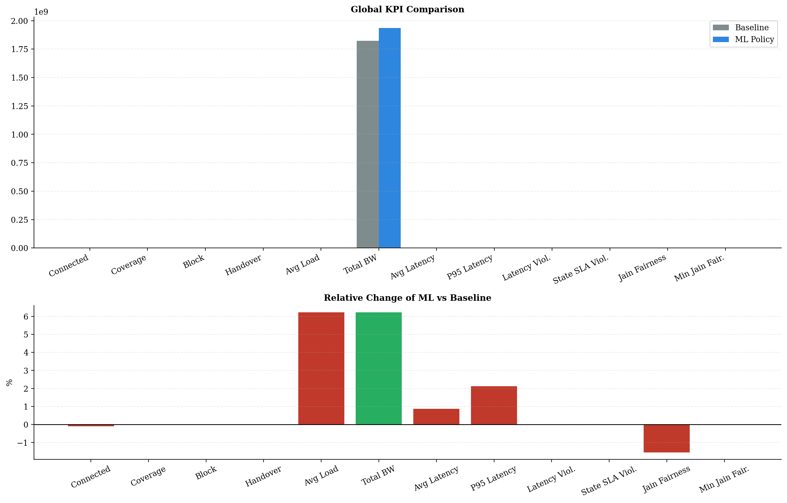
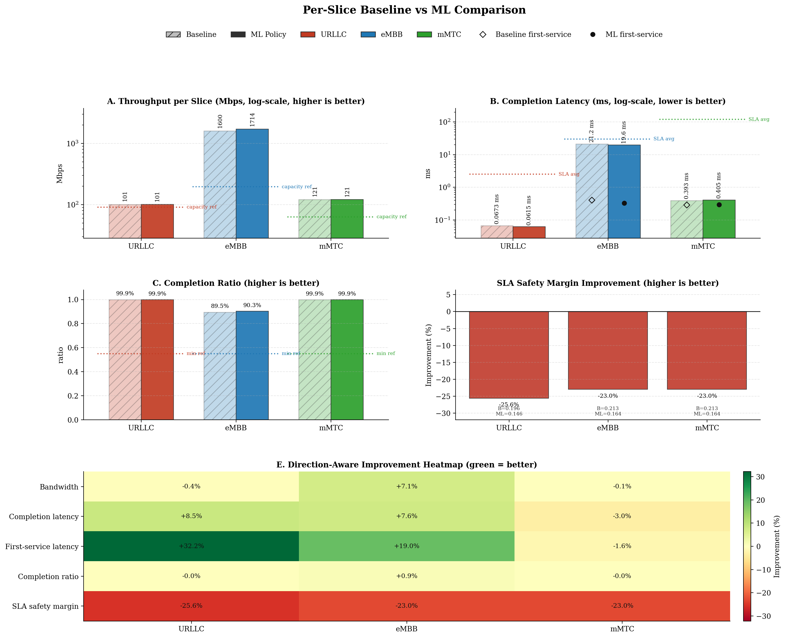
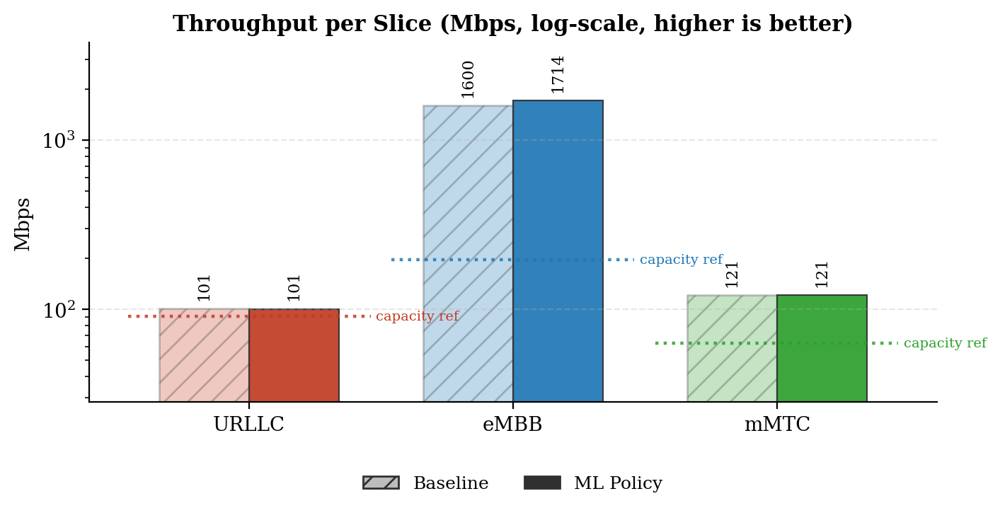
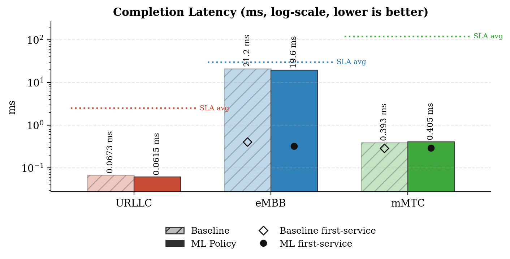
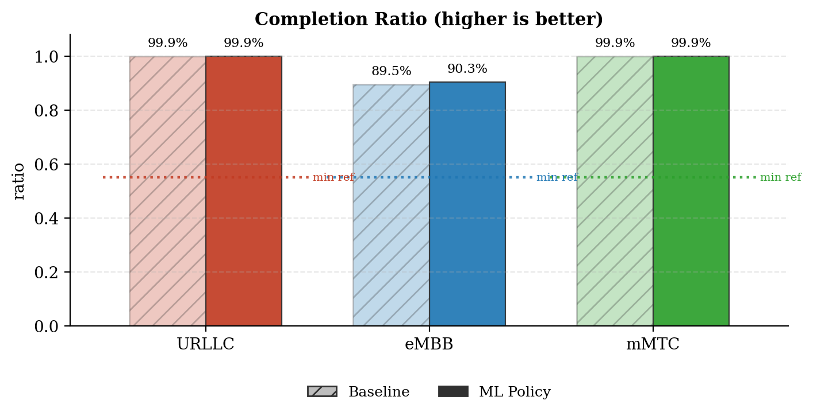
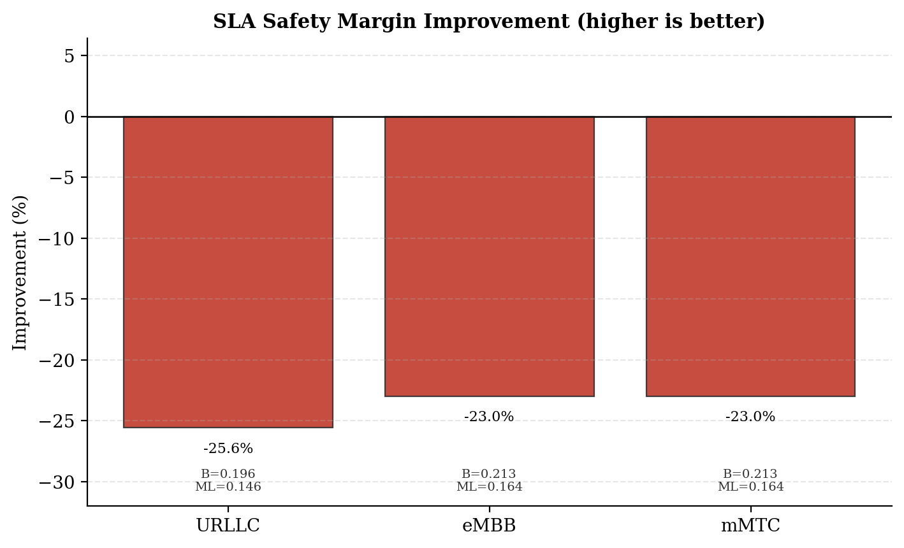
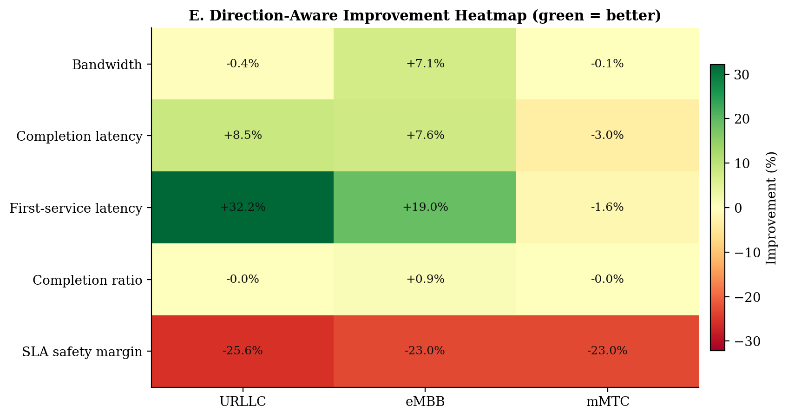
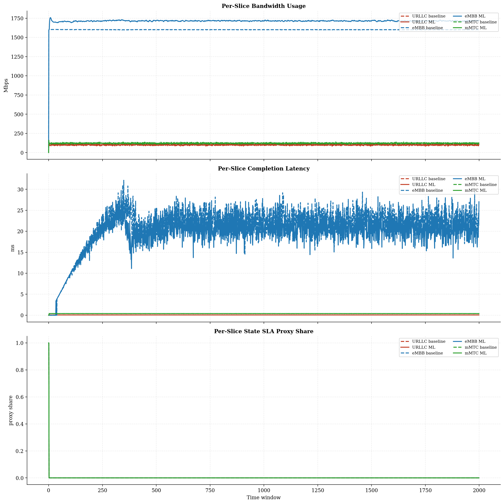
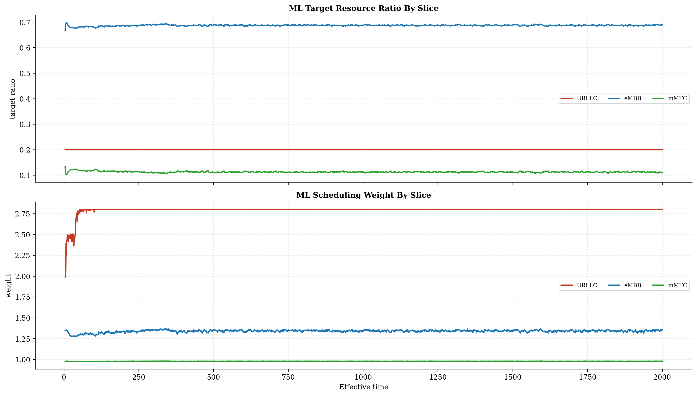
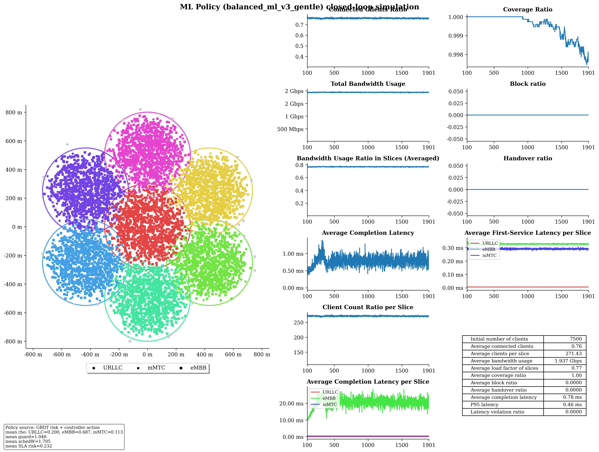

# Baseline vs ML Policy Report

## Run Summary

- Timestamp: `2026-05-08T02:53:15`
- Config: `C:\Users\LENOVO\Downloads\5G-Network-Slicing-main\5G-Network-Slicing-with-GBDT-ML-Policy\slicesim\scenario-heavy.yml`
- Model: `C:\Users\LENOVO\Downloads\5G-Network-Slicing-main\5G-Network-Slicing-with-GBDT-ML-Policy\models\sla_risk_gbdt`
- Controller type: `gbdt`
- Controller preset: `balanced_ml_v3_gentle`
- Broker enabled: `True`
- Broker preset: `forecasting_balanced`
- Seed: `7`

## Global KPI Comparison

| metric | baseline | ml_policy | delta_ml_minus_baseline | delta_pct |
|---|---|---|---|---|
| connected_clients_ratio | 0.7602 | 0.7595 | -0.0007 | -0.0986 |
| coverage_ratio | 0.9995 | 0.9995 | -0.0001 | -0.0057 |
| block_ratio | 0.0000 | 0.0000 | 0.0000 | 0.0000 |
| handover_ratio | 0.0000 | 0.0000 | 0.0000 | 0.0000 |
| avg_slice_load_ratio | 0.7232 | 0.7682 | 0.0450 | 6.2231 |
| total_bandwidth_usage | 1822410843.0962 | 1935821586.6075 | 113410743.5113 | 6.2231 |
| avg_latency_ms | 0.7479 | 0.7544 | 0.0065 | 0.8755 |
| p95_latency_ms | 0.4531 | 0.4627 | 0.0096 | 2.1226 |
| latency_violation_ratio | 0.0000 | 0.0000 | 0.0000 | 0.0000 |
| avg_state_sla_violation_share | 0.0010 | 0.0010 | 0.0000 | 0.0000 |
| bandwidth_jain_fairness | 0.4283 | 0.4217 | -0.0066 | -1.5428 |
| bandwidth_jain_fairness_min | 0.3333 | 0.3333 | 0.0000 | 0.0000 |

## Per-Slice Summary

| slice_name | avg_bandwidth_usage_mbps_baseline | avg_bandwidth_usage_mbps_ml | avg_bandwidth_usage_mbps_delta | avg_served_bandwidth_baseline | avg_served_bandwidth_ml | avg_served_bandwidth_delta | avg_completion_latency_ms_baseline | avg_completion_latency_ms_ml | avg_completion_latency_ms_delta | avg_first_service_latency_ms_baseline | avg_first_service_latency_ms_ml | avg_first_service_latency_ms_delta | avg_recorded_first_service_latency_ms_baseline | avg_recorded_first_service_latency_ms_ml | avg_recorded_first_service_latency_ms_delta | avg_bandwidth_share_baseline | avg_bandwidth_share_ml | avg_bandwidth_share_delta | zero_bandwidth_window_share_baseline | zero_bandwidth_window_share_ml | zero_bandwidth_window_share_delta | completion_ratio_baseline | completion_ratio_ml | completion_ratio_delta | completion_latency_violation_ratio_baseline | completion_latency_violation_ratio_ml | completion_latency_violation_ratio_delta | first_service_latency_violation_ratio_baseline | first_service_latency_violation_ratio_ml | first_service_latency_violation_ratio_delta | request_latency_violation_event_ratio_baseline | request_latency_violation_event_ratio_ml | request_latency_violation_event_ratio_delta | avg_state_sla_violation_share_baseline | avg_state_sla_violation_share_ml | avg_state_sla_violation_share_delta | avg_sla_safety_margin_baseline | avg_sla_safety_margin_ml | avg_sla_safety_margin_delta | avg_sla_safety_margin_improvement_pct |
|---|---|---|---|---|---|---|---|---|---|---|---|---|---|---|---|---|---|---|---|---|---|---|---|---|---|---|---|---|---|---|---|---|---|---|---|---|---|---|---|---|
| URLLC | 101.1198 | 100.7045 | -0.4154 | 340173.7738 | 339707.1836 | -466.5902 | 0.0673 | 0.0615 | -0.0057 | 0.0085 | 0.0057 | -0.0027 | 0.0085 | 0.0057 | -0.0027 | 0.0559 | 0.0525 | -0.0035 | 0.0000 | 0.0000 | 0.0000 | 0.9995 | 0.9995 | -0.0000 | 0.0000 | 0.0000 | 0.0000 | 0.0000 | 0.0000 | 0.0000 | 0.0000 | 0.0000 | 0.0000 | 0.0010 | 0.0010 | 0.0000 | 0.1956 | 0.1456 | -0.0500 | -25.5702 |
| eMBB | 1599.8169 | 1713.7490 | 113.9321 | 371751.2456 | 401707.6965 | 29956.4509 | 21.2184 | 19.5969 | -1.6215 | 0.4023 | 0.3257 | -0.0766 | 0.4058 | 0.3280 | -0.0777 | 0.8775 | 0.8849 | 0.0074 | 0.0005 | 0.0005 | 0.0000 | 0.8954 | 0.9031 | 0.0077 | 0.0000 | 0.0000 | 0.0000 | 0.0000 | 0.0000 | 0.0000 | 0.0000 | 0.0000 | 0.0000 | 0.0010 | 0.0010 | 0.0000 | 0.2130 | 0.1641 | -0.0489 | -22.9651 |
| mMTC | 121.4741 | 121.3681 | -0.1060 | 224995.0274 | 224857.2078 | -137.8197 | 0.3934 | 0.4054 | 0.0120 | 0.2863 | 0.2909 | 0.0047 | 0.2864 | 0.2911 | 0.0047 | 0.0666 | 0.0627 | -0.0040 | 0.0005 | 0.0005 | 0.0000 | 0.9990 | 0.9990 | -0.0000 | 0.0000 | 0.0000 | 0.0000 | 0.0000 | 0.0000 | 0.0000 | 0.0000 | 0.0000 | 0.0000 | 0.0010 | 0.0010 | 0.0000 | 0.2130 | 0.1641 | -0.0489 | -22.9651 |

## Per-Base-Station Summary

| base_station_id | avg_bandwidth_usage_mbps_baseline | avg_bandwidth_usage_mbps_ml | avg_bandwidth_usage_mbps_delta | avg_bandwidth_usage_mbps_delta_pct | avg_capacity_mbps_baseline | avg_capacity_mbps_ml | avg_capacity_mbps_delta | avg_capacity_mbps_delta_pct | avg_load_ratio_baseline | avg_load_ratio_ml | avg_load_ratio_delta | avg_load_ratio_delta_pct | avg_remaining_capacity_ratio_baseline | avg_remaining_capacity_ratio_ml | avg_remaining_capacity_ratio_delta | avg_remaining_capacity_ratio_delta_pct | avg_request_count_per_window_baseline | avg_request_count_per_window_ml | avg_request_count_per_window_delta | avg_request_count_per_window_delta_pct | total_request_count_baseline | total_request_count_ml | total_request_count_delta | total_request_count_delta_pct | avg_requested_usage_mbps_per_window_baseline | avg_requested_usage_mbps_per_window_ml | avg_requested_usage_mbps_per_window_delta | avg_requested_usage_mbps_per_window_delta_pct | avg_clients_seen_per_window_baseline | avg_clients_seen_per_window_ml | avg_clients_seen_per_window_delta | avg_clients_seen_per_window_delta_pct | avg_connected_events_per_window_baseline | avg_connected_events_per_window_ml | avg_connected_events_per_window_delta | avg_connected_events_per_window_delta_pct | avg_disconnected_events_per_window_baseline | avg_disconnected_events_per_window_ml | avg_disconnected_events_per_window_delta | avg_disconnected_events_per_window_delta_pct | avg_state_sla_violation_share_baseline | avg_state_sla_violation_share_ml | avg_state_sla_violation_share_delta | avg_state_sla_violation_share_delta_pct | avg_sla_safety_margin_baseline | avg_sla_safety_margin_ml | avg_sla_safety_margin_delta | avg_sla_safety_margin_delta_pct | avg_sla_breach_count_per_window_baseline | avg_sla_breach_count_per_window_ml | avg_sla_breach_count_per_window_delta | avg_sla_breach_count_per_window_delta_pct |
|---|---|---|---|---|---|---|---|---|---|---|---|---|---|---|---|---|---|---|---|---|---|---|---|---|---|---|---|---|---|---|---|---|---|---|---|---|---|---|---|---|---|---|---|---|---|---|---|---|---|---|---|---|
| BS_0 | 288.6120 | 316.5605 | 27.9485 | 9.6838 | 420.0000 | 420.0000 | 0.0000 | 0.0000 | 0.6872 | 0.7537 | 0.0665 | 9.6838 | 0.3128 | 0.2463 | -0.0665 | -21.2717 | 112.9315 | 113.0555 | 0.1240 | 0.1098 | 225863.0000 | 226111.0000 | 248.0000 | 0.1098 | 304.8815 | 336.0451 | 31.1635 | 10.2215 | 1072.3040 | 1072.8720 | 0.5680 | 0.0530 | 112.9375 | 113.0660 | 0.1285 | 0.1138 | 112.5240 | 112.6410 | 0.1170 | 0.1040 | 0.0010 | 0.0010 | 0.0000 | 0.0000 | 0.2072 | 0.1579 | -0.0493 | -23.7847 | 0.0030 | 0.0030 | 0.0000 | 0.0000 |
| BS_1 | 257.0893 | 270.8545 | 13.7651 | 5.3542 | 350.0000 | 350.0000 | 0.0000 | 0.0000 | 0.7345 | 0.7739 | 0.0393 | 5.3542 | 0.2655 | 0.2261 | -0.0393 | -14.8154 | 128.1055 | 128.0600 | -0.0455 | -0.0355 | 256211.0000 | 256120.0000 | -91.0000 | -0.0355 | 272.9456 | 288.6979 | 15.7523 | 5.7712 | 1069.5735 | 1069.5245 | -0.0490 | -0.0046 | 128.1140 | 128.0655 | -0.0485 | -0.0379 | 127.7110 | 127.6650 | -0.0460 | -0.0360 | 0.0010 | 0.0010 | 0.0000 | 0.0000 | 0.2072 | 0.1579 | -0.0493 | -23.7847 | 0.0030 | 0.0030 | 0.0000 | 0.0000 |
| BS_2 | 255.9415 | 270.0603 | 14.1188 | 5.5164 | 350.0000 | 350.0000 | 0.0000 | 0.0000 | 0.7313 | 0.7716 | 0.0403 | 5.5164 | 0.2687 | 0.2284 | -0.0403 | -15.0107 | 125.9295 | 126.3430 | 0.4135 | 0.3284 | 251859.0000 | 252686.0000 | 827.0000 | 0.3284 | 271.5498 | 288.2018 | 16.6520 | 6.1322 | 1071.9165 | 1071.9060 | -0.0105 | -0.0010 | 125.9435 | 126.3710 | 0.4275 | 0.3394 | 125.5300 | 125.9605 | 0.4305 | 0.3429 | 0.0010 | 0.0010 | 0.0000 | 0.0000 | 0.2072 | 0.1579 | -0.0493 | -23.7847 | 0.0030 | 0.0030 | 0.0000 | 0.0000 |
| BS_3 | 254.6646 | 268.9432 | 14.2786 | 5.6068 | 350.0000 | 350.0000 | 0.0000 | 0.0000 | 0.7276 | 0.7684 | 0.0408 | 5.6068 | 0.2724 | 0.2316 | -0.0408 | -14.9772 | 122.1100 | 121.8770 | -0.2330 | -0.1908 | 244220.0000 | 243754.0000 | -466.0000 | -0.1908 | 269.8111 | 286.5434 | 16.7323 | 6.2015 | 1070.9205 | 1071.0700 | 0.1495 | 0.0140 | 122.1180 | 121.8855 | -0.2325 | -0.1904 | 121.7105 | 121.4785 | -0.2320 | -0.1906 | 0.0010 | 0.0010 | 0.0000 | 0.0000 | 0.2072 | 0.1579 | -0.0493 | -23.7847 | 0.0030 | 0.0030 | 0.0000 | 0.0000 |
| BS_4 | 257.6067 | 271.8947 | 14.2880 | 5.5464 | 350.0000 | 350.0000 | 0.0000 | 0.0000 | 0.7360 | 0.7768 | 0.0408 | 5.5464 | 0.2640 | 0.2232 | -0.0408 | -15.4643 | 130.3570 | 131.1370 | 0.7800 | 0.5984 | 260714.0000 | 262274.0000 | 1560.0000 | 0.5984 | 272.6798 | 289.7404 | 17.0606 | 6.2566 | 1068.7030 | 1069.4920 | 0.7890 | 0.0738 | 130.3690 | 131.1460 | 0.7770 | 0.5960 | 129.9735 | 130.7490 | 0.7755 | 0.5967 | 0.0010 | 0.0010 | 0.0000 | 0.0000 | 0.2072 | 0.1579 | -0.0493 | -23.7847 | 0.0030 | 0.0030 | 0.0000 | 0.0000 |
| BS_5 | 255.0628 | 269.2701 | 14.2073 | 5.5701 | 350.0000 | 350.0000 | 0.0000 | 0.0000 | 0.7288 | 0.7693 | 0.0406 | 5.5701 | 0.2712 | 0.2307 | -0.0406 | -14.9650 | 122.0405 | 121.7020 | -0.3385 | -0.2774 | 244081.0000 | 243404.0000 | -677.0000 | -0.2774 | 270.7806 | 287.8262 | 17.0456 | 6.2950 | 1070.4485 | 1071.6565 | 1.2080 | 0.1128 | 122.0710 | 121.7120 | -0.3590 | -0.2941 | 121.6730 | 121.2985 | -0.3745 | -0.3078 | 0.0010 | 0.0010 | 0.0000 | 0.0000 | 0.2072 | 0.1579 | -0.0493 | -23.7847 | 0.0030 | 0.0030 | 0.0000 | 0.0000 |
| BS_6 | 253.4340 | 268.2384 | 14.8044 | 5.8415 | 350.0000 | 350.0000 | 0.0000 | 0.0000 | 0.7241 | 0.7664 | 0.0423 | 5.8415 | 0.2759 | 0.2336 | -0.0423 | -15.3308 | 116.6435 | 116.4625 | -0.1810 | -0.1552 | 233287.0000 | 232925.0000 | -362.0000 | -0.1552 | 270.8540 | 286.2786 | 15.4245 | 5.6948 | 1072.5905 | 1069.5075 | -3.0830 | -0.2874 | 116.6615 | 116.4890 | -0.1725 | -0.1479 | 116.2385 | 116.0755 | -0.1630 | -0.1402 | 0.0010 | 0.0010 | 0.0000 | 0.0000 | 0.2072 | 0.1579 | -0.0493 | -23.7847 | 0.0030 | 0.0030 | 0.0000 | 0.0000 |

## Per-Base-Station Slice SLA Summary

| base_station_id | slice_name | avg_bandwidth_usage_mbps_baseline | avg_bandwidth_usage_mbps_ml | avg_bandwidth_usage_mbps_delta | avg_bandwidth_usage_mbps_delta_pct | avg_slice_capacity_mbps_baseline | avg_slice_capacity_mbps_ml | avg_slice_capacity_mbps_delta | avg_slice_capacity_mbps_delta_pct | avg_slice_load_ratio_baseline | avg_slice_load_ratio_ml | avg_slice_load_ratio_delta | avg_slice_load_ratio_delta_pct | avg_remaining_capacity_ratio_baseline | avg_remaining_capacity_ratio_ml | avg_remaining_capacity_ratio_delta | avg_remaining_capacity_ratio_delta_pct | avg_request_count_per_window_baseline | avg_request_count_per_window_ml | avg_request_count_per_window_delta | avg_request_count_per_window_delta_pct | total_request_count_baseline | total_request_count_ml | total_request_count_delta | total_request_count_delta_pct | avg_requested_usage_mbps_per_window_baseline | avg_requested_usage_mbps_per_window_ml | avg_requested_usage_mbps_per_window_delta | avg_requested_usage_mbps_per_window_delta_pct | avg_clients_seen_per_window_baseline | avg_clients_seen_per_window_ml | avg_clients_seen_per_window_delta | avg_clients_seen_per_window_delta_pct | avg_state_sla_violation_share_baseline | avg_state_sla_violation_share_ml | avg_state_sla_violation_share_delta | avg_state_sla_violation_share_delta_pct | avg_sla_safety_margin_baseline | avg_sla_safety_margin_ml | avg_sla_safety_margin_delta | avg_sla_safety_margin_delta_pct | avg_sla_breach_count_per_window_baseline | avg_sla_breach_count_per_window_ml | avg_sla_breach_count_per_window_delta | avg_sla_breach_count_per_window_delta_pct |
|---|---|---|---|---|---|---|---|---|---|---|---|---|---|---|---|---|---|---|---|---|---|---|---|---|---|---|---|---|---|---|---|---|---|---|---|---|---|---|---|---|---|---|---|---|---|
| BS_0 | URLLC | 12.8578 | 12.7485 | -0.1094 | -0.8505 | 84.0000 | 84.0000 | 0.0000 | 0.0000 | 0.1531 | 0.1518 | -0.0013 | -0.8505 | 0.8469 | 0.8482 | 0.0013 | 0.1537 | 37.7935 | 37.5655 | -0.2280 | -0.6033 | 75587.0000 | 75131.0000 | -456.0000 | -0.6033 | 12.8578 | 12.7485 | -0.1094 | -0.8505 | 115.2345 | 115.7080 | 0.4735 | 0.4109 | 0.0010 | 0.0010 | 0.0000 | 0.0000 | 0.1956 | 0.1456 | -0.0500 | -25.5702 | 0.0010 | 0.0010 | 0.0000 | 0.0000 |
| BS_0 | eMBB | 259.6152 | 287.6740 | 28.0588 | 10.8078 | 260.4000 | 290.3201 | 29.9201 | 11.4900 | 0.9970 | 0.9908 | -0.0061 | -0.6169 | 0.0030 | 0.0092 | 0.0061 | 204.0550 | 3.3685 | 3.7380 | 0.3695 | 10.9693 | 6737.0000 | 7476.0000 | 739.0000 | 10.9693 | 275.8769 | 307.1509 | 31.2740 | 11.3362 | 661.8200 | 661.6750 | -0.1450 | -0.0219 | 0.0010 | 0.0010 | 0.0000 | 0.0000 | 0.2130 | 0.1641 | -0.0489 | -22.9651 | 0.0010 | 0.0010 | 0.0000 | 0.0000 |
| BS_0 | mMTC | 16.1389 | 16.1380 | -0.0009 | -0.0055 | 75.6000 | 45.6799 | -29.9201 | -39.5768 | 0.2135 | 0.3538 | 0.1404 | 65.7507 | 0.7865 | 0.6462 | -0.1404 | -17.8461 | 71.7695 | 71.7520 | -0.0175 | -0.0244 | 143539.0000 | 143504.0000 | -35.0000 | -0.0244 | 16.1468 | 16.1457 | -0.0011 | -0.0068 | 295.2495 | 295.4890 | 0.2395 | 0.0811 | 0.0010 | 0.0010 | 0.0000 | 0.0000 | 0.2130 | 0.1641 | -0.0489 | -22.9651 | 0.0010 | 0.0010 | 0.0000 | 0.0000 |
| BS_1 | URLLC | 16.4723 | 16.3659 | -0.1064 | -0.6460 | 63.0000 | 69.9860 | 6.9860 | 11.0889 | 0.2615 | 0.2339 | -0.0276 | -10.5594 | 0.7385 | 0.7661 | 0.0276 | 3.7383 | 48.4700 | 48.1900 | -0.2800 | -0.5777 | 96940.0000 | 96380.0000 | -560.0000 | -0.5777 | 16.4723 | 16.3659 | -0.1064 | -0.6460 | 148.3040 | 147.6465 | -0.6575 | -0.4433 | 0.0010 | 0.0010 | 0.0000 | 0.0000 | 0.1956 | 0.1456 | -0.0500 | -25.5702 | 0.0010 | 0.0010 | 0.0000 | 0.0000 |
| BS_1 | eMBB | 223.3482 | 237.2492 | 13.9010 | 6.2239 | 224.0000 | 240.3719 | 16.3719 | 7.3089 | 0.9971 | 0.9870 | -0.0101 | -1.0140 | 0.0029 | 0.0130 | 0.0101 | 347.4656 | 2.8910 | 3.0830 | 0.1920 | 6.6413 | 5782.0000 | 6166.0000 | 384.0000 | 6.6413 | 239.1958 | 255.0830 | 15.8873 | 6.6420 | 605.4785 | 605.4260 | -0.0525 | -0.0087 | 0.0010 | 0.0010 | 0.0000 | 0.0000 | 0.2130 | 0.1641 | -0.0489 | -22.9651 | 0.0010 | 0.0010 | 0.0000 | 0.0000 |
| BS_1 | mMTC | 17.2689 | 17.2394 | -0.0295 | -0.1708 | 63.0000 | 39.6421 | -23.3579 | -37.0760 | 0.2741 | 0.4357 | 0.1616 | 58.9525 | 0.7259 | 0.5643 | -0.1616 | -22.2615 | 76.7445 | 76.7870 | 0.0425 | 0.0554 | 153489.0000 | 153574.0000 | 85.0000 | 0.0554 | 17.2776 | 17.2490 | -0.0285 | -0.1652 | 315.7910 | 316.4520 | 0.6610 | 0.2093 | 0.0010 | 0.0010 | 0.0000 | 0.0000 | 0.2130 | 0.1641 | -0.0489 | -22.9651 | 0.0010 | 0.0010 | 0.0000 | 0.0000 |
| BS_2 | URLLC | 14.4027 | 14.4745 | 0.0717 | 0.4982 | 63.0000 | 69.9860 | 6.9860 | 11.0889 | 0.2286 | 0.2068 | -0.0218 | -9.5310 | 0.7714 | 0.7932 | 0.0218 | 2.8247 | 42.2930 | 42.5715 | 0.2785 | 0.6585 | 84586.0000 | 85143.0000 | 557.0000 | 0.6585 | 14.4027 | 14.4745 | 0.0717 | 0.4982 | 131.7195 | 131.7600 | 0.0405 | 0.0307 | 0.0010 | 0.0010 | 0.0000 | 0.0000 | 0.1956 | 0.1456 | -0.0500 | -25.5702 | 0.0010 | 0.0010 | 0.0000 | 0.0000 |
| BS_2 | eMBB | 223.3560 | 237.4553 | 14.0992 | 6.3124 | 224.0000 | 240.0138 | 16.0138 | 7.1490 | 0.9971 | 0.9893 | -0.0078 | -0.7838 | 0.0029 | 0.0107 | 0.0078 | 271.8691 | 2.8550 | 3.1160 | 0.2610 | 9.1419 | 5710.0000 | 6232.0000 | 522.0000 | 9.1419 | 238.9535 | 255.5862 | 16.6326 | 6.9606 | 606.0320 | 606.3915 | 0.3595 | 0.0593 | 0.0010 | 0.0010 | 0.0000 | 0.0000 | 0.2130 | 0.1641 | -0.0489 | -22.9651 | 0.0010 | 0.0010 | 0.0000 | 0.0000 |
| BS_2 | mMTC | 18.1827 | 18.1305 | -0.0521 | -0.2868 | 63.0000 | 40.0002 | -22.9998 | -36.5076 | 0.2886 | 0.4542 | 0.1656 | 57.3747 | 0.7114 | 0.5458 | -0.1656 | -23.2773 | 80.7815 | 80.6555 | -0.1260 | -0.1560 | 161563.0000 | 161311.0000 | -252.0000 | -0.1560 | 18.1936 | 18.1412 | -0.0524 | -0.2880 | 334.1650 | 333.7545 | -0.4105 | -0.1228 | 0.0010 | 0.0010 | 0.0000 | 0.0000 | 0.2130 | 0.1641 | -0.0489 | -22.9651 | 0.0010 | 0.0010 | 0.0000 | 0.0000 |
| BS_3 | URLLC | 13.3008 | 13.1313 | -0.1695 | -1.2746 | 63.0000 | 69.9860 | 6.9860 | 11.0889 | 0.2111 | 0.1876 | -0.0235 | -11.1257 | 0.7889 | 0.8124 | 0.0235 | 2.9775 | 39.1085 | 38.6730 | -0.4355 | -1.1136 | 78217.0000 | 77346.0000 | -871.0000 | -1.1136 | 13.3008 | 13.1313 | -0.1695 | -1.2746 | 120.4455 | 119.2860 | -1.1595 | -0.9627 | 0.0010 | 0.0010 | 0.0000 | 0.0000 | 0.1956 | 0.1456 | -0.0500 | -25.5702 | 0.0010 | 0.0010 | 0.0000 | 0.0000 |
| BS_3 | eMBB | 223.3655 | 237.7993 | 14.4339 | 6.4620 | 224.0000 | 240.0268 | 16.0268 | 7.1548 | 0.9972 | 0.9907 | -0.0065 | -0.6496 | 0.0028 | 0.0093 | 0.0065 | 228.6659 | 2.9005 | 3.1250 | 0.2245 | 7.7400 | 5801.0000 | 6250.0000 | 449.0000 | 7.7400 | 238.5038 | 255.3912 | 16.8874 | 7.0806 | 622.8180 | 623.9075 | 1.0895 | 0.1749 | 0.0010 | 0.0010 | 0.0000 | 0.0000 | 0.2130 | 0.1641 | -0.0489 | -22.9651 | 0.0010 | 0.0010 | 0.0000 | 0.0000 |
| BS_3 | mMTC | 17.9983 | 18.0126 | 0.0142 | 0.0790 | 63.0000 | 39.9872 | -23.0128 | -36.5282 | 0.2857 | 0.4513 | 0.1656 | 57.9523 | 0.7143 | 0.5487 | -0.1656 | -23.1779 | 80.1010 | 80.0790 | -0.0220 | -0.0275 | 160202.0000 | 160158.0000 | -44.0000 | -0.0275 | 18.0064 | 18.0208 | 0.0144 | 0.0801 | 327.6570 | 327.8765 | 0.2195 | 0.0670 | 0.0010 | 0.0010 | 0.0000 | 0.0000 | 0.2130 | 0.1641 | -0.0489 | -22.9651 | 0.0010 | 0.0010 | 0.0000 | 0.0000 |
| BS_4 | URLLC | 16.4054 | 16.4712 | 0.0658 | 0.4010 | 63.0000 | 69.9860 | 6.9860 | 11.0889 | 0.2604 | 0.2354 | -0.0250 | -9.6195 | 0.7396 | 0.7646 | 0.0250 | 3.3869 | 48.1480 | 48.4940 | 0.3460 | 0.7186 | 96296.0000 | 96988.0000 | 692.0000 | 0.7186 | 16.4054 | 16.4712 | 0.0658 | 0.4010 | 149.0400 | 150.3820 | 1.3420 | 0.9004 | 0.0010 | 0.0010 | 0.0000 | 0.0000 | 0.1956 | 0.1456 | -0.0500 | -25.5702 | 0.0010 | 0.0010 | 0.0000 | 0.0000 |
| BS_4 | eMBB | 223.3539 | 237.5106 | 14.1567 | 6.3382 | 224.0000 | 240.0378 | 16.0378 | 7.1597 | 0.9971 | 0.9894 | -0.0077 | -0.7696 | 0.0029 | 0.0106 | 0.0077 | 266.0642 | 2.8765 | 3.0835 | 0.2070 | 7.1962 | 5753.0000 | 6167.0000 | 414.0000 | 7.1962 | 238.4178 | 255.3464 | 16.9286 | 7.1004 | 598.2000 | 596.6245 | -1.5755 | -0.2634 | 0.0010 | 0.0010 | 0.0000 | 0.0000 | 0.2130 | 0.1641 | -0.0489 | -22.9651 | 0.0010 | 0.0010 | 0.0000 | 0.0000 |
| BS_4 | mMTC | 17.8473 | 17.9128 | 0.0655 | 0.3672 | 63.0000 | 39.9762 | -23.0238 | -36.5457 | 0.2833 | 0.4489 | 0.1657 | 58.4755 | 0.7167 | 0.5511 | -0.1657 | -23.1133 | 79.3325 | 79.5595 | 0.2270 | 0.2861 | 158665.0000 | 159119.0000 | 454.0000 | 0.2861 | 17.8566 | 17.9228 | 0.0662 | 0.3707 | 321.4630 | 322.4855 | 1.0225 | 0.3181 | 0.0010 | 0.0010 | 0.0000 | 0.0000 | 0.2130 | 0.1641 | -0.0489 | -22.9651 | 0.0010 | 0.0010 | 0.0000 | 0.0000 |
| BS_5 | URLLC | 14.4438 | 14.3368 | -0.1069 | -0.7403 | 63.0000 | 69.9860 | 6.9860 | 11.0889 | 0.2293 | 0.2049 | -0.0244 | -10.6491 | 0.7707 | 0.7951 | 0.0244 | 3.1677 | 42.5065 | 42.1905 | -0.3160 | -0.7434 | 85013.0000 | 84381.0000 | -632.0000 | -0.7434 | 14.4438 | 14.3368 | -0.1069 | -0.7403 | 130.6445 | 130.2750 | -0.3695 | -0.2828 | 0.0010 | 0.0010 | 0.0000 | 0.0000 | 0.1956 | 0.1456 | -0.0500 | -25.5702 | 0.0010 | 0.0010 | 0.0000 | 0.0000 |
| BS_5 | eMBB | 223.3774 | 237.7835 | 14.4061 | 6.4492 | 224.0000 | 240.3384 | 16.3384 | 7.2939 | 0.9972 | 0.9893 | -0.0079 | -0.7905 | 0.0028 | 0.0107 | 0.0079 | 283.6159 | 2.8940 | 3.1110 | 0.2170 | 7.4983 | 5788.0000 | 6222.0000 | 434.0000 | 7.4983 | 239.0877 | 256.3318 | 17.2441 | 7.2125 | 626.7635 | 629.1670 | 2.4035 | 0.3835 | 0.0010 | 0.0010 | 0.0000 | 0.0000 | 0.2130 | 0.1641 | -0.0489 | -22.9651 | 0.0010 | 0.0010 | 0.0000 | 0.0000 |
| BS_5 | mMTC | 17.2417 | 17.1499 | -0.0918 | -0.5325 | 63.0000 | 39.6756 | -23.3244 | -37.0229 | 0.2737 | 0.4331 | 0.1594 | 58.2426 | 0.7263 | 0.5669 | -0.1594 | -21.9457 | 76.6400 | 76.4005 | -0.2395 | -0.3125 | 153280.0000 | 152801.0000 | -479.0000 | -0.3125 | 17.2492 | 17.1576 | -0.0916 | -0.5309 | 313.0405 | 312.2145 | -0.8260 | -0.2639 | 0.0010 | 0.0010 | 0.0000 | 0.0000 | 0.2130 | 0.1641 | -0.0489 | -22.9651 | 0.0010 | 0.0010 | 0.0000 | 0.0000 |
| BS_6 | URLLC | 13.2370 | 13.1763 | -0.0607 | -0.4585 | 63.0000 | 69.9860 | 6.9860 | 11.0889 | 0.2101 | 0.1883 | -0.0218 | -10.3922 | 0.7899 | 0.8117 | 0.0218 | 2.7643 | 38.9385 | 38.7650 | -0.1735 | -0.4456 | 77877.0000 | 77530.0000 | -347.0000 | -0.4456 | 13.2370 | 13.1763 | -0.0607 | -0.4585 | 119.0310 | 118.9235 | -0.1075 | -0.0903 | 0.0010 | 0.0010 | 0.0000 | 0.0000 | 0.1956 | 0.1456 | -0.0500 | -25.5702 | 0.0010 | 0.0010 | 0.0000 | 0.0000 |
| BS_6 | eMBB | 223.4007 | 238.2771 | 14.8764 | 6.6591 | 224.0000 | 240.5343 | 16.5343 | 7.3814 | 0.9973 | 0.9906 | -0.0067 | -0.6759 | 0.0027 | 0.0094 | 0.0067 | 251.9490 | 2.9035 | 3.0950 | 0.1915 | 6.5955 | 5807.0000 | 6190.0000 | 383.0000 | 6.5955 | 240.8115 | 256.3101 | 15.4986 | 6.4360 | 647.0465 | 644.4405 | -2.6060 | -0.4028 | 0.0010 | 0.0010 | 0.0000 | 0.0000 | 0.2130 | 0.1641 | -0.0489 | -22.9651 | 0.0010 | 0.0010 | 0.0000 | 0.0000 |
| BS_6 | mMTC | 16.7963 | 16.7849 | -0.0114 | -0.0678 | 63.0000 | 39.4797 | -23.5203 | -37.3338 | 0.2666 | 0.4259 | 0.1593 | 59.7404 | 0.7334 | 0.5741 | -0.1593 | -21.7173 | 74.8015 | 74.6025 | -0.1990 | -0.2660 | 149603.0000 | 149205.0000 | -398.0000 | -0.2660 | 16.8056 | 16.7922 | -0.0133 | -0.0794 | 306.5130 | 306.1435 | -0.3695 | -0.1205 | 0.0010 | 0.0010 | 0.0000 | 0.0000 | 0.2130 | 0.1641 | -0.0489 | -22.9651 | 0.0010 | 0.0010 | 0.0000 | 0.0000 |

## Resource Allocation Summary

| slice_name | baseline_state_ratio | ml_state_ratio | ml_action_target_ratio_mean | ml_action_target_ratio_min | ml_action_target_ratio_max | ml_scheduling_weight_mean | ml_admission_guard_factor_mean | target_ratio_delta_vs_baseline_state |
|---|---|---|---|---|---|---|---|---|
| URLLC | 0.1829 | 0.2000 | 0.2000 | 0.2000 | 0.2000 | 2.7927 | 1.0849 | 0.0171 |
| eMBB | 0.6371 | 0.6870 | 0.6871 | 0.6640 | 0.7000 | 1.3415 | 1.0434 | 0.0500 |
| mMTC | 0.1800 | 0.1130 | 0.1129 | 0.1000 | 0.1360 | 0.9800 | 1.0088 | -0.0671 |

## Visual Comparison

### Global KPI View

### Per-Slice View

### Per-Slice Panel Images

#### Throughput per Slice

#### Latency per Slice

#### Completion Ratio

#### SLA Safety Margin Improvement

#### Improvement Heatmap

### Per-Slice Time-Series View

### ML Action Distribution

### ML Policy Simulation Snapshot

## Metric Notes

- `avg_state_sla_violation_share` is the per-slice state-level SLA violation ratio averaged from simulator state frames.
- `avg_sla_safety_margin` is the average distance to the active SLA boundary. Higher is better; negative means violation.
- `avg_sla_safety_margin_improvement_pct` is `(ML margin - baseline margin) / abs(baseline margin) * 100`.
- `request_latency_violation_event_ratio`, `completion_latency_violation_ratio`, and `first_service_latency_violation_ratio` are client-level latency-only metrics.
- A latency value of `0` can mean no recorded latency event for that slice/window. Check `completion_ratio` and request/completion counts before interpreting it as perfect latency.
- `bandwidth_jain_fairness` is Jain's fairness index over per-slice bandwidth usage per time window. Higher is more balanced, with `1.0` meaning equal usage across slices.

## Trade-off Notes

- URLLC completion latency changed by -0.01 ms and SLA safety margin changed by -0.0500 (-25.6%).
- eMBB average bandwidth usage changed by 113.932 Mbps and completion ratio changed by 0.0077.
- mMTC first-service latency changed by 0.00 ms and completion ratio changed by -0.0000.
- URLLC recorded first-service latency changed by -0.00 ms on windows with actual first-service events.
- Classic trade-off snapshot: if URLLC improved by 0.01 ms in latency, eMBB bandwidth moved by 113.932 Mbps.

## Artifacts

- Baseline raw states: `C:\Users\LENOVO\Downloads\5G-Network-Slicing-main\5G-Network-Slicing-with-GBDT-ML-Policy\FINAL_OUTPUT_heavy_seed7_20260508_015220\baseline_run\baseline_states.csv`
- ML raw states: `C:\Users\LENOVO\Downloads\5G-Network-Slicing-main\5G-Network-Slicing-with-GBDT-ML-Policy\FINAL_OUTPUT_heavy_seed7_20260508_015220\ml_run\online_states_raw.csv`
- ML broker forecasts: `C:\Users\LENOVO\Downloads\5G-Network-Slicing-main\5G-Network-Slicing-with-GBDT-ML-Policy\FINAL_OUTPUT_heavy_seed7_20260508_015220\ml_run\online_broker_forecasts.csv`
- ML broker feedback: `C:\Users\LENOVO\Downloads\5G-Network-Slicing-main\5G-Network-Slicing-with-GBDT-ML-Policy\FINAL_OUTPUT_heavy_seed7_20260508_015220\ml_run\online_broker_feedback.csv`
- Comparison CSV (global): `C:\Users\LENOVO\Downloads\5G-Network-Slicing-main\5G-Network-Slicing-with-GBDT-ML-Policy\FINAL_OUTPUT_heavy_seed7_20260508_015220\global_kpi_comparison.csv`
- Comparison CSV (per-slice): `C:\Users\LENOVO\Downloads\5G-Network-Slicing-main\5G-Network-Slicing-with-GBDT-ML-Policy\FINAL_OUTPUT_heavy_seed7_20260508_015220\per_slice_comparison.csv`
- Comparison CSV (per-base-station): `C:\Users\LENOVO\Downloads\5G-Network-Slicing-main\5G-Network-Slicing-with-GBDT-ML-Policy\FINAL_OUTPUT_heavy_seed7_20260508_015220\per_base_station_comparison.csv`
- Comparison CSV (per-base-station-slice): `C:\Users\LENOVO\Downloads\5G-Network-Slicing-main\5G-Network-Slicing-with-GBDT-ML-Policy\FINAL_OUTPUT_heavy_seed7_20260508_015220\per_base_station_slice_comparison.csv`
- Resource allocation CSV: `C:\Users\LENOVO\Downloads\5G-Network-Slicing-main\5G-Network-Slicing-with-GBDT-ML-Policy\FINAL_OUTPUT_heavy_seed7_20260508_015220\resource_allocation_summary.csv`
- ML action time-series CSV: `C:\Users\LENOVO\Downloads\5G-Network-Slicing-main\5G-Network-Slicing-with-GBDT-ML-Policy\FINAL_OUTPUT_heavy_seed7_20260508_015220\ml_action_ratio_timeseries.csv`
- Global KPI plot: `C:\Users\LENOVO\Downloads\5G-Network-Slicing-main\5G-Network-Slicing-with-GBDT-ML-Policy\FINAL_OUTPUT_heavy_seed7_20260508_015220\baseline_vs_ml_global_kpis.png`
- Per-slice bar plot: `C:\Users\LENOVO\Downloads\5G-Network-Slicing-main\5G-Network-Slicing-with-GBDT-ML-Policy\FINAL_OUTPUT_heavy_seed7_20260508_015220\baseline_vs_ml_per_slice_bars.png`
- Per-slice vector plot (SVG): `C:\Users\LENOVO\Downloads\5G-Network-Slicing-main\5G-Network-Slicing-with-GBDT-ML-Policy\FINAL_OUTPUT_heavy_seed7_20260508_015220\baseline_vs_ml_per_slice_bars.svg`
- Per-slice panel plot (Throughput per Slice): `C:\Users\LENOVO\Downloads\5G-Network-Slicing-main\5G-Network-Slicing-with-GBDT-ML-Policy\FINAL_OUTPUT_heavy_seed7_20260508_015220\baseline_vs_ml_per_slice_bars_throughput.png`
- Per-slice panel plot (Latency per Slice): `C:\Users\LENOVO\Downloads\5G-Network-Slicing-main\5G-Network-Slicing-with-GBDT-ML-Policy\FINAL_OUTPUT_heavy_seed7_20260508_015220\baseline_vs_ml_per_slice_bars_latency.png`
- Per-slice panel plot (Completion Ratio): `C:\Users\LENOVO\Downloads\5G-Network-Slicing-main\5G-Network-Slicing-with-GBDT-ML-Policy\FINAL_OUTPUT_heavy_seed7_20260508_015220\baseline_vs_ml_per_slice_bars_completion_ratio.png`
- Per-slice panel plot (SLA Safety Margin Improvement): `C:\Users\LENOVO\Downloads\5G-Network-Slicing-main\5G-Network-Slicing-with-GBDT-ML-Policy\FINAL_OUTPUT_heavy_seed7_20260508_015220\baseline_vs_ml_per_slice_bars_sla_margin_improvement.png`
- Per-slice panel plot (Improvement Heatmap): `C:\Users\LENOVO\Downloads\5G-Network-Slicing-main\5G-Network-Slicing-with-GBDT-ML-Policy\FINAL_OUTPUT_heavy_seed7_20260508_015220\baseline_vs_ml_per_slice_bars_improvement_heatmap.png`
- Per-slice time-series plot: `C:\Users\LENOVO\Downloads\5G-Network-Slicing-main\5G-Network-Slicing-with-GBDT-ML-Policy\FINAL_OUTPUT_heavy_seed7_20260508_015220\baseline_vs_ml_timeseries.png`
- ML action distribution plot: `C:\Users\LENOVO\Downloads\5G-Network-Slicing-main\5G-Network-Slicing-with-GBDT-ML-Policy\FINAL_OUTPUT_heavy_seed7_20260508_015220\ml_action_distribution.png`
- ML policy simulation graph: `C:\Users\LENOVO\Downloads\5G-Network-Slicing-main\5G-Network-Slicing-with-GBDT-ML-Policy\FINAL_OUTPUT_heavy_seed7_20260508_015220\ml_run\ml_policy_simulation.png`
