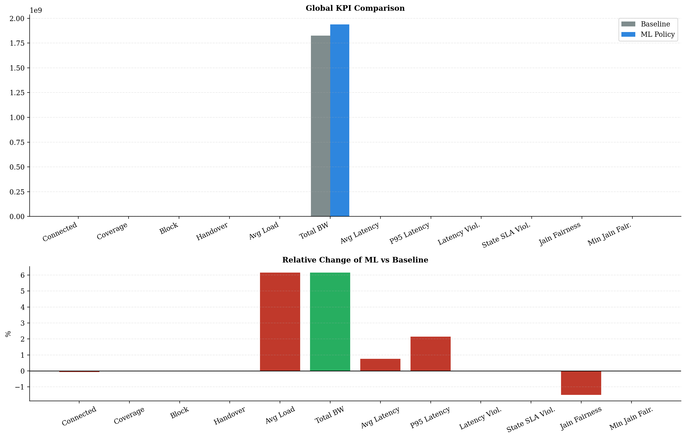
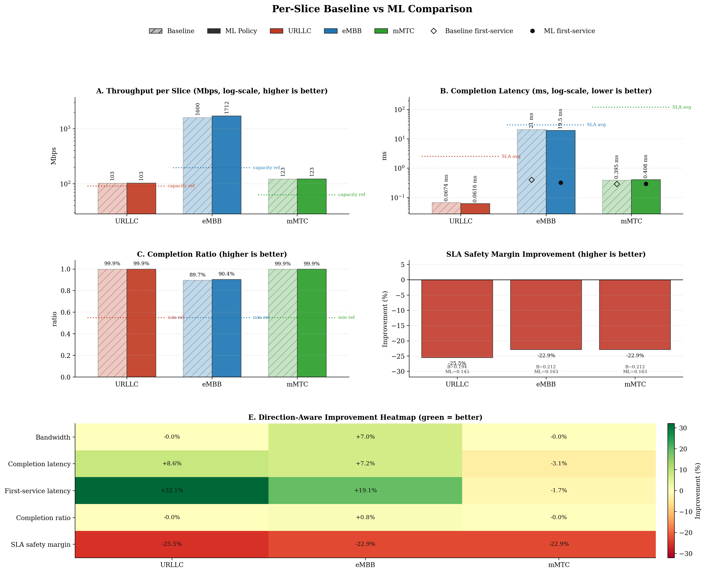
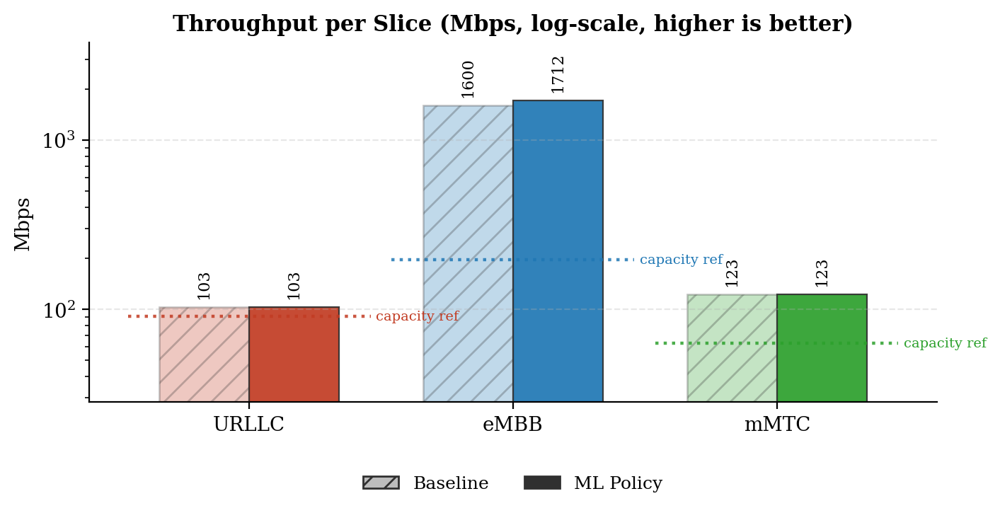
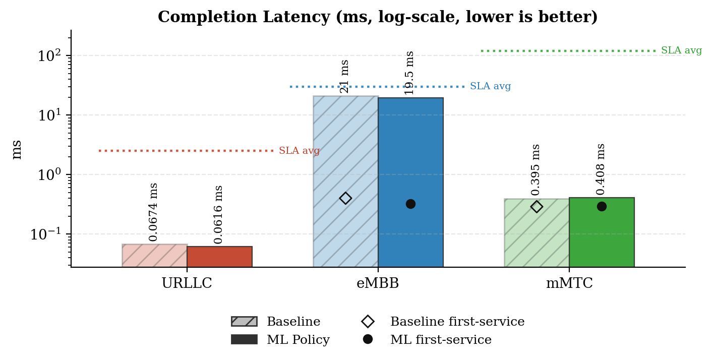
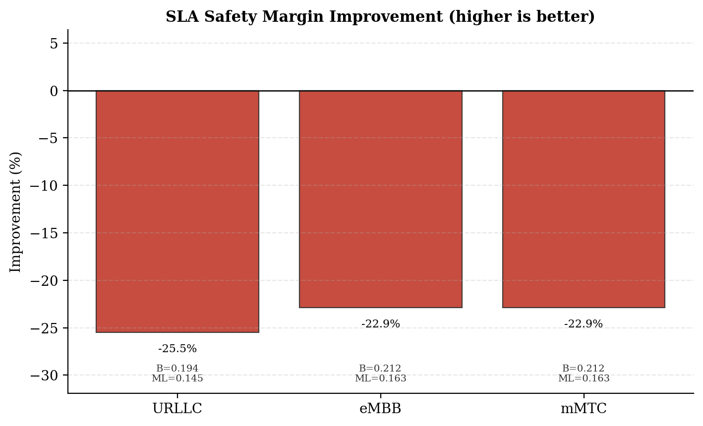
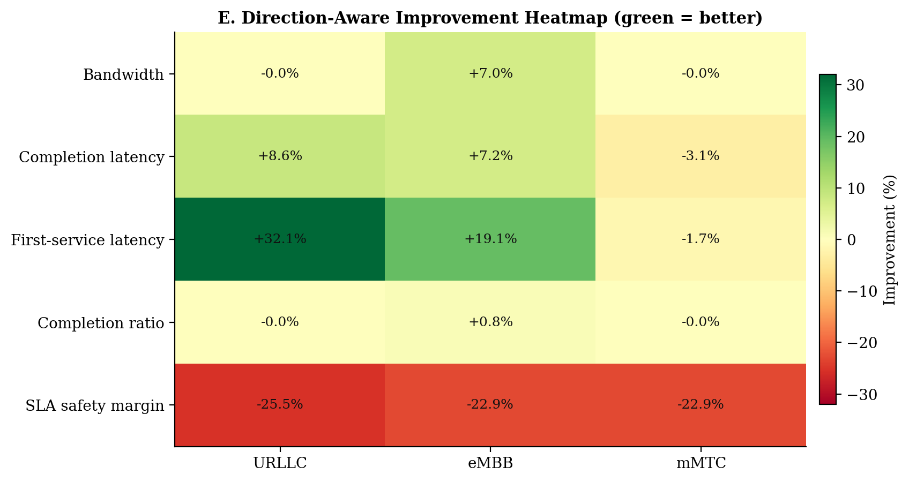
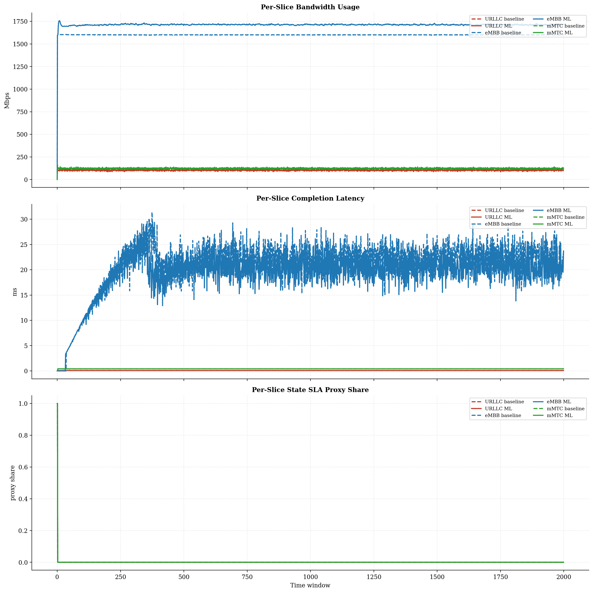
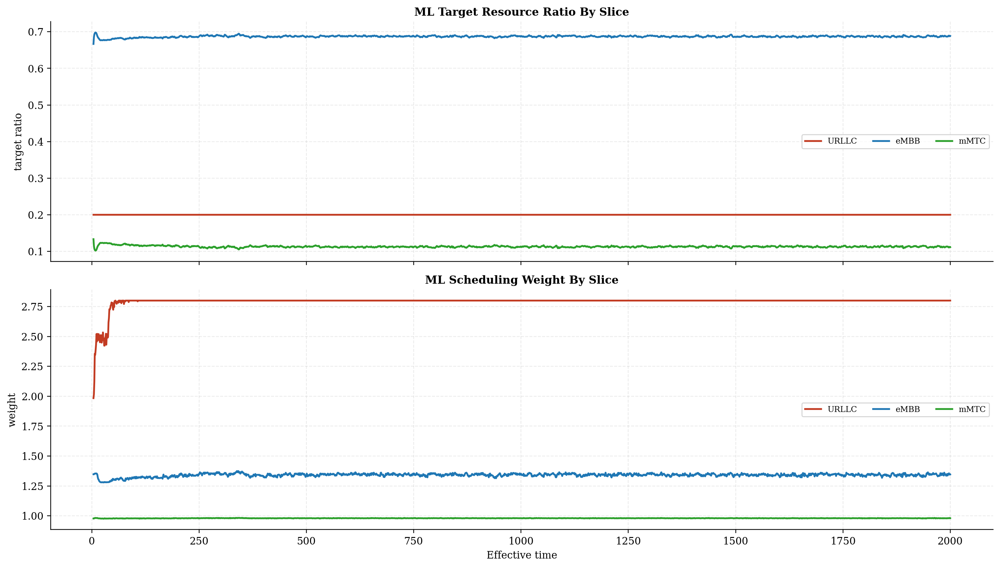
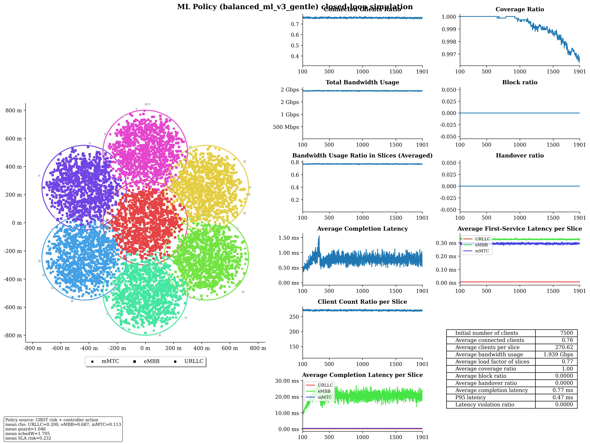

# Baseline vs ML Policy Report

## Run Summary

- Timestamp: `2026-05-08T22:38:34`
- Config: `C:\Users\LENOVO\Downloads\5G-Network-Slicing-main\5G-Network-Slicing-with-GBDT-ML-Policy\slicesim\scenario-heavy.yml`
- Model: `C:\Users\LENOVO\Downloads\5G-Network-Slicing-main\5G-Network-Slicing-with-GBDT-ML-Policy\models\sla_risk_gbdt`
- Controller type: `gbdt`
- Controller preset: `balanced_ml_v3_gentle`
- Broker enabled: `True`
- Broker preset: `forecasting_balanced`
- Seed: `999`

## Global KPI Comparison

| metric | baseline | ml_policy | delta_ml_minus_baseline | delta_pct |
|---|---|---|---|---|
| connected_clients_ratio | 0.7578 | 0.7572 | -0.0006 | -0.0767 |
| coverage_ratio | 0.9994 | 0.9992 | -0.0003 | -0.0277 |
| block_ratio | 0.0000 | 0.0000 | 0.0000 | 0.0000 |
| handover_ratio | 0.0000 | 0.0000 | 0.0000 | 0.0000 |
| avg_slice_load_ratio | 0.7244 | 0.7690 | 0.0446 | 6.1550 |
| total_bandwidth_usage | 1825515630.6676 | 1937876254.4483 | 112360623.7807 | 6.1550 |
| avg_latency_ms | 0.7387 | 0.7443 | 0.0056 | 0.7564 |
| p95_latency_ms | 0.4556 | 0.4654 | 0.0098 | 2.1446 |
| latency_violation_ratio | 0.0000 | 0.0000 | 0.0000 | 0.0000 |
| avg_state_sla_violation_share | 0.0010 | 0.0010 | 0.0000 | 0.0000 |
| bandwidth_jain_fairness | 0.4297 | 0.4233 | -0.0064 | -1.4953 |
| bandwidth_jain_fairness_min | 0.3333 | 0.3333 | 0.0000 | 0.0000 |

## Per-Slice Summary

| slice_name | avg_bandwidth_usage_mbps_baseline | avg_bandwidth_usage_mbps_ml | avg_bandwidth_usage_mbps_delta | avg_served_bandwidth_baseline | avg_served_bandwidth_ml | avg_served_bandwidth_delta | avg_completion_latency_ms_baseline | avg_completion_latency_ms_ml | avg_completion_latency_ms_delta | avg_first_service_latency_ms_baseline | avg_first_service_latency_ms_ml | avg_first_service_latency_ms_delta | avg_recorded_first_service_latency_ms_baseline | avg_recorded_first_service_latency_ms_ml | avg_recorded_first_service_latency_ms_delta | avg_bandwidth_share_baseline | avg_bandwidth_share_ml | avg_bandwidth_share_delta | zero_bandwidth_window_share_baseline | zero_bandwidth_window_share_ml | zero_bandwidth_window_share_delta | completion_ratio_baseline | completion_ratio_ml | completion_ratio_delta | completion_latency_violation_ratio_baseline | completion_latency_violation_ratio_ml | completion_latency_violation_ratio_delta | first_service_latency_violation_ratio_baseline | first_service_latency_violation_ratio_ml | first_service_latency_violation_ratio_delta | request_latency_violation_event_ratio_baseline | request_latency_violation_event_ratio_ml | request_latency_violation_event_ratio_delta | avg_state_sla_violation_share_baseline | avg_state_sla_violation_share_ml | avg_state_sla_violation_share_delta | avg_sla_safety_margin_baseline | avg_sla_safety_margin_ml | avg_sla_safety_margin_delta | avg_sla_safety_margin_improvement_pct |
|---|---|---|---|---|---|---|---|---|---|---|---|---|---|---|---|---|---|---|---|---|---|---|---|---|---|---|---|---|---|---|---|---|---|---|---|---|---|---|---|---|
| URLLC | 103.1505 | 103.1233 | -0.0272 | 339905.1307 | 339826.1853 | -78.9454 | 0.0674 | 0.0616 | -0.0058 | 0.0086 | 0.0058 | -0.0028 | 0.0086 | 0.0058 | -0.0028 | 0.0569 | 0.0537 | -0.0033 | 0.0000 | 0.0000 | 0.0000 | 0.9995 | 0.9995 | -0.0000 | 0.0000 | 0.0000 | 0.0000 | 0.0000 | 0.0000 | 0.0000 | 0.0000 | 0.0000 | 0.0000 | 0.0010 | 0.0010 | 0.0000 | 0.1942 | 0.1447 | -0.0495 | -25.5096 |
| eMBB | 1599.7068 | 1712.1058 | 112.3990 | 374823.6090 | 404861.0091 | 30037.4002 | 20.9708 | 19.4662 | -1.5047 | 0.3996 | 0.3233 | -0.0762 | 0.4028 | 0.3258 | -0.0770 | 0.8759 | 0.8831 | 0.0072 | 0.0005 | 0.0005 | 0.0000 | 0.8968 | 0.9038 | 0.0070 | 0.0000 | 0.0000 | 0.0000 | 0.0000 | 0.0000 | 0.0000 | 0.0000 | 0.0000 | 0.0000 | 0.0010 | 0.0010 | 0.0000 | 0.2117 | 0.1632 | -0.0485 | -22.8944 |
| mMTC | 122.6583 | 122.6472 | -0.0111 | 224937.2113 | 224874.2287 | -62.9826 | 0.3954 | 0.4076 | 0.0122 | 0.2882 | 0.2931 | 0.0048 | 0.2884 | 0.2932 | 0.0048 | 0.0672 | 0.0633 | -0.0039 | 0.0005 | 0.0005 | 0.0000 | 0.9990 | 0.9990 | -0.0000 | 0.0000 | 0.0000 | 0.0000 | 0.0000 | 0.0000 | 0.0000 | 0.0000 | 0.0000 | 0.0000 | 0.0010 | 0.0010 | 0.0000 | 0.2117 | 0.1632 | -0.0485 | -22.8944 |

## Per-Base-Station Summary

| base_station_id | avg_bandwidth_usage_mbps_baseline | avg_bandwidth_usage_mbps_ml | avg_bandwidth_usage_mbps_delta | avg_bandwidth_usage_mbps_delta_pct | avg_capacity_mbps_baseline | avg_capacity_mbps_ml | avg_capacity_mbps_delta | avg_capacity_mbps_delta_pct | avg_load_ratio_baseline | avg_load_ratio_ml | avg_load_ratio_delta | avg_load_ratio_delta_pct | avg_remaining_capacity_ratio_baseline | avg_remaining_capacity_ratio_ml | avg_remaining_capacity_ratio_delta | avg_remaining_capacity_ratio_delta_pct | avg_request_count_per_window_baseline | avg_request_count_per_window_ml | avg_request_count_per_window_delta | avg_request_count_per_window_delta_pct | total_request_count_baseline | total_request_count_ml | total_request_count_delta | total_request_count_delta_pct | avg_requested_usage_mbps_per_window_baseline | avg_requested_usage_mbps_per_window_ml | avg_requested_usage_mbps_per_window_delta | avg_requested_usage_mbps_per_window_delta_pct | avg_clients_seen_per_window_baseline | avg_clients_seen_per_window_ml | avg_clients_seen_per_window_delta | avg_clients_seen_per_window_delta_pct | avg_connected_events_per_window_baseline | avg_connected_events_per_window_ml | avg_connected_events_per_window_delta | avg_connected_events_per_window_delta_pct | avg_disconnected_events_per_window_baseline | avg_disconnected_events_per_window_ml | avg_disconnected_events_per_window_delta | avg_disconnected_events_per_window_delta_pct | avg_state_sla_violation_share_baseline | avg_state_sla_violation_share_ml | avg_state_sla_violation_share_delta | avg_state_sla_violation_share_delta_pct | avg_sla_safety_margin_baseline | avg_sla_safety_margin_ml | avg_sla_safety_margin_delta | avg_sla_safety_margin_delta_pct | avg_sla_breach_count_per_window_baseline | avg_sla_breach_count_per_window_ml | avg_sla_breach_count_per_window_delta | avg_sla_breach_count_per_window_delta_pct |
|---|---|---|---|---|---|---|---|---|---|---|---|---|---|---|---|---|---|---|---|---|---|---|---|---|---|---|---|---|---|---|---|---|---|---|---|---|---|---|---|---|---|---|---|---|---|---|---|---|---|---|---|---|
| BS_0 | 292.6089 | 319.4750 | 26.8662 | 9.1816 | 420.0000 | 420.0000 | 0.0000 | 0.0000 | 0.6967 | 0.7607 | 0.0640 | 9.1816 | 0.3033 | 0.2393 | -0.0640 | -21.0895 | 128.0615 | 127.6200 | -0.4415 | -0.3448 | 256123.0000 | 255240.0000 | -883.0000 | -0.3448 | 308.0795 | 336.5337 | 28.4543 | 9.2360 | 1073.1185 | 1069.4510 | -3.6675 | -0.3418 | 128.0675 | 127.6255 | -0.4420 | -0.3451 | 127.6545 | 127.2335 | -0.4210 | -0.3298 | 0.0010 | 0.0010 | 0.0000 | 0.0000 | 0.2059 | 0.1570 | -0.0488 | -23.7168 | 0.0030 | 0.0030 | 0.0000 | 0.0000 |
| BS_1 | 256.8058 | 270.8507 | 14.0449 | 5.4691 | 350.0000 | 350.0000 | 0.0000 | 0.0000 | 0.7337 | 0.7739 | 0.0401 | 5.4691 | 0.2663 | 0.2261 | -0.0401 | -15.0706 | 128.3865 | 128.8700 | 0.4835 | 0.3766 | 256773.0000 | 257740.0000 | 967.0000 | 0.3766 | 272.1398 | 287.8658 | 15.7260 | 5.7786 | 1072.8770 | 1071.0550 | -1.8220 | -0.1698 | 128.4025 | 128.8980 | 0.4955 | 0.3859 | 128.0040 | 128.4945 | 0.4905 | 0.3832 | 0.0010 | 0.0010 | 0.0000 | 0.0000 | 0.2059 | 0.1570 | -0.0488 | -23.7168 | 0.0030 | 0.0030 | 0.0000 | 0.0000 |
| BS_2 | 256.3245 | 270.1734 | 13.8489 | 5.4029 | 350.0000 | 350.0000 | 0.0000 | 0.0000 | 0.7324 | 0.7719 | 0.0396 | 5.4029 | 0.2676 | 0.2281 | -0.0396 | -14.7839 | 126.9905 | 127.1300 | 0.1395 | 0.1099 | 253981.0000 | 254260.0000 | 279.0000 | 0.1099 | 271.2294 | 287.1063 | 15.8769 | 5.8537 | 1071.6845 | 1070.1700 | -1.5145 | -0.1413 | 127.0005 | 127.1640 | 0.1635 | 0.1287 | 126.5980 | 126.7685 | 0.1705 | 0.1347 | 0.0010 | 0.0010 | 0.0000 | 0.0000 | 0.2059 | 0.1570 | -0.0488 | -23.7168 | 0.0030 | 0.0030 | 0.0000 | 0.0000 |
| BS_3 | 255.7807 | 269.6410 | 13.8603 | 5.4188 | 350.0000 | 350.0000 | 0.0000 | 0.0000 | 0.7308 | 0.7704 | 0.0396 | 5.4188 | 0.2692 | 0.2296 | -0.0396 | -14.7107 | 126.1260 | 126.6320 | 0.5060 | 0.4012 | 252252.0000 | 253264.0000 | 1012.0000 | 0.4012 | 271.5722 | 287.3113 | 15.7391 | 5.7955 | 1069.5840 | 1070.0175 | 0.4335 | 0.0405 | 126.1320 | 126.6465 | 0.5145 | 0.4079 | 125.7355 | 126.2475 | 0.5120 | 0.4072 | 0.0010 | 0.0010 | 0.0000 | 0.0000 | 0.2059 | 0.1570 | -0.0488 | -23.7168 | 0.0030 | 0.0030 | 0.0000 | 0.0000 |
| BS_4 | 255.3990 | 269.8247 | 14.4256 | 5.6483 | 350.0000 | 350.0000 | 0.0000 | 0.0000 | 0.7297 | 0.7709 | 0.0412 | 5.6483 | 0.2703 | 0.2291 | -0.0412 | -15.2489 | 122.8405 | 123.3860 | 0.5455 | 0.4441 | 245681.0000 | 246772.0000 | 1091.0000 | 0.4441 | 271.4316 | 288.0354 | 16.6038 | 6.1171 | 1070.7405 | 1072.3215 | 1.5810 | 0.1477 | 122.8675 | 123.4120 | 0.5445 | 0.4432 | 122.4635 | 123.0075 | 0.5440 | 0.4442 | 0.0010 | 0.0010 | 0.0000 | 0.0000 | 0.2059 | 0.1570 | -0.0488 | -23.7168 | 0.0030 | 0.0030 | 0.0000 | 0.0000 |
| BS_5 | 254.5795 | 269.6540 | 15.0745 | 5.9213 | 350.0000 | 350.0000 | 0.0000 | 0.0000 | 0.7274 | 0.7704 | 0.0431 | 5.9213 | 0.2726 | 0.2296 | -0.0431 | -15.7979 | 119.2890 | 119.3180 | 0.0290 | 0.0243 | 238578.0000 | 238636.0000 | 58.0000 | 0.0243 | 270.8292 | 288.1480 | 17.3188 | 6.3947 | 1068.0880 | 1071.0865 | 2.9985 | 0.2807 | 119.3270 | 119.3295 | 0.0025 | 0.0021 | 118.9215 | 118.9055 | -0.0160 | -0.0135 | 0.0010 | 0.0010 | 0.0000 | 0.0000 | 0.2059 | 0.1570 | -0.0488 | -23.7168 | 0.0030 | 0.0030 | 0.0000 | 0.0000 |
| BS_6 | 254.0172 | 268.2575 | 14.2403 | 5.6060 | 350.0000 | 350.0000 | 0.0000 | 0.0000 | 0.7258 | 0.7665 | 0.0407 | 5.6060 | 0.2742 | 0.2335 | -0.0407 | -14.8363 | 118.1255 | 118.3195 | 0.1940 | 0.1642 | 236251.0000 | 236639.0000 | 388.0000 | 0.1642 | 270.6224 | 287.3047 | 16.6822 | 6.1644 | 1069.6925 | 1069.6040 | -0.0885 | -0.0083 | 118.1435 | 118.3345 | 0.1910 | 0.1617 | 117.7370 | 117.9105 | 0.1735 | 0.1474 | 0.0010 | 0.0010 | 0.0000 | 0.0000 | 0.2059 | 0.1570 | -0.0488 | -23.7168 | 0.0030 | 0.0030 | 0.0000 | 0.0000 |

## Per-Base-Station Slice SLA Summary

| base_station_id | slice_name | avg_bandwidth_usage_mbps_baseline | avg_bandwidth_usage_mbps_ml | avg_bandwidth_usage_mbps_delta | avg_bandwidth_usage_mbps_delta_pct | avg_slice_capacity_mbps_baseline | avg_slice_capacity_mbps_ml | avg_slice_capacity_mbps_delta | avg_slice_capacity_mbps_delta_pct | avg_slice_load_ratio_baseline | avg_slice_load_ratio_ml | avg_slice_load_ratio_delta | avg_slice_load_ratio_delta_pct | avg_remaining_capacity_ratio_baseline | avg_remaining_capacity_ratio_ml | avg_remaining_capacity_ratio_delta | avg_remaining_capacity_ratio_delta_pct | avg_request_count_per_window_baseline | avg_request_count_per_window_ml | avg_request_count_per_window_delta | avg_request_count_per_window_delta_pct | total_request_count_baseline | total_request_count_ml | total_request_count_delta | total_request_count_delta_pct | avg_requested_usage_mbps_per_window_baseline | avg_requested_usage_mbps_per_window_ml | avg_requested_usage_mbps_per_window_delta | avg_requested_usage_mbps_per_window_delta_pct | avg_clients_seen_per_window_baseline | avg_clients_seen_per_window_ml | avg_clients_seen_per_window_delta | avg_clients_seen_per_window_delta_pct | avg_state_sla_violation_share_baseline | avg_state_sla_violation_share_ml | avg_state_sla_violation_share_delta | avg_state_sla_violation_share_delta_pct | avg_sla_safety_margin_baseline | avg_sla_safety_margin_ml | avg_sla_safety_margin_delta | avg_sla_safety_margin_delta_pct | avg_sla_breach_count_per_window_baseline | avg_sla_breach_count_per_window_ml | avg_sla_breach_count_per_window_delta | avg_sla_breach_count_per_window_delta_pct |
|---|---|---|---|---|---|---|---|---|---|---|---|---|---|---|---|---|---|---|---|---|---|---|---|---|---|---|---|---|---|---|---|---|---|---|---|---|---|---|---|---|---|---|---|---|---|
| BS_0 | URLLC | 14.8953 | 14.8356 | -0.0597 | -0.4011 | 84.0000 | 84.0000 | 0.0000 | 0.0000 | 0.1773 | 0.1766 | -0.0007 | -0.4011 | 0.8227 | 0.8234 | 0.0007 | 0.0865 | 43.9200 | 43.7090 | -0.2110 | -0.4804 | 87840.0000 | 87418.0000 | -422.0000 | -0.4804 | 14.8953 | 14.8356 | -0.0597 | -0.4011 | 134.0565 | 133.6845 | -0.3720 | -0.2775 | 0.0010 | 0.0010 | 0.0000 | 0.0000 | 0.1942 | 0.1447 | -0.0495 | -25.5096 | 0.0010 | 0.0010 | 0.0000 | 0.0000 |
| BS_0 | eMBB | 259.5519 | 286.5712 | 27.0193 | 10.4100 | 260.4000 | 289.3738 | 28.9738 | 11.1267 | 0.9967 | 0.9903 | -0.0065 | -0.6497 | 0.0033 | 0.0097 | 0.0065 | 198.8281 | 3.3085 | 3.6850 | 0.3765 | 11.3798 | 6617.0000 | 7370.0000 | 753.0000 | 11.3798 | 275.0111 | 303.6222 | 28.6111 | 10.4036 | 609.0960 | 608.5105 | -0.5855 | -0.0961 | 0.0010 | 0.0010 | 0.0000 | 0.0000 | 0.2117 | 0.1632 | -0.0485 | -22.8944 | 0.0010 | 0.0010 | 0.0000 | 0.0000 |
| BS_0 | mMTC | 18.1617 | 18.0683 | -0.0934 | -0.5142 | 75.6000 | 46.6262 | -28.9738 | -38.3252 | 0.2402 | 0.3881 | 0.1479 | 61.5608 | 0.7598 | 0.6119 | -0.1479 | -19.4652 | 80.8330 | 80.2260 | -0.6070 | -0.7509 | 161666.0000 | 160452.0000 | -1214.0000 | -0.7509 | 18.1731 | 18.0760 | -0.0971 | -0.5342 | 329.9660 | 327.2560 | -2.7100 | -0.8213 | 0.0010 | 0.0010 | 0.0000 | 0.0000 | 0.2117 | 0.1632 | -0.0485 | -22.8944 | 0.0010 | 0.0010 | 0.0000 | 0.0000 |
| BS_1 | URLLC | 15.5137 | 15.5876 | 0.0740 | 0.4768 | 63.0000 | 69.9860 | 6.9860 | 11.0889 | 0.2462 | 0.2227 | -0.0235 | -9.5488 | 0.7538 | 0.7773 | 0.0235 | 3.1196 | 45.6150 | 45.8515 | 0.2365 | 0.5185 | 91230.0000 | 91703.0000 | 473.0000 | 0.5185 | 15.5137 | 15.5876 | 0.0740 | 0.4768 | 140.1315 | 140.3230 | 0.1915 | 0.1367 | 0.0010 | 0.0010 | 0.0000 | 0.0000 | 0.1942 | 0.1447 | -0.0495 | -25.5096 | 0.0010 | 0.0010 | 0.0000 | 0.0000 |
| BS_1 | eMBB | 223.3478 | 237.3093 | 13.9616 | 6.2510 | 224.0000 | 240.0258 | 16.0258 | 7.1544 | 0.9971 | 0.9887 | -0.0084 | -0.8461 | 0.0029 | 0.0113 | 0.0084 | 289.7459 | 2.8775 | 3.0735 | 0.1960 | 6.8115 | 5755.0000 | 6147.0000 | 392.0000 | 6.8115 | 238.6726 | 254.3153 | 15.6428 | 6.5541 | 605.3335 | 603.5255 | -1.8080 | -0.2987 | 0.0010 | 0.0010 | 0.0000 | 0.0000 | 0.2117 | 0.1632 | -0.0485 | -22.8944 | 0.0010 | 0.0010 | 0.0000 | 0.0000 |
| BS_1 | mMTC | 17.9443 | 17.9537 | 0.0094 | 0.0524 | 63.0000 | 39.9882 | -23.0118 | -36.5267 | 0.2848 | 0.4499 | 0.1651 | 57.9617 | 0.7152 | 0.5501 | -0.1651 | -23.0844 | 79.8940 | 79.9450 | 0.0510 | 0.0638 | 159788.0000 | 159890.0000 | 102.0000 | 0.0638 | 17.9535 | 17.9628 | 0.0093 | 0.0516 | 327.4120 | 327.2065 | -0.2055 | -0.0628 | 0.0010 | 0.0010 | 0.0000 | 0.0000 | 0.2117 | 0.1632 | -0.0485 | -22.8944 | 0.0010 | 0.0010 | 0.0000 | 0.0000 |
| BS_2 | URLLC | 15.0497 | 15.1163 | 0.0666 | 0.4425 | 63.0000 | 69.9860 | 6.9860 | 11.0889 | 0.2389 | 0.2160 | -0.0229 | -9.5825 | 0.7611 | 0.7840 | 0.0229 | 3.0076 | 44.3100 | 44.4455 | 0.1355 | 0.3058 | 88620.0000 | 88891.0000 | 271.0000 | 0.3058 | 15.0497 | 15.1163 | 0.0666 | 0.4425 | 135.9270 | 135.8715 | -0.0555 | -0.0408 | 0.0010 | 0.0010 | 0.0000 | 0.0000 | 0.1942 | 0.1447 | -0.0495 | -25.5096 | 0.0010 | 0.0010 | 0.0000 | 0.0000 |
| BS_2 | eMBB | 223.3429 | 237.1858 | 13.8429 | 6.1980 | 224.0000 | 240.0474 | 16.0474 | 7.1640 | 0.9971 | 0.9880 | -0.0090 | -0.9046 | 0.0029 | 0.0120 | 0.0090 | 307.4719 | 2.9055 | 3.1025 | 0.1970 | 6.7802 | 5811.0000 | 6205.0000 | 394.0000 | 6.7802 | 238.2394 | 254.1110 | 15.8716 | 6.6620 | 607.4275 | 605.9390 | -1.4885 | -0.2450 | 0.0010 | 0.0010 | 0.0000 | 0.0000 | 0.2117 | 0.1632 | -0.0485 | -22.8944 | 0.0010 | 0.0010 | 0.0000 | 0.0000 |
| BS_2 | mMTC | 17.9318 | 17.8713 | -0.0606 | -0.3379 | 63.0000 | 39.9666 | -23.0334 | -36.5610 | 0.2846 | 0.4479 | 0.1633 | 57.3552 | 0.7154 | 0.5521 | -0.1633 | -22.8206 | 79.7750 | 79.5820 | -0.1930 | -0.2419 | 159550.0000 | 159164.0000 | -386.0000 | -0.2419 | 17.9403 | 17.8790 | -0.0613 | -0.3418 | 328.3300 | 328.3595 | 0.0295 | 0.0090 | 0.0010 | 0.0010 | 0.0000 | 0.0000 | 0.2117 | 0.1632 | -0.0485 | -22.8944 | 0.0010 | 0.0010 | 0.0000 | 0.0000 |
| BS_3 | URLLC | 13.9181 | 13.8334 | -0.0848 | -0.6091 | 63.0000 | 69.9860 | 6.9860 | 11.0889 | 0.2209 | 0.1977 | -0.0233 | -10.5286 | 0.7791 | 0.8023 | 0.0233 | 2.9856 | 41.0295 | 40.7500 | -0.2795 | -0.6812 | 82059.0000 | 81500.0000 | -559.0000 | -0.6812 | 13.9181 | 13.8334 | -0.0848 | -0.6091 | 128.0000 | 127.6030 | -0.3970 | -0.3102 | 0.0010 | 0.0010 | 0.0000 | 0.0000 | 0.1942 | 0.1447 | -0.0495 | -25.5096 | 0.0010 | 0.0010 | 0.0000 | 0.0000 |
| BS_3 | eMBB | 223.3347 | 237.1877 | 13.8531 | 6.2028 | 224.0000 | 239.6927 | 15.6927 | 7.0057 | 0.9970 | 0.9895 | -0.0075 | -0.7534 | 0.0030 | 0.0105 | 0.0075 | 252.8799 | 2.9130 | 3.1145 | 0.2015 | 6.9173 | 5826.0000 | 6229.0000 | 403.0000 | 6.9173 | 239.1172 | 254.8491 | 15.7319 | 6.5792 | 605.5660 | 604.7125 | -0.8535 | -0.1409 | 0.0010 | 0.0010 | 0.0000 | 0.0000 | 0.2117 | 0.1632 | -0.0485 | -22.8944 | 0.0010 | 0.0010 | 0.0000 | 0.0000 |
| BS_3 | mMTC | 18.5279 | 18.6199 | 0.0920 | 0.4964 | 63.0000 | 40.3213 | -22.6787 | -35.9980 | 0.2941 | 0.4626 | 0.1686 | 57.3126 | 0.7059 | 0.5374 | -0.1686 | -23.8775 | 82.1835 | 82.7675 | 0.5840 | 0.7106 | 164367.0000 | 165535.0000 | 1168.0000 | 0.7106 | 18.5369 | 18.6288 | 0.0919 | 0.4959 | 336.0180 | 337.7020 | 1.6840 | 0.5012 | 0.0010 | 0.0010 | 0.0000 | 0.0000 | 0.2117 | 0.1632 | -0.0485 | -22.8944 | 0.0010 | 0.0010 | 0.0000 | 0.0000 |
| BS_4 | URLLC | 15.0201 | 15.0307 | 0.0105 | 0.0700 | 63.0000 | 69.9860 | 6.9860 | 11.0889 | 0.2384 | 0.2148 | -0.0236 | -9.9188 | 0.7616 | 0.7852 | 0.0236 | 3.1051 | 44.1735 | 44.1780 | 0.0045 | 0.0102 | 88347.0000 | 88356.0000 | 9.0000 | 0.0102 | 15.0201 | 15.0307 | 0.0105 | 0.0700 | 136.8485 | 136.7835 | -0.0650 | -0.0475 | 0.0010 | 0.0010 | 0.0000 | 0.0000 | 0.1942 | 0.1447 | -0.0495 | -25.5096 | 0.0010 | 0.0010 | 0.0000 | 0.0000 |
| BS_4 | eMBB | 223.3615 | 237.6686 | 14.3071 | 6.4054 | 224.0000 | 240.3204 | 16.3204 | 7.2859 | 0.9971 | 0.9889 | -0.0082 | -0.8240 | 0.0029 | 0.0111 | 0.0082 | 288.2386 | 2.8985 | 3.1075 | 0.2090 | 7.2106 | 5797.0000 | 6215.0000 | 418.0000 | 7.2106 | 239.3852 | 255.8701 | 16.4849 | 6.8864 | 623.6900 | 624.5590 | 0.8690 | 0.1393 | 0.0010 | 0.0010 | 0.0000 | 0.0000 | 0.2117 | 0.1632 | -0.0485 | -22.8944 | 0.0010 | 0.0010 | 0.0000 | 0.0000 |
| BS_4 | mMTC | 17.0174 | 17.1254 | 0.1080 | 0.6347 | 63.0000 | 39.6936 | -23.3064 | -36.9942 | 0.2701 | 0.4322 | 0.1621 | 60.0070 | 0.7299 | 0.5678 | -0.1621 | -22.2076 | 75.7685 | 76.1005 | 0.3320 | 0.4382 | 151537.0000 | 152201.0000 | 664.0000 | 0.4382 | 17.0263 | 17.1347 | 0.1084 | 0.6366 | 310.2020 | 310.9790 | 0.7770 | 0.2505 | 0.0010 | 0.0010 | 0.0000 | 0.0000 | 0.2117 | 0.1632 | -0.0485 | -22.8944 | 0.0010 | 0.0010 | 0.0000 | 0.0000 |
| BS_5 | URLLC | 14.9163 | 14.9411 | 0.0248 | 0.1661 | 63.0000 | 69.9860 | 6.9860 | 11.0889 | 0.2368 | 0.2135 | -0.0233 | -9.8302 | 0.7632 | 0.7865 | 0.0233 | 3.0495 | 43.8265 | 43.9485 | 0.1220 | 0.2784 | 87653.0000 | 87897.0000 | 244.0000 | 0.2784 | 14.9163 | 14.9411 | 0.0248 | 0.1661 | 132.9475 | 133.4945 | 0.5470 | 0.4114 | 0.0010 | 0.0010 | 0.0000 | 0.0000 | 0.1942 | 0.1447 | -0.0495 | -25.5096 | 0.0010 | 0.0010 | 0.0000 | 0.0000 |
| BS_5 | eMBB | 223.3772 | 238.4818 | 15.1046 | 6.7619 | 224.0000 | 240.9734 | 16.9734 | 7.5774 | 0.9972 | 0.9896 | -0.0076 | -0.7614 | 0.0028 | 0.0104 | 0.0076 | 273.0884 | 2.9225 | 3.1185 | 0.1960 | 6.7066 | 5845.0000 | 6237.0000 | 392.0000 | 6.7066 | 239.6202 | 256.9673 | 17.3471 | 7.2394 | 639.9330 | 642.5145 | 2.5815 | 0.4034 | 0.0010 | 0.0010 | 0.0000 | 0.0000 | 0.2117 | 0.1632 | -0.0485 | -22.8944 | 0.0010 | 0.0010 | 0.0000 | 0.0000 |
| BS_5 | mMTC | 16.2861 | 16.2311 | -0.0549 | -0.3372 | 63.0000 | 39.0406 | -23.9594 | -38.0307 | 0.2585 | 0.4164 | 0.1579 | 61.0818 | 0.7415 | 0.5836 | -0.1579 | -21.2952 | 72.5400 | 72.2510 | -0.2890 | -0.3984 | 145080.0000 | 144502.0000 | -578.0000 | -0.3984 | 16.2927 | 16.2396 | -0.0531 | -0.3258 | 295.2075 | 295.0775 | -0.1300 | -0.0440 | 0.0010 | 0.0010 | 0.0000 | 0.0000 | 0.2117 | 0.1632 | -0.0485 | -22.8944 | 0.0010 | 0.0010 | 0.0000 | 0.0000 |
| BS_6 | URLLC | 13.8373 | 13.7787 | -0.0586 | -0.4234 | 63.0000 | 69.9860 | 6.9860 | 11.0889 | 0.2196 | 0.1969 | -0.0228 | -10.3594 | 0.7804 | 0.8031 | 0.0228 | 2.9157 | 40.6030 | 40.5780 | -0.0250 | -0.0616 | 81206.0000 | 81156.0000 | -50.0000 | -0.0616 | 13.8373 | 13.7787 | -0.0586 | -0.4234 | 124.4440 | 124.4700 | 0.0260 | 0.0209 | 0.0010 | 0.0010 | 0.0000 | 0.0000 | 0.1942 | 0.1447 | -0.0495 | -25.5096 | 0.0010 | 0.0010 | 0.0000 | 0.0000 |
| BS_6 | eMBB | 223.3909 | 237.7013 | 14.3104 | 6.4060 | 224.0000 | 240.4981 | 16.4981 | 7.3652 | 0.9973 | 0.9883 | -0.0089 | -0.8966 | 0.0027 | 0.0117 | 0.0089 | 328.8102 | 2.9370 | 3.1135 | 0.1765 | 6.0095 | 5874.0000 | 6227.0000 | 353.0000 | 6.0095 | 239.9888 | 256.7401 | 16.7514 | 6.9801 | 642.4310 | 642.3985 | -0.0325 | -0.0051 | 0.0010 | 0.0010 | 0.0000 | 0.0000 | 0.2117 | 0.1632 | -0.0485 | -22.8944 | 0.0010 | 0.0010 | 0.0000 | 0.0000 |
| BS_6 | mMTC | 16.7891 | 16.7775 | -0.0116 | -0.0690 | 63.0000 | 39.5159 | -23.4841 | -37.2764 | 0.2665 | 0.4253 | 0.1588 | 59.5872 | 0.7335 | 0.5747 | -0.1588 | -21.6489 | 74.5855 | 74.6280 | 0.0425 | 0.0570 | 149171.0000 | 149256.0000 | 85.0000 | 0.0570 | 16.7964 | 16.7859 | -0.0105 | -0.0628 | 302.8175 | 302.7355 | -0.0820 | -0.0271 | 0.0010 | 0.0010 | 0.0000 | 0.0000 | 0.2117 | 0.1632 | -0.0485 | -22.8944 | 0.0010 | 0.0010 | 0.0000 | 0.0000 |

## Resource Allocation Summary

| slice_name | baseline_state_ratio | ml_state_ratio | ml_action_target_ratio_mean | ml_action_target_ratio_min | ml_action_target_ratio_max | ml_scheduling_weight_mean | ml_admission_guard_factor_mean | target_ratio_delta_vs_baseline_state |
|---|---|---|---|---|---|---|---|---|
| URLLC | 0.1829 | 0.2000 | 0.2000 | 0.2000 | 0.2000 | 2.7930 | 1.0852 | 0.0171 |
| eMBB | 0.6371 | 0.6868 | 0.6869 | 0.6628 | 0.6998 | 1.3409 | 1.0435 | 0.0498 |
| mMTC | 0.1800 | 0.1132 | 0.1131 | 0.1002 | 0.1372 | 0.9799 | 1.0089 | -0.0669 |

## Visual Comparison

### Global KPI View

### Per-Slice View

### Per-Slice Panel Images

#### Throughput per Slice

#### Latency per Slice

#### Completion Ratio

#### SLA Safety Margin Improvement

#### Improvement Heatmap

### Per-Slice Time-Series View

### ML Action Distribution

### ML Policy Simulation Snapshot

## Metric Notes

- `avg_state_sla_violation_share` is the per-slice state-level SLA violation ratio averaged from simulator state frames.
- `avg_sla_safety_margin` is the average distance to the active SLA boundary. Higher is better; negative means violation.
- `avg_sla_safety_margin_improvement_pct` is `(ML margin - baseline margin) / abs(baseline margin) * 100`.
- `request_latency_violation_event_ratio`, `completion_latency_violation_ratio`, and `first_service_latency_violation_ratio` are client-level latency-only metrics.
- A latency value of `0` can mean no recorded latency event for that slice/window. Check `completion_ratio` and request/completion counts before interpreting it as perfect latency.
- `bandwidth_jain_fairness` is Jain's fairness index over per-slice bandwidth usage per time window. Higher is more balanced, with `1.0` meaning equal usage across slices.

## Trade-off Notes

- URLLC completion latency changed by -0.01 ms and SLA safety margin changed by -0.0495 (-25.5%).
- eMBB average bandwidth usage changed by 112.399 Mbps and completion ratio changed by 0.0070.
- mMTC first-service latency changed by 0.00 ms and completion ratio changed by -0.0000.
- URLLC recorded first-service latency changed by -0.00 ms on windows with actual first-service events.
- Classic trade-off snapshot: if URLLC improved by 0.01 ms in latency, eMBB bandwidth moved by 112.399 Mbps.

## Artifacts

- Baseline raw states: `C:\Users\LENOVO\Downloads\5G-Network-Slicing-main\5G-Network-Slicing-with-GBDT-ML-Policy\FINAL_OUTPUT_heavy_seed999_20260508_211407\baseline_run\baseline_states.csv`
- ML raw states: `C:\Users\LENOVO\Downloads\5G-Network-Slicing-main\5G-Network-Slicing-with-GBDT-ML-Policy\FINAL_OUTPUT_heavy_seed999_20260508_211407\ml_run\online_states_raw.csv`
- ML broker forecasts: `C:\Users\LENOVO\Downloads\5G-Network-Slicing-main\5G-Network-Slicing-with-GBDT-ML-Policy\FINAL_OUTPUT_heavy_seed999_20260508_211407\ml_run\online_broker_forecasts.csv`
- ML broker feedback: `C:\Users\LENOVO\Downloads\5G-Network-Slicing-main\5G-Network-Slicing-with-GBDT-ML-Policy\FINAL_OUTPUT_heavy_seed999_20260508_211407\ml_run\online_broker_feedback.csv`
- Comparison CSV (global): `C:\Users\LENOVO\Downloads\5G-Network-Slicing-main\5G-Network-Slicing-with-GBDT-ML-Policy\FINAL_OUTPUT_heavy_seed999_20260508_211407\global_kpi_comparison.csv`
- Comparison CSV (per-slice): `C:\Users\LENOVO\Downloads\5G-Network-Slicing-main\5G-Network-Slicing-with-GBDT-ML-Policy\FINAL_OUTPUT_heavy_seed999_20260508_211407\per_slice_comparison.csv`
- Comparison CSV (per-base-station): `C:\Users\LENOVO\Downloads\5G-Network-Slicing-main\5G-Network-Slicing-with-GBDT-ML-Policy\FINAL_OUTPUT_heavy_seed999_20260508_211407\per_base_station_comparison.csv`
- Comparison CSV (per-base-station-slice): `C:\Users\LENOVO\Downloads\5G-Network-Slicing-main\5G-Network-Slicing-with-GBDT-ML-Policy\FINAL_OUTPUT_heavy_seed999_20260508_211407\per_base_station_slice_comparison.csv`
- Resource allocation CSV: `C:\Users\LENOVO\Downloads\5G-Network-Slicing-main\5G-Network-Slicing-with-GBDT-ML-Policy\FINAL_OUTPUT_heavy_seed999_20260508_211407\resource_allocation_summary.csv`
- ML action time-series CSV: `C:\Users\LENOVO\Downloads\5G-Network-Slicing-main\5G-Network-Slicing-with-GBDT-ML-Policy\FINAL_OUTPUT_heavy_seed999_20260508_211407\ml_action_ratio_timeseries.csv`
- Global KPI plot: `C:\Users\LENOVO\Downloads\5G-Network-Slicing-main\5G-Network-Slicing-with-GBDT-ML-Policy\FINAL_OUTPUT_heavy_seed999_20260508_211407\baseline_vs_ml_global_kpis.png`
- Per-slice bar plot: `C:\Users\LENOVO\Downloads\5G-Network-Slicing-main\5G-Network-Slicing-with-GBDT-ML-Policy\FINAL_OUTPUT_heavy_seed999_20260508_211407\baseline_vs_ml_per_slice_bars.png`
- Per-slice vector plot (SVG): `C:\Users\LENOVO\Downloads\5G-Network-Slicing-main\5G-Network-Slicing-with-GBDT-ML-Policy\FINAL_OUTPUT_heavy_seed999_20260508_211407\baseline_vs_ml_per_slice_bars.svg`
- Per-slice panel plot (Throughput per Slice): `C:\Users\LENOVO\Downloads\5G-Network-Slicing-main\5G-Network-Slicing-with-GBDT-ML-Policy\FINAL_OUTPUT_heavy_seed999_20260508_211407\baseline_vs_ml_per_slice_bars_throughput.png`
- Per-slice panel plot (Latency per Slice): `C:\Users\LENOVO\Downloads\5G-Network-Slicing-main\5G-Network-Slicing-with-GBDT-ML-Policy\FINAL_OUTPUT_heavy_seed999_20260508_211407\baseline_vs_ml_per_slice_bars_latency.png`
- Per-slice panel plot (Completion Ratio): `C:\Users\LENOVO\Downloads\5G-Network-Slicing-main\5G-Network-Slicing-with-GBDT-ML-Policy\FINAL_OUTPUT_heavy_seed999_20260508_211407\baseline_vs_ml_per_slice_bars_completion_ratio.png`
- Per-slice panel plot (SLA Safety Margin Improvement): `C:\Users\LENOVO\Downloads\5G-Network-Slicing-main\5G-Network-Slicing-with-GBDT-ML-Policy\FINAL_OUTPUT_heavy_seed999_20260508_211407\baseline_vs_ml_per_slice_bars_sla_margin_improvement.png`
- Per-slice panel plot (Improvement Heatmap): `C:\Users\LENOVO\Downloads\5G-Network-Slicing-main\5G-Network-Slicing-with-GBDT-ML-Policy\FINAL_OUTPUT_heavy_seed999_20260508_211407\baseline_vs_ml_per_slice_bars_improvement_heatmap.png`
- Per-slice time-series plot: `C:\Users\LENOVO\Downloads\5G-Network-Slicing-main\5G-Network-Slicing-with-GBDT-ML-Policy\FINAL_OUTPUT_heavy_seed999_20260508_211407\baseline_vs_ml_timeseries.png`
- ML action distribution plot: `C:\Users\LENOVO\Downloads\5G-Network-Slicing-main\5G-Network-Slicing-with-GBDT-ML-Policy\FINAL_OUTPUT_heavy_seed999_20260508_211407\ml_action_distribution.png`
- ML policy simulation graph: `C:\Users\LENOVO\Downloads\5G-Network-Slicing-main\5G-Network-Slicing-with-GBDT-ML-Policy\FINAL_OUTPUT_heavy_seed999_20260508_211407\ml_run\ml_policy_simulation.png`
