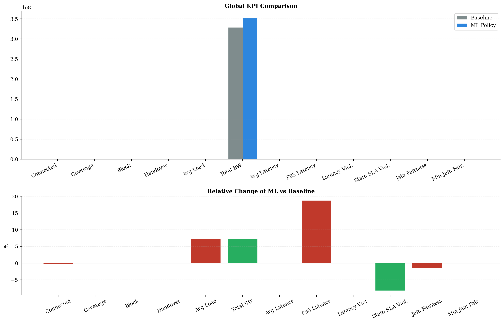
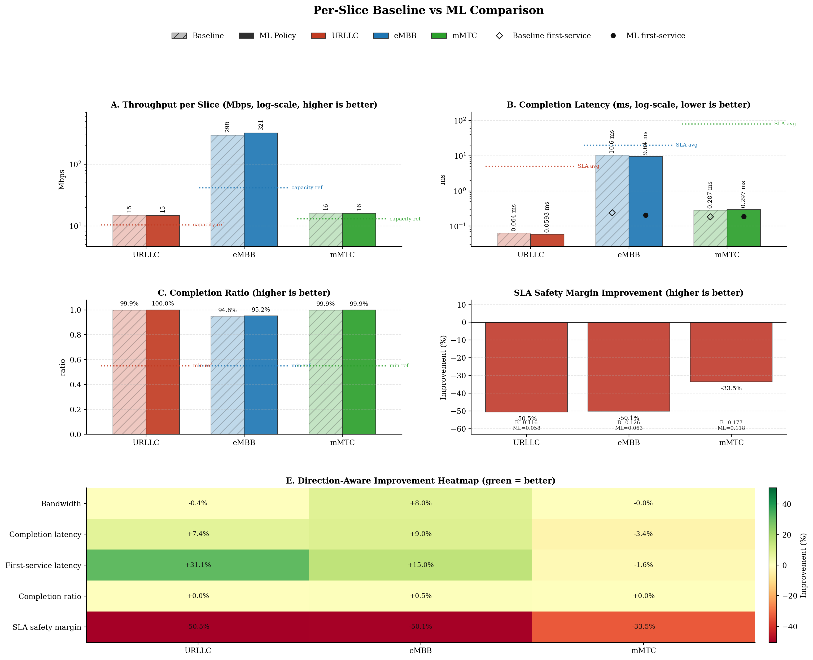
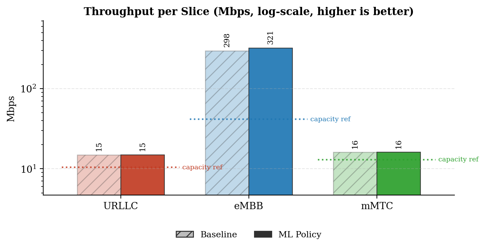
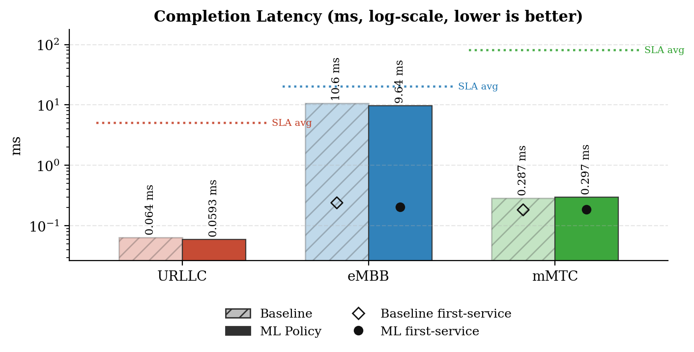
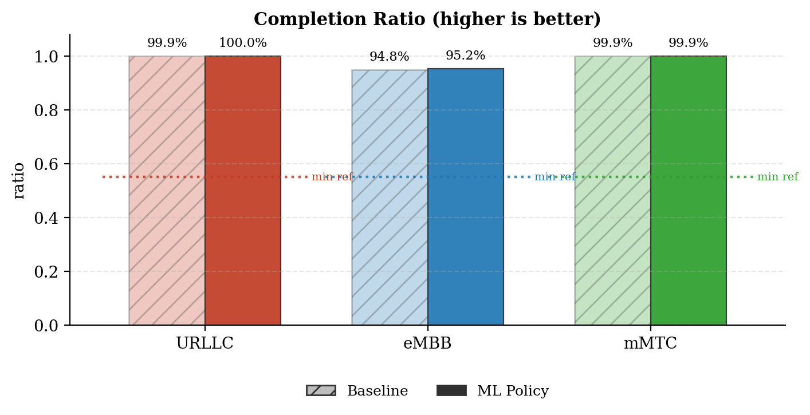
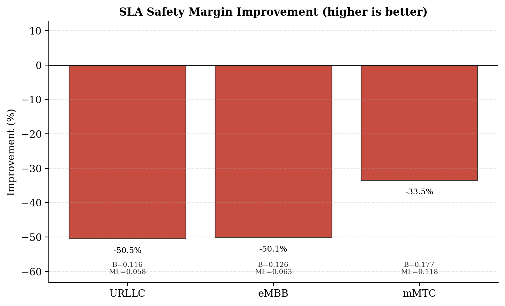
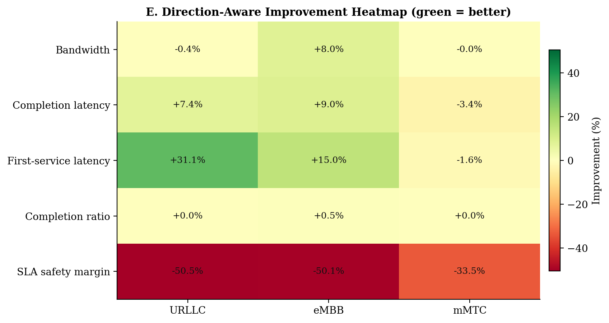
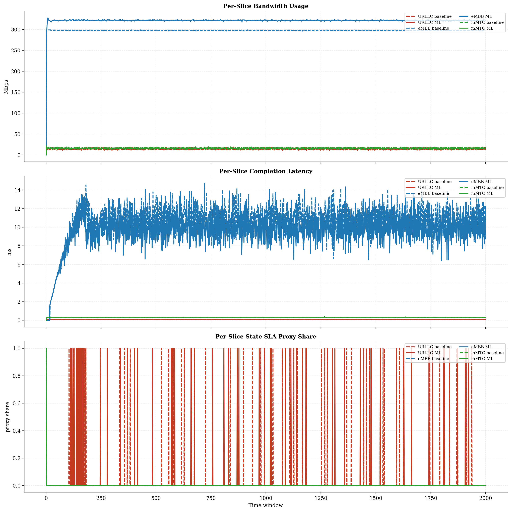
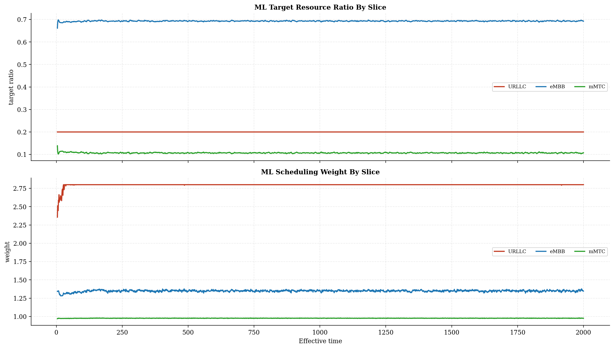
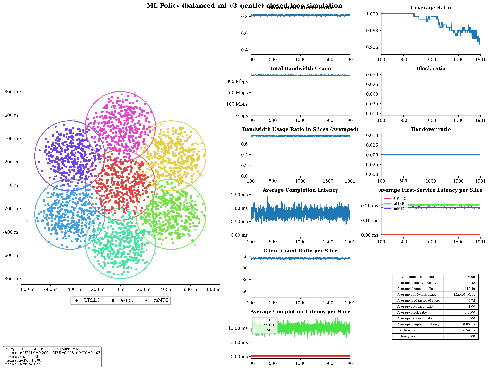

# Baseline vs ML Policy Report

## Run Summary

- Timestamp: `2026-05-10T21:07:34`
- Config: `C:\Users\LENOVO\Downloads\5G-Network-Slicing-main\5G-Network-Slicing-with-GBDT-ML-Policy\slicesim\scenario-light.yml`
- Model: `C:\Users\LENOVO\Downloads\5G-Network-Slicing-main\5G-Network-Slicing-with-GBDT-ML-Policy\models\sla_risk_gbdt`
- Controller type: `gbdt`
- Controller preset: `balanced_ml_v3_gentle`
- Broker enabled: `True`
- Broker preset: `forecasting_balanced`
- Seed: `31`

## Global KPI Comparison

| metric | baseline | ml_policy | delta_ml_minus_baseline | delta_pct |
|---|---|---|---|---|
| connected_clients_ratio | 0.8164 | 0.8151 | -0.0013 | -0.1635 |
| coverage_ratio | 0.9992 | 0.9989 | -0.0003 | -0.0283 |
| block_ratio | 0.0000 | 0.0000 | 0.0000 | 0.0000 |
| handover_ratio | 0.0000 | 0.0000 | 0.0000 | 0.0000 |
| avg_slice_load_ratio | 0.6990 | 0.7494 | 0.0504 | 7.2050 |
| total_bandwidth_usage | 328532068.3633 | 352202720.6073 | 23670652.2439 | 7.2050 |
| avg_latency_ms | 0.7818 | 0.7818 | -0.0001 | -0.0075 |
| p95_latency_ms | 3.7263 | 4.4246 | 0.6983 | 18.7390 |
| latency_violation_ratio | 0.0000 | 0.0000 | 0.0000 | 0.0000 |
| avg_state_sla_violation_share | 0.0102 | 0.0093 | -0.0008 | -8.1967 |
| bandwidth_jain_fairness | 0.4041 | 0.3987 | -0.0054 | -1.3421 |
| bandwidth_jain_fairness_min | 0.3333 | 0.3333 | 0.0000 | 0.0000 |

## Per-Slice Summary

| slice_name | avg_bandwidth_usage_mbps_baseline | avg_bandwidth_usage_mbps_ml | avg_bandwidth_usage_mbps_delta | avg_served_bandwidth_baseline | avg_served_bandwidth_ml | avg_served_bandwidth_delta | avg_completion_latency_ms_baseline | avg_completion_latency_ms_ml | avg_completion_latency_ms_delta | avg_first_service_latency_ms_baseline | avg_first_service_latency_ms_ml | avg_first_service_latency_ms_delta | avg_recorded_first_service_latency_ms_baseline | avg_recorded_first_service_latency_ms_ml | avg_recorded_first_service_latency_ms_delta | avg_bandwidth_share_baseline | avg_bandwidth_share_ml | avg_bandwidth_share_delta | zero_bandwidth_window_share_baseline | zero_bandwidth_window_share_ml | zero_bandwidth_window_share_delta | completion_ratio_baseline | completion_ratio_ml | completion_ratio_delta | completion_latency_violation_ratio_baseline | completion_latency_violation_ratio_ml | completion_latency_violation_ratio_delta | first_service_latency_violation_ratio_baseline | first_service_latency_violation_ratio_ml | first_service_latency_violation_ratio_delta | request_latency_violation_event_ratio_baseline | request_latency_violation_event_ratio_ml | request_latency_violation_event_ratio_delta | avg_state_sla_violation_share_baseline | avg_state_sla_violation_share_ml | avg_state_sla_violation_share_delta | avg_sla_safety_margin_baseline | avg_sla_safety_margin_ml | avg_sla_safety_margin_delta | avg_sla_safety_margin_improvement_pct |
|---|---|---|---|---|---|---|---|---|---|---|---|---|---|---|---|---|---|---|---|---|---|---|---|---|---|---|---|---|---|---|---|---|---|---|---|---|---|---|---|---|
| URLLC | 14.9199 | 14.8671 | -0.0528 | 139946.5820 | 139786.0217 | -160.5603 | 0.0640 | 0.0593 | -0.0047 | 0.0054 | 0.0037 | -0.0017 | 0.0054 | 0.0037 | -0.0017 | 0.0459 | 0.0427 | -0.0032 | 0.0000 | 0.0000 | 0.0000 | 0.9995 | 0.9995 | 0.0000 | 0.0000 | 0.0000 | 0.0000 | 0.0000 | 0.0000 | 0.0000 | 0.0000 | 0.0000 | 0.0000 | 0.0295 | 0.0270 | -0.0025 | 0.1163 | 0.0575 | -0.0588 | -50.5413 |
| eMBB | 297.5549 | 321.2845 | 23.7296 | 154823.5394 | 168905.8762 | 14082.3368 | 10.5856 | 9.6375 | -0.9481 | 0.2404 | 0.2043 | -0.0361 | 0.2407 | 0.2044 | -0.0362 | 0.9053 | 0.9118 | 0.0065 | 0.0005 | 0.0005 | 0.0000 | 0.9479 | 0.9524 | 0.0045 | 0.0000 | 0.0000 | 0.0000 | 0.0000 | 0.0000 | 0.0000 | 0.0000 | 0.0000 | 0.0000 | 0.0005 | 0.0005 | 0.0000 | 0.1255 | 0.0626 | -0.0630 | -50.1462 |
| mMTC | 16.0573 | 16.0511 | -0.0061 | 79958.2569 | 79967.3646 | 9.1077 | 0.2873 | 0.2972 | 0.0099 | 0.1838 | 0.1867 | 0.0029 | 0.1839 | 0.1868 | 0.0029 | 0.0488 | 0.0455 | -0.0033 | 0.0005 | 0.0005 | 0.0000 | 0.9990 | 0.9990 | 0.0000 | 0.0000 | 0.0000 | 0.0000 | 0.0000 | 0.0000 | 0.0000 | 0.0000 | 0.0000 | 0.0000 | 0.0005 | 0.0005 | 0.0000 | 0.1769 | 0.1177 | -0.0593 | -33.4918 |

## Per-Base-Station Summary

| base_station_id | avg_bandwidth_usage_mbps_baseline | avg_bandwidth_usage_mbps_ml | avg_bandwidth_usage_mbps_delta | avg_bandwidth_usage_mbps_delta_pct | avg_capacity_mbps_baseline | avg_capacity_mbps_ml | avg_capacity_mbps_delta | avg_capacity_mbps_delta_pct | avg_load_ratio_baseline | avg_load_ratio_ml | avg_load_ratio_delta | avg_load_ratio_delta_pct | avg_remaining_capacity_ratio_baseline | avg_remaining_capacity_ratio_ml | avg_remaining_capacity_ratio_delta | avg_remaining_capacity_ratio_delta_pct | avg_request_count_per_window_baseline | avg_request_count_per_window_ml | avg_request_count_per_window_delta | avg_request_count_per_window_delta_pct | total_request_count_baseline | total_request_count_ml | total_request_count_delta | total_request_count_delta_pct | avg_requested_usage_mbps_per_window_baseline | avg_requested_usage_mbps_per_window_ml | avg_requested_usage_mbps_per_window_delta | avg_requested_usage_mbps_per_window_delta_pct | avg_clients_seen_per_window_baseline | avg_clients_seen_per_window_ml | avg_clients_seen_per_window_delta | avg_clients_seen_per_window_delta_pct | avg_connected_events_per_window_baseline | avg_connected_events_per_window_ml | avg_connected_events_per_window_delta | avg_connected_events_per_window_delta_pct | avg_disconnected_events_per_window_baseline | avg_disconnected_events_per_window_ml | avg_disconnected_events_per_window_delta | avg_disconnected_events_per_window_delta_pct | avg_state_sla_violation_share_baseline | avg_state_sla_violation_share_ml | avg_state_sla_violation_share_delta | avg_state_sla_violation_share_delta_pct | avg_sla_safety_margin_baseline | avg_sla_safety_margin_ml | avg_sla_safety_margin_delta | avg_sla_safety_margin_delta_pct | avg_sla_breach_count_per_window_baseline | avg_sla_breach_count_per_window_ml | avg_sla_breach_count_per_window_delta | avg_sla_breach_count_per_window_delta_pct |
|---|---|---|---|---|---|---|---|---|---|---|---|---|---|---|---|---|---|---|---|---|---|---|---|---|---|---|---|---|---|---|---|---|---|---|---|---|---|---|---|---|---|---|---|---|---|---|---|---|---|---|---|---|
| BS_0 | 53.8203 | 59.5652 | 5.7449 | 10.6742 | 80.0000 | 80.0000 | 0.0000 | 0.0000 | 0.6728 | 0.7446 | 0.0718 | 10.6742 | 0.3272 | 0.2554 | -0.0718 | -21.9440 | 47.5050 | 48.1565 | 0.6515 | 1.3714 | 95010.0000 | 96313.0000 | 1303.0000 | 1.3714 | 55.2808 | 61.3144 | 6.0336 | 10.9145 | 429.1450 | 430.3480 | 1.2030 | 0.2803 | 47.5075 | 48.1595 | 0.6520 | 1.3724 | 47.3290 | 47.9840 | 0.6550 | 1.3839 | 0.0102 | 0.0093 | -0.0008 | -8.1967 | 0.1396 | 0.0793 | -0.0603 | -43.2196 | 0.0305 | 0.0280 | -0.0025 | -8.1967 |
| BS_1 | 45.6620 | 48.8493 | 3.1874 | 6.9804 | 65.0000 | 65.0000 | 0.0000 | 0.0000 | 0.7025 | 0.7515 | 0.0490 | 6.9804 | 0.2975 | 0.2485 | -0.0490 | -16.4824 | 43.7405 | 43.9270 | 0.1865 | 0.4264 | 87481.0000 | 87854.0000 | 373.0000 | 0.4264 | 47.1381 | 50.6514 | 3.5133 | 7.4532 | 428.5110 | 428.5540 | 0.0430 | 0.0100 | 43.7575 | 43.9370 | 0.1795 | 0.4102 | 43.5815 | 43.7630 | 0.1815 | 0.4165 | 0.0102 | 0.0093 | -0.0008 | -8.1967 | 0.1396 | 0.0793 | -0.0603 | -43.2196 | 0.0305 | 0.0280 | -0.0025 | -8.1967 |
| BS_2 | 45.2775 | 48.1526 | 2.8751 | 6.3499 | 65.0000 | 65.0000 | 0.0000 | 0.0000 | 0.6966 | 0.7408 | 0.0442 | 6.3499 | 0.3034 | 0.2592 | -0.0442 | -14.5776 | 42.7815 | 42.9160 | 0.1345 | 0.3144 | 85563.0000 | 85832.0000 | 269.0000 | 0.3144 | 46.7126 | 50.0185 | 3.3059 | 7.0770 | 428.1900 | 427.7545 | -0.4355 | -0.1017 | 42.7840 | 42.9285 | 0.1445 | 0.3377 | 42.6105 | 42.7550 | 0.1445 | 0.3391 | 0.0102 | 0.0093 | -0.0008 | -8.1967 | 0.1396 | 0.0793 | -0.0603 | -43.2196 | 0.0305 | 0.0280 | -0.0025 | -8.1967 |
| BS_3 | 45.3556 | 48.5137 | 3.1582 | 6.9631 | 65.0000 | 65.0000 | 0.0000 | 0.0000 | 0.6978 | 0.7464 | 0.0486 | 6.9631 | 0.3022 | 0.2536 | -0.0486 | -16.0766 | 41.6640 | 42.0050 | 0.3410 | 0.8185 | 83328.0000 | 84010.0000 | 682.0000 | 0.8185 | 46.8404 | 50.3181 | 3.4777 | 7.4245 | 427.1100 | 427.1785 | 0.0685 | 0.0160 | 41.6740 | 42.0100 | 0.3360 | 0.8063 | 41.4955 | 41.8325 | 0.3370 | 0.8121 | 0.0102 | 0.0093 | -0.0008 | -8.1967 | 0.1396 | 0.0793 | -0.0603 | -43.2196 | 0.0305 | 0.0280 | -0.0025 | -8.1967 |
| BS_4 | 46.2168 | 48.9691 | 2.7523 | 5.9552 | 65.0000 | 65.0000 | 0.0000 | 0.0000 | 0.7110 | 0.7534 | 0.0423 | 5.9552 | 0.2890 | 0.2466 | -0.0423 | -14.6529 | 51.9075 | 51.3385 | -0.5690 | -1.0962 | 103815.0000 | 102677.0000 | -1138.0000 | -1.0962 | 47.4996 | 50.6502 | 3.1506 | 6.6329 | 429.1510 | 427.7280 | -1.4230 | -0.3316 | 51.9115 | 51.3465 | -0.5650 | -1.0884 | 51.7395 | 51.1755 | -0.5640 | -1.0901 | 0.0102 | 0.0093 | -0.0008 | -8.1967 | 0.1396 | 0.0793 | -0.0603 | -43.2196 | 0.0305 | 0.0280 | -0.0025 | -8.1967 |
| BS_5 | 45.8678 | 48.9192 | 3.0514 | 6.6526 | 65.0000 | 65.0000 | 0.0000 | 0.0000 | 0.7057 | 0.7526 | 0.0469 | 6.6526 | 0.2943 | 0.2474 | -0.0469 | -15.9490 | 47.2920 | 47.6135 | 0.3215 | 0.6798 | 94584.0000 | 95227.0000 | 643.0000 | 0.6798 | 47.3074 | 50.6558 | 3.3484 | 7.0779 | 428.7755 | 428.5640 | -0.2115 | -0.0493 | 47.2935 | 47.6190 | 0.3255 | 0.6883 | 47.1205 | 47.4495 | 0.3290 | 0.6982 | 0.0102 | 0.0093 | -0.0008 | -8.1967 | 0.1396 | 0.0793 | -0.0603 | -43.2196 | 0.0305 | 0.0280 | -0.0025 | -8.1967 |
| BS_6 | 46.3322 | 49.2336 | 2.9015 | 6.2624 | 65.0000 | 65.0000 | 0.0000 | 0.0000 | 0.7128 | 0.7574 | 0.0446 | 6.2624 | 0.2872 | 0.2426 | -0.0446 | -15.5427 | 51.2510 | 51.5000 | 0.2490 | 0.4858 | 102502.0000 | 103000.0000 | 498.0000 | 0.4858 | 47.6484 | 50.9644 | 3.3160 | 6.9593 | 426.7495 | 426.6555 | -0.0940 | -0.0220 | 51.2560 | 51.5270 | 0.2710 | 0.5287 | 51.0870 | 51.3610 | 0.2740 | 0.5363 | 0.0102 | 0.0093 | -0.0008 | -8.1967 | 0.1396 | 0.0793 | -0.0603 | -43.2196 | 0.0305 | 0.0280 | -0.0025 | -8.1967 |

## Per-Base-Station Slice SLA Summary

| base_station_id | slice_name | avg_bandwidth_usage_mbps_baseline | avg_bandwidth_usage_mbps_ml | avg_bandwidth_usage_mbps_delta | avg_bandwidth_usage_mbps_delta_pct | avg_slice_capacity_mbps_baseline | avg_slice_capacity_mbps_ml | avg_slice_capacity_mbps_delta | avg_slice_capacity_mbps_delta_pct | avg_slice_load_ratio_baseline | avg_slice_load_ratio_ml | avg_slice_load_ratio_delta | avg_slice_load_ratio_delta_pct | avg_remaining_capacity_ratio_baseline | avg_remaining_capacity_ratio_ml | avg_remaining_capacity_ratio_delta | avg_remaining_capacity_ratio_delta_pct | avg_request_count_per_window_baseline | avg_request_count_per_window_ml | avg_request_count_per_window_delta | avg_request_count_per_window_delta_pct | total_request_count_baseline | total_request_count_ml | total_request_count_delta | total_request_count_delta_pct | avg_requested_usage_mbps_per_window_baseline | avg_requested_usage_mbps_per_window_ml | avg_requested_usage_mbps_per_window_delta | avg_requested_usage_mbps_per_window_delta_pct | avg_clients_seen_per_window_baseline | avg_clients_seen_per_window_ml | avg_clients_seen_per_window_delta | avg_clients_seen_per_window_delta_pct | avg_state_sla_violation_share_baseline | avg_state_sla_violation_share_ml | avg_state_sla_violation_share_delta | avg_state_sla_violation_share_delta_pct | avg_sla_safety_margin_baseline | avg_sla_safety_margin_ml | avg_sla_safety_margin_delta | avg_sla_safety_margin_delta_pct | avg_sla_breach_count_per_window_baseline | avg_sla_breach_count_per_window_ml | avg_sla_breach_count_per_window_delta | avg_sla_breach_count_per_window_delta_pct |
|---|---|---|---|---|---|---|---|---|---|---|---|---|---|---|---|---|---|---|---|---|---|---|---|---|---|---|---|---|---|---|---|---|---|---|---|---|---|---|---|---|---|---|---|---|---|
| BS_0 | URLLC | 2.2950 | 2.3264 | 0.0314 | 1.3696 | 14.4000 | 15.9968 | 1.5968 | 11.0889 | 0.1594 | 0.1454 | -0.0139 | -8.7490 | 0.8406 | 0.8546 | 0.0139 | 1.6588 | 16.4320 | 16.6640 | 0.2320 | 1.4119 | 32864.0000 | 33328.0000 | 464.0000 | 1.4119 | 2.2950 | 2.3264 | 0.0314 | 1.3696 | 45.5080 | 45.8315 | 0.3235 | 0.7109 | 0.0295 | 0.0270 | -0.0025 | -8.4746 | 0.1163 | 0.0575 | -0.0588 | -50.5413 | 0.0295 | 0.0270 | -0.0025 | -8.4746 |
| BS_0 | eMBB | 49.2862 | 55.0018 | 5.7157 | 11.5969 | 49.6000 | 55.6649 | 6.0649 | 12.2276 | 0.9937 | 0.9880 | -0.0056 | -0.5673 | 0.0063 | 0.0120 | 0.0056 | 89.0963 | 3.0830 | 3.4735 | 0.3905 | 12.6662 | 6166.0000 | 6947.0000 | 781.0000 | 12.6662 | 50.7456 | 56.7500 | 6.0044 | 11.8324 | 281.5200 | 282.0145 | 0.4945 | 0.1757 | 0.0005 | 0.0005 | 0.0000 | 0.0000 | 0.1255 | 0.0626 | -0.0630 | -50.1462 | 0.0005 | 0.0005 | 0.0000 | 0.0000 |
| BS_0 | mMTC | 2.2391 | 2.2369 | -0.0022 | -0.0989 | 16.0000 | 8.3383 | -7.6617 | -47.8855 | 0.1399 | 0.2687 | 0.1287 | 91.9796 | 0.8601 | 0.7313 | -0.1287 | -14.9665 | 27.9900 | 28.0190 | 0.0290 | 0.1036 | 55980.0000 | 56038.0000 | 58.0000 | 0.1036 | 2.2402 | 2.2379 | -0.0022 | -0.0993 | 102.1170 | 102.5020 | 0.3850 | 0.3770 | 0.0005 | 0.0005 | 0.0000 | 0.0000 | 0.1769 | 0.1177 | -0.0593 | -33.4918 | 0.0005 | 0.0005 | 0.0000 | 0.0000 |
| BS_1 | URLLC | 2.3143 | 2.2994 | -0.0150 | -0.6468 | 10.4000 | 12.9948 | 2.5948 | 24.9500 | 0.2225 | 0.1770 | -0.0456 | -20.4788 | 0.7775 | 0.8230 | 0.0456 | 5.8616 | 16.5510 | 16.4305 | -0.1205 | -0.7281 | 33102.0000 | 32861.0000 | -241.0000 | -0.7281 | 2.3143 | 2.2994 | -0.0150 | -0.6468 | 43.9350 | 43.7810 | -0.1540 | -0.3505 | 0.0295 | 0.0270 | -0.0025 | -8.4746 | 0.1163 | 0.0575 | -0.0588 | -50.5413 | 0.0295 | 0.0270 | -0.0025 | -8.4746 |
| BS_1 | eMBB | 41.3810 | 44.5832 | 3.2021 | 7.7381 | 41.6000 | 45.1737 | 3.5737 | 8.5906 | 0.9947 | 0.9869 | -0.0078 | -0.7888 | 0.0053 | 0.0131 | 0.0078 | 149.0770 | 2.5980 | 2.8480 | 0.2500 | 9.6228 | 5196.0000 | 5696.0000 | 500.0000 | 9.6228 | 42.8564 | 46.3846 | 3.5281 | 8.2324 | 293.5760 | 293.6745 | 0.0985 | 0.0336 | 0.0005 | 0.0005 | 0.0000 | 0.0000 | 0.1255 | 0.0626 | -0.0630 | -50.1462 | 0.0005 | 0.0005 | 0.0000 | 0.0000 |
| BS_1 | mMTC | 1.9666 | 1.9668 | 0.0002 | 0.0119 | 13.0000 | 6.8315 | -6.1685 | -47.4499 | 0.1513 | 0.2883 | 0.1370 | 90.5888 | 0.8487 | 0.7117 | -0.1370 | -16.1463 | 24.5915 | 24.6485 | 0.0570 | 0.2318 | 49183.0000 | 49297.0000 | 114.0000 | 0.2318 | 1.9673 | 1.9675 | 0.0002 | 0.0077 | 91.0000 | 91.0985 | 0.0985 | 0.1082 | 0.0005 | 0.0005 | 0.0000 | 0.0000 | 0.1769 | 0.1177 | -0.0593 | -33.4918 | 0.0005 | 0.0005 | 0.0000 | 0.0000 |
| BS_2 | URLLC | 1.5923 | 1.5535 | -0.0388 | -2.4360 | 10.4000 | 12.9948 | 2.5948 | 24.9500 | 0.1531 | 0.1196 | -0.0335 | -21.9049 | 0.8469 | 0.8804 | 0.0335 | 3.9601 | 11.3335 | 11.1570 | -0.1765 | -1.5573 | 22667.0000 | 22314.0000 | -353.0000 | -1.5573 | 1.5923 | 1.5535 | -0.0388 | -2.4360 | 32.0000 | 31.5990 | -0.4010 | -1.2531 | 0.0295 | 0.0270 | -0.0025 | -8.4746 | 0.1163 | 0.0575 | -0.0588 | -50.5413 | 0.0295 | 0.0270 | -0.0025 | -8.4746 |
| BS_2 | eMBB | 41.3806 | 44.2804 | 2.8997 | 7.0075 | 41.6000 | 44.9853 | 3.3853 | 8.1379 | 0.9947 | 0.9843 | -0.0104 | -1.0488 | 0.0053 | 0.0157 | 0.0104 | 197.8324 | 2.5775 | 2.8030 | 0.2255 | 8.7488 | 5155.0000 | 5606.0000 | 451.0000 | 8.7488 | 42.8146 | 46.1455 | 3.3310 | 7.7800 | 290.1900 | 289.9180 | -0.2720 | -0.0937 | 0.0005 | 0.0005 | 0.0000 | 0.0000 | 0.1255 | 0.0626 | -0.0630 | -50.1462 | 0.0005 | 0.0005 | 0.0000 | 0.0000 |
| BS_2 | mMTC | 2.3046 | 2.3187 | 0.0141 | 0.6125 | 13.0000 | 7.0199 | -5.9801 | -46.0011 | 0.1773 | 0.3308 | 0.1535 | 86.6169 | 0.8227 | 0.6692 | -0.1535 | -18.6636 | 28.8705 | 28.9560 | 0.0855 | 0.2962 | 57741.0000 | 57912.0000 | 171.0000 | 0.2962 | 2.3057 | 2.3194 | 0.0137 | 0.5931 | 106.0000 | 106.2375 | 0.2375 | 0.2241 | 0.0005 | 0.0005 | 0.0000 | 0.0000 | 0.1769 | 0.1177 | -0.0593 | -33.4918 | 0.0005 | 0.0005 | 0.0000 | 0.0000 |
| BS_3 | URLLC | 1.9517 | 1.9482 | -0.0035 | -0.1775 | 10.4000 | 12.9948 | 2.5948 | 24.9500 | 0.1877 | 0.1499 | -0.0377 | -20.1064 | 0.8123 | 0.8501 | 0.0377 | 4.6448 | 13.9420 | 13.9720 | 0.0300 | 0.2152 | 27884.0000 | 27944.0000 | 60.0000 | 0.2152 | 1.9517 | 1.9482 | -0.0035 | -0.1775 | 37.0000 | 37.0690 | 0.0690 | 0.1865 | 0.0295 | 0.0270 | -0.0025 | -8.4746 | 0.1163 | 0.0575 | -0.0588 | -50.5413 | 0.0295 | 0.0270 | -0.0025 | -8.4746 |
| BS_3 | eMBB | 41.3954 | 44.5523 | 3.1569 | 7.6261 | 41.6000 | 45.1369 | 3.5369 | 8.5023 | 0.9951 | 0.9870 | -0.0081 | -0.8111 | 0.0049 | 0.0130 | 0.0081 | 164.1113 | 2.6015 | 2.8270 | 0.2255 | 8.6681 | 5203.0000 | 5654.0000 | 451.0000 | 8.6681 | 42.8791 | 46.3558 | 3.4767 | 8.1081 | 299.6280 | 299.4230 | -0.2050 | -0.0684 | 0.0005 | 0.0005 | 0.0000 | 0.0000 | 0.1255 | 0.0626 | -0.0630 | -50.1462 | 0.0005 | 0.0005 | 0.0000 | 0.0000 |
| BS_3 | mMTC | 2.0085 | 2.0133 | 0.0048 | 0.2373 | 13.0000 | 6.8683 | -6.1317 | -47.1672 | 0.1545 | 0.2936 | 0.1391 | 90.0057 | 0.8455 | 0.7064 | -0.1391 | -16.4469 | 25.1205 | 25.2060 | 0.0855 | 0.3404 | 50241.0000 | 50412.0000 | 171.0000 | 0.3404 | 2.0097 | 2.0141 | 0.0045 | 0.2226 | 90.4820 | 90.6865 | 0.2045 | 0.2260 | 0.0005 | 0.0005 | 0.0000 | 0.0000 | 0.1769 | 0.1177 | -0.0593 | -33.4918 | 0.0005 | 0.0005 | 0.0000 | 0.0000 |
| BS_4 | URLLC | 2.1207 | 2.0634 | -0.0573 | -2.7029 | 10.4000 | 12.9948 | 2.5948 | 24.9500 | 0.2039 | 0.1588 | -0.0451 | -22.1208 | 0.7961 | 0.8412 | 0.0451 | 5.6661 | 15.1560 | 14.7185 | -0.4375 | -2.8866 | 30312.0000 | 29437.0000 | -875.0000 | -2.8866 | 2.1207 | 2.0634 | -0.0573 | -2.7029 | 41.1325 | 40.8425 | -0.2900 | -0.7050 | 0.0295 | 0.0270 | -0.0025 | -8.4746 | 0.1163 | 0.0575 | -0.0588 | -50.5413 | 0.0295 | 0.0270 | -0.0025 | -8.4746 |
| BS_4 | eMBB | 41.3617 | 44.1936 | 2.8319 | 6.8467 | 41.6000 | 44.8067 | 3.2067 | 7.7084 | 0.9943 | 0.9863 | -0.0080 | -0.8034 | 0.0057 | 0.0137 | 0.0080 | 139.4253 | 2.5595 | 2.7705 | 0.2110 | 8.2438 | 5119.0000 | 5541.0000 | 422.0000 | 8.2438 | 42.6432 | 45.8732 | 3.2300 | 7.5745 | 263.7820 | 263.0795 | -0.7025 | -0.2663 | 0.0005 | 0.0005 | 0.0000 | 0.0000 | 0.1255 | 0.0626 | -0.0630 | -50.1462 | 0.0005 | 0.0005 | 0.0000 | 0.0000 |
| BS_4 | mMTC | 2.7345 | 2.7122 | -0.0223 | -0.8150 | 13.0000 | 7.1985 | -5.8015 | -44.6268 | 0.2103 | 0.3774 | 0.1671 | 79.4221 | 0.7897 | 0.6226 | -0.1671 | -21.1559 | 34.1920 | 33.8495 | -0.3425 | -1.0017 | 68384.0000 | 67699.0000 | -685.0000 | -1.0017 | 2.7357 | 2.7136 | -0.0221 | -0.8074 | 124.2365 | 123.8060 | -0.4305 | -0.3465 | 0.0005 | 0.0005 | 0.0000 | 0.0000 | 0.1769 | 0.1177 | -0.0593 | -33.4918 | 0.0005 | 0.0005 | 0.0000 | 0.0000 |
| BS_5 | URLLC | 2.1461 | 2.1733 | 0.0272 | 1.2680 | 10.4000 | 12.9948 | 2.5948 | 24.9500 | 0.2064 | 0.1673 | -0.0391 | -18.9456 | 0.7936 | 0.8327 | 0.0391 | 4.9260 | 15.3650 | 15.5375 | 0.1725 | 1.1227 | 30730.0000 | 31075.0000 | 345.0000 | 1.1227 | 2.1461 | 2.1733 | 0.0272 | 1.2680 | 41.6610 | 42.1290 | 0.4680 | 1.1234 | 0.0295 | 0.0270 | -0.0025 | -8.4746 | 0.1163 | 0.0575 | -0.0588 | -50.5413 | 0.0295 | 0.0270 | -0.0025 | -8.4746 |
| BS_5 | eMBB | 41.3825 | 44.4167 | 3.0342 | 7.3320 | 41.6000 | 44.9920 | 3.3920 | 8.1539 | 0.9948 | 0.9872 | -0.0076 | -0.7635 | 0.0052 | 0.0128 | 0.0076 | 145.2766 | 2.6070 | 2.8100 | 0.2030 | 7.7867 | 5214.0000 | 5620.0000 | 406.0000 | 7.7867 | 42.8208 | 46.1521 | 3.3313 | 7.7797 | 279.6825 | 279.0355 | -0.6470 | -0.2313 | 0.0005 | 0.0005 | 0.0000 | 0.0000 | 0.1255 | 0.0626 | -0.0630 | -50.1462 | 0.0005 | 0.0005 | 0.0000 | 0.0000 |
| BS_5 | mMTC | 2.3391 | 2.3292 | -0.0100 | -0.4267 | 13.0000 | 7.0132 | -5.9868 | -46.0525 | 0.1799 | 0.3327 | 0.1527 | 84.8769 | 0.8201 | 0.6673 | -0.1527 | -18.6232 | 29.3200 | 29.2660 | -0.0540 | -0.1842 | 58640.0000 | 58532.0000 | -108.0000 | -0.1842 | 2.3405 | 2.3303 | -0.0102 | -0.4343 | 107.4320 | 107.3995 | -0.0325 | -0.0303 | 0.0005 | 0.0005 | 0.0000 | 0.0000 | 0.1769 | 0.1177 | -0.0593 | -33.4918 | 0.0005 | 0.0005 | 0.0000 | 0.0000 |
| BS_6 | URLLC | 2.4998 | 2.5029 | 0.0031 | 0.1251 | 10.4000 | 12.9948 | 2.5948 | 24.9500 | 0.2404 | 0.1926 | -0.0477 | -19.8578 | 0.7596 | 0.8074 | 0.0477 | 6.2834 | 17.8330 | 17.8785 | 0.0455 | 0.2551 | 35666.0000 | 35757.0000 | 91.0000 | 0.2551 | 2.4998 | 2.5029 | 0.0031 | 0.1251 | 49.1195 | 49.1150 | -0.0045 | -0.0092 | 0.0295 | 0.0270 | -0.0025 | -8.4746 | 0.1163 | 0.0575 | -0.0588 | -50.5413 | 0.0295 | 0.0270 | -0.0025 | -8.4746 |
| BS_6 | eMBB | 41.3675 | 44.2566 | 2.8891 | 6.9841 | 41.6000 | 44.9196 | 3.3196 | 7.9798 | 0.9944 | 0.9852 | -0.0092 | -0.9257 | 0.0056 | 0.0148 | 0.0092 | 164.6825 | 2.5805 | 2.7750 | 0.1945 | 7.5373 | 5161.0000 | 5550.0000 | 389.0000 | 7.5373 | 42.6820 | 45.9862 | 3.3041 | 7.7412 | 264.1870 | 264.5415 | 0.3545 | 0.1342 | 0.0005 | 0.0005 | 0.0000 | 0.0000 | 0.1255 | 0.0626 | -0.0630 | -50.1462 | 0.0005 | 0.0005 | 0.0000 | 0.0000 |
| BS_6 | mMTC | 2.4649 | 2.4741 | 0.0092 | 0.3742 | 13.0000 | 7.0856 | -5.9144 | -45.4953 | 0.1896 | 0.3498 | 0.1602 | 84.4834 | 0.8104 | 0.6502 | -0.1602 | -19.7667 | 30.8375 | 30.8465 | 0.0090 | 0.0292 | 61675.0000 | 61693.0000 | 18.0000 | 0.0292 | 2.4666 | 2.4753 | 0.0088 | 0.3549 | 113.4430 | 112.9990 | -0.4440 | -0.3914 | 0.0005 | 0.0005 | 0.0000 | 0.0000 | 0.1769 | 0.1177 | -0.0593 | -33.4918 | 0.0005 | 0.0005 | 0.0000 | 0.0000 |

## Resource Allocation Summary

| slice_name | baseline_state_ratio | ml_state_ratio | ml_action_target_ratio_mean | ml_action_target_ratio_min | ml_action_target_ratio_max | ml_scheduling_weight_mean | ml_admission_guard_factor_mean | target_ratio_delta_vs_baseline_state |
|---|---|---|---|---|---|---|---|---|
| URLLC | 0.1629 | 0.1999 | 0.2000 | 0.2000 | 0.2000 | 2.7977 | 1.1473 | 0.0371 |
| eMBB | 0.6371 | 0.6928 | 0.6930 | 0.6595 | 0.7000 | 1.3490 | 1.0435 | 0.0558 |
| mMTC | 0.2000 | 0.1072 | 0.1070 | 0.1000 | 0.1405 | 0.9768 | 1.0080 | -0.0930 |

## Visual Comparison

### Global KPI View

### Per-Slice View

### Per-Slice Panel Images

#### Throughput per Slice

#### Latency per Slice

#### Completion Ratio

#### SLA Safety Margin Improvement

#### Improvement Heatmap

### Per-Slice Time-Series View

### ML Action Distribution

### ML Policy Simulation Snapshot

## Metric Notes

- `avg_state_sla_violation_share` is the per-slice state-level SLA violation ratio averaged from simulator state frames.
- `avg_sla_safety_margin` is the average distance to the active SLA boundary. Higher is better; negative means violation.
- `avg_sla_safety_margin_improvement_pct` is `(ML margin - baseline margin) / abs(baseline margin) * 100`.
- `request_latency_violation_event_ratio`, `completion_latency_violation_ratio`, and `first_service_latency_violation_ratio` are client-level latency-only metrics.
- A latency value of `0` can mean no recorded latency event for that slice/window. Check `completion_ratio` and request/completion counts before interpreting it as perfect latency.
- `bandwidth_jain_fairness` is Jain's fairness index over per-slice bandwidth usage per time window. Higher is more balanced, with `1.0` meaning equal usage across slices.

## Trade-off Notes

- URLLC completion latency changed by -0.00 ms and SLA safety margin changed by -0.0588 (-50.5%).
- eMBB average bandwidth usage changed by 23.730 Mbps and completion ratio changed by 0.0045.
- mMTC first-service latency changed by 0.00 ms and completion ratio changed by 0.0000.
- URLLC recorded first-service latency changed by -0.00 ms on windows with actual first-service events.
- Classic trade-off snapshot: if URLLC improved by 0.00 ms in latency, eMBB bandwidth moved by 23.730 Mbps.

## Artifacts

- Baseline raw states: `C:\Users\LENOVO\Downloads\5G-Network-Slicing-main\5G-Network-Slicing-with-GBDT-ML-Policy\FINAL_OUTPUT_light_20260510_175938\baseline_run\baseline_states.csv`
- ML raw states: `C:\Users\LENOVO\Downloads\5G-Network-Slicing-main\5G-Network-Slicing-with-GBDT-ML-Policy\FINAL_OUTPUT_light_20260510_175938\ml_run\online_states_raw.csv`
- ML broker forecasts: `C:\Users\LENOVO\Downloads\5G-Network-Slicing-main\5G-Network-Slicing-with-GBDT-ML-Policy\FINAL_OUTPUT_light_20260510_175938\ml_run\online_broker_forecasts.csv`
- ML broker feedback: `C:\Users\LENOVO\Downloads\5G-Network-Slicing-main\5G-Network-Slicing-with-GBDT-ML-Policy\FINAL_OUTPUT_light_20260510_175938\ml_run\online_broker_feedback.csv`
- Comparison CSV (global): `C:\Users\LENOVO\Downloads\5G-Network-Slicing-main\5G-Network-Slicing-with-GBDT-ML-Policy\FINAL_OUTPUT_light_20260510_175938\global_kpi_comparison.csv`
- Comparison CSV (per-slice): `C:\Users\LENOVO\Downloads\5G-Network-Slicing-main\5G-Network-Slicing-with-GBDT-ML-Policy\FINAL_OUTPUT_light_20260510_175938\per_slice_comparison.csv`
- Comparison CSV (per-base-station): `C:\Users\LENOVO\Downloads\5G-Network-Slicing-main\5G-Network-Slicing-with-GBDT-ML-Policy\FINAL_OUTPUT_light_20260510_175938\per_base_station_comparison.csv`
- Comparison CSV (per-base-station-slice): `C:\Users\LENOVO\Downloads\5G-Network-Slicing-main\5G-Network-Slicing-with-GBDT-ML-Policy\FINAL_OUTPUT_light_20260510_175938\per_base_station_slice_comparison.csv`
- Resource allocation CSV: `C:\Users\LENOVO\Downloads\5G-Network-Slicing-main\5G-Network-Slicing-with-GBDT-ML-Policy\FINAL_OUTPUT_light_20260510_175938\resource_allocation_summary.csv`
- ML action time-series CSV: `C:\Users\LENOVO\Downloads\5G-Network-Slicing-main\5G-Network-Slicing-with-GBDT-ML-Policy\FINAL_OUTPUT_light_20260510_175938\ml_action_ratio_timeseries.csv`
- Global KPI plot: `C:\Users\LENOVO\Downloads\5G-Network-Slicing-main\5G-Network-Slicing-with-GBDT-ML-Policy\FINAL_OUTPUT_light_20260510_175938\baseline_vs_ml_global_kpis.png`
- Per-slice bar plot: `C:\Users\LENOVO\Downloads\5G-Network-Slicing-main\5G-Network-Slicing-with-GBDT-ML-Policy\FINAL_OUTPUT_light_20260510_175938\baseline_vs_ml_per_slice_bars.png`
- Per-slice vector plot (SVG): `C:\Users\LENOVO\Downloads\5G-Network-Slicing-main\5G-Network-Slicing-with-GBDT-ML-Policy\FINAL_OUTPUT_light_20260510_175938\baseline_vs_ml_per_slice_bars.svg`
- Per-slice panel plot (Throughput per Slice): `C:\Users\LENOVO\Downloads\5G-Network-Slicing-main\5G-Network-Slicing-with-GBDT-ML-Policy\FINAL_OUTPUT_light_20260510_175938\baseline_vs_ml_per_slice_bars_throughput.png`
- Per-slice panel plot (Latency per Slice): `C:\Users\LENOVO\Downloads\5G-Network-Slicing-main\5G-Network-Slicing-with-GBDT-ML-Policy\FINAL_OUTPUT_light_20260510_175938\baseline_vs_ml_per_slice_bars_latency.png`
- Per-slice panel plot (Completion Ratio): `C:\Users\LENOVO\Downloads\5G-Network-Slicing-main\5G-Network-Slicing-with-GBDT-ML-Policy\FINAL_OUTPUT_light_20260510_175938\baseline_vs_ml_per_slice_bars_completion_ratio.png`
- Per-slice panel plot (SLA Safety Margin Improvement): `C:\Users\LENOVO\Downloads\5G-Network-Slicing-main\5G-Network-Slicing-with-GBDT-ML-Policy\FINAL_OUTPUT_light_20260510_175938\baseline_vs_ml_per_slice_bars_sla_margin_improvement.png`
- Per-slice panel plot (Improvement Heatmap): `C:\Users\LENOVO\Downloads\5G-Network-Slicing-main\5G-Network-Slicing-with-GBDT-ML-Policy\FINAL_OUTPUT_light_20260510_175938\baseline_vs_ml_per_slice_bars_improvement_heatmap.png`
- Per-slice time-series plot: `C:\Users\LENOVO\Downloads\5G-Network-Slicing-main\5G-Network-Slicing-with-GBDT-ML-Policy\FINAL_OUTPUT_light_20260510_175938\baseline_vs_ml_timeseries.png`
- ML action distribution plot: `C:\Users\LENOVO\Downloads\5G-Network-Slicing-main\5G-Network-Slicing-with-GBDT-ML-Policy\FINAL_OUTPUT_light_20260510_175938\ml_action_distribution.png`
- ML policy simulation graph: `C:\Users\LENOVO\Downloads\5G-Network-Slicing-main\5G-Network-Slicing-with-GBDT-ML-Policy\FINAL_OUTPUT_light_20260510_175938\ml_run\ml_policy_simulation.png`
