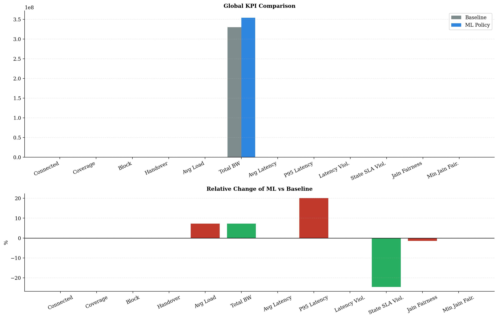
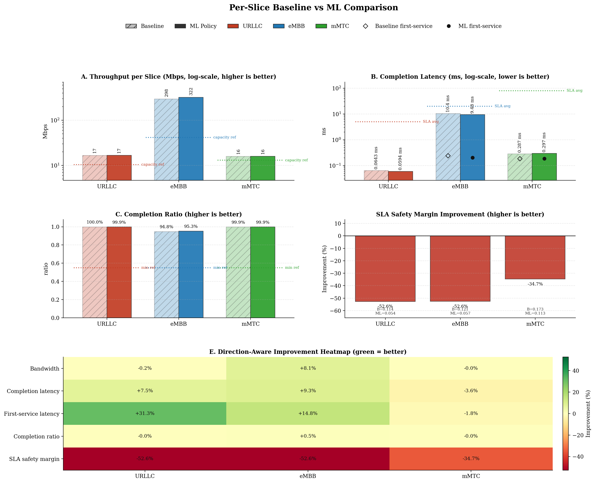
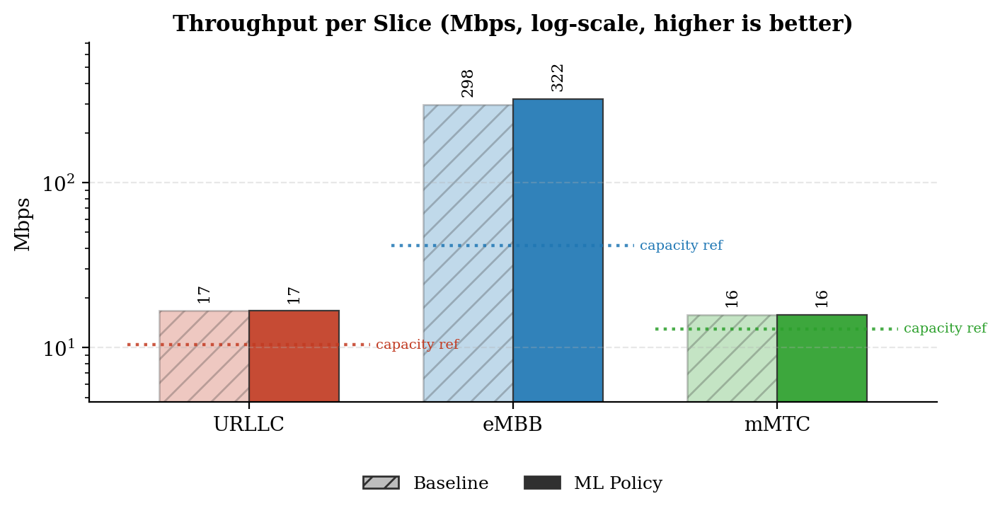
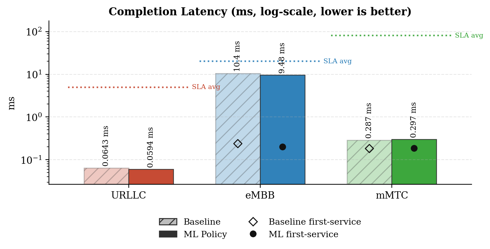
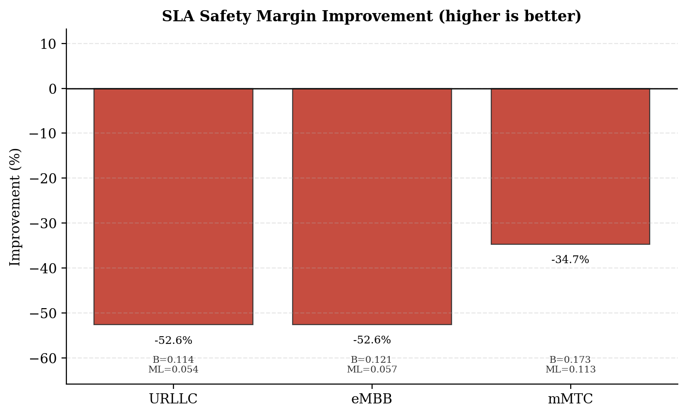
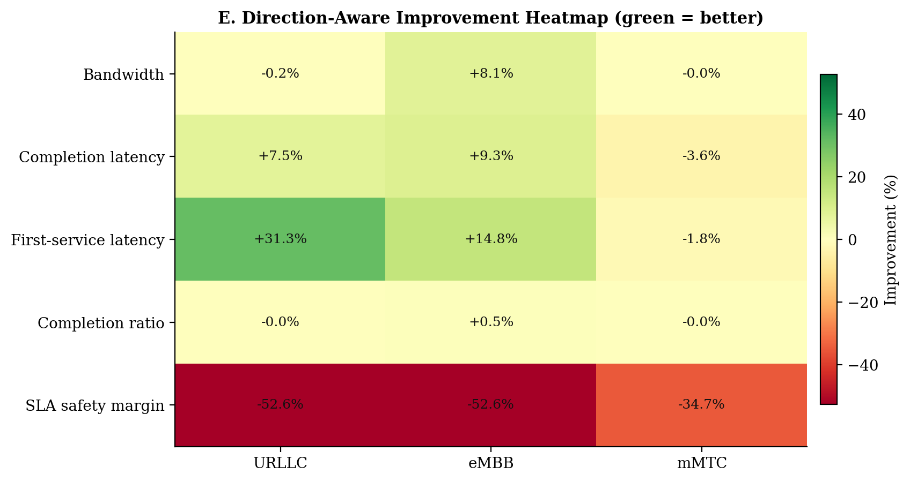
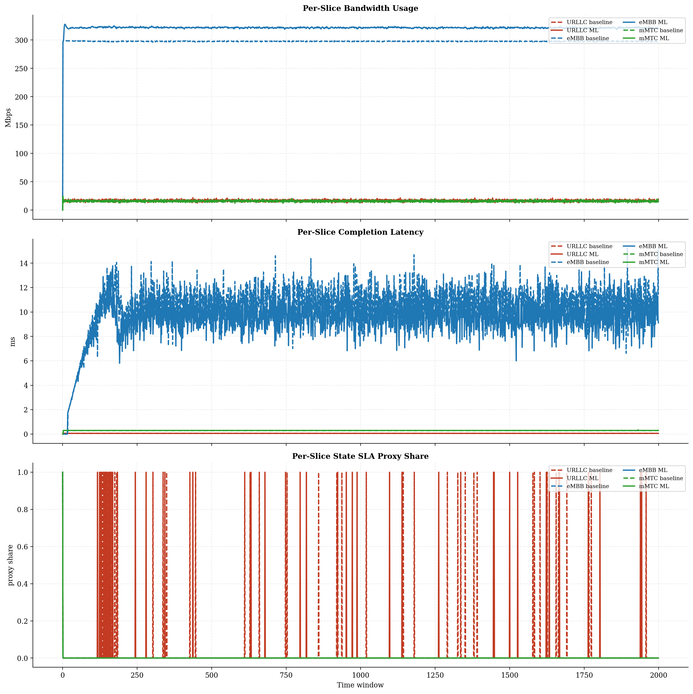
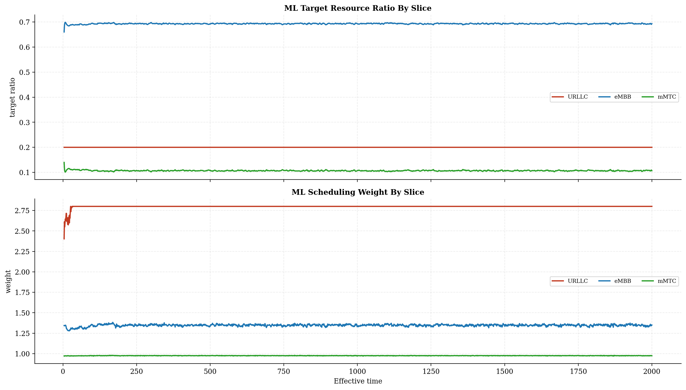
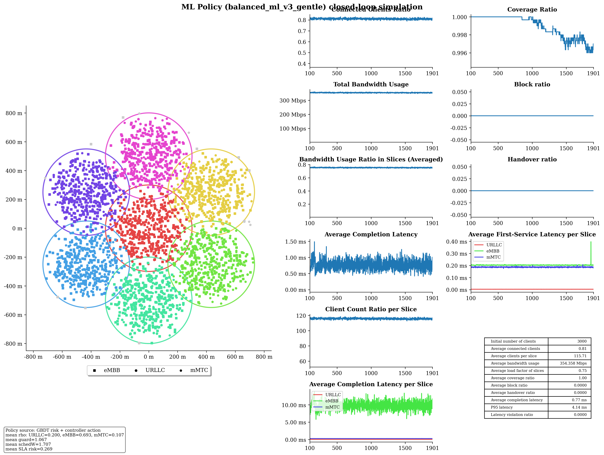

# Baseline vs ML Policy Report

## Run Summary

- Timestamp: `2026-05-09T14:23:49`
- Config: `C:\Users\LENOVO\Downloads\5G-Network-Slicing-main\5G-Network-Slicing-with-GBDT-ML-Policy\slicesim\scenario-light.yml`
- Model: `C:\Users\LENOVO\Downloads\5G-Network-Slicing-main\5G-Network-Slicing-with-GBDT-ML-Policy\models\sla_risk_gbdt`
- Controller type: `gbdt`
- Controller preset: `balanced_ml_v3_gentle`
- Broker enabled: `True`
- Broker preset: `forecasting_balanced`
- Seed: `11`

## Global KPI Comparison

| metric | baseline | ml_policy | delta_ml_minus_baseline | delta_pct |
|---|---|---|---|---|
| connected_clients_ratio | 0.8109 | 0.8096 | -0.0013 | -0.1630 |
| coverage_ratio | 0.9996 | 0.9989 | -0.0007 | -0.0721 |
| block_ratio | 0.0000 | 0.0000 | 0.0000 | 0.0000 |
| handover_ratio | 0.0000 | 0.0000 | 0.0000 | 0.0000 |
| avg_slice_load_ratio | 0.7025 | 0.7535 | 0.0510 | 7.2627 |
| total_bandwidth_usage | 330161839.5207 | 354140415.3298 | 23978575.8091 | 7.2627 |
| avg_latency_ms | 0.7500 | 0.7486 | -0.0015 | -0.1934 |
| p95_latency_ms | 3.3143 | 3.9806 | 0.6663 | 20.1042 |
| latency_violation_ratio | 0.0000 | 0.0000 | 0.0000 | 0.0000 |
| avg_state_sla_violation_share | 0.0088 | 0.0067 | -0.0022 | -24.5283 |
| bandwidth_jain_fairness | 0.4079 | 0.4021 | -0.0057 | -1.4037 |
| bandwidth_jain_fairness_min | 0.3333 | 0.3333 | 0.0000 | 0.0000 |

## Per-Slice Summary

| slice_name | avg_bandwidth_usage_mbps_baseline | avg_bandwidth_usage_mbps_ml | avg_bandwidth_usage_mbps_delta | avg_served_bandwidth_baseline | avg_served_bandwidth_ml | avg_served_bandwidth_delta | avg_completion_latency_ms_baseline | avg_completion_latency_ms_ml | avg_completion_latency_ms_delta | avg_first_service_latency_ms_baseline | avg_first_service_latency_ms_ml | avg_first_service_latency_ms_delta | avg_recorded_first_service_latency_ms_baseline | avg_recorded_first_service_latency_ms_ml | avg_recorded_first_service_latency_ms_delta | avg_bandwidth_share_baseline | avg_bandwidth_share_ml | avg_bandwidth_share_delta | zero_bandwidth_window_share_baseline | zero_bandwidth_window_share_ml | zero_bandwidth_window_share_delta | completion_ratio_baseline | completion_ratio_ml | completion_ratio_delta | completion_latency_violation_ratio_baseline | completion_latency_violation_ratio_ml | completion_latency_violation_ratio_delta | first_service_latency_violation_ratio_baseline | first_service_latency_violation_ratio_ml | first_service_latency_violation_ratio_delta | request_latency_violation_event_ratio_baseline | request_latency_violation_event_ratio_ml | request_latency_violation_event_ratio_delta | avg_state_sla_violation_share_baseline | avg_state_sla_violation_share_ml | avg_state_sla_violation_share_delta | avg_sla_safety_margin_baseline | avg_sla_safety_margin_ml | avg_sla_safety_margin_delta | avg_sla_safety_margin_improvement_pct |
|---|---|---|---|---|---|---|---|---|---|---|---|---|---|---|---|---|---|---|---|---|---|---|---|---|---|---|---|---|---|---|---|---|---|---|---|---|---|---|---|---|
| URLLC | 16.7430 | 16.7086 | -0.0344 | 140036.8968 | 139828.5624 | -208.3345 | 0.0643 | 0.0594 | -0.0048 | 0.0055 | 0.0038 | -0.0017 | 0.0055 | 0.0038 | -0.0017 | 0.0511 | 0.0476 | -0.0035 | 0.0000 | 0.0000 | 0.0000 | 0.9995 | 0.9995 | -0.0001 | 0.0000 | 0.0000 | 0.0000 | 0.0000 | 0.0000 | 0.0000 | 0.0000 | 0.0000 | 0.0000 | 0.0255 | 0.0190 | -0.0065 | 0.1137 | 0.0539 | -0.0599 | -52.6468 |
| eMBB | 297.5561 | 321.5737 | 24.0176 | 156805.9679 | 171199.2074 | 14393.2395 | 10.4485 | 9.4753 | -0.9732 | 0.2388 | 0.2034 | -0.0355 | 0.2392 | 0.2036 | -0.0356 | 0.9008 | 0.9076 | 0.0068 | 0.0005 | 0.0005 | 0.0000 | 0.9485 | 0.9528 | 0.0043 | 0.0000 | 0.0000 | 0.0000 | 0.0000 | 0.0000 | 0.0000 | 0.0000 | 0.0000 | 0.0000 | 0.0005 | 0.0005 | 0.0000 | 0.1213 | 0.0575 | -0.0638 | -52.5943 |
| mMTC | 15.8627 | 15.8582 | -0.0046 | 79987.2815 | 79922.6572 | -64.6243 | 0.2868 | 0.2970 | 0.0102 | 0.1833 | 0.1865 | 0.0032 | 0.1834 | 0.1866 | 0.0032 | 0.0480 | 0.0448 | -0.0033 | 0.0005 | 0.0005 | 0.0000 | 0.9990 | 0.9990 | -0.0000 | 0.0000 | 0.0000 | 0.0000 | 0.0000 | 0.0000 | 0.0000 | 0.0000 | 0.0000 | 0.0000 | 0.0005 | 0.0005 | 0.0000 | 0.1729 | 0.1129 | -0.0600 | -34.7171 |

## Per-Base-Station Summary

| base_station_id | avg_bandwidth_usage_mbps_baseline | avg_bandwidth_usage_mbps_ml | avg_bandwidth_usage_mbps_delta | avg_bandwidth_usage_mbps_delta_pct | avg_capacity_mbps_baseline | avg_capacity_mbps_ml | avg_capacity_mbps_delta | avg_capacity_mbps_delta_pct | avg_load_ratio_baseline | avg_load_ratio_ml | avg_load_ratio_delta | avg_load_ratio_delta_pct | avg_remaining_capacity_ratio_baseline | avg_remaining_capacity_ratio_ml | avg_remaining_capacity_ratio_delta | avg_remaining_capacity_ratio_delta_pct | avg_request_count_per_window_baseline | avg_request_count_per_window_ml | avg_request_count_per_window_delta | avg_request_count_per_window_delta_pct | total_request_count_baseline | total_request_count_ml | total_request_count_delta | total_request_count_delta_pct | avg_requested_usage_mbps_per_window_baseline | avg_requested_usage_mbps_per_window_ml | avg_requested_usage_mbps_per_window_delta | avg_requested_usage_mbps_per_window_delta_pct | avg_clients_seen_per_window_baseline | avg_clients_seen_per_window_ml | avg_clients_seen_per_window_delta | avg_clients_seen_per_window_delta_pct | avg_connected_events_per_window_baseline | avg_connected_events_per_window_ml | avg_connected_events_per_window_delta | avg_connected_events_per_window_delta_pct | avg_disconnected_events_per_window_baseline | avg_disconnected_events_per_window_ml | avg_disconnected_events_per_window_delta | avg_disconnected_events_per_window_delta_pct | avg_state_sla_violation_share_baseline | avg_state_sla_violation_share_ml | avg_state_sla_violation_share_delta | avg_state_sla_violation_share_delta_pct | avg_sla_safety_margin_baseline | avg_sla_safety_margin_ml | avg_sla_safety_margin_delta | avg_sla_safety_margin_delta_pct | avg_sla_breach_count_per_window_baseline | avg_sla_breach_count_per_window_ml | avg_sla_breach_count_per_window_delta | avg_sla_breach_count_per_window_delta_pct |
|---|---|---|---|---|---|---|---|---|---|---|---|---|---|---|---|---|---|---|---|---|---|---|---|---|---|---|---|---|---|---|---|---|---|---|---|---|---|---|---|---|---|---|---|---|---|---|---|---|---|---|---|---|
| BS_0 | 53.3336 | 58.9987 | 5.6651 | 10.6220 | 80.0000 | 80.0000 | 0.0000 | 0.0000 | 0.6667 | 0.7375 | 0.0708 | 10.6220 | 0.3333 | 0.2625 | -0.0708 | -21.2444 | 43.3405 | 43.5550 | 0.2145 | 0.4949 | 86681.0000 | 87110.0000 | 429.0000 | 0.4949 | 54.7479 | 60.8335 | 6.0856 | 11.1156 | 428.3565 | 427.7865 | -0.5700 | -0.1331 | 43.3415 | 43.5565 | 0.2150 | 0.4961 | 43.1685 | 43.3805 | 0.2120 | 0.4911 | 0.0088 | 0.0067 | -0.0022 | -24.5283 | 0.1360 | 0.0747 | -0.0612 | -45.0311 | 0.0265 | 0.0200 | -0.0065 | -24.5283 |
| BS_1 | 46.4310 | 49.4449 | 3.0139 | 6.4911 | 65.0000 | 65.0000 | 0.0000 | 0.0000 | 0.7143 | 0.7607 | 0.0464 | 6.4911 | 0.2857 | 0.2393 | -0.0464 | -16.2307 | 51.8540 | 51.7275 | -0.1265 | -0.2440 | 103708.0000 | 103455.0000 | -253.0000 | -0.2440 | 47.7617 | 51.0687 | 3.3070 | 6.9241 | 429.5385 | 428.9490 | -0.5895 | -0.1372 | 51.8575 | 51.7530 | -0.1045 | -0.2015 | 51.6895 | 51.5825 | -0.1070 | -0.2070 | 0.0088 | 0.0067 | -0.0022 | -24.5283 | 0.1360 | 0.0747 | -0.0612 | -45.0311 | 0.0265 | 0.0200 | -0.0065 | -24.5283 |
| BS_2 | 46.5223 | 49.4189 | 2.8966 | 6.2262 | 65.0000 | 65.0000 | 0.0000 | 0.0000 | 0.7157 | 0.7603 | 0.0446 | 6.2262 | 0.2843 | 0.2397 | -0.0446 | -15.6760 | 52.9655 | 53.3760 | 0.4105 | 0.7750 | 105931.0000 | 106752.0000 | 821.0000 | 0.7750 | 47.8735 | 51.1057 | 3.2322 | 6.7515 | 427.9250 | 428.9290 | 1.0040 | 0.2346 | 52.9725 | 53.3830 | 0.4105 | 0.7749 | 52.8040 | 53.2195 | 0.4155 | 0.7869 | 0.0088 | 0.0067 | -0.0022 | -24.5283 | 0.1360 | 0.0747 | -0.0612 | -45.0311 | 0.0265 | 0.0200 | -0.0065 | -24.5283 |
| BS_3 | 45.8126 | 49.0442 | 3.2316 | 7.0539 | 65.0000 | 65.0000 | 0.0000 | 0.0000 | 0.7048 | 0.7545 | 0.0497 | 7.0539 | 0.2952 | 0.2455 | -0.0497 | -16.8422 | 45.0875 | 45.2950 | 0.2075 | 0.4602 | 90175.0000 | 90590.0000 | 415.0000 | 0.4602 | 47.3025 | 50.7724 | 3.4699 | 7.3355 | 429.3955 | 428.3150 | -1.0805 | -0.2516 | 45.0920 | 45.3105 | 0.2185 | 0.4846 | 44.9155 | 45.1300 | 0.2145 | 0.4776 | 0.0088 | 0.0067 | -0.0022 | -24.5283 | 0.1360 | 0.0747 | -0.0612 | -45.0311 | 0.0265 | 0.0200 | -0.0065 | -24.5283 |
| BS_4 | 46.1538 | 49.0644 | 2.9106 | 6.3063 | 65.0000 | 65.0000 | 0.0000 | 0.0000 | 0.7101 | 0.7548 | 0.0448 | 6.3063 | 0.2899 | 0.2452 | -0.0448 | -15.4441 | 50.2915 | 50.6185 | 0.3270 | 0.6502 | 100583.0000 | 101237.0000 | 654.0000 | 0.6502 | 47.5385 | 50.7252 | 3.1867 | 6.7033 | 428.1130 | 427.3520 | -0.7610 | -0.1778 | 50.2935 | 50.6250 | 0.3315 | 0.6591 | 50.1245 | 50.4555 | 0.3310 | 0.6604 | 0.0088 | 0.0067 | -0.0022 | -24.5283 | 0.1360 | 0.0747 | -0.0612 | -45.0311 | 0.0265 | 0.0200 | -0.0065 | -24.5283 |
| BS_5 | 46.0170 | 49.1518 | 3.1349 | 6.8124 | 65.0000 | 65.0000 | 0.0000 | 0.0000 | 0.7080 | 0.7562 | 0.0482 | 6.8124 | 0.2920 | 0.2438 | -0.0482 | -16.5139 | 45.9295 | 46.4050 | 0.4755 | 1.0353 | 91859.0000 | 92810.0000 | 951.0000 | 1.0353 | 47.4496 | 51.0777 | 3.6281 | 7.6461 | 427.1295 | 428.5515 | 1.4220 | 0.3329 | 45.9400 | 46.4230 | 0.4830 | 1.0514 | 45.7685 | 46.2445 | 0.4760 | 1.0400 | 0.0088 | 0.0067 | -0.0022 | -24.5283 | 0.1360 | 0.0747 | -0.0612 | -45.0311 | 0.0265 | 0.0200 | -0.0065 | -24.5283 |
| BS_6 | 45.8914 | 49.0174 | 3.1260 | 6.8117 | 65.0000 | 65.0000 | 0.0000 | 0.0000 | 0.7060 | 0.7541 | 0.0481 | 6.8117 | 0.2940 | 0.2459 | -0.0481 | -16.3592 | 47.0825 | 47.3765 | 0.2940 | 0.6244 | 94165.0000 | 94753.0000 | 588.0000 | 0.6244 | 47.2271 | 50.7118 | 3.4847 | 7.3786 | 428.2625 | 426.6760 | -1.5865 | -0.3705 | 47.0885 | 47.3825 | 0.2940 | 0.6244 | 46.9140 | 47.2075 | 0.2935 | 0.6256 | 0.0088 | 0.0067 | -0.0022 | -24.5283 | 0.1360 | 0.0747 | -0.0612 | -45.0311 | 0.0265 | 0.0200 | -0.0065 | -24.5283 |

## Per-Base-Station Slice SLA Summary

| base_station_id | slice_name | avg_bandwidth_usage_mbps_baseline | avg_bandwidth_usage_mbps_ml | avg_bandwidth_usage_mbps_delta | avg_bandwidth_usage_mbps_delta_pct | avg_slice_capacity_mbps_baseline | avg_slice_capacity_mbps_ml | avg_slice_capacity_mbps_delta | avg_slice_capacity_mbps_delta_pct | avg_slice_load_ratio_baseline | avg_slice_load_ratio_ml | avg_slice_load_ratio_delta | avg_slice_load_ratio_delta_pct | avg_remaining_capacity_ratio_baseline | avg_remaining_capacity_ratio_ml | avg_remaining_capacity_ratio_delta | avg_remaining_capacity_ratio_delta_pct | avg_request_count_per_window_baseline | avg_request_count_per_window_ml | avg_request_count_per_window_delta | avg_request_count_per_window_delta_pct | total_request_count_baseline | total_request_count_ml | total_request_count_delta | total_request_count_delta_pct | avg_requested_usage_mbps_per_window_baseline | avg_requested_usage_mbps_per_window_ml | avg_requested_usage_mbps_per_window_delta | avg_requested_usage_mbps_per_window_delta_pct | avg_clients_seen_per_window_baseline | avg_clients_seen_per_window_ml | avg_clients_seen_per_window_delta | avg_clients_seen_per_window_delta_pct | avg_state_sla_violation_share_baseline | avg_state_sla_violation_share_ml | avg_state_sla_violation_share_delta | avg_state_sla_violation_share_delta_pct | avg_sla_safety_margin_baseline | avg_sla_safety_margin_ml | avg_sla_safety_margin_delta | avg_sla_safety_margin_delta_pct | avg_sla_breach_count_per_window_baseline | avg_sla_breach_count_per_window_ml | avg_sla_breach_count_per_window_delta | avg_sla_breach_count_per_window_delta_pct |
|---|---|---|---|---|---|---|---|---|---|---|---|---|---|---|---|---|---|---|---|---|---|---|---|---|---|---|---|---|---|---|---|---|---|---|---|---|---|---|---|---|---|---|---|---|---|
| BS_0 | URLLC | 1.8895 | 1.8928 | 0.0033 | 0.1732 | 14.4000 | 15.9968 | 1.5968 | 11.0889 | 0.1312 | 0.1183 | -0.0129 | -9.8249 | 0.8688 | 0.8817 | 0.0129 | 1.4839 | 13.5010 | 13.5220 | 0.0210 | 0.1555 | 27002.0000 | 27044.0000 | 42.0000 | 0.1555 | 1.8895 | 1.8928 | 0.0033 | 0.1732 | 37.0940 | 37.1455 | 0.0515 | 0.1388 | 0.0255 | 0.0190 | -0.0065 | -25.4902 | 0.1137 | 0.0539 | -0.0599 | -52.6468 | 0.0255 | 0.0190 | -0.0065 | -25.4902 |
| BS_0 | eMBB | 49.3057 | 54.9877 | 5.6819 | 11.5238 | 49.6000 | 55.7287 | 6.1287 | 12.3563 | 0.9941 | 0.9866 | -0.0074 | -0.7462 | 0.0059 | 0.0134 | 0.0074 | 125.0396 | 3.0770 | 3.4820 | 0.4050 | 13.1622 | 6154.0000 | 6964.0000 | 810.0000 | 13.1622 | 50.7191 | 56.8211 | 6.1021 | 12.0311 | 293.8875 | 293.6860 | -0.2015 | -0.0686 | 0.0005 | 0.0005 | 0.0000 | 0.0000 | 0.1213 | 0.0575 | -0.0638 | -52.5943 | 0.0005 | 0.0005 | 0.0000 | 0.0000 |
| BS_0 | mMTC | 2.1384 | 2.1183 | -0.0201 | -0.9396 | 16.0000 | 8.2745 | -7.7255 | -48.2846 | 0.1337 | 0.2563 | 0.1227 | 91.7740 | 0.8663 | 0.7437 | -0.1227 | -14.1579 | 26.7625 | 26.5510 | -0.2115 | -0.7903 | 53525.0000 | 53102.0000 | -423.0000 | -0.7903 | 2.1393 | 2.1196 | -0.0197 | -0.9230 | 97.3750 | 96.9550 | -0.4200 | -0.4313 | 0.0005 | 0.0005 | 0.0000 | 0.0000 | 0.1729 | 0.1129 | -0.0600 | -34.7171 | 0.0005 | 0.0005 | 0.0000 | 0.0000 |
| BS_1 | URLLC | 2.6091 | 2.5770 | -0.0320 | -1.2277 | 10.4000 | 12.9948 | 2.5948 | 24.9500 | 0.2509 | 0.1983 | -0.0525 | -20.9428 | 0.7491 | 0.8017 | 0.0525 | 7.0134 | 18.6185 | 18.3890 | -0.2295 | -1.2326 | 37237.0000 | 36778.0000 | -459.0000 | -1.2326 | 2.6091 | 2.5770 | -0.0320 | -1.2277 | 49.0000 | 48.5440 | -0.4560 | -0.9306 | 0.0255 | 0.0190 | -0.0065 | -25.4902 | 0.1137 | 0.0539 | -0.0599 | -52.6468 | 0.0255 | 0.0190 | -0.0065 | -25.4902 |
| BS_1 | eMBB | 41.3682 | 44.4305 | 3.0623 | 7.4026 | 41.6000 | 44.9379 | 3.3379 | 8.0237 | 0.9944 | 0.9887 | -0.0058 | -0.5785 | 0.0056 | 0.0113 | 0.0058 | 103.2183 | 2.5930 | 2.7890 | 0.1960 | 7.5588 | 5186.0000 | 5578.0000 | 392.0000 | 7.5588 | 42.6977 | 46.0532 | 3.3555 | 7.8589 | 268.4665 | 269.1230 | 0.6565 | 0.2445 | 0.0005 | 0.0005 | 0.0000 | 0.0000 | 0.1213 | 0.0575 | -0.0638 | -52.5943 | 0.0005 | 0.0005 | 0.0000 | 0.0000 |
| BS_1 | mMTC | 2.4538 | 2.4374 | -0.0164 | -0.6688 | 13.0000 | 7.0673 | -5.9327 | -45.6359 | 0.1888 | 0.3454 | 0.1567 | 83.0007 | 0.8112 | 0.6546 | -0.1567 | -19.3121 | 30.6425 | 30.5495 | -0.0930 | -0.3035 | 61285.0000 | 61099.0000 | -186.0000 | -0.3035 | 2.4550 | 2.4385 | -0.0165 | -0.6710 | 112.0720 | 111.2820 | -0.7900 | -0.7049 | 0.0005 | 0.0005 | 0.0000 | 0.0000 | 0.1729 | 0.1129 | -0.0600 | -34.7171 | 0.0005 | 0.0005 | 0.0000 | 0.0000 |
| BS_2 | URLLC | 2.6435 | 2.6421 | -0.0014 | -0.0538 | 10.4000 | 12.9948 | 2.5948 | 24.9500 | 0.2542 | 0.2034 | -0.0508 | -19.9972 | 0.7458 | 0.7966 | 0.0508 | 6.8154 | 18.8495 | 18.9720 | 0.1225 | 0.6499 | 37699.0000 | 37944.0000 | 245.0000 | 0.6499 | 2.6435 | 2.6421 | -0.0014 | -0.0538 | 50.9995 | 51.0000 | 0.0005 | 0.0010 | 0.0255 | 0.0190 | -0.0065 | -25.4902 | 0.1137 | 0.0539 | -0.0599 | -52.6468 | 0.0255 | 0.0190 | -0.0065 | -25.4902 |
| BS_2 | eMBB | 41.3553 | 44.2565 | 2.9012 | 7.0154 | 41.6000 | 44.9048 | 3.3048 | 7.9442 | 0.9941 | 0.9855 | -0.0086 | -0.8639 | 0.0059 | 0.0145 | 0.0086 | 145.9971 | 2.5945 | 2.8105 | 0.2160 | 8.3253 | 5189.0000 | 5621.0000 | 432.0000 | 8.3253 | 42.7056 | 45.9418 | 3.2362 | 7.5779 | 260.8260 | 261.7640 | 0.9380 | 0.3596 | 0.0005 | 0.0005 | 0.0000 | 0.0000 | 0.1213 | 0.0575 | -0.0638 | -52.5943 | 0.0005 | 0.0005 | 0.0000 | 0.0000 |
| BS_2 | mMTC | 2.5235 | 2.5203 | -0.0032 | -0.1285 | 13.0000 | 7.1004 | -5.8996 | -45.3814 | 0.1941 | 0.3554 | 0.1613 | 83.0847 | 0.8059 | 0.6446 | -0.1613 | -20.0128 | 31.5215 | 31.5935 | 0.0720 | 0.2284 | 63043.0000 | 63187.0000 | 144.0000 | 0.2284 | 2.5244 | 2.5218 | -0.0026 | -0.1020 | 116.0995 | 116.1650 | 0.0655 | 0.0564 | 0.0005 | 0.0005 | 0.0000 | 0.0000 | 0.1729 | 0.1129 | -0.0600 | -34.7171 | 0.0005 | 0.0005 | 0.0000 | 0.0000 |
| BS_3 | URLLC | 2.3987 | 2.4031 | 0.0044 | 0.1828 | 10.4000 | 12.9948 | 2.5948 | 24.9500 | 0.2306 | 0.1850 | -0.0457 | -19.8092 | 0.7694 | 0.8150 | 0.0457 | 5.9387 | 17.1640 | 17.2060 | 0.0420 | 0.2447 | 34328.0000 | 34412.0000 | 84.0000 | 0.2447 | 2.3987 | 2.4031 | 0.0044 | 0.1828 | 45.8870 | 45.8545 | -0.0325 | -0.0708 | 0.0255 | 0.0190 | -0.0065 | -25.4902 | 0.1137 | 0.0539 | -0.0599 | -52.6468 | 0.0255 | 0.0190 | -0.0065 | -25.4902 |
| BS_3 | eMBB | 41.3878 | 44.6217 | 3.2339 | 7.8136 | 41.6000 | 45.1455 | 3.5455 | 8.5230 | 0.9949 | 0.9884 | -0.0065 | -0.6572 | 0.0051 | 0.0116 | 0.0065 | 128.1718 | 2.6125 | 2.8185 | 0.2060 | 7.8852 | 5225.0000 | 5637.0000 | 412.0000 | 7.8852 | 42.8769 | 46.3487 | 3.4718 | 8.0971 | 289.4860 | 288.4010 | -1.0850 | -0.3748 | 0.0005 | 0.0005 | 0.0000 | 0.0000 | 0.1213 | 0.0575 | -0.0638 | -52.5943 | 0.0005 | 0.0005 | 0.0000 | 0.0000 |
| BS_3 | mMTC | 2.0261 | 2.0194 | -0.0067 | -0.3301 | 13.0000 | 6.8597 | -6.1403 | -47.2334 | 0.1559 | 0.2948 | 0.1389 | 89.1447 | 0.8441 | 0.7052 | -0.1389 | -16.4590 | 25.3110 | 25.2705 | -0.0405 | -0.1600 | 50622.0000 | 50541.0000 | -81.0000 | -0.1600 | 2.0269 | 2.0205 | -0.0063 | -0.3119 | 94.0225 | 94.0595 | 0.0370 | 0.0394 | 0.0005 | 0.0005 | 0.0000 | 0.0000 | 0.1729 | 0.1129 | -0.0600 | -34.7171 | 0.0005 | 0.0005 | 0.0000 | 0.0000 |
| BS_4 | URLLC | 2.2549 | 2.2622 | 0.0073 | 0.3245 | 10.4000 | 12.9948 | 2.5948 | 24.9500 | 0.2168 | 0.1741 | -0.0427 | -19.7008 | 0.7832 | 0.8259 | 0.0427 | 5.4539 | 16.1440 | 16.1270 | -0.0170 | -0.1053 | 32288.0000 | 32254.0000 | -34.0000 | -0.1053 | 2.2549 | 2.2622 | 0.0073 | 0.3245 | 42.9060 | 43.0000 | 0.0940 | 0.2191 | 0.0255 | 0.0190 | -0.0065 | -25.4902 | 0.1137 | 0.0539 | -0.0599 | -52.6468 | 0.0255 | 0.0190 | -0.0065 | -25.4902 |
| BS_4 | eMBB | 41.3760 | 44.2639 | 2.8878 | 6.9795 | 41.6000 | 44.8813 | 3.2813 | 7.8878 | 0.9946 | 0.9862 | -0.0084 | -0.8453 | 0.0054 | 0.0138 | 0.0084 | 156.1716 | 2.5700 | 2.8175 | 0.2475 | 9.6304 | 5140.0000 | 5635.0000 | 495.0000 | 9.6304 | 42.7597 | 45.9232 | 3.1635 | 7.3983 | 267.2650 | 266.3545 | -0.9105 | -0.3407 | 0.0005 | 0.0005 | 0.0000 | 0.0000 | 0.1213 | 0.0575 | -0.0638 | -52.5943 | 0.0005 | 0.0005 | 0.0000 | 0.0000 |
| BS_4 | mMTC | 2.5229 | 2.5384 | 0.0155 | 0.6135 | 13.0000 | 7.1239 | -5.8761 | -45.2009 | 0.1941 | 0.3569 | 0.1629 | 83.9227 | 0.8059 | 0.6431 | -0.1629 | -20.2089 | 31.5775 | 31.6740 | 0.0965 | 0.3056 | 63155.0000 | 63348.0000 | 193.0000 | 0.3056 | 2.5240 | 2.5398 | 0.0159 | 0.6281 | 117.9420 | 117.9975 | 0.0555 | 0.0471 | 0.0005 | 0.0005 | 0.0000 | 0.0000 | 0.1729 | 0.1129 | -0.0600 | -34.7171 | 0.0005 | 0.0005 | 0.0000 | 0.0000 |
| BS_5 | URLLC | 2.7167 | 2.7124 | -0.0043 | -0.1586 | 10.4000 | 12.9948 | 2.5948 | 24.9500 | 0.2612 | 0.2088 | -0.0525 | -20.0835 | 0.7388 | 0.7912 | 0.0525 | 7.1013 | 19.3980 | 19.3755 | -0.0225 | -0.1160 | 38796.0000 | 38751.0000 | -45.0000 | -0.1160 | 2.7167 | 2.7124 | -0.0043 | -0.1586 | 51.0000 | 51.0000 | 0.0000 | 0.0000 | 0.0255 | 0.0190 | -0.0065 | -25.4902 | 0.1137 | 0.0539 | -0.0599 | -52.6468 | 0.0255 | 0.0190 | -0.0065 | -25.4902 |
| BS_5 | eMBB | 41.3807 | 44.5116 | 3.1309 | 7.5660 | 41.6000 | 45.2010 | 3.6010 | 8.6563 | 0.9947 | 0.9847 | -0.0100 | -1.0071 | 0.0053 | 0.0153 | 0.0100 | 190.0479 | 2.5690 | 2.8315 | 0.2625 | 10.2180 | 5138.0000 | 5663.0000 | 525.0000 | 10.2180 | 42.8122 | 46.4365 | 3.6242 | 8.4654 | 287.8070 | 288.4720 | 0.6650 | 0.2311 | 0.0005 | 0.0005 | 0.0000 | 0.0000 | 0.1213 | 0.0575 | -0.0638 | -52.5943 | 0.0005 | 0.0005 | 0.0000 | 0.0000 |
| BS_5 | mMTC | 1.9195 | 1.9278 | 0.0083 | 0.4327 | 13.0000 | 6.8042 | -6.1958 | -47.6602 | 0.1477 | 0.2837 | 0.1360 | 92.1163 | 0.8523 | 0.7163 | -0.1360 | -15.9577 | 23.9625 | 24.1980 | 0.2355 | 0.9828 | 47925.0000 | 48396.0000 | 471.0000 | 0.9828 | 1.9207 | 1.9288 | 0.0082 | 0.4246 | 88.3225 | 89.0795 | 0.7570 | 0.8571 | 0.0005 | 0.0005 | 0.0000 | 0.0000 | 0.1729 | 0.1129 | -0.0600 | -34.7171 | 0.0005 | 0.0005 | 0.0000 | 0.0000 |
| BS_6 | URLLC | 2.2306 | 2.2190 | -0.0117 | -0.5227 | 10.4000 | 12.9948 | 2.5948 | 24.9500 | 0.2145 | 0.1708 | -0.0437 | -20.3751 | 0.7855 | 0.8292 | 0.0437 | 5.5634 | 15.8895 | 15.8965 | 0.0070 | 0.0441 | 31779.0000 | 31793.0000 | 14.0000 | 0.0441 | 2.2306 | 2.2190 | -0.0117 | -0.5227 | 42.0000 | 42.3150 | 0.3150 | 0.7500 | 0.0255 | 0.0190 | -0.0065 | -25.4902 | 0.1137 | 0.0539 | -0.0599 | -52.6468 | 0.0255 | 0.0190 | -0.0065 | -25.4902 |
| BS_6 | eMBB | 41.3824 | 44.5020 | 3.1196 | 7.5384 | 41.6000 | 45.0100 | 3.4100 | 8.1970 | 0.9948 | 0.9887 | -0.0061 | -0.6124 | 0.0052 | 0.0113 | 0.0061 | 116.4563 | 2.5700 | 2.8065 | 0.2365 | 9.2023 | 5140.0000 | 5613.0000 | 473.0000 | 9.2023 | 42.7172 | 46.1948 | 3.4776 | 8.1410 | 280.3370 | 279.0705 | -1.2665 | -0.4518 | 0.0005 | 0.0005 | 0.0000 | 0.0000 | 0.1213 | 0.0575 | -0.0638 | -52.5943 | 0.0005 | 0.0005 | 0.0000 | 0.0000 |
| BS_6 | mMTC | 2.2784 | 2.2965 | 0.0181 | 0.7945 | 13.0000 | 6.9952 | -6.0048 | -46.1905 | 0.1753 | 0.3289 | 0.1536 | 87.6489 | 0.8247 | 0.6711 | -0.1536 | -18.6260 | 28.6230 | 28.6735 | 0.0505 | 0.1764 | 57246.0000 | 57347.0000 | 101.0000 | 0.1764 | 2.2793 | 2.2980 | 0.0187 | 0.8209 | 105.9255 | 105.2905 | -0.6350 | -0.5995 | 0.0005 | 0.0005 | 0.0000 | 0.0000 | 0.1729 | 0.1129 | -0.0600 | -34.7171 | 0.0005 | 0.0005 | 0.0000 | 0.0000 |

## Resource Allocation Summary

| slice_name | baseline_state_ratio | ml_state_ratio | ml_action_target_ratio_mean | ml_action_target_ratio_min | ml_action_target_ratio_max | ml_scheduling_weight_mean | ml_admission_guard_factor_mean | target_ratio_delta_vs_baseline_state |
|---|---|---|---|---|---|---|---|---|
| URLLC | 0.1629 | 0.1999 | 0.2000 | 0.2000 | 0.2000 | 2.7981 | 1.1471 | 0.0371 |
| eMBB | 0.6371 | 0.6931 | 0.6932 | 0.6580 | 0.7000 | 1.3466 | 1.0444 | 0.0561 |
| mMTC | 0.2000 | 0.1070 | 0.1068 | 0.1000 | 0.1420 | 0.9756 | 1.0088 | -0.0932 |

## Visual Comparison

### Global KPI View

### Per-Slice View

### Per-Slice Panel Images

#### Throughput per Slice

#### Latency per Slice

#### Completion Ratio

#### SLA Safety Margin Improvement

#### Improvement Heatmap

### Per-Slice Time-Series View

### ML Action Distribution

### ML Policy Simulation Snapshot

## Metric Notes

- `avg_state_sla_violation_share` is the per-slice state-level SLA violation ratio averaged from simulator state frames.
- `avg_sla_safety_margin` is the average distance to the active SLA boundary. Higher is better; negative means violation.
- `avg_sla_safety_margin_improvement_pct` is `(ML margin - baseline margin) / abs(baseline margin) * 100`.
- `request_latency_violation_event_ratio`, `completion_latency_violation_ratio`, and `first_service_latency_violation_ratio` are client-level latency-only metrics.
- A latency value of `0` can mean no recorded latency event for that slice/window. Check `completion_ratio` and request/completion counts before interpreting it as perfect latency.
- `bandwidth_jain_fairness` is Jain's fairness index over per-slice bandwidth usage per time window. Higher is more balanced, with `1.0` meaning equal usage across slices.

## Trade-off Notes

- URLLC completion latency changed by -0.00 ms and SLA safety margin changed by -0.0599 (-52.6%).
- eMBB average bandwidth usage changed by 24.018 Mbps and completion ratio changed by 0.0043.
- mMTC first-service latency changed by 0.00 ms and completion ratio changed by -0.0000.
- URLLC recorded first-service latency changed by -0.00 ms on windows with actual first-service events.
- Classic trade-off snapshot: if URLLC improved by 0.00 ms in latency, eMBB bandwidth moved by 24.018 Mbps.

## Artifacts

- Baseline raw states: `C:\Users\LENOVO\Downloads\5G-Network-Slicing-main\5G-Network-Slicing-with-GBDT-ML-Policy\FINAL_OUTPUT_light_seed11_20260509_135016\baseline_run\baseline_states.csv`
- ML raw states: `C:\Users\LENOVO\Downloads\5G-Network-Slicing-main\5G-Network-Slicing-with-GBDT-ML-Policy\FINAL_OUTPUT_light_seed11_20260509_135016\ml_run\online_states_raw.csv`
- ML broker forecasts: `C:\Users\LENOVO\Downloads\5G-Network-Slicing-main\5G-Network-Slicing-with-GBDT-ML-Policy\FINAL_OUTPUT_light_seed11_20260509_135016\ml_run\online_broker_forecasts.csv`
- ML broker feedback: `C:\Users\LENOVO\Downloads\5G-Network-Slicing-main\5G-Network-Slicing-with-GBDT-ML-Policy\FINAL_OUTPUT_light_seed11_20260509_135016\ml_run\online_broker_feedback.csv`
- Comparison CSV (global): `C:\Users\LENOVO\Downloads\5G-Network-Slicing-main\5G-Network-Slicing-with-GBDT-ML-Policy\FINAL_OUTPUT_light_seed11_20260509_135016\global_kpi_comparison.csv`
- Comparison CSV (per-slice): `C:\Users\LENOVO\Downloads\5G-Network-Slicing-main\5G-Network-Slicing-with-GBDT-ML-Policy\FINAL_OUTPUT_light_seed11_20260509_135016\per_slice_comparison.csv`
- Comparison CSV (per-base-station): `C:\Users\LENOVO\Downloads\5G-Network-Slicing-main\5G-Network-Slicing-with-GBDT-ML-Policy\FINAL_OUTPUT_light_seed11_20260509_135016\per_base_station_comparison.csv`
- Comparison CSV (per-base-station-slice): `C:\Users\LENOVO\Downloads\5G-Network-Slicing-main\5G-Network-Slicing-with-GBDT-ML-Policy\FINAL_OUTPUT_light_seed11_20260509_135016\per_base_station_slice_comparison.csv`
- Resource allocation CSV: `C:\Users\LENOVO\Downloads\5G-Network-Slicing-main\5G-Network-Slicing-with-GBDT-ML-Policy\FINAL_OUTPUT_light_seed11_20260509_135016\resource_allocation_summary.csv`
- ML action time-series CSV: `C:\Users\LENOVO\Downloads\5G-Network-Slicing-main\5G-Network-Slicing-with-GBDT-ML-Policy\FINAL_OUTPUT_light_seed11_20260509_135016\ml_action_ratio_timeseries.csv`
- Global KPI plot: `C:\Users\LENOVO\Downloads\5G-Network-Slicing-main\5G-Network-Slicing-with-GBDT-ML-Policy\FINAL_OUTPUT_light_seed11_20260509_135016\baseline_vs_ml_global_kpis.png`
- Per-slice bar plot: `C:\Users\LENOVO\Downloads\5G-Network-Slicing-main\5G-Network-Slicing-with-GBDT-ML-Policy\FINAL_OUTPUT_light_seed11_20260509_135016\baseline_vs_ml_per_slice_bars.png`
- Per-slice vector plot (SVG): `C:\Users\LENOVO\Downloads\5G-Network-Slicing-main\5G-Network-Slicing-with-GBDT-ML-Policy\FINAL_OUTPUT_light_seed11_20260509_135016\baseline_vs_ml_per_slice_bars.svg`
- Per-slice panel plot (Throughput per Slice): `C:\Users\LENOVO\Downloads\5G-Network-Slicing-main\5G-Network-Slicing-with-GBDT-ML-Policy\FINAL_OUTPUT_light_seed11_20260509_135016\baseline_vs_ml_per_slice_bars_throughput.png`
- Per-slice panel plot (Latency per Slice): `C:\Users\LENOVO\Downloads\5G-Network-Slicing-main\5G-Network-Slicing-with-GBDT-ML-Policy\FINAL_OUTPUT_light_seed11_20260509_135016\baseline_vs_ml_per_slice_bars_latency.png`
- Per-slice panel plot (Completion Ratio): `C:\Users\LENOVO\Downloads\5G-Network-Slicing-main\5G-Network-Slicing-with-GBDT-ML-Policy\FINAL_OUTPUT_light_seed11_20260509_135016\baseline_vs_ml_per_slice_bars_completion_ratio.png`
- Per-slice panel plot (SLA Safety Margin Improvement): `C:\Users\LENOVO\Downloads\5G-Network-Slicing-main\5G-Network-Slicing-with-GBDT-ML-Policy\FINAL_OUTPUT_light_seed11_20260509_135016\baseline_vs_ml_per_slice_bars_sla_margin_improvement.png`
- Per-slice panel plot (Improvement Heatmap): `C:\Users\LENOVO\Downloads\5G-Network-Slicing-main\5G-Network-Slicing-with-GBDT-ML-Policy\FINAL_OUTPUT_light_seed11_20260509_135016\baseline_vs_ml_per_slice_bars_improvement_heatmap.png`
- Per-slice time-series plot: `C:\Users\LENOVO\Downloads\5G-Network-Slicing-main\5G-Network-Slicing-with-GBDT-ML-Policy\FINAL_OUTPUT_light_seed11_20260509_135016\baseline_vs_ml_timeseries.png`
- ML action distribution plot: `C:\Users\LENOVO\Downloads\5G-Network-Slicing-main\5G-Network-Slicing-with-GBDT-ML-Policy\FINAL_OUTPUT_light_seed11_20260509_135016\ml_action_distribution.png`
- ML policy simulation graph: `C:\Users\LENOVO\Downloads\5G-Network-Slicing-main\5G-Network-Slicing-with-GBDT-ML-Policy\FINAL_OUTPUT_light_seed11_20260509_135016\ml_run\ml_policy_simulation.png`
