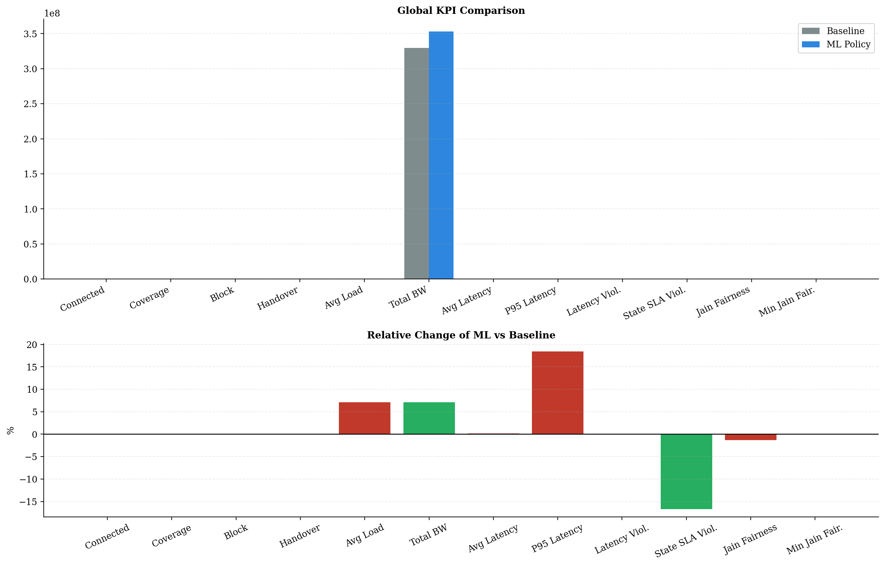
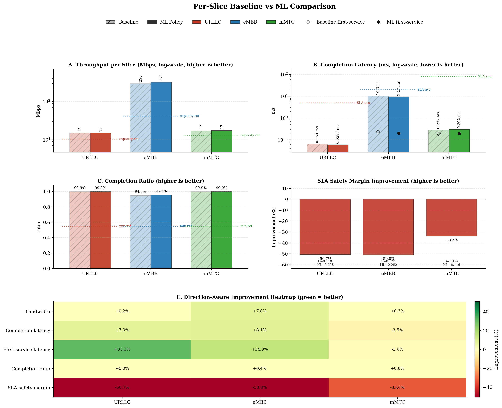
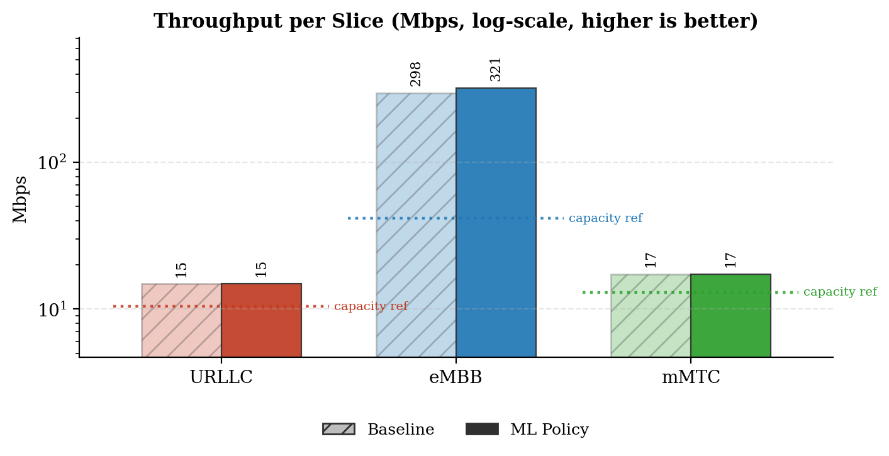
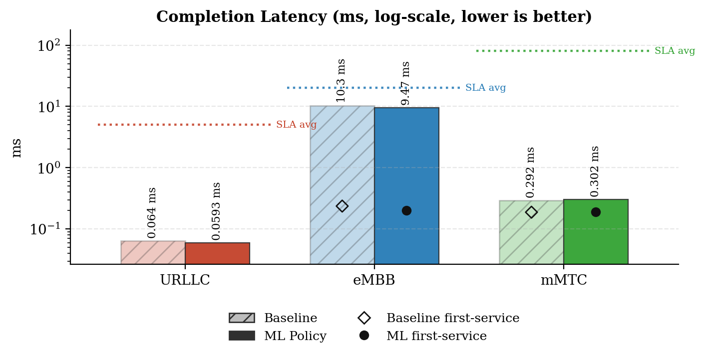
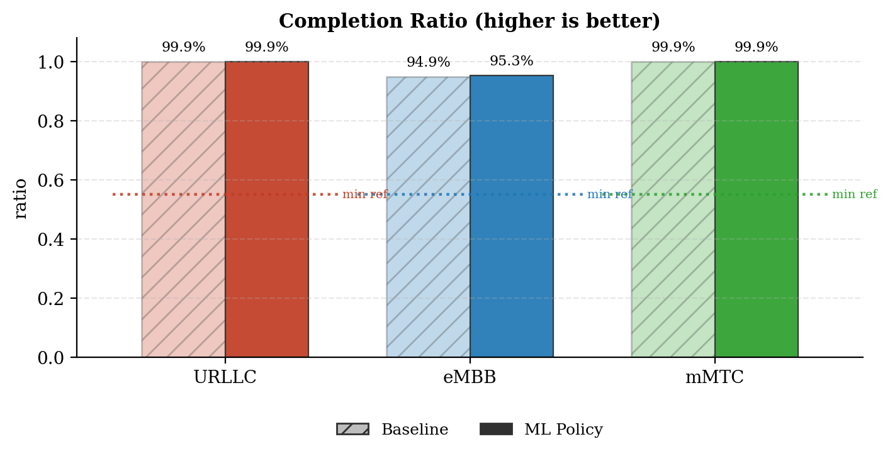
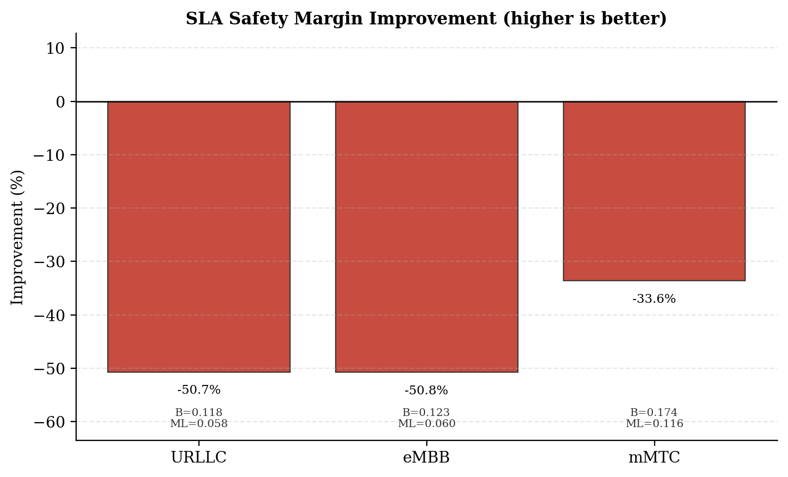
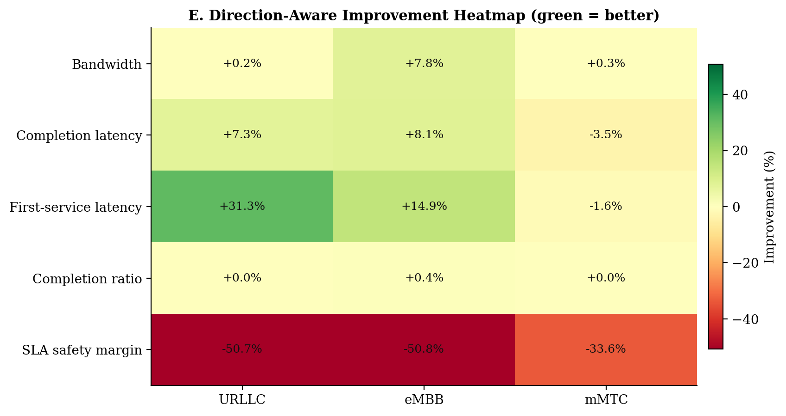
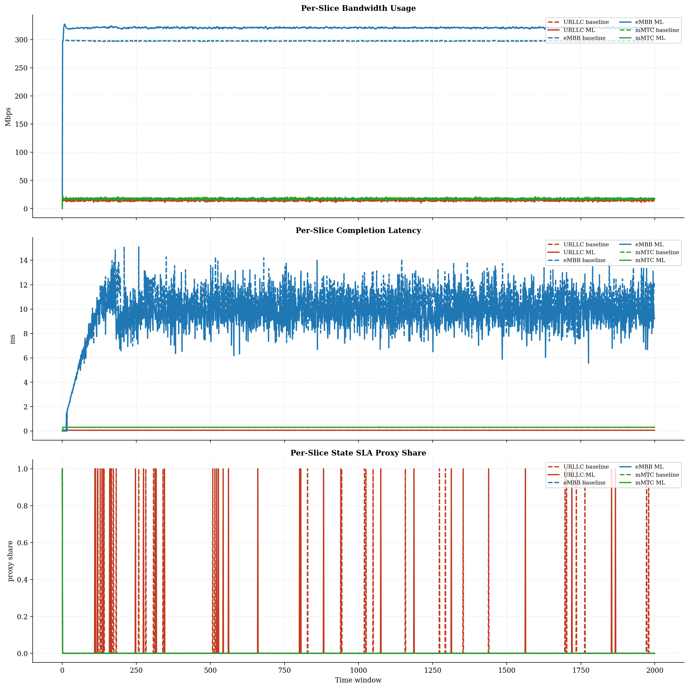
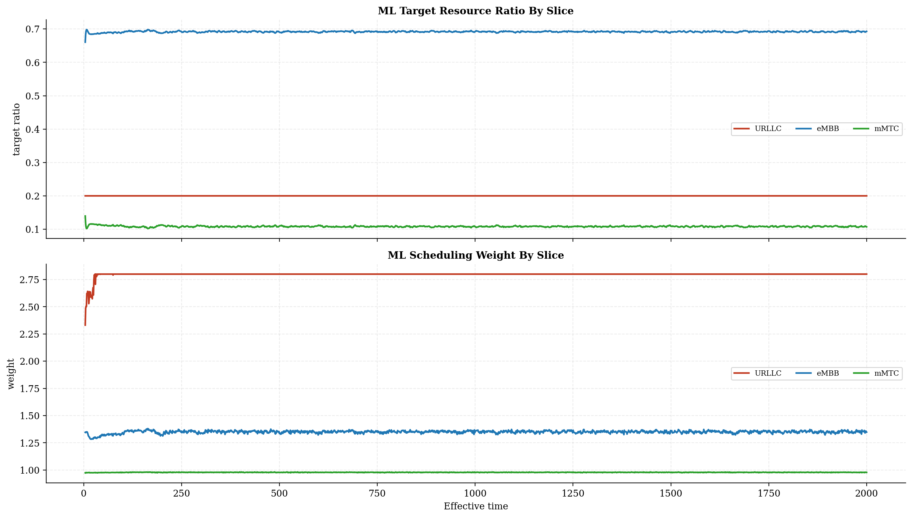
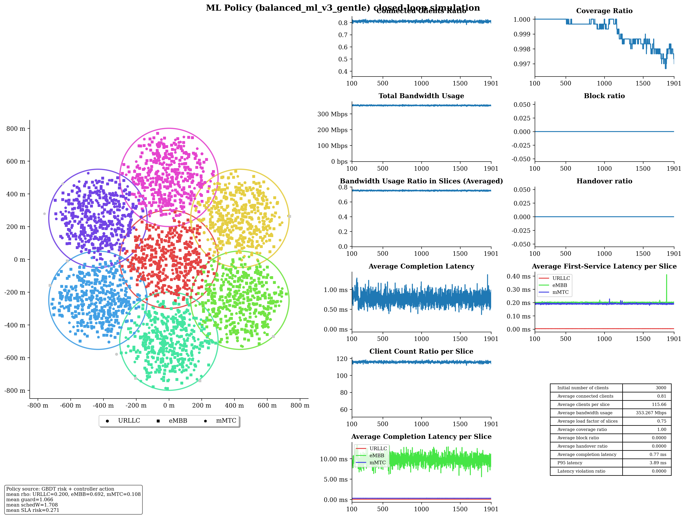

# Baseline vs ML Policy Report

## Run Summary

- Timestamp: `2026-05-08T21:13:51`
- Config: `C:\Users\LENOVO\Downloads\5G-Network-Slicing-main\5G-Network-Slicing-with-GBDT-ML-Policy\slicesim\scenario-light.yml`
- Model: `C:\Users\LENOVO\Downloads\5G-Network-Slicing-main\5G-Network-Slicing-with-GBDT-ML-Policy\models\sla_risk_gbdt`
- Controller type: `gbdt`
- Controller preset: `balanced_ml_v3_gentle`
- Broker enabled: `True`
- Broker preset: `forecasting_balanced`
- Seed: `1234`

## Global KPI Comparison

| metric | baseline | ml_policy | delta_ml_minus_baseline | delta_pct |
|---|---|---|---|---|
| connected_clients_ratio | 0.8101 | 0.8093 | -0.0007 | -0.0901 |
| coverage_ratio | 0.9991 | 0.9991 | -0.0000 | -0.0026 |
| block_ratio | 0.0000 | 0.0000 | 0.0000 | 0.0000 |
| handover_ratio | 0.0000 | 0.0000 | 0.0000 | 0.0000 |
| avg_slice_load_ratio | 0.7014 | 0.7512 | 0.0498 | 7.0998 |
| total_bandwidth_usage | 329646575.4139 | 353050742.2815 | 23404166.8676 | 7.0998 |
| avg_latency_ms | 0.7489 | 0.7500 | 0.0011 | 0.1511 |
| p95_latency_ms | 3.1719 | 3.7568 | 0.5848 | 18.4372 |
| latency_violation_ratio | 0.0000 | 0.0000 | 0.0000 | 0.0000 |
| avg_state_sla_violation_share | 0.0060 | 0.0050 | -0.0010 | -16.6667 |
| bandwidth_jain_fairness | 0.4067 | 0.4015 | -0.0052 | -1.2906 |
| bandwidth_jain_fairness_min | 0.3333 | 0.3333 | 0.0000 | 0.0000 |

## Per-Slice Summary

| slice_name | avg_bandwidth_usage_mbps_baseline | avg_bandwidth_usage_mbps_ml | avg_bandwidth_usage_mbps_delta | avg_served_bandwidth_baseline | avg_served_bandwidth_ml | avg_served_bandwidth_delta | avg_completion_latency_ms_baseline | avg_completion_latency_ms_ml | avg_completion_latency_ms_delta | avg_first_service_latency_ms_baseline | avg_first_service_latency_ms_ml | avg_first_service_latency_ms_delta | avg_recorded_first_service_latency_ms_baseline | avg_recorded_first_service_latency_ms_ml | avg_recorded_first_service_latency_ms_delta | avg_bandwidth_share_baseline | avg_bandwidth_share_ml | avg_bandwidth_share_delta | zero_bandwidth_window_share_baseline | zero_bandwidth_window_share_ml | zero_bandwidth_window_share_delta | completion_ratio_baseline | completion_ratio_ml | completion_ratio_delta | completion_latency_violation_ratio_baseline | completion_latency_violation_ratio_ml | completion_latency_violation_ratio_delta | first_service_latency_violation_ratio_baseline | first_service_latency_violation_ratio_ml | first_service_latency_violation_ratio_delta | request_latency_violation_event_ratio_baseline | request_latency_violation_event_ratio_ml | request_latency_violation_event_ratio_delta | avg_state_sla_violation_share_baseline | avg_state_sla_violation_share_ml | avg_state_sla_violation_share_delta | avg_sla_safety_margin_baseline | avg_sla_safety_margin_ml | avg_sla_safety_margin_delta | avg_sla_safety_margin_improvement_pct |
|---|---|---|---|---|---|---|---|---|---|---|---|---|---|---|---|---|---|---|---|---|---|---|---|---|---|---|---|---|---|---|---|---|---|---|---|---|---|---|---|---|
| URLLC | 14.8405 | 14.8628 | 0.0224 | 139756.5163 | 140001.8034 | 245.2872 | 0.0640 | 0.0593 | -0.0047 | 0.0054 | 0.0037 | -0.0017 | 0.0054 | 0.0037 | -0.0017 | 0.0455 | 0.0425 | -0.0029 | 0.0000 | 0.0000 | 0.0000 | 0.9994 | 0.9995 | 0.0000 | 0.0000 | 0.0000 | 0.0000 | 0.0000 | 0.0000 | 0.0000 | 0.0000 | 0.0000 | 0.0000 | 0.0170 | 0.0140 | -0.0030 | 0.1177 | 0.0580 | -0.0597 | -50.6898 |
| eMBB | 297.5284 | 320.8580 | 23.3296 | 158908.9480 | 172918.3961 | 14009.4481 | 10.2954 | 9.4657 | -0.8297 | 0.2368 | 0.2015 | -0.0353 | 0.2370 | 0.2018 | -0.0352 | 0.9022 | 0.9084 | 0.0062 | 0.0005 | 0.0005 | 0.0000 | 0.9493 | 0.9533 | 0.0040 | 0.0000 | 0.0000 | 0.0000 | 0.0000 | 0.0000 | 0.0000 | 0.0000 | 0.0000 | 0.0000 | 0.0005 | 0.0005 | 0.0000 | 0.1226 | 0.0604 | -0.0622 | -50.7726 |
| mMTC | 17.2777 | 17.3299 | 0.0522 | 79875.2133 | 80094.9986 | 219.7853 | 0.2920 | 0.3021 | 0.0101 | 0.1880 | 0.1910 | 0.0030 | 0.1881 | 0.1911 | 0.0030 | 0.0524 | 0.0491 | -0.0033 | 0.0005 | 0.0005 | 0.0000 | 0.9990 | 0.9990 | 0.0001 | 0.0000 | 0.0000 | 0.0000 | 0.0000 | 0.0000 | 0.0000 | 0.0000 | 0.0000 | 0.0000 | 0.0005 | 0.0005 | 0.0000 | 0.1741 | 0.1156 | -0.0586 | -33.6416 |

## Per-Base-Station Summary

| base_station_id | avg_bandwidth_usage_mbps_baseline | avg_bandwidth_usage_mbps_ml | avg_bandwidth_usage_mbps_delta | avg_bandwidth_usage_mbps_delta_pct | avg_capacity_mbps_baseline | avg_capacity_mbps_ml | avg_capacity_mbps_delta | avg_capacity_mbps_delta_pct | avg_load_ratio_baseline | avg_load_ratio_ml | avg_load_ratio_delta | avg_load_ratio_delta_pct | avg_remaining_capacity_ratio_baseline | avg_remaining_capacity_ratio_ml | avg_remaining_capacity_ratio_delta | avg_remaining_capacity_ratio_delta_pct | avg_request_count_per_window_baseline | avg_request_count_per_window_ml | avg_request_count_per_window_delta | avg_request_count_per_window_delta_pct | total_request_count_baseline | total_request_count_ml | total_request_count_delta | total_request_count_delta_pct | avg_requested_usage_mbps_per_window_baseline | avg_requested_usage_mbps_per_window_ml | avg_requested_usage_mbps_per_window_delta | avg_requested_usage_mbps_per_window_delta_pct | avg_clients_seen_per_window_baseline | avg_clients_seen_per_window_ml | avg_clients_seen_per_window_delta | avg_clients_seen_per_window_delta_pct | avg_connected_events_per_window_baseline | avg_connected_events_per_window_ml | avg_connected_events_per_window_delta | avg_connected_events_per_window_delta_pct | avg_disconnected_events_per_window_baseline | avg_disconnected_events_per_window_ml | avg_disconnected_events_per_window_delta | avg_disconnected_events_per_window_delta_pct | avg_state_sla_violation_share_baseline | avg_state_sla_violation_share_ml | avg_state_sla_violation_share_delta | avg_state_sla_violation_share_delta_pct | avg_sla_safety_margin_baseline | avg_sla_safety_margin_ml | avg_sla_safety_margin_delta | avg_sla_safety_margin_delta_pct | avg_sla_breach_count_per_window_baseline | avg_sla_breach_count_per_window_ml | avg_sla_breach_count_per_window_delta | avg_sla_breach_count_per_window_delta_pct |
|---|---|---|---|---|---|---|---|---|---|---|---|---|---|---|---|---|---|---|---|---|---|---|---|---|---|---|---|---|---|---|---|---|---|---|---|---|---|---|---|---|---|---|---|---|---|---|---|---|---|---|---|---|
| BS_0 | 54.4605 | 59.9313 | 5.4708 | 10.0455 | 80.0000 | 80.0000 | 0.0000 | 0.0000 | 0.6808 | 0.7491 | 0.0684 | 10.0455 | 0.3192 | 0.2509 | -0.0684 | -21.4211 | 53.9980 | 54.4420 | 0.4440 | 0.8223 | 107996.0000 | 108884.0000 | 888.0000 | 0.8223 | 55.7830 | 61.5680 | 5.7850 | 10.3705 | 427.6255 | 426.9775 | -0.6480 | -0.1515 | 53.9985 | 54.4435 | 0.4450 | 0.8241 | 53.8295 | 54.2780 | 0.4485 | 0.8332 | 0.0060 | 0.0050 | -0.0010 | -16.6667 | 0.1381 | 0.0780 | -0.0602 | -43.5506 | 0.0180 | 0.0150 | -0.0030 | -16.6667 |
| BS_1 | 45.9030 | 48.8761 | 2.9731 | 6.4769 | 65.0000 | 65.0000 | 0.0000 | 0.0000 | 0.7062 | 0.7519 | 0.0457 | 6.4769 | 0.2938 | 0.2481 | -0.0457 | -15.5684 | 47.8870 | 47.8060 | -0.0810 | -0.1691 | 95774.0000 | 95612.0000 | -162.0000 | -0.1691 | 47.1878 | 50.6577 | 3.4698 | 7.3532 | 429.8535 | 428.2835 | -1.5700 | -0.3652 | 47.8930 | 47.8200 | -0.0730 | -0.1524 | 47.7140 | 47.6520 | -0.0620 | -0.1299 | 0.0060 | 0.0050 | -0.0010 | -16.6667 | 0.1381 | 0.0780 | -0.0602 | -43.5506 | 0.0180 | 0.0150 | -0.0030 | -16.6667 |
| BS_2 | 45.4273 | 48.4150 | 2.9877 | 6.5769 | 65.0000 | 65.0000 | 0.0000 | 0.0000 | 0.6989 | 0.7448 | 0.0460 | 6.5769 | 0.3011 | 0.2552 | -0.0460 | -15.2647 | 45.0725 | 45.4195 | 0.3470 | 0.7699 | 90145.0000 | 90839.0000 | 694.0000 | 0.7699 | 47.0086 | 50.1001 | 3.0915 | 6.5764 | 428.3340 | 428.5810 | 0.2470 | 0.0577 | 45.0805 | 45.4355 | 0.3550 | 0.7875 | 44.9010 | 45.2580 | 0.3570 | 0.7951 | 0.0060 | 0.0050 | -0.0010 | -16.6667 | 0.1381 | 0.0780 | -0.0602 | -43.5506 | 0.0180 | 0.0150 | -0.0030 | -16.6667 |
| BS_3 | 46.0038 | 48.8235 | 2.8197 | 6.1292 | 65.0000 | 65.0000 | 0.0000 | 0.0000 | 0.7078 | 0.7511 | 0.0434 | 6.1292 | 0.2922 | 0.2489 | -0.0434 | -14.8433 | 50.0270 | 50.2580 | 0.2310 | 0.4618 | 100054.0000 | 100516.0000 | 462.0000 | 0.4618 | 47.3456 | 50.3945 | 3.0489 | 6.4396 | 427.7695 | 428.1460 | 0.3765 | 0.0880 | 50.0290 | 50.2665 | 0.2375 | 0.4747 | 49.8605 | 50.0960 | 0.2355 | 0.4723 | 0.0060 | 0.0050 | -0.0010 | -16.6667 | 0.1381 | 0.0780 | -0.0602 | -43.5506 | 0.0180 | 0.0150 | -0.0030 | -16.6667 |
| BS_4 | 45.9326 | 49.0812 | 3.1486 | 6.8548 | 65.0000 | 65.0000 | 0.0000 | 0.0000 | 0.7067 | 0.7551 | 0.0484 | 6.8548 | 0.2933 | 0.2449 | -0.0484 | -16.5129 | 47.2130 | 47.0895 | -0.1235 | -0.2616 | 94426.0000 | 94179.0000 | -247.0000 | -0.2616 | 47.4284 | 50.7969 | 3.3685 | 7.1022 | 428.6520 | 428.1445 | -0.5075 | -0.1184 | 47.2240 | 47.1020 | -0.1220 | -0.2583 | 47.0435 | 46.9240 | -0.1195 | -0.2540 | 0.0060 | 0.0050 | -0.0010 | -16.6667 | 0.1381 | 0.0780 | -0.0602 | -43.5506 | 0.0180 | 0.0150 | -0.0030 | -16.6667 |
| BS_5 | 46.3718 | 49.2935 | 2.9218 | 6.3007 | 65.0000 | 65.0000 | 0.0000 | 0.0000 | 0.7134 | 0.7584 | 0.0450 | 6.3007 | 0.2866 | 0.2416 | -0.0450 | -15.6845 | 52.4305 | 52.4540 | 0.0235 | 0.0448 | 104861.0000 | 104908.0000 | 47.0000 | 0.0448 | 47.7883 | 51.0294 | 3.2411 | 6.7821 | 429.0425 | 428.0870 | -0.9555 | -0.2227 | 52.4370 | 52.4565 | 0.0195 | 0.0372 | 52.2635 | 52.2875 | 0.0240 | 0.0459 | 0.0060 | 0.0050 | -0.0010 | -16.6667 | 0.1381 | 0.0780 | -0.0602 | -43.5506 | 0.0180 | 0.0150 | -0.0030 | -16.6667 |
| BS_6 | 45.5477 | 48.6302 | 3.0825 | 6.7677 | 65.0000 | 65.0000 | 0.0000 | 0.0000 | 0.7007 | 0.7482 | 0.0474 | 6.7677 | 0.2993 | 0.2518 | -0.0474 | -15.8465 | 44.5895 | 45.2880 | 0.6985 | 1.5665 | 89179.0000 | 90576.0000 | 1397.0000 | 1.5665 | 46.9289 | 50.4323 | 3.5034 | 7.4654 | 426.1155 | 429.0955 | 2.9800 | 0.6993 | 44.6070 | 45.3000 | 0.6930 | 1.5536 | 44.4335 | 45.1240 | 0.6905 | 1.5540 | 0.0060 | 0.0050 | -0.0010 | -16.6667 | 0.1381 | 0.0780 | -0.0602 | -43.5506 | 0.0180 | 0.0150 | -0.0030 | -16.6667 |

## Per-Base-Station Slice SLA Summary

| base_station_id | slice_name | avg_bandwidth_usage_mbps_baseline | avg_bandwidth_usage_mbps_ml | avg_bandwidth_usage_mbps_delta | avg_bandwidth_usage_mbps_delta_pct | avg_slice_capacity_mbps_baseline | avg_slice_capacity_mbps_ml | avg_slice_capacity_mbps_delta | avg_slice_capacity_mbps_delta_pct | avg_slice_load_ratio_baseline | avg_slice_load_ratio_ml | avg_slice_load_ratio_delta | avg_slice_load_ratio_delta_pct | avg_remaining_capacity_ratio_baseline | avg_remaining_capacity_ratio_ml | avg_remaining_capacity_ratio_delta | avg_remaining_capacity_ratio_delta_pct | avg_request_count_per_window_baseline | avg_request_count_per_window_ml | avg_request_count_per_window_delta | avg_request_count_per_window_delta_pct | total_request_count_baseline | total_request_count_ml | total_request_count_delta | total_request_count_delta_pct | avg_requested_usage_mbps_per_window_baseline | avg_requested_usage_mbps_per_window_ml | avg_requested_usage_mbps_per_window_delta | avg_requested_usage_mbps_per_window_delta_pct | avg_clients_seen_per_window_baseline | avg_clients_seen_per_window_ml | avg_clients_seen_per_window_delta | avg_clients_seen_per_window_delta_pct | avg_state_sla_violation_share_baseline | avg_state_sla_violation_share_ml | avg_state_sla_violation_share_delta | avg_state_sla_violation_share_delta_pct | avg_sla_safety_margin_baseline | avg_sla_safety_margin_ml | avg_sla_safety_margin_delta | avg_sla_safety_margin_delta_pct | avg_sla_breach_count_per_window_baseline | avg_sla_breach_count_per_window_ml | avg_sla_breach_count_per_window_delta | avg_sla_breach_count_per_window_delta_pct |
|---|---|---|---|---|---|---|---|---|---|---|---|---|---|---|---|---|---|---|---|---|---|---|---|---|---|---|---|---|---|---|---|---|---|---|---|---|---|---|---|---|---|---|---|---|---|
| BS_0 | URLLC | 2.5987 | 2.5661 | -0.0325 | -1.2521 | 14.4000 | 15.9968 | 1.5968 | 11.0889 | 0.1805 | 0.1604 | -0.0200 | -11.1087 | 0.8195 | 0.8396 | 0.0200 | 2.4462 | 18.5795 | 18.3545 | -0.2250 | -1.2110 | 37159.0000 | 36709.0000 | -450.0000 | -1.2110 | 2.5987 | 2.5661 | -0.0325 | -1.2521 | 48.7865 | 48.0000 | -0.7865 | -1.6121 | 0.0170 | 0.0140 | -0.0030 | -17.6471 | 0.1177 | 0.0580 | -0.0597 | -50.6898 | 0.0170 | 0.0140 | -0.0030 | -17.6471 |
| BS_0 | eMBB | 49.2734 | 54.7534 | 5.4800 | 11.1216 | 49.6000 | 55.4910 | 5.8910 | 11.8769 | 0.9934 | 0.9867 | -0.0068 | -0.6805 | 0.0066 | 0.0133 | 0.0068 | 102.6576 | 3.0870 | 3.4010 | 0.3140 | 10.1717 | 6174.0000 | 6802.0000 | 628.0000 | 10.1717 | 50.5945 | 56.3890 | 5.7945 | 11.4527 | 259.4745 | 258.6160 | -0.8585 | -0.3309 | 0.0005 | 0.0005 | 0.0000 | 0.0000 | 0.1226 | 0.0604 | -0.0622 | -50.7726 | 0.0005 | 0.0005 | 0.0000 | 0.0000 |
| BS_0 | mMTC | 2.5884 | 2.6118 | 0.0234 | 0.9035 | 16.0000 | 8.5122 | -7.4878 | -46.7985 | 0.1618 | 0.3073 | 0.1455 | 89.9618 | 0.8382 | 0.6927 | -0.1455 | -17.3626 | 32.3315 | 32.6865 | 0.3550 | 1.0980 | 64663.0000 | 65373.0000 | 710.0000 | 1.0980 | 2.5898 | 2.6128 | 0.0230 | 0.8894 | 119.3645 | 120.3615 | 0.9970 | 0.8353 | 0.0005 | 0.0005 | 0.0000 | 0.0000 | 0.1741 | 0.1156 | -0.0586 | -33.6416 | 0.0005 | 0.0005 | 0.0000 | 0.0000 |
| BS_1 | URLLC | 2.1060 | 2.0959 | -0.0101 | -0.4819 | 10.4000 | 12.9948 | 2.5948 | 24.9500 | 0.2025 | 0.1613 | -0.0412 | -20.3469 | 0.7975 | 0.8387 | 0.0412 | 5.1665 | 15.0410 | 14.9735 | -0.0675 | -0.4488 | 30082.0000 | 29947.0000 | -135.0000 | -0.4488 | 2.1060 | 2.0959 | -0.0101 | -0.4819 | 41.0000 | 40.5335 | -0.4665 | -1.1378 | 0.0170 | 0.0140 | -0.0030 | -17.6471 | 0.1177 | 0.0580 | -0.0597 | -50.6898 | 0.0170 | 0.0140 | -0.0030 | -17.6471 |
| BS_1 | eMBB | 41.3800 | 44.3758 | 2.9958 | 7.2398 | 41.6000 | 44.9511 | 3.3511 | 8.0556 | 0.9947 | 0.9872 | -0.0075 | -0.7585 | 0.0053 | 0.0128 | 0.0075 | 142.6545 | 2.5760 | 2.7915 | 0.2155 | 8.3657 | 5152.0000 | 5583.0000 | 431.0000 | 8.3657 | 42.6637 | 46.1566 | 3.4929 | 8.1871 | 277.0935 | 276.9820 | -0.1115 | -0.0402 | 0.0005 | 0.0005 | 0.0000 | 0.0000 | 0.1226 | 0.0604 | -0.0622 | -50.7726 | 0.0005 | 0.0005 | 0.0000 | 0.0000 |
| BS_1 | mMTC | 2.4170 | 2.4044 | -0.0126 | -0.5208 | 13.0000 | 7.0541 | -5.9459 | -45.7380 | 0.1859 | 0.3414 | 0.1555 | 83.6183 | 0.8141 | 0.6586 | -0.1555 | -19.0970 | 30.2700 | 30.0410 | -0.2290 | -0.7565 | 60540.0000 | 60082.0000 | -458.0000 | -0.7565 | 2.4182 | 2.4052 | -0.0129 | -0.5349 | 111.7600 | 110.7680 | -0.9920 | -0.8876 | 0.0005 | 0.0005 | 0.0000 | 0.0000 | 0.1741 | 0.1156 | -0.0586 | -33.6416 | 0.0005 | 0.0005 | 0.0000 | 0.0000 |
| BS_2 | URLLC | 1.5445 | 1.5767 | 0.0322 | 2.0846 | 10.4000 | 12.9948 | 2.5948 | 24.9500 | 0.1485 | 0.1214 | -0.0272 | -18.2849 | 0.8515 | 0.8786 | 0.0272 | 3.1890 | 11.0920 | 11.2495 | 0.1575 | 1.4199 | 22184.0000 | 22499.0000 | 315.0000 | 1.4199 | 1.5445 | 1.5767 | 0.0322 | 2.0846 | 28.8015 | 29.4665 | 0.6650 | 2.3089 | 0.0170 | 0.0140 | -0.0030 | -17.6471 | 0.1177 | 0.0580 | -0.0597 | -50.6898 | 0.0170 | 0.0140 | -0.0030 | -17.6471 |
| BS_2 | eMBB | 41.3790 | 44.3181 | 2.9392 | 7.1031 | 41.6000 | 44.8827 | 3.2827 | 7.8912 | 0.9947 | 0.9874 | -0.0073 | -0.7339 | 0.0053 | 0.0126 | 0.0073 | 137.3819 | 2.5995 | 2.7925 | 0.1930 | 7.4245 | 5199.0000 | 5585.0000 | 386.0000 | 7.4245 | 42.9591 | 46.0015 | 3.0424 | 7.0822 | 286.0045 | 285.1785 | -0.8260 | -0.2888 | 0.0005 | 0.0005 | 0.0000 | 0.0000 | 0.1226 | 0.0604 | -0.0622 | -50.7726 | 0.0005 | 0.0005 | 0.0000 | 0.0000 |
| BS_2 | mMTC | 2.5039 | 2.5202 | 0.0163 | 0.6526 | 13.0000 | 7.1225 | -5.8775 | -45.2119 | 0.1926 | 0.3545 | 0.1619 | 84.0326 | 0.8074 | 0.6455 | -0.1619 | -20.0461 | 31.3810 | 31.3775 | -0.0035 | -0.0112 | 62762.0000 | 62755.0000 | -7.0000 | -0.0112 | 2.5051 | 2.5219 | 0.0169 | 0.6730 | 113.5280 | 113.9360 | 0.4080 | 0.3594 | 0.0005 | 0.0005 | 0.0000 | 0.0000 | 0.1741 | 0.1156 | -0.0586 | -33.6416 | 0.0005 | 0.0005 | 0.0000 | 0.0000 |
| BS_3 | URLLC | 1.9720 | 1.9570 | -0.0150 | -0.7623 | 10.4000 | 12.9948 | 2.5948 | 24.9500 | 0.1896 | 0.1506 | -0.0390 | -20.5683 | 0.8104 | 0.8494 | 0.0390 | 4.8126 | 14.0865 | 14.0730 | -0.0135 | -0.0958 | 28173.0000 | 28146.0000 | -27.0000 | -0.0958 | 1.9720 | 1.9570 | -0.0150 | -0.7623 | 38.1985 | 38.1245 | -0.0740 | -0.1937 | 0.0170 | 0.0140 | -0.0030 | -17.6471 | 0.1177 | 0.0580 | -0.0597 | -50.6898 | 0.0170 | 0.0140 | -0.0030 | -17.6471 |
| BS_3 | eMBB | 41.3665 | 44.1915 | 2.8250 | 6.8291 | 41.6000 | 44.8178 | 3.2178 | 7.7351 | 0.9944 | 0.9860 | -0.0084 | -0.8443 | 0.0056 | 0.0140 | 0.0084 | 149.5990 | 2.5755 | 2.7455 | 0.1700 | 6.6007 | 5151.0000 | 5491.0000 | 340.0000 | 6.6007 | 42.7070 | 45.7614 | 3.0545 | 7.1521 | 266.5075 | 267.0690 | 0.5615 | 0.2107 | 0.0005 | 0.0005 | 0.0000 | 0.0000 | 0.1226 | 0.0604 | -0.0622 | -50.7726 | 0.0005 | 0.0005 | 0.0000 | 0.0000 |
| BS_3 | mMTC | 2.6653 | 2.6750 | 0.0097 | 0.3651 | 13.0000 | 7.1874 | -5.8126 | -44.7123 | 0.2050 | 0.3728 | 0.1677 | 81.8159 | 0.7950 | 0.6272 | -0.1677 | -21.1002 | 33.3650 | 33.4395 | 0.0745 | 0.2233 | 66730.0000 | 66879.0000 | 149.0000 | 0.2233 | 2.6666 | 2.6761 | 0.0094 | 0.3532 | 123.0635 | 122.9525 | -0.1110 | -0.0902 | 0.0005 | 0.0005 | 0.0000 | 0.0000 | 0.1741 | 0.1156 | -0.0586 | -33.6416 | 0.0005 | 0.0005 | 0.0000 | 0.0000 |
| BS_4 | URLLC | 2.3283 | 2.3047 | -0.0237 | -1.0162 | 10.4000 | 12.9948 | 2.5948 | 24.9500 | 0.2239 | 0.1774 | -0.0465 | -20.7771 | 0.7761 | 0.8226 | 0.0465 | 5.9932 | 16.7110 | 16.4095 | -0.3015 | -1.8042 | 33422.0000 | 32819.0000 | -603.0000 | -1.8042 | 2.3283 | 2.3047 | -0.0237 | -1.0162 | 45.0000 | 44.4580 | -0.5420 | -1.2044 | 0.0170 | 0.0140 | -0.0030 | -17.6471 | 0.1177 | 0.0580 | -0.0597 | -50.6898 | 0.0170 | 0.0140 | -0.0030 | -17.6471 |
| BS_4 | eMBB | 41.3824 | 44.5467 | 3.1643 | 7.6464 | 41.6000 | 45.0431 | 3.4431 | 8.2766 | 0.9948 | 0.9889 | -0.0058 | -0.5856 | 0.0052 | 0.0111 | 0.0058 | 111.3836 | 2.6045 | 2.8170 | 0.2125 | 8.1590 | 5209.0000 | 5634.0000 | 425.0000 | 8.1590 | 42.8771 | 46.2611 | 3.3840 | 7.8924 | 282.0380 | 281.6310 | -0.4070 | -0.1443 | 0.0005 | 0.0005 | 0.0000 | 0.0000 | 0.1226 | 0.0604 | -0.0622 | -50.7726 | 0.0005 | 0.0005 | 0.0000 | 0.0000 |
| BS_4 | mMTC | 2.2218 | 2.2298 | 0.0080 | 0.3590 | 13.0000 | 6.9621 | -6.0379 | -46.4450 | 0.1709 | 0.3207 | 0.1498 | 87.6564 | 0.8291 | 0.6793 | -0.1498 | -18.0697 | 27.8975 | 27.8630 | -0.0345 | -0.1237 | 55795.0000 | 55726.0000 | -69.0000 | -0.1237 | 2.2230 | 2.2311 | 0.0081 | 0.3645 | 101.6140 | 102.0555 | 0.4415 | 0.4345 | 0.0005 | 0.0005 | 0.0000 | 0.0000 | 0.1741 | 0.1156 | -0.0586 | -33.6416 | 0.0005 | 0.0005 | 0.0000 | 0.0000 |
| BS_5 | URLLC | 2.4232 | 2.4643 | 0.0412 | 1.6984 | 10.4000 | 12.9948 | 2.5948 | 24.9500 | 0.2330 | 0.1897 | -0.0433 | -18.6038 | 0.7670 | 0.8103 | 0.0433 | 5.6514 | 17.3380 | 17.5780 | 0.2400 | 1.3842 | 34676.0000 | 35156.0000 | 480.0000 | 1.3842 | 2.4232 | 2.4643 | 0.0412 | 1.6984 | 46.7445 | 47.0000 | 0.2555 | 0.5466 | 0.0170 | 0.0140 | -0.0030 | -17.6471 | 0.1177 | 0.0580 | -0.0597 | -50.6898 | 0.0170 | 0.0140 | -0.0030 | -17.6471 |
| BS_5 | eMBB | 41.3585 | 44.2613 | 2.9028 | 7.0185 | 41.6000 | 44.8818 | 3.2818 | 7.8890 | 0.9942 | 0.9861 | -0.0081 | -0.8103 | 0.0058 | 0.0139 | 0.0081 | 138.7825 | 2.5840 | 2.7845 | 0.2005 | 7.7593 | 5168.0000 | 5569.0000 | 401.0000 | 7.7593 | 42.7739 | 45.9955 | 3.2216 | 7.5317 | 264.0000 | 264.1395 | 0.1395 | 0.0528 | 0.0005 | 0.0005 | 0.0000 | 0.0000 | 0.1226 | 0.0604 | -0.0622 | -50.7726 | 0.0005 | 0.0005 | 0.0000 | 0.0000 |
| BS_5 | mMTC | 2.5901 | 2.5679 | -0.0222 | -0.8555 | 13.0000 | 7.1234 | -5.8766 | -45.2048 | 0.1992 | 0.3611 | 0.1619 | 81.2577 | 0.8008 | 0.6389 | -0.1619 | -20.2178 | 32.5085 | 32.0915 | -0.4170 | -1.2827 | 65017.0000 | 64183.0000 | -834.0000 | -1.2827 | 2.5913 | 2.5696 | -0.0217 | -0.8375 | 118.2980 | 116.9475 | -1.3505 | -1.1416 | 0.0005 | 0.0005 | 0.0000 | 0.0000 | 0.1741 | 0.1156 | -0.0586 | -33.6416 | 0.0005 | 0.0005 | 0.0000 | 0.0000 |
| BS_6 | URLLC | 1.8679 | 1.8982 | 0.0304 | 1.6264 | 10.4000 | 12.9948 | 2.5948 | 24.9500 | 0.1796 | 0.1461 | -0.0335 | -18.6701 | 0.8204 | 0.8539 | 0.0335 | 4.0873 | 13.3415 | 13.5215 | 0.1800 | 1.3492 | 26683.0000 | 27043.0000 | 360.0000 | 1.3492 | 1.8679 | 1.8982 | 0.0304 | 1.6264 | 34.4690 | 35.0000 | 0.5310 | 1.5405 | 0.0170 | 0.0140 | -0.0030 | -17.6471 | 0.1177 | 0.0580 | -0.0597 | -50.6898 | 0.0170 | 0.0140 | -0.0030 | -17.6471 |
| BS_6 | eMBB | 41.3886 | 44.4112 | 3.0226 | 7.3030 | 41.6000 | 45.0087 | 3.4087 | 8.1939 | 0.9949 | 0.9867 | -0.0082 | -0.8270 | 0.0051 | 0.0133 | 0.0082 | 161.9066 | 2.5895 | 2.8110 | 0.2215 | 8.5538 | 5179.0000 | 5622.0000 | 443.0000 | 8.5538 | 42.7689 | 46.2124 | 3.4434 | 8.0513 | 287.4880 | 289.0955 | 1.6075 | 0.5592 | 0.0005 | 0.0005 | 0.0000 | 0.0000 | 0.1226 | 0.0604 | -0.0622 | -50.7726 | 0.0005 | 0.0005 | 0.0000 | 0.0000 |
| BS_6 | mMTC | 2.2912 | 2.3207 | 0.0295 | 1.2879 | 13.0000 | 6.9965 | -6.0035 | -46.1806 | 0.1762 | 0.3322 | 0.1560 | 88.4881 | 0.8238 | 0.6678 | -0.1560 | -18.9324 | 28.6585 | 28.9555 | 0.2970 | 1.0363 | 57317.0000 | 57911.0000 | 594.0000 | 1.0363 | 2.2921 | 2.3217 | 0.0296 | 1.2914 | 104.1585 | 105.0000 | 0.8415 | 0.8079 | 0.0005 | 0.0005 | 0.0000 | 0.0000 | 0.1741 | 0.1156 | -0.0586 | -33.6416 | 0.0005 | 0.0005 | 0.0000 | 0.0000 |

## Resource Allocation Summary

| slice_name | baseline_state_ratio | ml_state_ratio | ml_action_target_ratio_mean | ml_action_target_ratio_min | ml_action_target_ratio_max | ml_scheduling_weight_mean | ml_admission_guard_factor_mean | target_ratio_delta_vs_baseline_state |
|---|---|---|---|---|---|---|---|---|
| URLLC | 0.1629 | 0.1999 | 0.2000 | 0.2000 | 0.2000 | 2.7975 | 1.1471 | 0.0371 |
| eMBB | 0.6371 | 0.6916 | 0.6917 | 0.6581 | 0.7000 | 1.3496 | 1.0430 | 0.0546 |
| mMTC | 0.2000 | 0.1085 | 0.1083 | 0.1000 | 0.1419 | 0.9783 | 1.0076 | -0.0917 |

## Visual Comparison

### Global KPI View

### Per-Slice View

### Per-Slice Panel Images

#### Throughput per Slice

#### Latency per Slice

#### Completion Ratio

#### SLA Safety Margin Improvement

#### Improvement Heatmap

### Per-Slice Time-Series View

### ML Action Distribution

### ML Policy Simulation Snapshot

## Metric Notes

- `avg_state_sla_violation_share` is the per-slice state-level SLA violation ratio averaged from simulator state frames.
- `avg_sla_safety_margin` is the average distance to the active SLA boundary. Higher is better; negative means violation.
- `avg_sla_safety_margin_improvement_pct` is `(ML margin - baseline margin) / abs(baseline margin) * 100`.
- `request_latency_violation_event_ratio`, `completion_latency_violation_ratio`, and `first_service_latency_violation_ratio` are client-level latency-only metrics.
- A latency value of `0` can mean no recorded latency event for that slice/window. Check `completion_ratio` and request/completion counts before interpreting it as perfect latency.
- `bandwidth_jain_fairness` is Jain's fairness index over per-slice bandwidth usage per time window. Higher is more balanced, with `1.0` meaning equal usage across slices.

## Trade-off Notes

- URLLC completion latency changed by -0.00 ms and SLA safety margin changed by -0.0597 (-50.7%).
- eMBB average bandwidth usage changed by 23.330 Mbps and completion ratio changed by 0.0040.
- mMTC first-service latency changed by 0.00 ms and completion ratio changed by 0.0001.
- URLLC recorded first-service latency changed by -0.00 ms on windows with actual first-service events.
- Classic trade-off snapshot: if URLLC improved by 0.00 ms in latency, eMBB bandwidth moved by 23.330 Mbps.

## Artifacts

- Baseline raw states: `C:\Users\LENOVO\Downloads\5G-Network-Slicing-main\5G-Network-Slicing-with-GBDT-ML-Policy\FINAL_OUTPUT_light_seed1234_20260508_202306\baseline_run\baseline_states.csv`
- ML raw states: `C:\Users\LENOVO\Downloads\5G-Network-Slicing-main\5G-Network-Slicing-with-GBDT-ML-Policy\FINAL_OUTPUT_light_seed1234_20260508_202306\ml_run\online_states_raw.csv`
- ML broker forecasts: `C:\Users\LENOVO\Downloads\5G-Network-Slicing-main\5G-Network-Slicing-with-GBDT-ML-Policy\FINAL_OUTPUT_light_seed1234_20260508_202306\ml_run\online_broker_forecasts.csv`
- ML broker feedback: `C:\Users\LENOVO\Downloads\5G-Network-Slicing-main\5G-Network-Slicing-with-GBDT-ML-Policy\FINAL_OUTPUT_light_seed1234_20260508_202306\ml_run\online_broker_feedback.csv`
- Comparison CSV (global): `C:\Users\LENOVO\Downloads\5G-Network-Slicing-main\5G-Network-Slicing-with-GBDT-ML-Policy\FINAL_OUTPUT_light_seed1234_20260508_202306\global_kpi_comparison.csv`
- Comparison CSV (per-slice): `C:\Users\LENOVO\Downloads\5G-Network-Slicing-main\5G-Network-Slicing-with-GBDT-ML-Policy\FINAL_OUTPUT_light_seed1234_20260508_202306\per_slice_comparison.csv`
- Comparison CSV (per-base-station): `C:\Users\LENOVO\Downloads\5G-Network-Slicing-main\5G-Network-Slicing-with-GBDT-ML-Policy\FINAL_OUTPUT_light_seed1234_20260508_202306\per_base_station_comparison.csv`
- Comparison CSV (per-base-station-slice): `C:\Users\LENOVO\Downloads\5G-Network-Slicing-main\5G-Network-Slicing-with-GBDT-ML-Policy\FINAL_OUTPUT_light_seed1234_20260508_202306\per_base_station_slice_comparison.csv`
- Resource allocation CSV: `C:\Users\LENOVO\Downloads\5G-Network-Slicing-main\5G-Network-Slicing-with-GBDT-ML-Policy\FINAL_OUTPUT_light_seed1234_20260508_202306\resource_allocation_summary.csv`
- ML action time-series CSV: `C:\Users\LENOVO\Downloads\5G-Network-Slicing-main\5G-Network-Slicing-with-GBDT-ML-Policy\FINAL_OUTPUT_light_seed1234_20260508_202306\ml_action_ratio_timeseries.csv`
- Global KPI plot: `C:\Users\LENOVO\Downloads\5G-Network-Slicing-main\5G-Network-Slicing-with-GBDT-ML-Policy\FINAL_OUTPUT_light_seed1234_20260508_202306\baseline_vs_ml_global_kpis.png`
- Per-slice bar plot: `C:\Users\LENOVO\Downloads\5G-Network-Slicing-main\5G-Network-Slicing-with-GBDT-ML-Policy\FINAL_OUTPUT_light_seed1234_20260508_202306\baseline_vs_ml_per_slice_bars.png`
- Per-slice vector plot (SVG): `C:\Users\LENOVO\Downloads\5G-Network-Slicing-main\5G-Network-Slicing-with-GBDT-ML-Policy\FINAL_OUTPUT_light_seed1234_20260508_202306\baseline_vs_ml_per_slice_bars.svg`
- Per-slice panel plot (Throughput per Slice): `C:\Users\LENOVO\Downloads\5G-Network-Slicing-main\5G-Network-Slicing-with-GBDT-ML-Policy\FINAL_OUTPUT_light_seed1234_20260508_202306\baseline_vs_ml_per_slice_bars_throughput.png`
- Per-slice panel plot (Latency per Slice): `C:\Users\LENOVO\Downloads\5G-Network-Slicing-main\5G-Network-Slicing-with-GBDT-ML-Policy\FINAL_OUTPUT_light_seed1234_20260508_202306\baseline_vs_ml_per_slice_bars_latency.png`
- Per-slice panel plot (Completion Ratio): `C:\Users\LENOVO\Downloads\5G-Network-Slicing-main\5G-Network-Slicing-with-GBDT-ML-Policy\FINAL_OUTPUT_light_seed1234_20260508_202306\baseline_vs_ml_per_slice_bars_completion_ratio.png`
- Per-slice panel plot (SLA Safety Margin Improvement): `C:\Users\LENOVO\Downloads\5G-Network-Slicing-main\5G-Network-Slicing-with-GBDT-ML-Policy\FINAL_OUTPUT_light_seed1234_20260508_202306\baseline_vs_ml_per_slice_bars_sla_margin_improvement.png`
- Per-slice panel plot (Improvement Heatmap): `C:\Users\LENOVO\Downloads\5G-Network-Slicing-main\5G-Network-Slicing-with-GBDT-ML-Policy\FINAL_OUTPUT_light_seed1234_20260508_202306\baseline_vs_ml_per_slice_bars_improvement_heatmap.png`
- Per-slice time-series plot: `C:\Users\LENOVO\Downloads\5G-Network-Slicing-main\5G-Network-Slicing-with-GBDT-ML-Policy\FINAL_OUTPUT_light_seed1234_20260508_202306\baseline_vs_ml_timeseries.png`
- ML action distribution plot: `C:\Users\LENOVO\Downloads\5G-Network-Slicing-main\5G-Network-Slicing-with-GBDT-ML-Policy\FINAL_OUTPUT_light_seed1234_20260508_202306\ml_action_distribution.png`
- ML policy simulation graph: `C:\Users\LENOVO\Downloads\5G-Network-Slicing-main\5G-Network-Slicing-with-GBDT-ML-Policy\FINAL_OUTPUT_light_seed1234_20260508_202306\ml_run\ml_policy_simulation.png`
