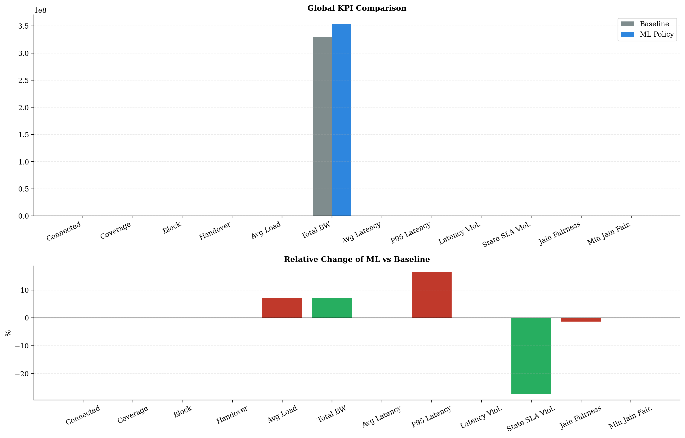
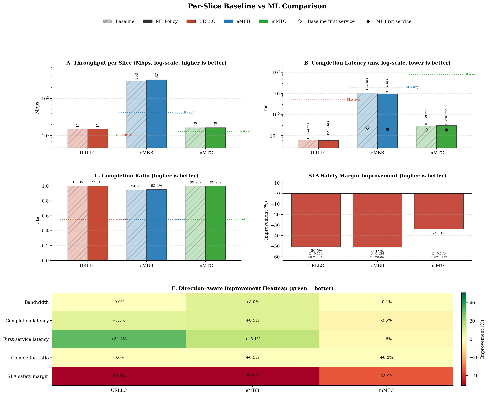
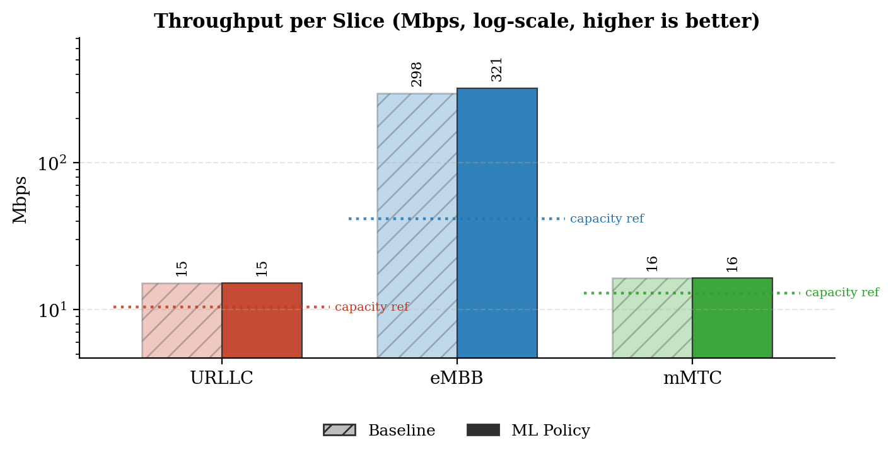
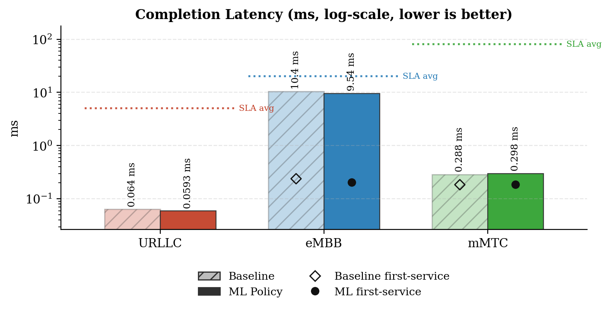
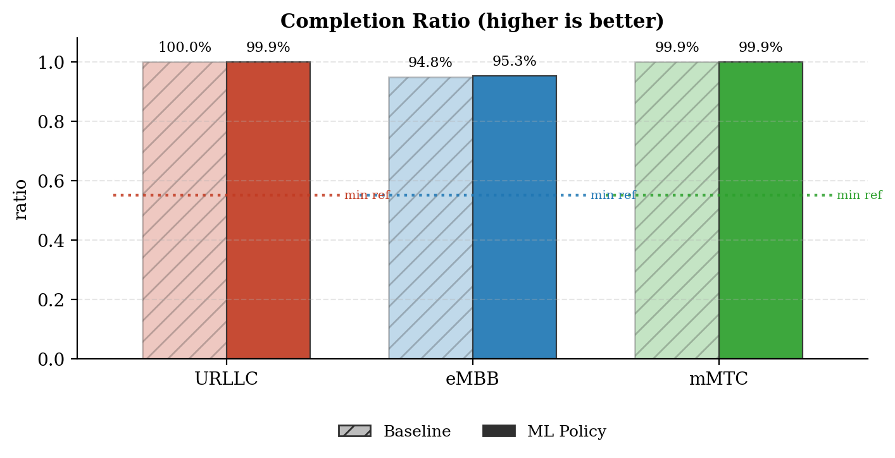
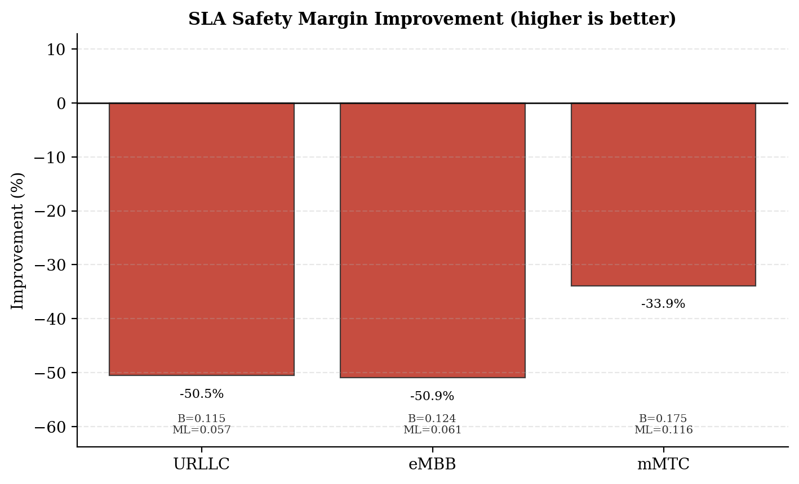
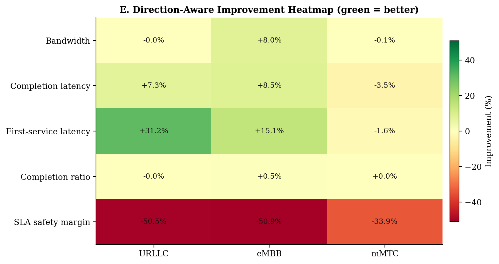
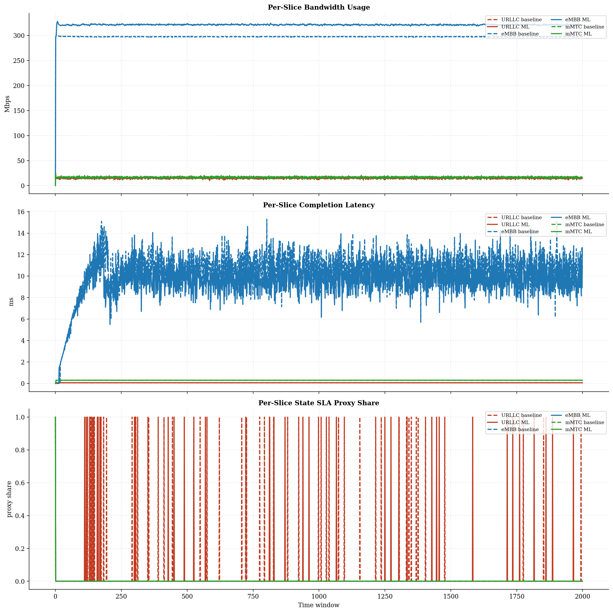
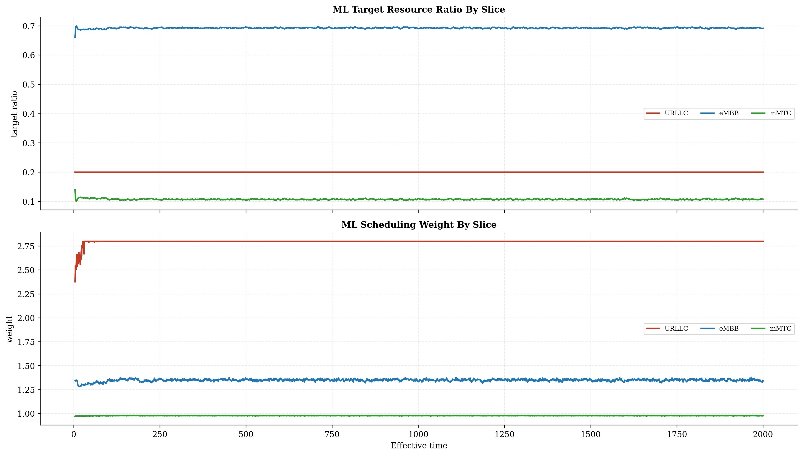
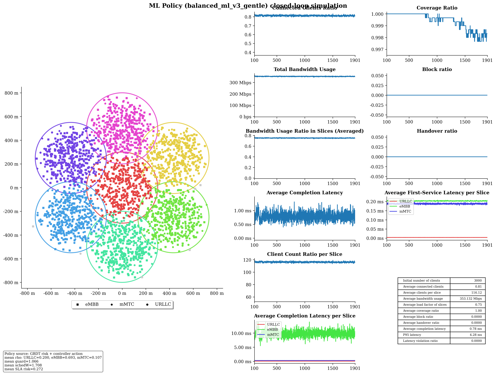

# Baseline vs ML Policy Report

## Run Summary

- Timestamp: `2026-05-08T10:26:44`
- Config: `C:\Users\LENOVO\Downloads\5G-Network-Slicing-main\5G-Network-Slicing-with-GBDT-ML-Policy\slicesim\scenario-light.yml`
- Model: `C:\Users\LENOVO\Downloads\5G-Network-Slicing-main\5G-Network-Slicing-with-GBDT-ML-Policy\models\sla_risk_gbdt`
- Controller type: `gbdt`
- Controller preset: `balanced_ml_v3_gentle`
- Broker enabled: `True`
- Broker preset: `forecasting_balanced`
- Seed: `123`

## Global KPI Comparison

| metric | baseline | ml_policy | delta_ml_minus_baseline | delta_pct |
|---|---|---|---|---|
| connected_clients_ratio | 0.8135 | 0.8125 | -0.0010 | -0.1189 |
| coverage_ratio | 0.9992 | 0.9994 | 0.0002 | 0.0172 |
| block_ratio | 0.0000 | 0.0000 | 0.0000 | 0.0000 |
| handover_ratio | 0.0000 | 0.0000 | 0.0000 | 0.0000 |
| avg_slice_load_ratio | 0.7003 | 0.7508 | 0.0505 | 7.2134 |
| total_bandwidth_usage | 329143375.8847 | 352885789.6428 | 23742413.7581 | 7.2134 |
| avg_latency_ms | 0.7648 | 0.7651 | 0.0003 | 0.0444 |
| p95_latency_ms | 3.5295 | 4.1103 | 0.5808 | 16.4567 |
| latency_violation_ratio | 0.0000 | 0.0000 | 0.0000 | 0.0000 |
| avg_state_sla_violation_share | 0.0092 | 0.0067 | -0.0025 | -27.2727 |
| bandwidth_jain_fairness | 0.4055 | 0.4001 | -0.0055 | -1.3461 |
| bandwidth_jain_fairness_min | 0.3333 | 0.3333 | 0.0000 | 0.0000 |

## Per-Slice Summary

| slice_name | avg_bandwidth_usage_mbps_baseline | avg_bandwidth_usage_mbps_ml | avg_bandwidth_usage_mbps_delta | avg_served_bandwidth_baseline | avg_served_bandwidth_ml | avg_served_bandwidth_delta | avg_completion_latency_ms_baseline | avg_completion_latency_ms_ml | avg_completion_latency_ms_delta | avg_first_service_latency_ms_baseline | avg_first_service_latency_ms_ml | avg_first_service_latency_ms_delta | avg_recorded_first_service_latency_ms_baseline | avg_recorded_first_service_latency_ms_ml | avg_recorded_first_service_latency_ms_delta | avg_bandwidth_share_baseline | avg_bandwidth_share_ml | avg_bandwidth_share_delta | zero_bandwidth_window_share_baseline | zero_bandwidth_window_share_ml | zero_bandwidth_window_share_delta | completion_ratio_baseline | completion_ratio_ml | completion_ratio_delta | completion_latency_violation_ratio_baseline | completion_latency_violation_ratio_ml | completion_latency_violation_ratio_delta | first_service_latency_violation_ratio_baseline | first_service_latency_violation_ratio_ml | first_service_latency_violation_ratio_delta | request_latency_violation_event_ratio_baseline | request_latency_violation_event_ratio_ml | request_latency_violation_event_ratio_delta | avg_state_sla_violation_share_baseline | avg_state_sla_violation_share_ml | avg_state_sla_violation_share_delta | avg_sla_safety_margin_baseline | avg_sla_safety_margin_ml | avg_sla_safety_margin_delta | avg_sla_safety_margin_improvement_pct |
|---|---|---|---|---|---|---|---|---|---|---|---|---|---|---|---|---|---|---|---|---|---|---|---|---|---|---|---|---|---|---|---|---|---|---|---|---|---|---|---|---|
| URLLC | 15.1757 | 15.1749 | -0.0007 | 139950.3332 | 139909.0077 | -41.3255 | 0.0640 | 0.0593 | -0.0047 | 0.0054 | 0.0037 | -0.0017 | 0.0054 | 0.0037 | -0.0017 | 0.0465 | 0.0434 | -0.0031 | 0.0000 | 0.0000 | 0.0000 | 0.9995 | 0.9995 | -0.0000 | 0.0000 | 0.0000 | 0.0000 | 0.0000 | 0.0000 | 0.0000 | 0.0000 | 0.0000 | 0.0000 | 0.0265 | 0.0190 | -0.0075 | 0.1155 | 0.0572 | -0.0583 | -50.5115 |
| eMBB | 297.5553 | 321.3202 | 23.7648 | 156395.0079 | 170437.5181 | 14042.5102 | 10.4323 | 9.5438 | -0.8885 | 0.2392 | 0.2031 | -0.0361 | 0.2394 | 0.2033 | -0.0361 | 0.9036 | 0.9101 | 0.0065 | 0.0005 | 0.0005 | 0.0000 | 0.9483 | 0.9526 | 0.0043 | 0.0000 | 0.0000 | 0.0000 | 0.0000 | 0.0000 | 0.0000 | 0.0000 | 0.0000 | 0.0000 | 0.0005 | 0.0005 | 0.0000 | 0.1240 | 0.0608 | -0.0631 | -50.9406 |
| mMTC | 16.4124 | 16.3907 | -0.0217 | 79995.3600 | 79941.2951 | -54.0649 | 0.2882 | 0.2982 | 0.0100 | 0.1847 | 0.1877 | 0.0030 | 0.1848 | 0.1877 | 0.0030 | 0.0498 | 0.0464 | -0.0034 | 0.0005 | 0.0005 | 0.0000 | 0.9990 | 0.9990 | 0.0000 | 0.0000 | 0.0000 | 0.0000 | 0.0000 | 0.0000 | 0.0000 | 0.0000 | 0.0000 | 0.0000 | 0.0005 | 0.0005 | 0.0000 | 0.1754 | 0.1160 | -0.0594 | -33.8782 |

## Per-Base-Station Summary

| base_station_id | avg_bandwidth_usage_mbps_baseline | avg_bandwidth_usage_mbps_ml | avg_bandwidth_usage_mbps_delta | avg_bandwidth_usage_mbps_delta_pct | avg_capacity_mbps_baseline | avg_capacity_mbps_ml | avg_capacity_mbps_delta | avg_capacity_mbps_delta_pct | avg_load_ratio_baseline | avg_load_ratio_ml | avg_load_ratio_delta | avg_load_ratio_delta_pct | avg_remaining_capacity_ratio_baseline | avg_remaining_capacity_ratio_ml | avg_remaining_capacity_ratio_delta | avg_remaining_capacity_ratio_delta_pct | avg_request_count_per_window_baseline | avg_request_count_per_window_ml | avg_request_count_per_window_delta | avg_request_count_per_window_delta_pct | total_request_count_baseline | total_request_count_ml | total_request_count_delta | total_request_count_delta_pct | avg_requested_usage_mbps_per_window_baseline | avg_requested_usage_mbps_per_window_ml | avg_requested_usage_mbps_per_window_delta | avg_requested_usage_mbps_per_window_delta_pct | avg_clients_seen_per_window_baseline | avg_clients_seen_per_window_ml | avg_clients_seen_per_window_delta | avg_clients_seen_per_window_delta_pct | avg_connected_events_per_window_baseline | avg_connected_events_per_window_ml | avg_connected_events_per_window_delta | avg_connected_events_per_window_delta_pct | avg_disconnected_events_per_window_baseline | avg_disconnected_events_per_window_ml | avg_disconnected_events_per_window_delta | avg_disconnected_events_per_window_delta_pct | avg_state_sla_violation_share_baseline | avg_state_sla_violation_share_ml | avg_state_sla_violation_share_delta | avg_state_sla_violation_share_delta_pct | avg_sla_safety_margin_baseline | avg_sla_safety_margin_ml | avg_sla_safety_margin_delta | avg_sla_safety_margin_delta_pct | avg_sla_breach_count_per_window_baseline | avg_sla_breach_count_per_window_ml | avg_sla_breach_count_per_window_delta | avg_sla_breach_count_per_window_delta_pct |
|---|---|---|---|---|---|---|---|---|---|---|---|---|---|---|---|---|---|---|---|---|---|---|---|---|---|---|---|---|---|---|---|---|---|---|---|---|---|---|---|---|---|---|---|---|---|---|---|---|---|---|---|---|
| BS_0 | 54.2145 | 59.7064 | 5.4919 | 10.1299 | 80.0000 | 80.0000 | 0.0000 | 0.0000 | 0.6777 | 0.7463 | 0.0686 | 10.1299 | 0.3223 | 0.2537 | -0.0686 | -21.2984 | 51.7095 | 52.1040 | 0.3945 | 0.7629 | 103419.0000 | 104208.0000 | 789.0000 | 0.7629 | 55.5401 | 61.3302 | 5.7901 | 10.4250 | 426.3340 | 428.2805 | 1.9465 | 0.4566 | 51.7120 | 52.1050 | 0.3930 | 0.7600 | 51.5400 | 51.9300 | 0.3900 | 0.7567 | 0.0092 | 0.0067 | -0.0025 | -27.2727 | 0.1383 | 0.0780 | -0.0603 | -43.6066 | 0.0275 | 0.0200 | -0.0075 | -27.2727 |
| BS_1 | 46.0435 | 48.9201 | 2.8766 | 6.2476 | 65.0000 | 65.0000 | 0.0000 | 0.0000 | 0.7084 | 0.7526 | 0.0443 | 6.2476 | 0.2916 | 0.2474 | -0.0443 | -15.1747 | 49.7090 | 49.7740 | 0.0650 | 0.1308 | 99418.0000 | 99548.0000 | 130.0000 | 0.1308 | 47.4921 | 50.4590 | 2.9668 | 6.2470 | 428.1505 | 427.8780 | -0.2725 | -0.0636 | 49.7135 | 49.7805 | 0.0670 | 0.1348 | 49.5380 | 49.6095 | 0.0715 | 0.1443 | 0.0092 | 0.0067 | -0.0025 | -27.2727 | 0.1383 | 0.0780 | -0.0603 | -43.6066 | 0.0275 | 0.0200 | -0.0075 | -27.2727 |
| BS_2 | 45.5873 | 48.5662 | 2.9789 | 6.5344 | 65.0000 | 65.0000 | 0.0000 | 0.0000 | 0.7013 | 0.7472 | 0.0458 | 6.5344 | 0.2987 | 0.2528 | -0.0458 | -15.3449 | 45.8245 | 46.3465 | 0.5220 | 1.1391 | 91649.0000 | 92693.0000 | 1044.0000 | 1.1391 | 46.9836 | 50.1745 | 3.1909 | 6.7915 | 428.2785 | 427.6300 | -0.6485 | -0.1514 | 45.8340 | 46.3600 | 0.5260 | 1.1476 | 45.6545 | 46.1860 | 0.5315 | 1.1642 | 0.0092 | 0.0067 | -0.0025 | -27.2727 | 0.1383 | 0.0780 | -0.0603 | -43.6066 | 0.0275 | 0.0200 | -0.0075 | -27.2727 |
| BS_3 | 45.7196 | 48.9073 | 3.1877 | 6.9723 | 65.0000 | 65.0000 | 0.0000 | 0.0000 | 0.7034 | 0.7524 | 0.0490 | 6.9723 | 0.2966 | 0.2476 | -0.0490 | -16.5333 | 45.1090 | 45.2310 | 0.1220 | 0.2705 | 90218.0000 | 90462.0000 | 244.0000 | 0.2705 | 47.0080 | 50.6048 | 3.5968 | 7.6515 | 428.4810 | 429.3910 | 0.9100 | 0.2124 | 45.1100 | 45.2480 | 0.1380 | 0.3059 | 44.9355 | 45.0680 | 0.1325 | 0.2949 | 0.0092 | 0.0067 | -0.0025 | -27.2727 | 0.1383 | 0.0780 | -0.0603 | -43.6066 | 0.0275 | 0.0200 | -0.0075 | -27.2727 |
| BS_4 | 46.2367 | 49.2426 | 3.0058 | 6.5009 | 65.0000 | 65.0000 | 0.0000 | 0.0000 | 0.7113 | 0.7576 | 0.0462 | 6.5009 | 0.2887 | 0.2424 | -0.0462 | -16.0196 | 49.9055 | 49.9050 | -0.0005 | -0.0010 | 99811.0000 | 99810.0000 | -1.0000 | -0.0010 | 47.5390 | 50.9399 | 3.4009 | 7.1540 | 430.1540 | 429.0285 | -1.1255 | -0.2617 | 49.9080 | 49.9175 | 0.0095 | 0.0190 | 49.7395 | 49.7470 | 0.0075 | 0.0151 | 0.0092 | 0.0067 | -0.0025 | -27.2727 | 0.1383 | 0.0780 | -0.0603 | -43.6066 | 0.0275 | 0.0200 | -0.0075 | -27.2727 |
| BS_5 | 45.8465 | 48.9665 | 3.1200 | 6.8052 | 65.0000 | 65.0000 | 0.0000 | 0.0000 | 0.7053 | 0.7533 | 0.0480 | 6.8052 | 0.2947 | 0.2467 | -0.0480 | -16.2892 | 45.9360 | 46.2805 | 0.3445 | 0.7500 | 91872.0000 | 92561.0000 | 689.0000 | 0.7500 | 47.2222 | 50.7134 | 3.4912 | 7.3931 | 427.7595 | 428.8775 | 1.1180 | 0.2614 | 45.9395 | 46.2820 | 0.3425 | 0.7455 | 45.7690 | 46.1095 | 0.3405 | 0.7440 | 0.0092 | 0.0067 | -0.0025 | -27.2727 | 0.1383 | 0.0780 | -0.0603 | -43.6066 | 0.0275 | 0.0200 | -0.0075 | -27.2727 |
| BS_6 | 45.4952 | 48.5767 | 3.0816 | 6.7735 | 65.0000 | 65.0000 | 0.0000 | 0.0000 | 0.6999 | 0.7473 | 0.0474 | 6.7735 | 0.3001 | 0.2527 | -0.0474 | -15.7991 | 44.1405 | 44.2690 | 0.1285 | 0.2911 | 88281.0000 | 88538.0000 | 257.0000 | 0.2911 | 46.9300 | 50.2606 | 3.3306 | 7.0969 | 428.4000 | 426.9865 | -1.4135 | -0.3299 | 44.1580 | 44.2700 | 0.1120 | 0.2536 | 43.9810 | 44.0940 | 0.1130 | 0.2569 | 0.0092 | 0.0067 | -0.0025 | -27.2727 | 0.1383 | 0.0780 | -0.0603 | -43.6066 | 0.0275 | 0.0200 | -0.0075 | -27.2727 |

## Per-Base-Station Slice SLA Summary

| base_station_id | slice_name | avg_bandwidth_usage_mbps_baseline | avg_bandwidth_usage_mbps_ml | avg_bandwidth_usage_mbps_delta | avg_bandwidth_usage_mbps_delta_pct | avg_slice_capacity_mbps_baseline | avg_slice_capacity_mbps_ml | avg_slice_capacity_mbps_delta | avg_slice_capacity_mbps_delta_pct | avg_slice_load_ratio_baseline | avg_slice_load_ratio_ml | avg_slice_load_ratio_delta | avg_slice_load_ratio_delta_pct | avg_remaining_capacity_ratio_baseline | avg_remaining_capacity_ratio_ml | avg_remaining_capacity_ratio_delta | avg_remaining_capacity_ratio_delta_pct | avg_request_count_per_window_baseline | avg_request_count_per_window_ml | avg_request_count_per_window_delta | avg_request_count_per_window_delta_pct | total_request_count_baseline | total_request_count_ml | total_request_count_delta | total_request_count_delta_pct | avg_requested_usage_mbps_per_window_baseline | avg_requested_usage_mbps_per_window_ml | avg_requested_usage_mbps_per_window_delta | avg_requested_usage_mbps_per_window_delta_pct | avg_clients_seen_per_window_baseline | avg_clients_seen_per_window_ml | avg_clients_seen_per_window_delta | avg_clients_seen_per_window_delta_pct | avg_state_sla_violation_share_baseline | avg_state_sla_violation_share_ml | avg_state_sla_violation_share_delta | avg_state_sla_violation_share_delta_pct | avg_sla_safety_margin_baseline | avg_sla_safety_margin_ml | avg_sla_safety_margin_delta | avg_sla_safety_margin_delta_pct | avg_sla_breach_count_per_window_baseline | avg_sla_breach_count_per_window_ml | avg_sla_breach_count_per_window_delta | avg_sla_breach_count_per_window_delta_pct |
|---|---|---|---|---|---|---|---|---|---|---|---|---|---|---|---|---|---|---|---|---|---|---|---|---|---|---|---|---|---|---|---|---|---|---|---|---|---|---|---|---|---|---|---|---|---|
| BS_0 | URLLC | 2.4420 | 2.4327 | -0.0093 | -0.3801 | 14.4000 | 15.9968 | 1.5968 | 11.0889 | 0.1696 | 0.1521 | -0.0175 | -10.3263 | 0.8304 | 0.8479 | 0.0175 | 2.1088 | 17.4110 | 17.4100 | -0.0010 | -0.0057 | 34822.0000 | 34820.0000 | -2.0000 | -0.0057 | 2.4420 | 2.4327 | -0.0093 | -0.3801 | 47.0000 | 47.0000 | 0.0000 | 0.0000 | 0.0265 | 0.0190 | -0.0075 | -28.3019 | 0.1155 | 0.0572 | -0.0583 | -50.5115 | 0.0265 | 0.0190 | -0.0075 | -28.3019 |
| BS_0 | eMBB | 49.2789 | 54.7808 | 5.5019 | 11.1647 | 49.6000 | 55.5336 | 5.9336 | 11.9629 | 0.9935 | 0.9864 | -0.0071 | -0.7180 | 0.0065 | 0.0136 | 0.0071 | 110.1944 | 3.0750 | 3.4455 | 0.3705 | 12.0488 | 6150.0000 | 6891.0000 | 741.0000 | 12.0488 | 50.6030 | 56.4034 | 5.8004 | 11.4625 | 265.1120 | 267.1035 | 1.9915 | 0.7512 | 0.0005 | 0.0005 | 0.0000 | 0.0000 | 0.1240 | 0.0608 | -0.0631 | -50.9406 | 0.0005 | 0.0005 | 0.0000 | 0.0000 |
| BS_0 | mMTC | 2.4936 | 2.4929 | -0.0007 | -0.0269 | 16.0000 | 8.4696 | -7.5304 | -47.0651 | 0.1559 | 0.2948 | 0.1389 | 89.1492 | 0.8441 | 0.7052 | -0.1389 | -16.4590 | 31.2235 | 31.2485 | 0.0250 | 0.0801 | 62447.0000 | 62497.0000 | 50.0000 | 0.0801 | 2.4951 | 2.4941 | -0.0010 | -0.0408 | 114.2220 | 114.1770 | -0.0450 | -0.0394 | 0.0005 | 0.0005 | 0.0000 | 0.0000 | 0.1754 | 0.1160 | -0.0594 | -33.8782 | 0.0005 | 0.0005 | 0.0000 | 0.0000 |
| BS_1 | URLLC | 2.0878 | 2.0470 | -0.0408 | -1.9528 | 10.4000 | 12.9948 | 2.5948 | 24.9500 | 0.2007 | 0.1575 | -0.0432 | -21.5261 | 0.7993 | 0.8425 | 0.0432 | 5.4067 | 14.8690 | 14.6265 | -0.2425 | -1.6309 | 29738.0000 | 29253.0000 | -485.0000 | -1.6309 | 2.0878 | 2.0470 | -0.0408 | -1.9528 | 38.9925 | 38.8785 | -0.1140 | -0.2924 | 0.0265 | 0.0190 | -0.0075 | -28.3019 | 0.1155 | 0.0572 | -0.0583 | -50.5115 | 0.0265 | 0.0190 | -0.0075 | -28.3019 |
| BS_1 | eMBB | 41.3681 | 44.2896 | 2.9215 | 7.0622 | 41.6000 | 44.8668 | 3.2668 | 7.8528 | 0.9944 | 0.9871 | -0.0073 | -0.7364 | 0.0056 | 0.0129 | 0.0073 | 131.3440 | 2.5790 | 2.7965 | 0.2175 | 8.4335 | 5158.0000 | 5593.0000 | 435.0000 | 8.4335 | 42.8149 | 45.8269 | 3.0120 | 7.0349 | 268.5085 | 268.0250 | -0.4835 | -0.1801 | 0.0005 | 0.0005 | 0.0000 | 0.0000 | 0.1240 | 0.0608 | -0.0631 | -50.9406 | 0.0005 | 0.0005 | 0.0000 | 0.0000 |
| BS_1 | mMTC | 2.5877 | 2.5835 | -0.0041 | -0.1601 | 13.0000 | 7.1384 | -5.8616 | -45.0889 | 0.1991 | 0.3625 | 0.1635 | 82.1206 | 0.8009 | 0.6375 | -0.1635 | -20.4086 | 32.2610 | 32.3510 | 0.0900 | 0.2790 | 64522.0000 | 64702.0000 | 180.0000 | 0.2790 | 2.5895 | 2.5851 | -0.0044 | -0.1696 | 120.6495 | 120.9745 | 0.3250 | 0.2694 | 0.0005 | 0.0005 | 0.0000 | 0.0000 | 0.1754 | 0.1160 | -0.0594 | -33.8782 | 0.0005 | 0.0005 | 0.0000 | 0.0000 |
| BS_2 | URLLC | 1.7602 | 1.7906 | 0.0304 | 1.7280 | 10.4000 | 12.9948 | 2.5948 | 24.9500 | 0.1693 | 0.1378 | -0.0314 | -18.5792 | 0.8307 | 0.8622 | 0.0314 | 3.7852 | 12.6285 | 12.7805 | 0.1520 | 1.2036 | 25257.0000 | 25561.0000 | 304.0000 | 1.2036 | 1.7602 | 1.7906 | 0.0304 | 1.7280 | 33.8985 | 34.0000 | 0.1015 | 0.2994 | 0.0265 | 0.0190 | -0.0075 | -28.3019 | 0.1155 | 0.0572 | -0.0583 | -50.5115 | 0.0265 | 0.0190 | -0.0075 | -28.3019 |
| BS_2 | eMBB | 41.3832 | 44.3090 | 2.9258 | 7.0701 | 41.6000 | 44.9107 | 3.3107 | 7.9584 | 0.9948 | 0.9866 | -0.0082 | -0.8261 | 0.0052 | 0.0134 | 0.0082 | 157.6613 | 2.6110 | 2.8025 | 0.1915 | 7.3344 | 5222.0000 | 5605.0000 | 383.0000 | 7.3344 | 42.7782 | 45.9163 | 3.1380 | 7.3356 | 283.4220 | 282.0130 | -1.4090 | -0.4971 | 0.0005 | 0.0005 | 0.0000 | 0.0000 | 0.1240 | 0.0608 | -0.0631 | -50.9406 | 0.0005 | 0.0005 | 0.0000 | 0.0000 |
| BS_2 | mMTC | 2.4439 | 2.4665 | 0.0226 | 0.9252 | 13.0000 | 7.0945 | -5.9055 | -45.4269 | 0.1880 | 0.3483 | 0.1603 | 85.2851 | 0.8120 | 0.6517 | -0.1603 | -19.7452 | 30.5850 | 30.7635 | 0.1785 | 0.5836 | 61170.0000 | 61527.0000 | 357.0000 | 0.5836 | 2.4452 | 2.4676 | 0.0224 | 0.9178 | 110.9580 | 111.6170 | 0.6590 | 0.5939 | 0.0005 | 0.0005 | 0.0000 | 0.0000 | 0.1754 | 0.1160 | -0.0594 | -33.8782 | 0.0005 | 0.0005 | 0.0000 | 0.0000 |
| BS_3 | URLLC | 2.1676 | 2.1658 | -0.0017 | -0.0795 | 10.4000 | 12.9948 | 2.5948 | 24.9500 | 0.2084 | 0.1667 | -0.0417 | -20.0280 | 0.7916 | 0.8333 | 0.0417 | 5.2733 | 15.4690 | 15.5170 | 0.0480 | 0.3103 | 30938.0000 | 31034.0000 | 96.0000 | 0.3103 | 2.1676 | 2.1658 | -0.0017 | -0.0795 | 41.8450 | 41.8970 | 0.0520 | 0.1243 | 0.0265 | 0.0190 | -0.0075 | -28.3019 | 0.1155 | 0.0572 | -0.0583 | -50.5115 | 0.0265 | 0.0190 | -0.0075 | -28.3019 |
| BS_3 | eMBB | 41.3860 | 44.5928 | 3.2068 | 7.7484 | 41.6000 | 45.0595 | 3.4595 | 8.3161 | 0.9949 | 0.9896 | -0.0053 | -0.5278 | 0.0051 | 0.0104 | 0.0053 | 102.0713 | 2.5900 | 2.8045 | 0.2145 | 8.2819 | 5180.0000 | 5609.0000 | 429.0000 | 8.2819 | 42.6734 | 46.2891 | 3.6157 | 8.4730 | 288.4530 | 288.8780 | 0.4250 | 0.1473 | 0.0005 | 0.0005 | 0.0000 | 0.0000 | 0.1240 | 0.0608 | -0.0631 | -50.9406 | 0.0005 | 0.0005 | 0.0000 | 0.0000 |
| BS_3 | mMTC | 2.1661 | 2.1487 | -0.0174 | -0.8015 | 13.0000 | 6.9457 | -6.0543 | -46.5716 | 0.1666 | 0.3098 | 0.1432 | 85.9364 | 0.8334 | 0.6902 | -0.1432 | -17.1815 | 27.0500 | 26.9095 | -0.1405 | -0.5194 | 54100.0000 | 53819.0000 | -281.0000 | -0.5194 | 2.1671 | 2.1499 | -0.0172 | -0.7917 | 98.1830 | 98.6160 | 0.4330 | 0.4410 | 0.0005 | 0.0005 | 0.0000 | 0.0000 | 0.1754 | 0.1160 | -0.0594 | -33.8782 | 0.0005 | 0.0005 | 0.0000 | 0.0000 |
| BS_4 | URLLC | 2.5388 | 2.5430 | 0.0042 | 0.1647 | 10.4000 | 12.9948 | 2.5948 | 24.9500 | 0.2441 | 0.1957 | -0.0484 | -19.8269 | 0.7559 | 0.8043 | 0.0484 | 6.4032 | 18.1875 | 18.1960 | 0.0085 | 0.0467 | 36375.0000 | 36392.0000 | 17.0000 | 0.0467 | 2.5388 | 2.5430 | 0.0042 | 0.1647 | 49.0000 | 48.9125 | -0.0875 | -0.1786 | 0.0265 | 0.0190 | -0.0075 | -28.3019 | 0.1155 | 0.0572 | -0.0583 | -50.5115 | 0.0265 | 0.0190 | -0.0075 | -28.3019 |
| BS_4 | eMBB | 41.3725 | 44.3914 | 3.0189 | 7.2969 | 41.6000 | 45.0039 | 3.4039 | 8.1824 | 0.9945 | 0.9864 | -0.0082 | -0.8222 | 0.0055 | 0.0136 | 0.0082 | 149.5367 | 2.5845 | 2.8030 | 0.2185 | 8.4542 | 5169.0000 | 5606.0000 | 437.0000 | 8.4542 | 42.6737 | 46.0879 | 3.4142 | 8.0007 | 273.3370 | 272.8630 | -0.4740 | -0.1734 | 0.0005 | 0.0005 | 0.0000 | 0.0000 | 0.1240 | 0.0608 | -0.0631 | -50.9406 | 0.0005 | 0.0005 | 0.0000 | 0.0000 |
| BS_4 | mMTC | 2.3254 | 2.3081 | -0.0173 | -0.7428 | 13.0000 | 7.0013 | -5.9987 | -46.1437 | 0.1789 | 0.3302 | 0.1513 | 84.5685 | 0.8211 | 0.6698 | -0.1513 | -18.4229 | 29.1335 | 28.9060 | -0.2275 | -0.7809 | 58267.0000 | 57812.0000 | -455.0000 | -0.7809 | 2.3265 | 2.3090 | -0.0175 | -0.7508 | 107.8170 | 107.2530 | -0.5640 | -0.5231 | 0.0005 | 0.0005 | 0.0000 | 0.0000 | 0.1754 | 0.1160 | -0.0594 | -33.8782 | 0.0005 | 0.0005 | 0.0000 | 0.0000 |
| BS_5 | URLLC | 2.3274 | 2.3299 | 0.0025 | 0.1090 | 10.4000 | 12.9948 | 2.5948 | 24.9500 | 0.2238 | 0.1793 | -0.0445 | -19.8729 | 0.7762 | 0.8207 | 0.0445 | 5.7294 | 16.6525 | 16.6055 | -0.0470 | -0.2822 | 33305.0000 | 33211.0000 | -94.0000 | -0.2822 | 2.3274 | 2.3299 | 0.0025 | 0.1090 | 45.0000 | 44.9935 | -0.0065 | -0.0144 | 0.0265 | 0.0190 | -0.0075 | -28.3019 | 0.1155 | 0.0572 | -0.0583 | -50.5115 | 0.0265 | 0.0190 | -0.0075 | -28.3019 |
| BS_5 | eMBB | 41.3827 | 44.4983 | 3.1155 | 7.5286 | 41.6000 | 45.0733 | 3.4733 | 8.3494 | 0.9948 | 0.9872 | -0.0076 | -0.7612 | 0.0052 | 0.0128 | 0.0076 | 144.9774 | 2.6000 | 2.8165 | 0.2165 | 8.3269 | 5200.0000 | 5633.0000 | 433.0000 | 8.3269 | 42.7576 | 46.2440 | 3.4865 | 8.1540 | 283.8835 | 284.5800 | 0.6965 | 0.2453 | 0.0005 | 0.0005 | 0.0000 | 0.0000 | 0.1240 | 0.0608 | -0.0631 | -50.9406 | 0.0005 | 0.0005 | 0.0000 | 0.0000 |
| BS_5 | mMTC | 2.1364 | 2.1383 | 0.0019 | 0.0881 | 13.0000 | 6.9319 | -6.0681 | -46.6780 | 0.1643 | 0.3090 | 0.1447 | 88.0358 | 0.8357 | 0.6910 | -0.1447 | -17.3131 | 26.6835 | 26.8585 | 0.1750 | 0.6558 | 53367.0000 | 53717.0000 | 350.0000 | 0.6558 | 2.1372 | 2.1394 | 0.0022 | 0.1028 | 98.8760 | 99.3040 | 0.4280 | 0.4329 | 0.0005 | 0.0005 | 0.0000 | 0.0000 | 0.1754 | 0.1160 | -0.0594 | -33.8782 | 0.0005 | 0.0005 | 0.0000 | 0.0000 |
| BS_6 | URLLC | 1.8520 | 1.8659 | 0.0139 | 0.7505 | 10.4000 | 12.9948 | 2.5948 | 24.9500 | 0.1781 | 0.1436 | -0.0345 | -19.3582 | 0.8219 | 0.8564 | 0.0345 | 4.1940 | 13.2125 | 13.3300 | 0.1175 | 0.8893 | 26425.0000 | 26660.0000 | 235.0000 | 0.8893 | 1.8520 | 1.8659 | 0.0139 | 0.7505 | 35.0000 | 35.1215 | 0.1215 | 0.3471 | 0.0265 | 0.0190 | -0.0075 | -28.3019 | 0.1155 | 0.0572 | -0.0583 | -50.5115 | 0.0265 | 0.0190 | -0.0075 | -28.3019 |
| BS_6 | eMBB | 41.3839 | 44.4583 | 3.0744 | 7.4290 | 41.6000 | 45.0221 | 3.4221 | 8.2263 | 0.9948 | 0.9874 | -0.0074 | -0.7404 | 0.0052 | 0.0126 | 0.0074 | 141.8162 | 2.5890 | 2.8370 | 0.2480 | 9.5790 | 5178.0000 | 5674.0000 | 496.0000 | 9.5790 | 42.8176 | 46.1410 | 3.3234 | 7.7618 | 290.5650 | 289.9110 | -0.6540 | -0.2251 | 0.0005 | 0.0005 | 0.0000 | 0.0000 | 0.1240 | 0.0608 | -0.0631 | -50.9406 | 0.0005 | 0.0005 | 0.0000 | 0.0000 |
| BS_6 | mMTC | 2.2592 | 2.2525 | -0.0067 | -0.2968 | 13.0000 | 6.9831 | -6.0169 | -46.2841 | 0.1738 | 0.3231 | 0.1493 | 85.8975 | 0.8262 | 0.6769 | -0.1493 | -18.0679 | 28.3390 | 28.1020 | -0.2370 | -0.8363 | 56678.0000 | 56204.0000 | -474.0000 | -0.8363 | 2.2604 | 2.2537 | -0.0068 | -0.2989 | 102.8350 | 101.9540 | -0.8810 | -0.8567 | 0.0005 | 0.0005 | 0.0000 | 0.0000 | 0.1754 | 0.1160 | -0.0594 | -33.8782 | 0.0005 | 0.0005 | 0.0000 | 0.0000 |

## Resource Allocation Summary

| slice_name | baseline_state_ratio | ml_state_ratio | ml_action_target_ratio_mean | ml_action_target_ratio_min | ml_action_target_ratio_max | ml_scheduling_weight_mean | ml_admission_guard_factor_mean | target_ratio_delta_vs_baseline_state |
|---|---|---|---|---|---|---|---|---|
| URLLC | 0.1629 | 0.1999 | 0.2000 | 0.2000 | 0.2000 | 2.7978 | 1.1470 | 0.0371 |
| eMBB | 0.6371 | 0.6924 | 0.6925 | 0.6576 | 0.7000 | 1.3485 | 1.0434 | 0.0554 |
| mMTC | 0.2000 | 0.1076 | 0.1075 | 0.1000 | 0.1424 | 0.9771 | 1.0080 | -0.0925 |

## Visual Comparison

### Global KPI View

### Per-Slice View

### Per-Slice Panel Images

#### Throughput per Slice

#### Latency per Slice

#### Completion Ratio

#### SLA Safety Margin Improvement

#### Improvement Heatmap

### Per-Slice Time-Series View

### ML Action Distribution

### ML Policy Simulation Snapshot

## Metric Notes

- `avg_state_sla_violation_share` is the per-slice state-level SLA violation ratio averaged from simulator state frames.
- `avg_sla_safety_margin` is the average distance to the active SLA boundary. Higher is better; negative means violation.
- `avg_sla_safety_margin_improvement_pct` is `(ML margin - baseline margin) / abs(baseline margin) * 100`.
- `request_latency_violation_event_ratio`, `completion_latency_violation_ratio`, and `first_service_latency_violation_ratio` are client-level latency-only metrics.
- A latency value of `0` can mean no recorded latency event for that slice/window. Check `completion_ratio` and request/completion counts before interpreting it as perfect latency.
- `bandwidth_jain_fairness` is Jain's fairness index over per-slice bandwidth usage per time window. Higher is more balanced, with `1.0` meaning equal usage across slices.

## Trade-off Notes

- URLLC completion latency changed by -0.00 ms and SLA safety margin changed by -0.0583 (-50.5%).
- eMBB average bandwidth usage changed by 23.765 Mbps and completion ratio changed by 0.0043.
- mMTC first-service latency changed by 0.00 ms and completion ratio changed by 0.0000.
- URLLC recorded first-service latency changed by -0.00 ms on windows with actual first-service events.
- Classic trade-off snapshot: if URLLC improved by 0.00 ms in latency, eMBB bandwidth moved by 23.765 Mbps.

## Artifacts

- Baseline raw states: `C:\Users\LENOVO\Downloads\5G-Network-Slicing-main\5G-Network-Slicing-with-GBDT-ML-Policy\FINAL_OUTPUT_light_seed123_20260508_093101\baseline_run\baseline_states.csv`
- ML raw states: `C:\Users\LENOVO\Downloads\5G-Network-Slicing-main\5G-Network-Slicing-with-GBDT-ML-Policy\FINAL_OUTPUT_light_seed123_20260508_093101\ml_run\online_states_raw.csv`
- ML broker forecasts: `C:\Users\LENOVO\Downloads\5G-Network-Slicing-main\5G-Network-Slicing-with-GBDT-ML-Policy\FINAL_OUTPUT_light_seed123_20260508_093101\ml_run\online_broker_forecasts.csv`
- ML broker feedback: `C:\Users\LENOVO\Downloads\5G-Network-Slicing-main\5G-Network-Slicing-with-GBDT-ML-Policy\FINAL_OUTPUT_light_seed123_20260508_093101\ml_run\online_broker_feedback.csv`
- Comparison CSV (global): `C:\Users\LENOVO\Downloads\5G-Network-Slicing-main\5G-Network-Slicing-with-GBDT-ML-Policy\FINAL_OUTPUT_light_seed123_20260508_093101\global_kpi_comparison.csv`
- Comparison CSV (per-slice): `C:\Users\LENOVO\Downloads\5G-Network-Slicing-main\5G-Network-Slicing-with-GBDT-ML-Policy\FINAL_OUTPUT_light_seed123_20260508_093101\per_slice_comparison.csv`
- Comparison CSV (per-base-station): `C:\Users\LENOVO\Downloads\5G-Network-Slicing-main\5G-Network-Slicing-with-GBDT-ML-Policy\FINAL_OUTPUT_light_seed123_20260508_093101\per_base_station_comparison.csv`
- Comparison CSV (per-base-station-slice): `C:\Users\LENOVO\Downloads\5G-Network-Slicing-main\5G-Network-Slicing-with-GBDT-ML-Policy\FINAL_OUTPUT_light_seed123_20260508_093101\per_base_station_slice_comparison.csv`
- Resource allocation CSV: `C:\Users\LENOVO\Downloads\5G-Network-Slicing-main\5G-Network-Slicing-with-GBDT-ML-Policy\FINAL_OUTPUT_light_seed123_20260508_093101\resource_allocation_summary.csv`
- ML action time-series CSV: `C:\Users\LENOVO\Downloads\5G-Network-Slicing-main\5G-Network-Slicing-with-GBDT-ML-Policy\FINAL_OUTPUT_light_seed123_20260508_093101\ml_action_ratio_timeseries.csv`
- Global KPI plot: `C:\Users\LENOVO\Downloads\5G-Network-Slicing-main\5G-Network-Slicing-with-GBDT-ML-Policy\FINAL_OUTPUT_light_seed123_20260508_093101\baseline_vs_ml_global_kpis.png`
- Per-slice bar plot: `C:\Users\LENOVO\Downloads\5G-Network-Slicing-main\5G-Network-Slicing-with-GBDT-ML-Policy\FINAL_OUTPUT_light_seed123_20260508_093101\baseline_vs_ml_per_slice_bars.png`
- Per-slice vector plot (SVG): `C:\Users\LENOVO\Downloads\5G-Network-Slicing-main\5G-Network-Slicing-with-GBDT-ML-Policy\FINAL_OUTPUT_light_seed123_20260508_093101\baseline_vs_ml_per_slice_bars.svg`
- Per-slice panel plot (Throughput per Slice): `C:\Users\LENOVO\Downloads\5G-Network-Slicing-main\5G-Network-Slicing-with-GBDT-ML-Policy\FINAL_OUTPUT_light_seed123_20260508_093101\baseline_vs_ml_per_slice_bars_throughput.png`
- Per-slice panel plot (Latency per Slice): `C:\Users\LENOVO\Downloads\5G-Network-Slicing-main\5G-Network-Slicing-with-GBDT-ML-Policy\FINAL_OUTPUT_light_seed123_20260508_093101\baseline_vs_ml_per_slice_bars_latency.png`
- Per-slice panel plot (Completion Ratio): `C:\Users\LENOVO\Downloads\5G-Network-Slicing-main\5G-Network-Slicing-with-GBDT-ML-Policy\FINAL_OUTPUT_light_seed123_20260508_093101\baseline_vs_ml_per_slice_bars_completion_ratio.png`
- Per-slice panel plot (SLA Safety Margin Improvement): `C:\Users\LENOVO\Downloads\5G-Network-Slicing-main\5G-Network-Slicing-with-GBDT-ML-Policy\FINAL_OUTPUT_light_seed123_20260508_093101\baseline_vs_ml_per_slice_bars_sla_margin_improvement.png`
- Per-slice panel plot (Improvement Heatmap): `C:\Users\LENOVO\Downloads\5G-Network-Slicing-main\5G-Network-Slicing-with-GBDT-ML-Policy\FINAL_OUTPUT_light_seed123_20260508_093101\baseline_vs_ml_per_slice_bars_improvement_heatmap.png`
- Per-slice time-series plot: `C:\Users\LENOVO\Downloads\5G-Network-Slicing-main\5G-Network-Slicing-with-GBDT-ML-Policy\FINAL_OUTPUT_light_seed123_20260508_093101\baseline_vs_ml_timeseries.png`
- ML action distribution plot: `C:\Users\LENOVO\Downloads\5G-Network-Slicing-main\5G-Network-Slicing-with-GBDT-ML-Policy\FINAL_OUTPUT_light_seed123_20260508_093101\ml_action_distribution.png`
- ML policy simulation graph: `C:\Users\LENOVO\Downloads\5G-Network-Slicing-main\5G-Network-Slicing-with-GBDT-ML-Policy\FINAL_OUTPUT_light_seed123_20260508_093101\ml_run\ml_policy_simulation.png`
