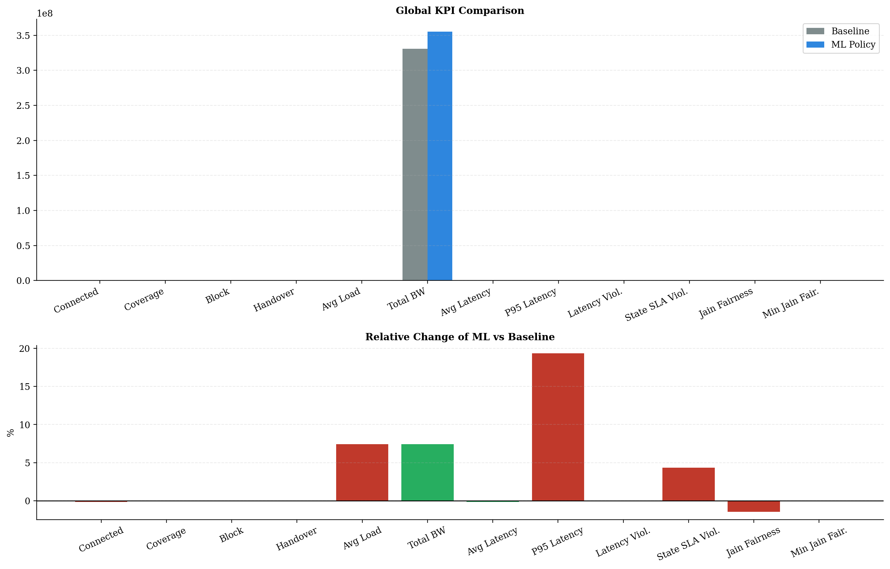
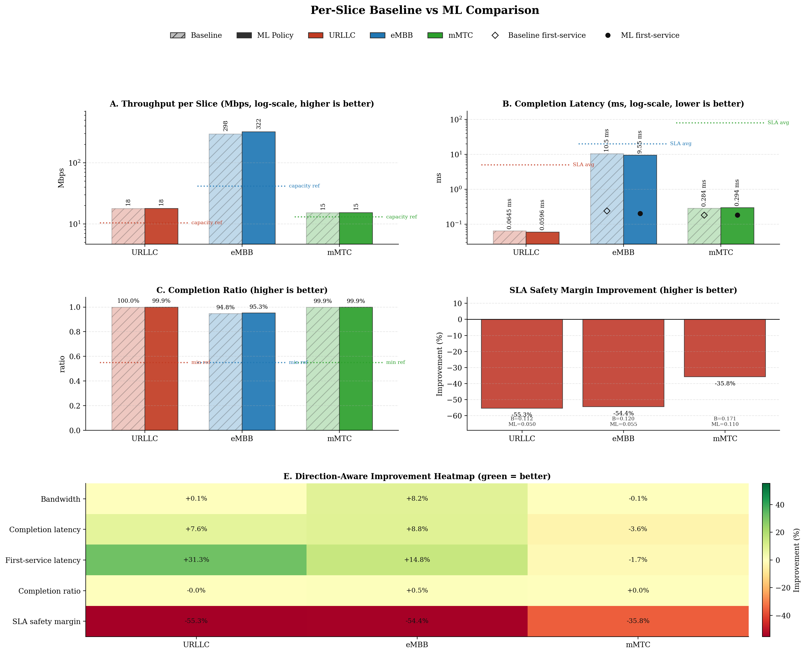
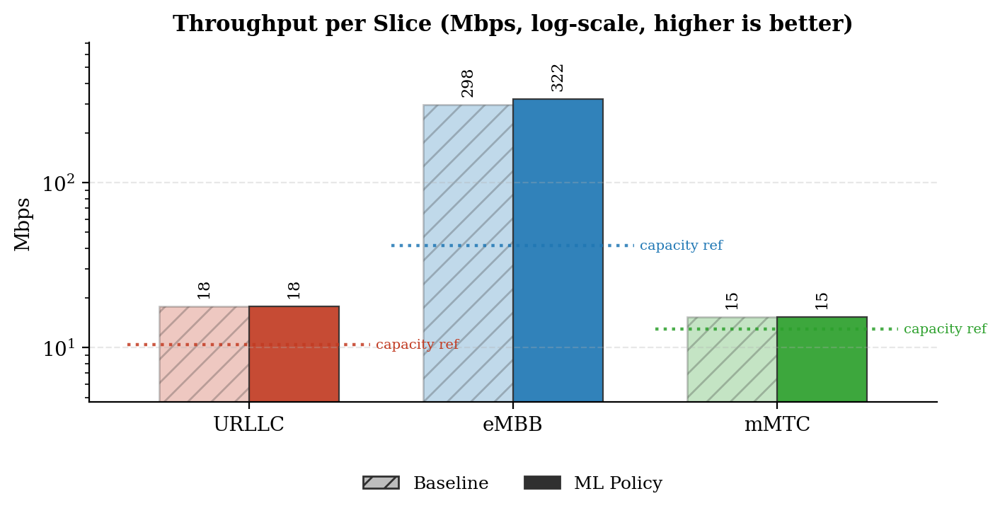
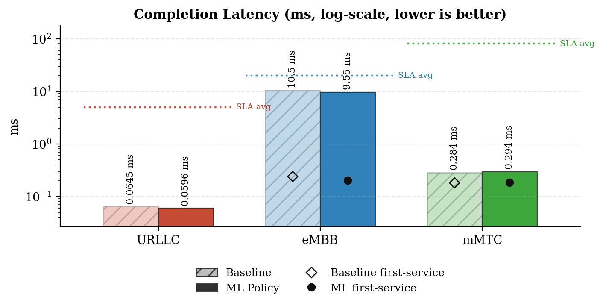
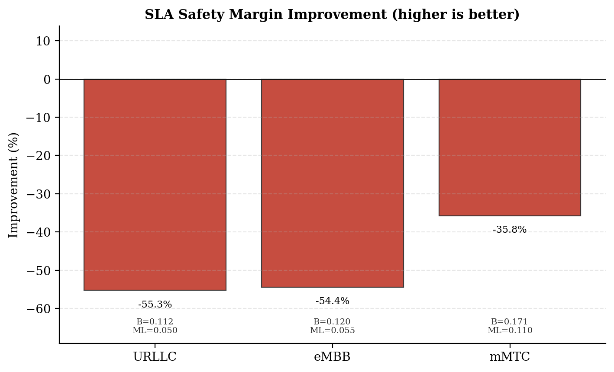
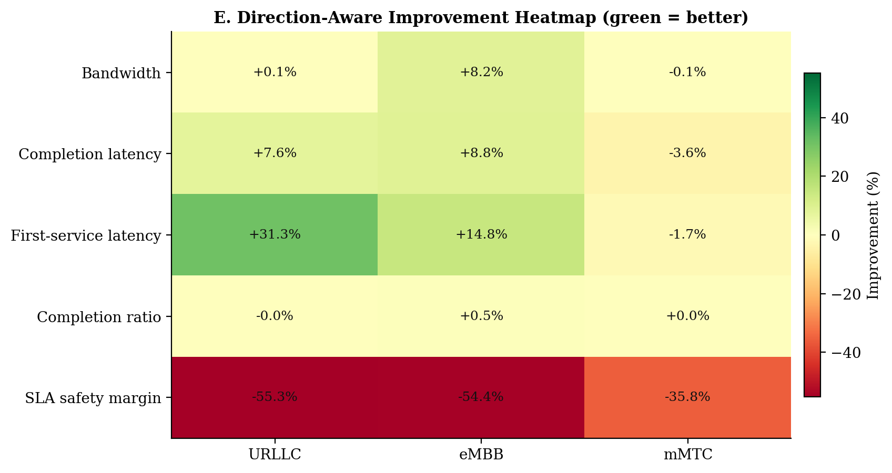
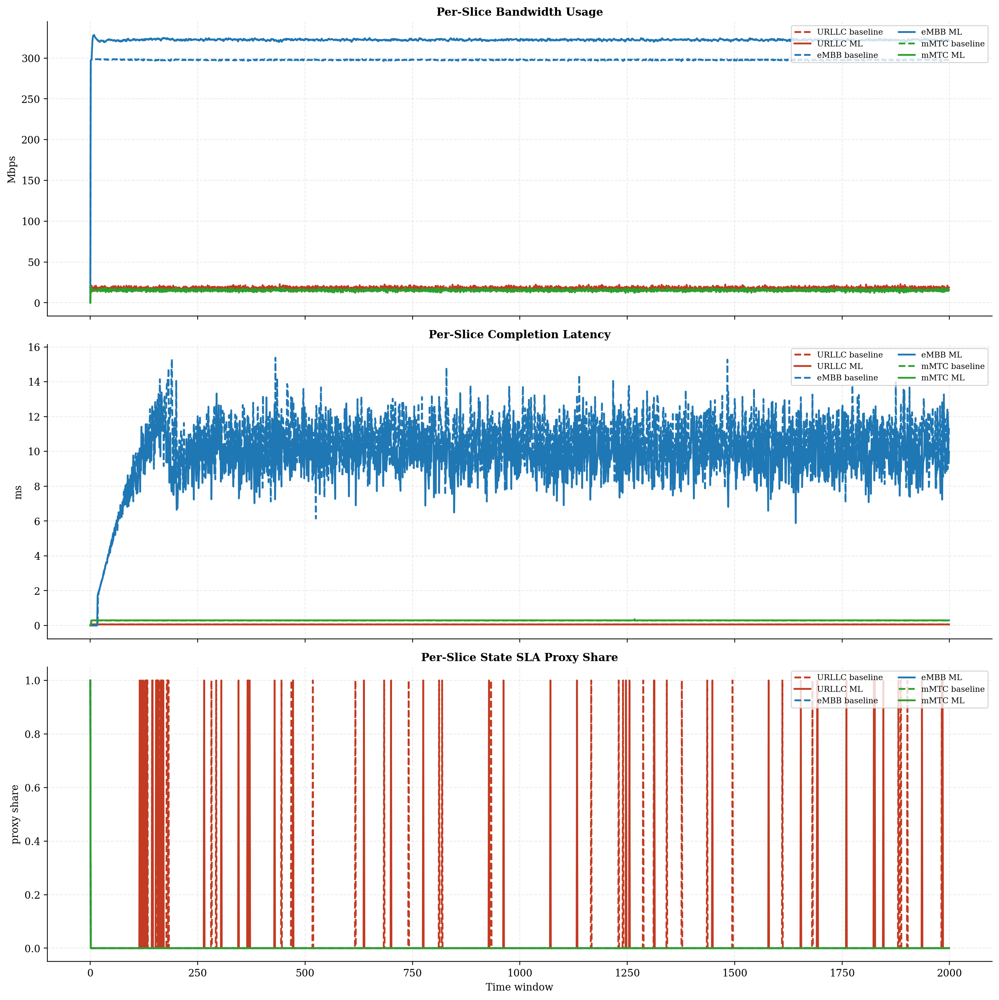
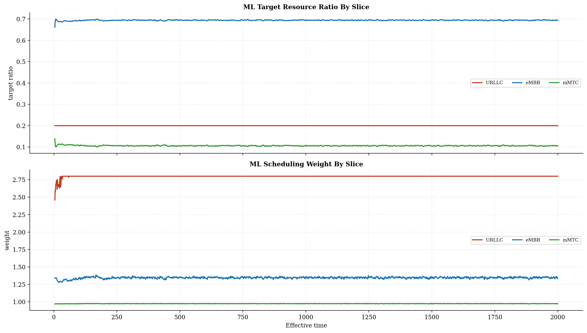
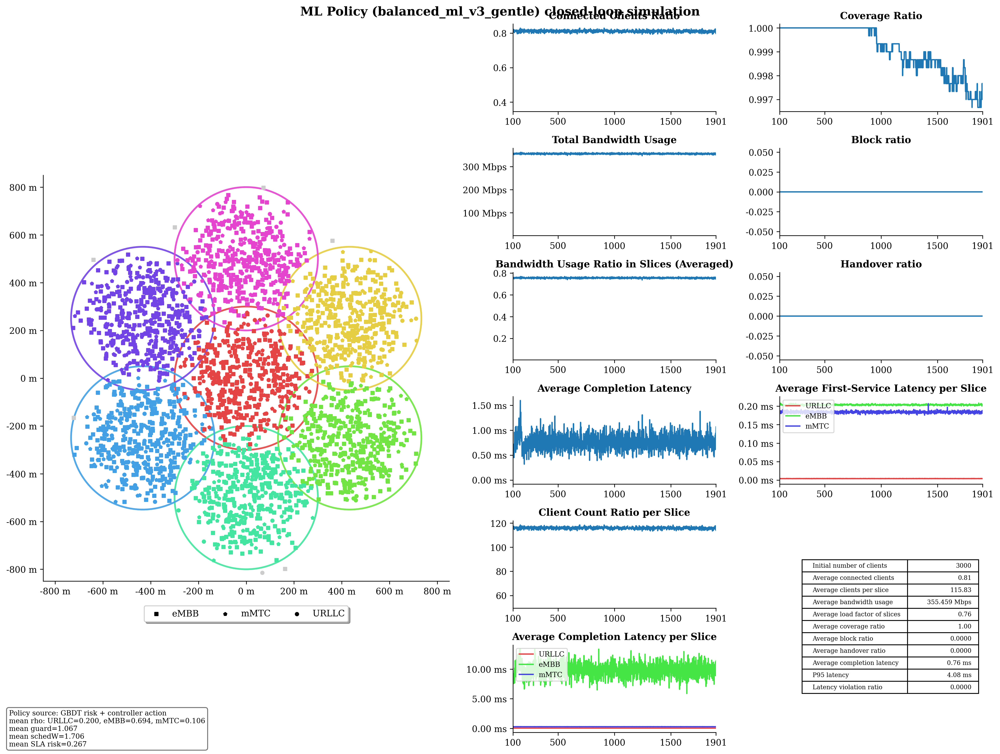

# Baseline vs ML Policy Report

## Run Summary

- Timestamp: `2026-05-08T11:23:50`
- Config: `C:\Users\LENOVO\Downloads\5G-Network-Slicing-main\5G-Network-Slicing-with-GBDT-ML-Policy\slicesim\scenario-light.yml`
- Model: `C:\Users\LENOVO\Downloads\5G-Network-Slicing-main\5G-Network-Slicing-with-GBDT-ML-Policy\models\sla_risk_gbdt`
- Controller type: `gbdt`
- Controller preset: `balanced_ml_v3_gentle`
- Broker enabled: `True`
- Broker preset: `forecasting_balanced`
- Seed: `256`

## Global KPI Comparison

| metric | baseline | ml_policy | delta_ml_minus_baseline | delta_pct |
|---|---|---|---|---|
| connected_clients_ratio | 0.8116 | 0.8104 | -0.0012 | -0.1438 |
| coverage_ratio | 0.9989 | 0.9991 | 0.0002 | 0.0234 |
| block_ratio | 0.0000 | 0.0000 | 0.0000 | 0.0000 |
| handover_ratio | 0.0000 | 0.0000 | 0.0000 | 0.0000 |
| avg_slice_load_ratio | 0.7037 | 0.7558 | 0.0521 | 7.4059 |
| total_bandwidth_usage | 330743230.1373 | 355237905.6384 | 24494675.5011 | 7.4059 |
| avg_latency_ms | 0.7435 | 0.7425 | -0.0010 | -0.1362 |
| p95_latency_ms | 3.3055 | 3.9449 | 0.6393 | 19.3417 |
| latency_violation_ratio | 0.0000 | 0.0000 | 0.0000 | 0.0000 |
| avg_state_sla_violation_share | 0.0077 | 0.0080 | 0.0003 | 4.3478 |
| bandwidth_jain_fairness | 0.4092 | 0.4034 | -0.0058 | -1.4271 |
| bandwidth_jain_fairness_min | 0.3333 | 0.3333 | 0.0000 | 0.0000 |

## Per-Slice Summary

| slice_name | avg_bandwidth_usage_mbps_baseline | avg_bandwidth_usage_mbps_ml | avg_bandwidth_usage_mbps_delta | avg_served_bandwidth_baseline | avg_served_bandwidth_ml | avg_served_bandwidth_delta | avg_completion_latency_ms_baseline | avg_completion_latency_ms_ml | avg_completion_latency_ms_delta | avg_first_service_latency_ms_baseline | avg_first_service_latency_ms_ml | avg_first_service_latency_ms_delta | avg_recorded_first_service_latency_ms_baseline | avg_recorded_first_service_latency_ms_ml | avg_recorded_first_service_latency_ms_delta | avg_bandwidth_share_baseline | avg_bandwidth_share_ml | avg_bandwidth_share_delta | zero_bandwidth_window_share_baseline | zero_bandwidth_window_share_ml | zero_bandwidth_window_share_delta | completion_ratio_baseline | completion_ratio_ml | completion_ratio_delta | completion_latency_violation_ratio_baseline | completion_latency_violation_ratio_ml | completion_latency_violation_ratio_delta | first_service_latency_violation_ratio_baseline | first_service_latency_violation_ratio_ml | first_service_latency_violation_ratio_delta | request_latency_violation_event_ratio_baseline | request_latency_violation_event_ratio_ml | request_latency_violation_event_ratio_delta | avg_state_sla_violation_share_baseline | avg_state_sla_violation_share_ml | avg_state_sla_violation_share_delta | avg_sla_safety_margin_baseline | avg_sla_safety_margin_ml | avg_sla_safety_margin_delta | avg_sla_safety_margin_improvement_pct |
|---|---|---|---|---|---|---|---|---|---|---|---|---|---|---|---|---|---|---|---|---|---|---|---|---|---|---|---|---|---|---|---|---|---|---|---|---|---|---|---|---|
| URLLC | 17.8481 | 17.8686 | 0.0205 | 139860.8392 | 139885.5360 | 24.6968 | 0.0645 | 0.0596 | -0.0049 | 0.0056 | 0.0039 | -0.0018 | 0.0056 | 0.0039 | -0.0018 | 0.0544 | 0.0507 | -0.0037 | 0.0000 | 0.0000 | 0.0000 | 0.9995 | 0.9995 | -0.0001 | 0.0000 | 0.0000 | 0.0000 | 0.0000 | 0.0000 | 0.0000 | 0.0000 | 0.0000 | 0.0000 | 0.0220 | 0.0230 | 0.0010 | 0.1125 | 0.0503 | -0.0622 | -55.2713 |
| eMBB | 297.5571 | 322.0479 | 24.4908 | 156195.5239 | 170653.0426 | 14457.5187 | 10.4782 | 9.5548 | -0.9234 | 0.2391 | 0.2037 | -0.0354 | 0.2395 | 0.2038 | -0.0357 | 0.8993 | 0.9062 | 0.0069 | 0.0005 | 0.0005 | 0.0000 | 0.9482 | 0.9526 | 0.0044 | 0.0000 | 0.0000 | 0.0000 | 0.0000 | 0.0000 | 0.0000 | 0.0000 | 0.0000 | 0.0000 | 0.0005 | 0.0005 | 0.0000 | 0.1197 | 0.0545 | -0.0651 | -54.4440 |
| mMTC | 15.3380 | 15.3214 | -0.0167 | 80074.5985 | 79943.1150 | -131.4835 | 0.2840 | 0.2941 | 0.0101 | 0.1809 | 0.1840 | 0.0032 | 0.1810 | 0.1841 | 0.0032 | 0.0463 | 0.0431 | -0.0032 | 0.0005 | 0.0005 | 0.0000 | 0.9990 | 0.9990 | 0.0000 | 0.0000 | 0.0000 | 0.0000 | 0.0000 | 0.0000 | 0.0000 | 0.0000 | 0.0000 | 0.0000 | 0.0005 | 0.0005 | 0.0000 | 0.1714 | 0.1101 | -0.0613 | -35.7780 |

## Per-Base-Station Summary

| base_station_id | avg_bandwidth_usage_mbps_baseline | avg_bandwidth_usage_mbps_ml | avg_bandwidth_usage_mbps_delta | avg_bandwidth_usage_mbps_delta_pct | avg_capacity_mbps_baseline | avg_capacity_mbps_ml | avg_capacity_mbps_delta | avg_capacity_mbps_delta_pct | avg_load_ratio_baseline | avg_load_ratio_ml | avg_load_ratio_delta | avg_load_ratio_delta_pct | avg_remaining_capacity_ratio_baseline | avg_remaining_capacity_ratio_ml | avg_remaining_capacity_ratio_delta | avg_remaining_capacity_ratio_delta_pct | avg_request_count_per_window_baseline | avg_request_count_per_window_ml | avg_request_count_per_window_delta | avg_request_count_per_window_delta_pct | total_request_count_baseline | total_request_count_ml | total_request_count_delta | total_request_count_delta_pct | avg_requested_usage_mbps_per_window_baseline | avg_requested_usage_mbps_per_window_ml | avg_requested_usage_mbps_per_window_delta | avg_requested_usage_mbps_per_window_delta_pct | avg_clients_seen_per_window_baseline | avg_clients_seen_per_window_ml | avg_clients_seen_per_window_delta | avg_clients_seen_per_window_delta_pct | avg_connected_events_per_window_baseline | avg_connected_events_per_window_ml | avg_connected_events_per_window_delta | avg_connected_events_per_window_delta_pct | avg_disconnected_events_per_window_baseline | avg_disconnected_events_per_window_ml | avg_disconnected_events_per_window_delta | avg_disconnected_events_per_window_delta_pct | avg_state_sla_violation_share_baseline | avg_state_sla_violation_share_ml | avg_state_sla_violation_share_delta | avg_state_sla_violation_share_delta_pct | avg_sla_safety_margin_baseline | avg_sla_safety_margin_ml | avg_sla_safety_margin_delta | avg_sla_safety_margin_delta_pct | avg_sla_breach_count_per_window_baseline | avg_sla_breach_count_per_window_ml | avg_sla_breach_count_per_window_delta | avg_sla_breach_count_per_window_delta_pct |
|---|---|---|---|---|---|---|---|---|---|---|---|---|---|---|---|---|---|---|---|---|---|---|---|---|---|---|---|---|---|---|---|---|---|---|---|---|---|---|---|---|---|---|---|---|---|---|---|---|---|---|---|---|
| BS_0 | 54.4893 | 60.2663 | 5.7770 | 10.6021 | 80.0000 | 80.0000 | 0.0000 | 0.0000 | 0.6811 | 0.7533 | 0.0722 | 10.6021 | 0.3189 | 0.2467 | -0.0722 | -22.6455 | 51.5935 | 51.5775 | -0.0160 | -0.0310 | 103187.0000 | 103155.0000 | -32.0000 | -0.0310 | 55.8073 | 61.8032 | 5.9959 | 10.7439 | 429.9300 | 429.1405 | -0.7895 | -0.1836 | 51.5975 | 51.5805 | -0.0170 | -0.0329 | 51.4260 | 51.4050 | -0.0210 | -0.0408 | 0.0077 | 0.0080 | 0.0003 | 4.3478 | 0.1345 | 0.0716 | -0.0629 | -46.7466 | 0.0230 | 0.0240 | 0.0010 | 4.3478 |
| BS_1 | 45.8665 | 48.9925 | 3.1260 | 6.8155 | 65.0000 | 65.0000 | 0.0000 | 0.0000 | 0.7056 | 0.7537 | 0.0481 | 6.8155 | 0.2944 | 0.2463 | -0.0481 | -16.3380 | 45.9155 | 46.3520 | 0.4365 | 0.9507 | 91831.0000 | 92704.0000 | 873.0000 | 0.9507 | 47.2589 | 50.8016 | 3.5427 | 7.4964 | 429.0115 | 428.3635 | -0.6480 | -0.1510 | 45.9205 | 46.3620 | 0.4415 | 0.9614 | 45.7455 | 46.1840 | 0.4385 | 0.9586 | 0.0077 | 0.0080 | 0.0003 | 4.3478 | 0.1345 | 0.0716 | -0.0629 | -46.7466 | 0.0230 | 0.0240 | 0.0010 | 4.3478 |
| BS_2 | 46.2282 | 49.3083 | 3.0801 | 6.6628 | 65.0000 | 65.0000 | 0.0000 | 0.0000 | 0.7112 | 0.7586 | 0.0474 | 6.6628 | 0.2888 | 0.2414 | -0.0474 | -16.4081 | 49.9345 | 50.4645 | 0.5300 | 1.0614 | 99869.0000 | 100929.0000 | 1060.0000 | 1.0614 | 47.6552 | 50.9680 | 3.3128 | 6.9515 | 427.7865 | 427.8245 | 0.0380 | 0.0089 | 49.9355 | 50.4825 | 0.5470 | 1.0954 | 49.7645 | 50.3105 | 0.5460 | 1.0972 | 0.0077 | 0.0080 | 0.0003 | 4.3478 | 0.1345 | 0.0716 | -0.0629 | -46.7466 | 0.0230 | 0.0240 | 0.0010 | 4.3478 |
| BS_3 | 46.0868 | 49.1012 | 3.0144 | 6.5407 | 65.0000 | 65.0000 | 0.0000 | 0.0000 | 0.7090 | 0.7554 | 0.0464 | 6.5407 | 0.2910 | 0.2446 | -0.0464 | -15.9381 | 48.8875 | 48.9415 | 0.0540 | 0.1105 | 97775.0000 | 97883.0000 | 108.0000 | 0.1105 | 47.4765 | 50.7353 | 3.2588 | 6.8640 | 426.7415 | 426.1800 | -0.5615 | -0.1316 | 48.8905 | 48.9465 | 0.0560 | 0.1145 | 48.7195 | 48.7755 | 0.0560 | 0.1149 | 0.0077 | 0.0080 | 0.0003 | 4.3478 | 0.1345 | 0.0716 | -0.0629 | -46.7466 | 0.0230 | 0.0240 | 0.0010 | 4.3478 |
| BS_4 | 45.9184 | 49.1364 | 3.2180 | 7.0081 | 65.0000 | 65.0000 | 0.0000 | 0.0000 | 0.7064 | 0.7559 | 0.0495 | 7.0081 | 0.2936 | 0.2441 | -0.0495 | -16.8645 | 46.0475 | 46.4395 | 0.3920 | 0.8513 | 92095.0000 | 92879.0000 | 784.0000 | 0.8513 | 47.4023 | 50.9436 | 3.5413 | 7.4708 | 427.1095 | 428.0475 | 0.9380 | 0.2196 | 46.0685 | 46.4570 | 0.3885 | 0.8433 | 45.8890 | 46.2840 | 0.3950 | 0.8608 | 0.0077 | 0.0080 | 0.0003 | 4.3478 | 0.1345 | 0.0716 | -0.0629 | -46.7466 | 0.0230 | 0.0240 | 0.0010 | 4.3478 |
| BS_5 | 46.2776 | 49.3238 | 3.0462 | 6.5824 | 65.0000 | 65.0000 | 0.0000 | 0.0000 | 0.7120 | 0.7588 | 0.0469 | 6.5824 | 0.2880 | 0.2412 | -0.0469 | -16.2703 | 49.8495 | 50.0810 | 0.2315 | 0.4644 | 99699.0000 | 100162.0000 | 463.0000 | 0.4644 | 47.6210 | 51.1188 | 3.4978 | 7.3450 | 430.3645 | 429.6765 | -0.6880 | -0.1599 | 49.8610 | 50.0845 | 0.2235 | 0.4482 | 49.6900 | 49.9140 | 0.2240 | 0.4508 | 0.0077 | 0.0080 | 0.0003 | 4.3478 | 0.1345 | 0.0716 | -0.0629 | -46.7466 | 0.0230 | 0.0240 | 0.0010 | 4.3478 |
| BS_6 | 45.8764 | 49.1094 | 3.2329 | 7.0470 | 65.0000 | 65.0000 | 0.0000 | 0.0000 | 0.7058 | 0.7555 | 0.0497 | 7.0470 | 0.2942 | 0.2445 | -0.0497 | -16.9054 | 45.6310 | 45.8950 | 0.2640 | 0.5786 | 91262.0000 | 91790.0000 | 528.0000 | 0.5786 | 47.2456 | 50.8407 | 3.5951 | 7.6093 | 425.6660 | 428.0785 | 2.4125 | 0.5668 | 45.6445 | 45.9000 | 0.2555 | 0.5598 | 45.4725 | 45.7250 | 0.2525 | 0.5553 | 0.0077 | 0.0080 | 0.0003 | 4.3478 | 0.1345 | 0.0716 | -0.0629 | -46.7466 | 0.0230 | 0.0240 | 0.0010 | 4.3478 |

## Per-Base-Station Slice SLA Summary

| base_station_id | slice_name | avg_bandwidth_usage_mbps_baseline | avg_bandwidth_usage_mbps_ml | avg_bandwidth_usage_mbps_delta | avg_bandwidth_usage_mbps_delta_pct | avg_slice_capacity_mbps_baseline | avg_slice_capacity_mbps_ml | avg_slice_capacity_mbps_delta | avg_slice_capacity_mbps_delta_pct | avg_slice_load_ratio_baseline | avg_slice_load_ratio_ml | avg_slice_load_ratio_delta | avg_slice_load_ratio_delta_pct | avg_remaining_capacity_ratio_baseline | avg_remaining_capacity_ratio_ml | avg_remaining_capacity_ratio_delta | avg_remaining_capacity_ratio_delta_pct | avg_request_count_per_window_baseline | avg_request_count_per_window_ml | avg_request_count_per_window_delta | avg_request_count_per_window_delta_pct | total_request_count_baseline | total_request_count_ml | total_request_count_delta | total_request_count_delta_pct | avg_requested_usage_mbps_per_window_baseline | avg_requested_usage_mbps_per_window_ml | avg_requested_usage_mbps_per_window_delta | avg_requested_usage_mbps_per_window_delta_pct | avg_clients_seen_per_window_baseline | avg_clients_seen_per_window_ml | avg_clients_seen_per_window_delta | avg_clients_seen_per_window_delta_pct | avg_state_sla_violation_share_baseline | avg_state_sla_violation_share_ml | avg_state_sla_violation_share_delta | avg_state_sla_violation_share_delta_pct | avg_sla_safety_margin_baseline | avg_sla_safety_margin_ml | avg_sla_safety_margin_delta | avg_sla_safety_margin_delta_pct | avg_sla_breach_count_per_window_baseline | avg_sla_breach_count_per_window_ml | avg_sla_breach_count_per_window_delta | avg_sla_breach_count_per_window_delta_pct |
|---|---|---|---|---|---|---|---|---|---|---|---|---|---|---|---|---|---|---|---|---|---|---|---|---|---|---|---|---|---|---|---|---|---|---|---|---|---|---|---|---|---|---|---|---|---|
| BS_0 | URLLC | 3.0868 | 3.0780 | -0.0088 | -0.2854 | 14.4000 | 15.9968 | 1.5968 | 11.0889 | 0.2144 | 0.1924 | -0.0219 | -10.2358 | 0.7856 | 0.8076 | 0.0219 | 2.7928 | 22.1130 | 22.0135 | -0.0995 | -0.4500 | 44226.0000 | 44027.0000 | -199.0000 | -0.4500 | 3.0868 | 3.0780 | -0.0088 | -0.2854 | 57.3130 | 56.6375 | -0.6755 | -1.1786 | 0.0220 | 0.0230 | 0.0010 | 4.5455 | 0.1125 | 0.0503 | -0.0622 | -55.2713 | 0.0220 | 0.0230 | 0.0010 | 4.5455 |
| BS_0 | eMBB | 49.2858 | 55.1005 | 5.8147 | 11.7980 | 49.6000 | 55.7470 | 6.1470 | 12.3932 | 0.9937 | 0.9884 | -0.0053 | -0.5349 | 0.0063 | 0.0116 | 0.0053 | 83.9025 | 3.0655 | 3.4205 | 0.3550 | 11.5805 | 6131.0000 | 6841.0000 | 710.0000 | 11.5805 | 50.6030 | 56.6362 | 6.0332 | 11.9226 | 276.2355 | 277.0270 | 0.7915 | 0.2865 | 0.0005 | 0.0005 | 0.0000 | 0.0000 | 0.1197 | 0.0545 | -0.0651 | -54.4440 | 0.0005 | 0.0005 | 0.0000 | 0.0000 |
| BS_0 | mMTC | 2.1167 | 2.0878 | -0.0289 | -1.3654 | 16.0000 | 8.2562 | -7.7438 | -48.3990 | 0.1323 | 0.2532 | 0.1209 | 91.3910 | 0.8677 | 0.7468 | -0.1209 | -13.9335 | 26.4150 | 26.1435 | -0.2715 | -1.0278 | 52830.0000 | 52287.0000 | -543.0000 | -1.0278 | 2.1175 | 2.0890 | -0.0285 | -1.3471 | 96.3815 | 95.4760 | -0.9055 | -0.9395 | 0.0005 | 0.0005 | 0.0000 | 0.0000 | 0.1714 | 0.1101 | -0.0613 | -35.7780 | 0.0005 | 0.0005 | 0.0000 | 0.0000 |
| BS_1 | URLLC | 2.3511 | 2.3425 | -0.0087 | -0.3681 | 10.4000 | 12.9948 | 2.5948 | 24.9500 | 0.2261 | 0.1803 | -0.0458 | -20.2591 | 0.7739 | 0.8197 | 0.0458 | 5.9179 | 16.8265 | 16.7420 | -0.0845 | -0.5022 | 33653.0000 | 33484.0000 | -169.0000 | -0.5022 | 2.3511 | 2.3425 | -0.0087 | -0.3681 | 45.0345 | 45.0000 | -0.0345 | -0.0766 | 0.0220 | 0.0230 | 0.0010 | 4.5455 | 0.1125 | 0.0503 | -0.0622 | -55.2713 | 0.0220 | 0.0230 | 0.0010 | 4.5455 |
| BS_1 | eMBB | 41.3896 | 44.5222 | 3.1326 | 7.5685 | 41.6000 | 45.1066 | 3.5066 | 8.4294 | 0.9949 | 0.9870 | -0.0079 | -0.7976 | 0.0051 | 0.0130 | 0.0079 | 156.9014 | 2.6025 | 2.8170 | 0.2145 | 8.2421 | 5205.0000 | 5634.0000 | 429.0000 | 8.2421 | 42.7809 | 46.3302 | 3.5493 | 8.2964 | 287.5150 | 286.1625 | -1.3525 | -0.4704 | 0.0005 | 0.0005 | 0.0000 | 0.0000 | 0.1197 | 0.0545 | -0.0651 | -54.4440 | 0.0005 | 0.0005 | 0.0000 | 0.0000 |
| BS_1 | mMTC | 2.1257 | 2.1278 | 0.0021 | 0.0993 | 13.0000 | 6.8986 | -6.1014 | -46.9342 | 0.1635 | 0.3088 | 0.1453 | 88.8711 | 0.8365 | 0.6912 | -0.1453 | -17.3726 | 26.4865 | 26.7930 | 0.3065 | 1.1572 | 52973.0000 | 53586.0000 | 613.0000 | 1.1572 | 2.1268 | 2.1289 | 0.0021 | 0.0986 | 96.4620 | 97.2010 | 0.7390 | 0.7661 | 0.0005 | 0.0005 | 0.0000 | 0.0000 | 0.1714 | 0.1101 | -0.0613 | -35.7780 | 0.0005 | 0.0005 | 0.0000 | 0.0000 |
| BS_2 | URLLC | 2.4808 | 2.5006 | 0.0198 | 0.7973 | 10.4000 | 12.9948 | 2.5948 | 24.9500 | 0.2385 | 0.1925 | -0.0461 | -19.3212 | 0.7615 | 0.8075 | 0.0461 | 6.0527 | 17.6745 | 17.9255 | 0.2510 | 1.4201 | 35349.0000 | 35851.0000 | 502.0000 | 1.4201 | 2.4808 | 2.5006 | 0.0198 | 0.7973 | 46.4150 | 47.0710 | 0.6560 | 1.4133 | 0.0220 | 0.0230 | 0.0010 | 4.5455 | 0.1125 | 0.0503 | -0.0622 | -55.2713 | 0.0220 | 0.0230 | 0.0010 | 4.5455 |
| BS_2 | eMBB | 41.3761 | 44.4227 | 3.0466 | 7.3632 | 41.6000 | 44.9839 | 3.3839 | 8.1343 | 0.9946 | 0.9875 | -0.0071 | -0.7166 | 0.0054 | 0.0125 | 0.0071 | 132.4288 | 2.6070 | 2.7840 | 0.1770 | 6.7894 | 5214.0000 | 5568.0000 | 354.0000 | 6.7894 | 42.8019 | 46.0812 | 3.2792 | 7.6614 | 272.4105 | 271.9485 | -0.4620 | -0.1696 | 0.0005 | 0.0005 | 0.0000 | 0.0000 | 0.1197 | 0.0545 | -0.0651 | -54.4440 | 0.0005 | 0.0005 | 0.0000 | 0.0000 |
| BS_2 | mMTC | 2.3713 | 2.3850 | 0.0137 | 0.5776 | 13.0000 | 7.0213 | -5.9787 | -45.9897 | 0.1824 | 0.3402 | 0.1578 | 86.5277 | 0.8176 | 0.6598 | -0.1578 | -19.3047 | 29.6530 | 29.7550 | 0.1020 | 0.3440 | 59306.0000 | 59510.0000 | 204.0000 | 0.3440 | 2.3725 | 2.3862 | 0.0137 | 0.5795 | 108.9610 | 108.8050 | -0.1560 | -0.1432 | 0.0005 | 0.0005 | 0.0000 | 0.0000 | 0.1714 | 0.1101 | -0.0613 | -35.7780 | 0.0005 | 0.0005 | 0.0000 | 0.0000 |
| BS_3 | URLLC | 2.3760 | 2.3737 | -0.0023 | -0.0965 | 10.4000 | 12.9948 | 2.5948 | 24.9500 | 0.2285 | 0.1827 | -0.0458 | -20.0328 | 0.7715 | 0.8173 | 0.0458 | 5.9321 | 16.9795 | 16.9505 | -0.0290 | -0.1708 | 33959.0000 | 33901.0000 | -58.0000 | -0.1708 | 2.3760 | 2.3737 | -0.0023 | -0.0965 | 46.0000 | 45.6055 | -0.3945 | -0.8576 | 0.0220 | 0.0230 | 0.0010 | 4.5455 | 0.1125 | 0.0503 | -0.0622 | -55.2713 | 0.0220 | 0.0230 | 0.0010 | 4.5455 |
| BS_3 | eMBB | 41.3652 | 44.3936 | 3.0283 | 7.3210 | 41.6000 | 44.9896 | 3.3896 | 8.1480 | 0.9944 | 0.9867 | -0.0076 | -0.7682 | 0.0056 | 0.0133 | 0.0076 | 135.3440 | 2.5865 | 2.7985 | 0.2120 | 8.1964 | 5173.0000 | 5597.0000 | 424.0000 | 8.1964 | 42.7540 | 46.0266 | 3.2726 | 7.6545 | 273.8115 | 273.7185 | -0.0930 | -0.0340 | 0.0005 | 0.0005 | 0.0000 | 0.0000 | 0.1197 | 0.0545 | -0.0651 | -54.4440 | 0.0005 | 0.0005 | 0.0000 | 0.0000 |
| BS_3 | mMTC | 2.3456 | 2.3339 | -0.0116 | -0.4964 | 13.0000 | 7.0156 | -5.9844 | -46.0338 | 0.1804 | 0.3332 | 0.1528 | 84.6779 | 0.8196 | 0.6668 | -0.1528 | -18.6418 | 29.3215 | 29.1925 | -0.1290 | -0.4400 | 58643.0000 | 58385.0000 | -258.0000 | -0.4400 | 2.3465 | 2.3350 | -0.0115 | -0.4908 | 106.9300 | 106.8560 | -0.0740 | -0.0692 | 0.0005 | 0.0005 | 0.0000 | 0.0000 | 0.1714 | 0.1101 | -0.0613 | -35.7780 | 0.0005 | 0.0005 | 0.0000 | 0.0000 |
| BS_4 | URLLC | 2.4815 | 2.4789 | -0.0026 | -0.1062 | 10.4000 | 12.9948 | 2.5948 | 24.9500 | 0.2386 | 0.1908 | -0.0478 | -20.0352 | 0.7614 | 0.8092 | 0.0478 | 6.2787 | 17.7175 | 17.6800 | -0.0375 | -0.2117 | 35435.0000 | 35360.0000 | -75.0000 | -0.2117 | 2.4815 | 2.4789 | -0.0026 | -0.1062 | 47.1155 | 47.0000 | -0.1155 | -0.2451 | 0.0220 | 0.0230 | 0.0010 | 4.5455 | 0.1125 | 0.0503 | -0.0622 | -55.2713 | 0.0220 | 0.0230 | 0.0010 | 4.5455 |
| BS_4 | eMBB | 41.3791 | 44.5814 | 3.2023 | 7.7390 | 41.6000 | 45.1237 | 3.5237 | 8.4703 | 0.9947 | 0.9879 | -0.0067 | -0.6778 | 0.0053 | 0.0121 | 0.0067 | 126.9470 | 2.5905 | 2.7965 | 0.2060 | 7.9521 | 5181.0000 | 5593.0000 | 412.0000 | 7.9521 | 42.8617 | 46.3875 | 3.5258 | 8.2260 | 284.8275 | 285.1455 | 0.3180 | 0.1116 | 0.0005 | 0.0005 | 0.0000 | 0.0000 | 0.1197 | 0.0545 | -0.0651 | -54.4440 | 0.0005 | 0.0005 | 0.0000 | 0.0000 |
| BS_4 | mMTC | 2.0578 | 2.0761 | 0.0183 | 0.8902 | 13.0000 | 6.8815 | -6.1185 | -47.0650 | 0.1583 | 0.3021 | 0.1438 | 90.8678 | 0.8417 | 0.6979 | -0.1438 | -17.0887 | 25.7395 | 25.9630 | 0.2235 | 0.8683 | 51479.0000 | 51926.0000 | 447.0000 | 0.8683 | 2.0591 | 2.0772 | 0.0182 | 0.8816 | 95.1665 | 95.9020 | 0.7355 | 0.7729 | 0.0005 | 0.0005 | 0.0000 | 0.0000 | 0.1714 | 0.1101 | -0.0613 | -35.7780 | 0.0005 | 0.0005 | 0.0000 | 0.0000 |
| BS_5 | URLLC | 2.6169 | 2.6206 | 0.0037 | 0.1416 | 10.4000 | 12.9948 | 2.5948 | 24.9500 | 0.2516 | 0.2017 | -0.0499 | -19.8468 | 0.7484 | 0.7983 | 0.0499 | 6.6731 | 18.6745 | 18.7020 | 0.0275 | 0.1473 | 37349.0000 | 37404.0000 | 55.0000 | 0.1473 | 2.6169 | 2.6206 | 0.0037 | 0.1416 | 49.5315 | 50.3625 | 0.8310 | 1.6777 | 0.0220 | 0.0230 | 0.0010 | 4.5455 | 0.1125 | 0.0503 | -0.0622 | -55.2713 | 0.0220 | 0.0230 | 0.0010 | 4.5455 |
| BS_5 | eMBB | 41.3764 | 44.4148 | 3.0384 | 7.3433 | 41.6000 | 45.0147 | 3.4147 | 8.2085 | 0.9946 | 0.9866 | -0.0080 | -0.8031 | 0.0054 | 0.0134 | 0.0080 | 148.6001 | 2.5750 | 2.8175 | 0.2425 | 9.4175 | 5150.0000 | 5635.0000 | 485.0000 | 9.4175 | 42.7186 | 46.2087 | 3.4901 | 8.1701 | 275.1320 | 273.1525 | -1.9795 | -0.7195 | 0.0005 | 0.0005 | 0.0000 | 0.0000 | 0.1197 | 0.0545 | -0.0651 | -54.4440 | 0.0005 | 0.0005 | 0.0000 | 0.0000 |
| BS_5 | mMTC | 2.2844 | 2.2885 | 0.0041 | 0.1794 | 13.0000 | 6.9905 | -6.0095 | -46.2271 | 0.1757 | 0.3279 | 0.1522 | 86.6010 | 0.8243 | 0.6721 | -0.1522 | -18.4616 | 28.6000 | 28.5615 | -0.0385 | -0.1346 | 57200.0000 | 57123.0000 | -77.0000 | -0.1346 | 2.2855 | 2.2894 | 0.0039 | 0.1716 | 105.7010 | 106.1615 | 0.4605 | 0.4357 | 0.0005 | 0.0005 | 0.0000 | 0.0000 | 0.1714 | 0.1101 | -0.0613 | -35.7780 | 0.0005 | 0.0005 | 0.0000 | 0.0000 |
| BS_6 | URLLC | 2.4549 | 2.4743 | 0.0194 | 0.7903 | 10.4000 | 12.9948 | 2.5948 | 24.9500 | 0.2360 | 0.1904 | -0.0456 | -19.3226 | 0.7640 | 0.8096 | 0.0456 | 5.9702 | 17.6240 | 17.7245 | 0.1005 | 0.5702 | 35248.0000 | 35449.0000 | 201.0000 | 0.5702 | 2.4549 | 2.4743 | 0.0194 | 0.7903 | 46.1065 | 46.0000 | -0.1065 | -0.2310 | 0.0220 | 0.0230 | 0.0010 | 4.5455 | 0.1125 | 0.0503 | -0.0622 | -55.2713 | 0.0220 | 0.0230 | 0.0010 | 4.5455 |
| BS_6 | eMBB | 41.3850 | 44.6128 | 3.2278 | 7.7996 | 41.6000 | 45.1454 | 3.5454 | 8.5225 | 0.9948 | 0.9882 | -0.0067 | -0.6698 | 0.0052 | 0.0118 | 0.0067 | 128.9100 | 2.5785 | 2.8370 | 0.2585 | 10.0252 | 5157.0000 | 5674.0000 | 517.0000 | 10.0252 | 42.7531 | 46.3433 | 3.5902 | 8.3975 | 285.6790 | 287.8855 | 2.2065 | 0.7724 | 0.0005 | 0.0005 | 0.0000 | 0.0000 | 0.1197 | 0.0545 | -0.0651 | -54.4440 | 0.0005 | 0.0005 | 0.0000 | 0.0000 |
| BS_6 | mMTC | 2.0366 | 2.0223 | -0.0143 | -0.7041 | 13.0000 | 6.8598 | -6.1402 | -47.2319 | 0.1567 | 0.2953 | 0.1386 | 88.4691 | 0.8433 | 0.7047 | -0.1386 | -16.4346 | 25.4285 | 25.3335 | -0.0950 | -0.3736 | 50857.0000 | 50667.0000 | -190.0000 | -0.3736 | 2.0377 | 2.0232 | -0.0145 | -0.7136 | 93.8805 | 94.1930 | 0.3125 | 0.3329 | 0.0005 | 0.0005 | 0.0000 | 0.0000 | 0.1714 | 0.1101 | -0.0613 | -35.7780 | 0.0005 | 0.0005 | 0.0000 | 0.0000 |

## Resource Allocation Summary

| slice_name | baseline_state_ratio | ml_state_ratio | ml_action_target_ratio_mean | ml_action_target_ratio_min | ml_action_target_ratio_max | ml_scheduling_weight_mean | ml_admission_guard_factor_mean | target_ratio_delta_vs_baseline_state |
|---|---|---|---|---|---|---|---|---|
| URLLC | 0.1629 | 0.1999 | 0.2000 | 0.2000 | 0.2000 | 2.7984 | 1.1471 | 0.0371 |
| eMBB | 0.6371 | 0.6938 | 0.6939 | 0.6594 | 0.7000 | 1.3451 | 1.0452 | 0.0567 |
| mMTC | 0.2000 | 0.1063 | 0.1061 | 0.1000 | 0.1406 | 0.9742 | 1.0095 | -0.0939 |

## Visual Comparison

### Global KPI View

### Per-Slice View

### Per-Slice Panel Images

#### Throughput per Slice

#### Latency per Slice

#### Completion Ratio

#### SLA Safety Margin Improvement

#### Improvement Heatmap

### Per-Slice Time-Series View

### ML Action Distribution

### ML Policy Simulation Snapshot

## Metric Notes

- `avg_state_sla_violation_share` is the per-slice state-level SLA violation ratio averaged from simulator state frames.
- `avg_sla_safety_margin` is the average distance to the active SLA boundary. Higher is better; negative means violation.
- `avg_sla_safety_margin_improvement_pct` is `(ML margin - baseline margin) / abs(baseline margin) * 100`.
- `request_latency_violation_event_ratio`, `completion_latency_violation_ratio`, and `first_service_latency_violation_ratio` are client-level latency-only metrics.
- A latency value of `0` can mean no recorded latency event for that slice/window. Check `completion_ratio` and request/completion counts before interpreting it as perfect latency.
- `bandwidth_jain_fairness` is Jain's fairness index over per-slice bandwidth usage per time window. Higher is more balanced, with `1.0` meaning equal usage across slices.

## Trade-off Notes

- URLLC completion latency changed by -0.00 ms and SLA safety margin changed by -0.0622 (-55.3%).
- eMBB average bandwidth usage changed by 24.491 Mbps and completion ratio changed by 0.0044.
- mMTC first-service latency changed by 0.00 ms and completion ratio changed by 0.0000.
- URLLC recorded first-service latency changed by -0.00 ms on windows with actual first-service events.
- Classic trade-off snapshot: if URLLC improved by 0.00 ms in latency, eMBB bandwidth moved by 24.491 Mbps.

## Artifacts

- Baseline raw states: `C:\Users\LENOVO\Downloads\5G-Network-Slicing-main\5G-Network-Slicing-with-GBDT-ML-Policy\FINAL_OUTPUT_light_seed256_20260508_102710\baseline_run\baseline_states.csv`
- ML raw states: `C:\Users\LENOVO\Downloads\5G-Network-Slicing-main\5G-Network-Slicing-with-GBDT-ML-Policy\FINAL_OUTPUT_light_seed256_20260508_102710\ml_run\online_states_raw.csv`
- ML broker forecasts: `C:\Users\LENOVO\Downloads\5G-Network-Slicing-main\5G-Network-Slicing-with-GBDT-ML-Policy\FINAL_OUTPUT_light_seed256_20260508_102710\ml_run\online_broker_forecasts.csv`
- ML broker feedback: `C:\Users\LENOVO\Downloads\5G-Network-Slicing-main\5G-Network-Slicing-with-GBDT-ML-Policy\FINAL_OUTPUT_light_seed256_20260508_102710\ml_run\online_broker_feedback.csv`
- Comparison CSV (global): `C:\Users\LENOVO\Downloads\5G-Network-Slicing-main\5G-Network-Slicing-with-GBDT-ML-Policy\FINAL_OUTPUT_light_seed256_20260508_102710\global_kpi_comparison.csv`
- Comparison CSV (per-slice): `C:\Users\LENOVO\Downloads\5G-Network-Slicing-main\5G-Network-Slicing-with-GBDT-ML-Policy\FINAL_OUTPUT_light_seed256_20260508_102710\per_slice_comparison.csv`
- Comparison CSV (per-base-station): `C:\Users\LENOVO\Downloads\5G-Network-Slicing-main\5G-Network-Slicing-with-GBDT-ML-Policy\FINAL_OUTPUT_light_seed256_20260508_102710\per_base_station_comparison.csv`
- Comparison CSV (per-base-station-slice): `C:\Users\LENOVO\Downloads\5G-Network-Slicing-main\5G-Network-Slicing-with-GBDT-ML-Policy\FINAL_OUTPUT_light_seed256_20260508_102710\per_base_station_slice_comparison.csv`
- Resource allocation CSV: `C:\Users\LENOVO\Downloads\5G-Network-Slicing-main\5G-Network-Slicing-with-GBDT-ML-Policy\FINAL_OUTPUT_light_seed256_20260508_102710\resource_allocation_summary.csv`
- ML action time-series CSV: `C:\Users\LENOVO\Downloads\5G-Network-Slicing-main\5G-Network-Slicing-with-GBDT-ML-Policy\FINAL_OUTPUT_light_seed256_20260508_102710\ml_action_ratio_timeseries.csv`
- Global KPI plot: `C:\Users\LENOVO\Downloads\5G-Network-Slicing-main\5G-Network-Slicing-with-GBDT-ML-Policy\FINAL_OUTPUT_light_seed256_20260508_102710\baseline_vs_ml_global_kpis.png`
- Per-slice bar plot: `C:\Users\LENOVO\Downloads\5G-Network-Slicing-main\5G-Network-Slicing-with-GBDT-ML-Policy\FINAL_OUTPUT_light_seed256_20260508_102710\baseline_vs_ml_per_slice_bars.png`
- Per-slice vector plot (SVG): `C:\Users\LENOVO\Downloads\5G-Network-Slicing-main\5G-Network-Slicing-with-GBDT-ML-Policy\FINAL_OUTPUT_light_seed256_20260508_102710\baseline_vs_ml_per_slice_bars.svg`
- Per-slice panel plot (Throughput per Slice): `C:\Users\LENOVO\Downloads\5G-Network-Slicing-main\5G-Network-Slicing-with-GBDT-ML-Policy\FINAL_OUTPUT_light_seed256_20260508_102710\baseline_vs_ml_per_slice_bars_throughput.png`
- Per-slice panel plot (Latency per Slice): `C:\Users\LENOVO\Downloads\5G-Network-Slicing-main\5G-Network-Slicing-with-GBDT-ML-Policy\FINAL_OUTPUT_light_seed256_20260508_102710\baseline_vs_ml_per_slice_bars_latency.png`
- Per-slice panel plot (Completion Ratio): `C:\Users\LENOVO\Downloads\5G-Network-Slicing-main\5G-Network-Slicing-with-GBDT-ML-Policy\FINAL_OUTPUT_light_seed256_20260508_102710\baseline_vs_ml_per_slice_bars_completion_ratio.png`
- Per-slice panel plot (SLA Safety Margin Improvement): `C:\Users\LENOVO\Downloads\5G-Network-Slicing-main\5G-Network-Slicing-with-GBDT-ML-Policy\FINAL_OUTPUT_light_seed256_20260508_102710\baseline_vs_ml_per_slice_bars_sla_margin_improvement.png`
- Per-slice panel plot (Improvement Heatmap): `C:\Users\LENOVO\Downloads\5G-Network-Slicing-main\5G-Network-Slicing-with-GBDT-ML-Policy\FINAL_OUTPUT_light_seed256_20260508_102710\baseline_vs_ml_per_slice_bars_improvement_heatmap.png`
- Per-slice time-series plot: `C:\Users\LENOVO\Downloads\5G-Network-Slicing-main\5G-Network-Slicing-with-GBDT-ML-Policy\FINAL_OUTPUT_light_seed256_20260508_102710\baseline_vs_ml_timeseries.png`
- ML action distribution plot: `C:\Users\LENOVO\Downloads\5G-Network-Slicing-main\5G-Network-Slicing-with-GBDT-ML-Policy\FINAL_OUTPUT_light_seed256_20260508_102710\ml_action_distribution.png`
- ML policy simulation graph: `C:\Users\LENOVO\Downloads\5G-Network-Slicing-main\5G-Network-Slicing-with-GBDT-ML-Policy\FINAL_OUTPUT_light_seed256_20260508_102710\ml_run\ml_policy_simulation.png`
