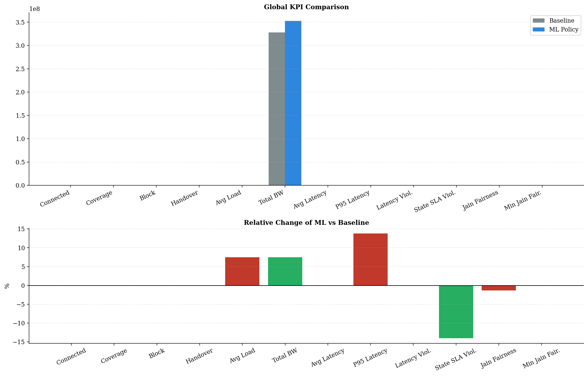
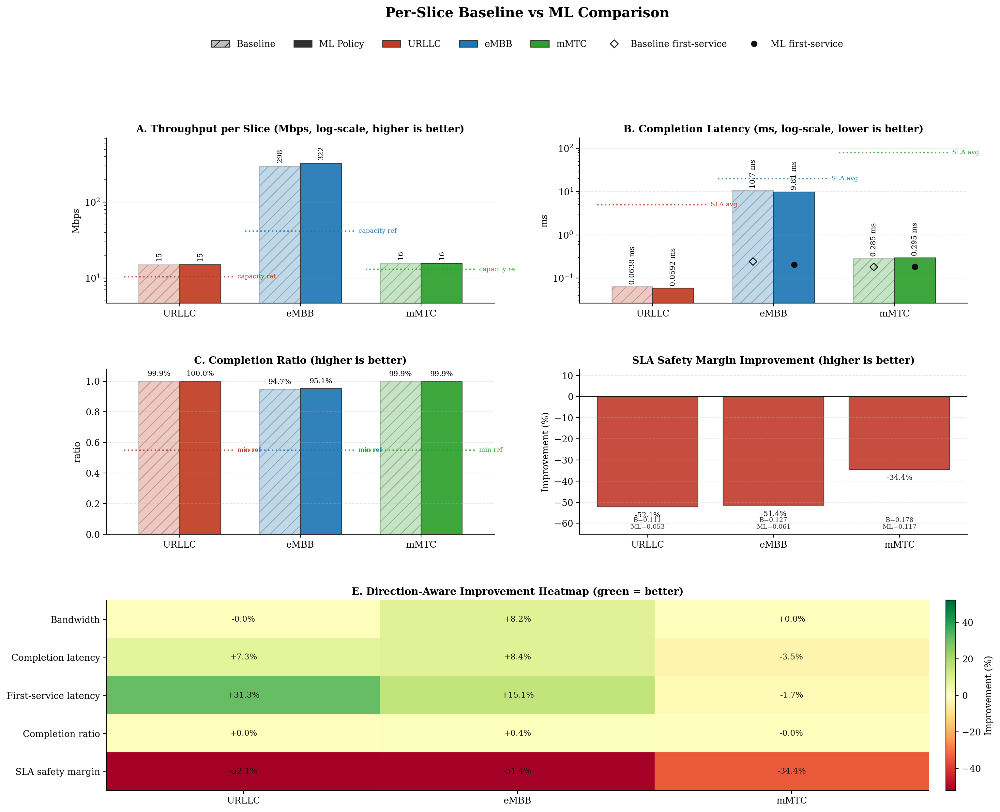
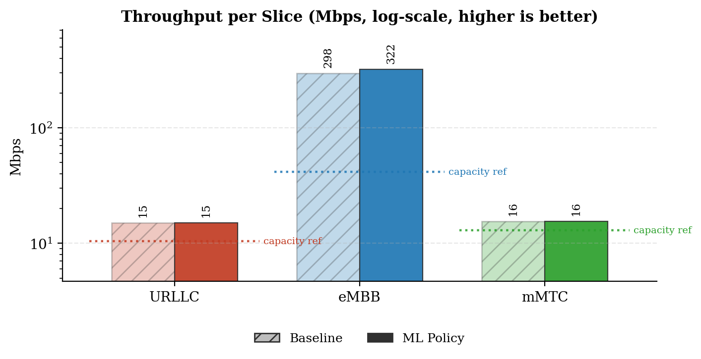
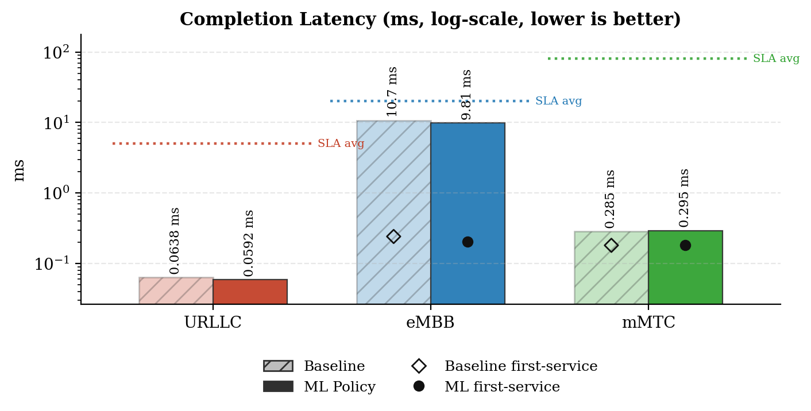
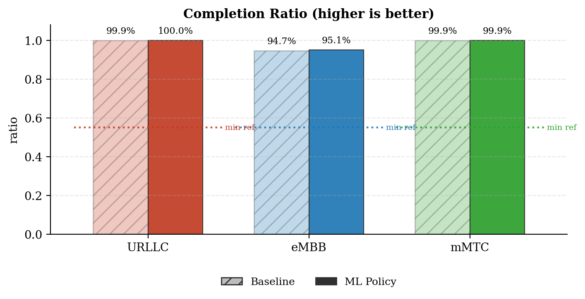
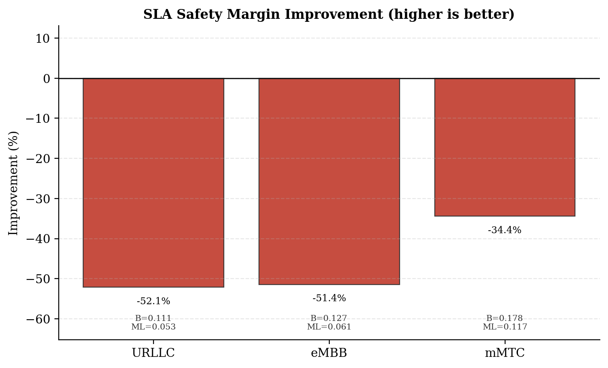
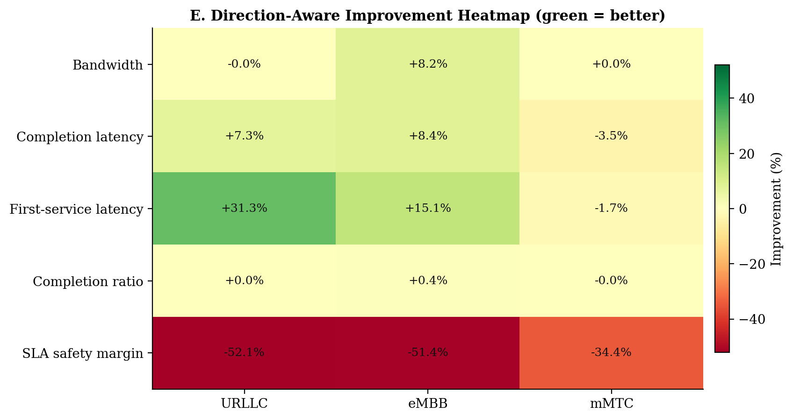
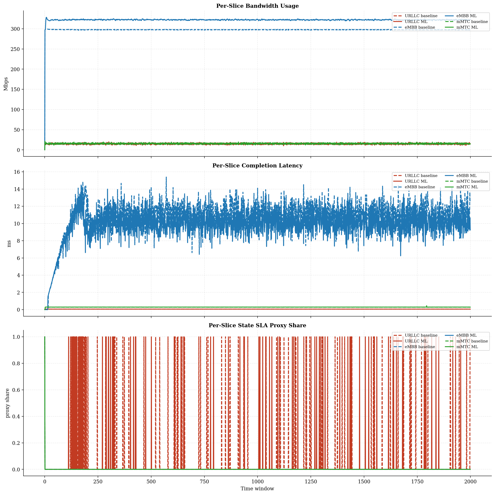
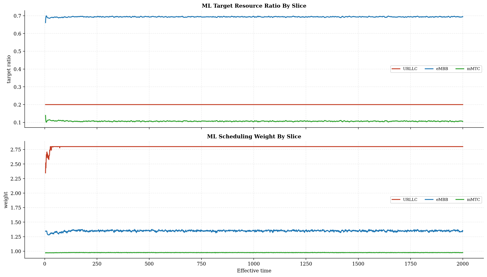
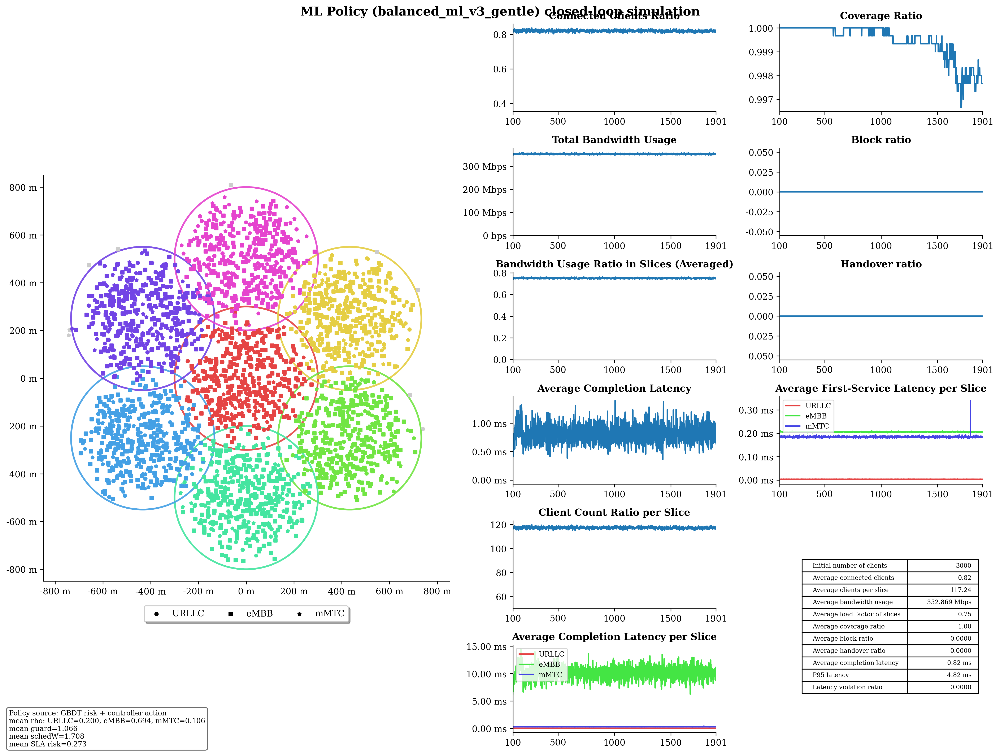

# Baseline vs ML Policy Report

## Run Summary

- Timestamp: `2026-05-08T01:52:03`
- Config: `C:\Users\LENOVO\Downloads\5G-Network-Slicing-main\5G-Network-Slicing-with-GBDT-ML-Policy\slicesim\scenario-light.yml`
- Model: `C:\Users\LENOVO\Downloads\5G-Network-Slicing-main\5G-Network-Slicing-with-GBDT-ML-Policy\models\sla_risk_gbdt`
- Controller type: `gbdt`
- Controller preset: `balanced_ml_v3_gentle`
- Broker enabled: `True`
- Broker preset: `forecasting_balanced`
- Seed: `42`

## Global KPI Comparison

| metric | baseline | ml_policy | delta_ml_minus_baseline | delta_pct |
|---|---|---|---|---|
| connected_clients_ratio | 0.8212 | 0.8203 | -0.0010 | -0.1191 |
| coverage_ratio | 0.9994 | 0.9994 | -0.0000 | -0.0036 |
| block_ratio | 0.0000 | 0.0000 | 0.0000 | 0.0000 |
| handover_ratio | 0.0000 | 0.0000 | 0.0000 | 0.0000 |
| avg_slice_load_ratio | 0.6982 | 0.7503 | 0.0521 | 7.4577 |
| total_bandwidth_usage | 328153443.1993 | 352626226.8230 | 24472783.6237 | 7.4577 |
| avg_latency_ms | 0.7961 | 0.7957 | -0.0004 | -0.0494 |
| p95_latency_ms | 4.0750 | 4.6369 | 0.5620 | 13.7905 |
| latency_violation_ratio | 0.0000 | 0.0000 | 0.0000 | 0.0000 |
| avg_state_sla_violation_share | 0.0167 | 0.0143 | -0.0023 | -14.0000 |
| bandwidth_jain_fairness | 0.4032 | 0.3978 | -0.0054 | -1.3366 |
| bandwidth_jain_fairness_min | 0.3333 | 0.3333 | 0.0000 | 0.0000 |

## Per-Slice Summary

| slice_name | avg_bandwidth_usage_mbps_baseline | avg_bandwidth_usage_mbps_ml | avg_bandwidth_usage_mbps_delta | avg_served_bandwidth_baseline | avg_served_bandwidth_ml | avg_served_bandwidth_delta | avg_completion_latency_ms_baseline | avg_completion_latency_ms_ml | avg_completion_latency_ms_delta | avg_first_service_latency_ms_baseline | avg_first_service_latency_ms_ml | avg_first_service_latency_ms_delta | avg_recorded_first_service_latency_ms_baseline | avg_recorded_first_service_latency_ms_ml | avg_recorded_first_service_latency_ms_delta | avg_bandwidth_share_baseline | avg_bandwidth_share_ml | avg_bandwidth_share_delta | zero_bandwidth_window_share_baseline | zero_bandwidth_window_share_ml | zero_bandwidth_window_share_delta | completion_ratio_baseline | completion_ratio_ml | completion_ratio_delta | completion_latency_violation_ratio_baseline | completion_latency_violation_ratio_ml | completion_latency_violation_ratio_delta | first_service_latency_violation_ratio_baseline | first_service_latency_violation_ratio_ml | first_service_latency_violation_ratio_delta | request_latency_violation_event_ratio_baseline | request_latency_violation_event_ratio_ml | request_latency_violation_event_ratio_delta | avg_state_sla_violation_share_baseline | avg_state_sla_violation_share_ml | avg_state_sla_violation_share_delta | avg_sla_safety_margin_baseline | avg_sla_safety_margin_ml | avg_sla_safety_margin_delta | avg_sla_safety_margin_improvement_pct |
|---|---|---|---|---|---|---|---|---|---|---|---|---|---|---|---|---|---|---|---|---|---|---|---|---|---|---|---|---|---|---|---|---|---|---|---|---|---|---|---|---|
| URLLC | 15.0208 | 15.0152 | -0.0056 | 140092.2928 | 140087.4169 | -4.8758 | 0.0638 | 0.0592 | -0.0047 | 0.0052 | 0.0035 | -0.0016 | 0.0052 | 0.0035 | -0.0016 | 0.0462 | 0.0430 | -0.0032 | 0.0000 | 0.0000 | 0.0000 | 0.9995 | 0.9995 | 0.0000 | 0.0000 | 0.0000 | 0.0000 | 0.0000 | 0.0000 | 0.0000 | 0.0000 | 0.0000 | 0.0000 | 0.0490 | 0.0420 | -0.0070 | 0.1107 | 0.0530 | -0.0577 | -52.1460 |
| eMBB | 297.5797 | 322.0574 | 24.4777 | 152705.0082 | 166637.4038 | 13932.3956 | 10.7142 | 9.8130 | -0.9013 | 0.2423 | 0.2058 | -0.0366 | 0.2426 | 0.2059 | -0.0367 | 0.9064 | 0.9129 | 0.0065 | 0.0005 | 0.0005 | 0.0000 | 0.9473 | 0.9514 | 0.0041 | 0.0000 | 0.0000 | 0.0000 | 0.0000 | 0.0000 | 0.0000 | 0.0000 | 0.0000 | 0.0000 | 0.0005 | 0.0005 | 0.0000 | 0.1266 | 0.0615 | -0.0651 | -51.4290 |
| mMTC | 15.5530 | 15.5536 | 0.0007 | 80027.7018 | 80121.8466 | 94.1447 | 0.2848 | 0.2947 | 0.0099 | 0.1816 | 0.1846 | 0.0030 | 0.1817 | 0.1847 | 0.0030 | 0.0474 | 0.0441 | -0.0033 | 0.0005 | 0.0005 | 0.0000 | 0.9991 | 0.9990 | -0.0001 | 0.0000 | 0.0000 | 0.0000 | 0.0000 | 0.0000 | 0.0000 | 0.0000 | 0.0000 | 0.0000 | 0.0005 | 0.0005 | 0.0000 | 0.1779 | 0.1166 | -0.0613 | -34.4404 |

## Per-Base-Station Summary

| base_station_id | avg_bandwidth_usage_mbps_baseline | avg_bandwidth_usage_mbps_ml | avg_bandwidth_usage_mbps_delta | avg_bandwidth_usage_mbps_delta_pct | avg_capacity_mbps_baseline | avg_capacity_mbps_ml | avg_capacity_mbps_delta | avg_capacity_mbps_delta_pct | avg_load_ratio_baseline | avg_load_ratio_ml | avg_load_ratio_delta | avg_load_ratio_delta_pct | avg_remaining_capacity_ratio_baseline | avg_remaining_capacity_ratio_ml | avg_remaining_capacity_ratio_delta | avg_remaining_capacity_ratio_delta_pct | avg_request_count_per_window_baseline | avg_request_count_per_window_ml | avg_request_count_per_window_delta | avg_request_count_per_window_delta_pct | total_request_count_baseline | total_request_count_ml | total_request_count_delta | total_request_count_delta_pct | avg_requested_usage_mbps_per_window_baseline | avg_requested_usage_mbps_per_window_ml | avg_requested_usage_mbps_per_window_delta | avg_requested_usage_mbps_per_window_delta_pct | avg_clients_seen_per_window_baseline | avg_clients_seen_per_window_ml | avg_clients_seen_per_window_delta | avg_clients_seen_per_window_delta_pct | avg_connected_events_per_window_baseline | avg_connected_events_per_window_ml | avg_connected_events_per_window_delta | avg_connected_events_per_window_delta_pct | avg_disconnected_events_per_window_baseline | avg_disconnected_events_per_window_ml | avg_disconnected_events_per_window_delta | avg_disconnected_events_per_window_delta_pct | avg_state_sla_violation_share_baseline | avg_state_sla_violation_share_ml | avg_state_sla_violation_share_delta | avg_state_sla_violation_share_delta_pct | avg_sla_safety_margin_baseline | avg_sla_safety_margin_ml | avg_sla_safety_margin_delta | avg_sla_safety_margin_delta_pct | avg_sla_breach_count_per_window_baseline | avg_sla_breach_count_per_window_ml | avg_sla_breach_count_per_window_delta | avg_sla_breach_count_per_window_delta_pct |
|---|---|---|---|---|---|---|---|---|---|---|---|---|---|---|---|---|---|---|---|---|---|---|---|---|---|---|---|---|---|---|---|---|---|---|---|---|---|---|---|---|---|---|---|---|---|---|---|---|---|---|---|---|
| BS_0 | 53.4448 | 59.1586 | 5.7138 | 10.6910 | 80.0000 | 80.0000 | 0.0000 | 0.0000 | 0.6681 | 0.7395 | 0.0714 | 10.6910 | 0.3319 | 0.2605 | -0.0714 | -21.5166 | 44.5790 | 44.8365 | 0.2575 | 0.5776 | 89158.0000 | 89673.0000 | 515.0000 | 0.5776 | 54.9977 | 60.8833 | 5.8855 | 10.7014 | 427.9950 | 428.9595 | 0.9645 | 0.2254 | 44.5805 | 44.8390 | 0.2585 | 0.5798 | 44.4085 | 44.6625 | 0.2540 | 0.5720 | 0.0167 | 0.0143 | -0.0023 | -14.0000 | 0.1384 | 0.0770 | -0.0614 | -44.3419 | 0.0500 | 0.0430 | -0.0070 | -14.0000 |
| BS_1 | 46.1920 | 49.1081 | 2.9160 | 6.3129 | 65.0000 | 65.0000 | 0.0000 | 0.0000 | 0.7106 | 0.7555 | 0.0449 | 6.3129 | 0.2894 | 0.2445 | -0.0449 | -15.5043 | 50.8645 | 51.2480 | 0.3835 | 0.7540 | 101729.0000 | 102496.0000 | 767.0000 | 0.7540 | 47.5439 | 50.7758 | 3.2319 | 6.7977 | 428.4970 | 428.5715 | 0.0745 | 0.0174 | 50.8645 | 51.2630 | 0.3985 | 0.7835 | 50.6955 | 51.0900 | 0.3945 | 0.7782 | 0.0167 | 0.0143 | -0.0023 | -14.0000 | 0.1384 | 0.0770 | -0.0614 | -44.3419 | 0.0500 | 0.0430 | -0.0070 | -14.0000 |
| BS_2 | 46.0420 | 49.2840 | 3.2420 | 7.0414 | 65.0000 | 65.0000 | 0.0000 | 0.0000 | 0.7083 | 0.7582 | 0.0499 | 7.0414 | 0.2917 | 0.2418 | -0.0499 | -17.1010 | 46.8580 | 47.2150 | 0.3570 | 0.7619 | 93716.0000 | 94430.0000 | 714.0000 | 0.7619 | 47.4349 | 50.9127 | 3.4777 | 7.3316 | 429.1255 | 428.9330 | -0.1925 | -0.0449 | 46.8615 | 47.2175 | 0.3560 | 0.7597 | 46.6850 | 47.0435 | 0.3585 | 0.7679 | 0.0167 | 0.0143 | -0.0023 | -14.0000 | 0.1384 | 0.0770 | -0.0614 | -44.3419 | 0.0500 | 0.0430 | -0.0070 | -14.0000 |
| BS_3 | 45.4238 | 48.6595 | 3.2357 | 7.1233 | 65.0000 | 65.0000 | 0.0000 | 0.0000 | 0.6988 | 0.7486 | 0.0498 | 7.1233 | 0.3012 | 0.2514 | -0.0498 | -16.5286 | 42.5245 | 42.9610 | 0.4365 | 1.0265 | 85049.0000 | 85922.0000 | 873.0000 | 1.0265 | 47.0015 | 50.3918 | 3.3903 | 7.2132 | 428.4755 | 430.1595 | 1.6840 | 0.3930 | 42.5285 | 42.9635 | 0.4350 | 1.0228 | 42.3535 | 42.7875 | 0.4340 | 1.0247 | 0.0167 | 0.0143 | -0.0023 | -14.0000 | 0.1384 | 0.0770 | -0.0614 | -44.3419 | 0.0500 | 0.0430 | -0.0070 | -14.0000 |
| BS_4 | 45.5734 | 48.7539 | 3.1805 | 6.9788 | 65.0000 | 65.0000 | 0.0000 | 0.0000 | 0.7011 | 0.7501 | 0.0489 | 6.9788 | 0.2989 | 0.2499 | -0.0489 | -16.3717 | 44.0710 | 43.9125 | -0.1585 | -0.3596 | 88142.0000 | 87825.0000 | -317.0000 | -0.3596 | 46.9906 | 50.5576 | 3.5671 | 7.5911 | 428.9975 | 427.7955 | -1.2020 | -0.2802 | 44.0775 | 43.9270 | -0.1505 | -0.3414 | 43.9040 | 43.7540 | -0.1500 | -0.3417 | 0.0167 | 0.0143 | -0.0023 | -14.0000 | 0.1384 | 0.0770 | -0.0614 | -44.3419 | 0.0500 | 0.0430 | -0.0070 | -14.0000 |
| BS_5 | 45.5854 | 48.7168 | 3.1313 | 6.8692 | 65.0000 | 65.0000 | 0.0000 | 0.0000 | 0.7013 | 0.7495 | 0.0482 | 6.8692 | 0.2987 | 0.2505 | -0.0482 | -16.1288 | 44.3145 | 44.4555 | 0.1410 | 0.3182 | 88629.0000 | 88911.0000 | 282.0000 | 0.3182 | 47.0699 | 50.3719 | 3.3020 | 7.0151 | 427.5995 | 427.5795 | -0.0200 | -0.0047 | 44.3210 | 44.4725 | 0.1515 | 0.3418 | 44.1445 | 44.2935 | 0.1490 | 0.3375 | 0.0167 | 0.0143 | -0.0023 | -14.0000 | 0.1384 | 0.0770 | -0.0614 | -44.3419 | 0.0500 | 0.0430 | -0.0070 | -14.0000 |
| BS_6 | 45.8919 | 48.9453 | 3.0535 | 6.6537 | 65.0000 | 65.0000 | 0.0000 | 0.0000 | 0.7060 | 0.7530 | 0.0470 | 6.6537 | 0.2940 | 0.2470 | -0.0470 | -15.9800 | 47.0510 | 46.9825 | -0.0685 | -0.1456 | 94102.0000 | 93965.0000 | -137.0000 | -0.1456 | 47.2430 | 50.6233 | 3.3803 | 7.1552 | 427.5395 | 426.1225 | -1.4170 | -0.3314 | 47.0565 | 46.9915 | -0.0650 | -0.1381 | 46.8830 | 46.8185 | -0.0645 | -0.1376 | 0.0167 | 0.0143 | -0.0023 | -14.0000 | 0.1384 | 0.0770 | -0.0614 | -44.3419 | 0.0500 | 0.0430 | -0.0070 | -14.0000 |

## Per-Base-Station Slice SLA Summary

| base_station_id | slice_name | avg_bandwidth_usage_mbps_baseline | avg_bandwidth_usage_mbps_ml | avg_bandwidth_usage_mbps_delta | avg_bandwidth_usage_mbps_delta_pct | avg_slice_capacity_mbps_baseline | avg_slice_capacity_mbps_ml | avg_slice_capacity_mbps_delta | avg_slice_capacity_mbps_delta_pct | avg_slice_load_ratio_baseline | avg_slice_load_ratio_ml | avg_slice_load_ratio_delta | avg_slice_load_ratio_delta_pct | avg_remaining_capacity_ratio_baseline | avg_remaining_capacity_ratio_ml | avg_remaining_capacity_ratio_delta | avg_remaining_capacity_ratio_delta_pct | avg_request_count_per_window_baseline | avg_request_count_per_window_ml | avg_request_count_per_window_delta | avg_request_count_per_window_delta_pct | total_request_count_baseline | total_request_count_ml | total_request_count_delta | total_request_count_delta_pct | avg_requested_usage_mbps_per_window_baseline | avg_requested_usage_mbps_per_window_ml | avg_requested_usage_mbps_per_window_delta | avg_requested_usage_mbps_per_window_delta_pct | avg_clients_seen_per_window_baseline | avg_clients_seen_per_window_ml | avg_clients_seen_per_window_delta | avg_clients_seen_per_window_delta_pct | avg_state_sla_violation_share_baseline | avg_state_sla_violation_share_ml | avg_state_sla_violation_share_delta | avg_state_sla_violation_share_delta_pct | avg_sla_safety_margin_baseline | avg_sla_safety_margin_ml | avg_sla_safety_margin_delta | avg_sla_safety_margin_delta_pct | avg_sla_breach_count_per_window_baseline | avg_sla_breach_count_per_window_ml | avg_sla_breach_count_per_window_delta | avg_sla_breach_count_per_window_delta_pct |
|---|---|---|---|---|---|---|---|---|---|---|---|---|---|---|---|---|---|---|---|---|---|---|---|---|---|---|---|---|---|---|---|---|---|---|---|---|---|---|---|---|---|---|---|---|---|
| BS_0 | URLLC | 1.9025 | 1.8940 | -0.0085 | -0.4460 | 14.4000 | 15.9968 | 1.5968 | 11.0889 | 0.1321 | 0.1184 | -0.0137 | -10.3811 | 0.8679 | 0.8816 | 0.0137 | 1.5803 | 13.5805 | 13.5290 | -0.0515 | -0.3792 | 27161.0000 | 27058.0000 | -103.0000 | -0.3792 | 1.9025 | 1.8940 | -0.0085 | -0.4460 | 35.0000 | 35.1155 | 0.1155 | 0.3300 | 0.0490 | 0.0420 | -0.0070 | -14.2857 | 0.1107 | 0.0530 | -0.0577 | -52.1460 | 0.0490 | 0.0420 | -0.0070 | -14.2857 |
| BS_0 | eMBB | 49.3037 | 55.0357 | 5.7320 | 11.6259 | 49.6000 | 55.6716 | 6.0716 | 12.2412 | 0.9940 | 0.9885 | -0.0055 | -0.5535 | 0.0060 | 0.0115 | 0.0055 | 92.0893 | 3.0775 | 3.4205 | 0.3430 | 11.1454 | 6155.0000 | 6841.0000 | 686.0000 | 11.1454 | 50.8557 | 56.7589 | 5.9031 | 11.6076 | 290.8590 | 291.3970 | 0.5380 | 0.1850 | 0.0005 | 0.0005 | 0.0000 | 0.0000 | 0.1266 | 0.0615 | -0.0651 | -51.4290 | 0.0005 | 0.0005 | 0.0000 | 0.0000 |
| BS_0 | mMTC | 2.2387 | 2.2289 | -0.0097 | -0.4352 | 16.0000 | 8.3316 | -7.6684 | -47.9277 | 0.1399 | 0.2679 | 0.1280 | 91.5029 | 0.8601 | 0.7321 | -0.1280 | -14.8856 | 27.9210 | 27.8870 | -0.0340 | -0.1218 | 55842.0000 | 55774.0000 | -68.0000 | -0.1218 | 2.2395 | 2.2304 | -0.0091 | -0.4069 | 102.1360 | 102.4470 | 0.3110 | 0.3045 | 0.0005 | 0.0005 | 0.0000 | 0.0000 | 0.1779 | 0.1166 | -0.0613 | -34.4404 | 0.0005 | 0.0005 | 0.0000 | 0.0000 |
| BS_1 | URLLC | 2.2625 | 2.2577 | -0.0048 | -0.2109 | 10.4000 | 12.9948 | 2.5948 | 24.9500 | 0.2175 | 0.1738 | -0.0438 | -20.1249 | 0.7825 | 0.8262 | 0.0438 | 5.5953 | 16.1335 | 16.1735 | 0.0400 | 0.2479 | 32267.0000 | 32347.0000 | 80.0000 | 0.2479 | 2.2625 | 2.2577 | -0.0048 | -0.2109 | 42.4970 | 43.0000 | 0.5030 | 1.1836 | 0.0490 | 0.0420 | -0.0070 | -14.2857 | 0.1107 | 0.0530 | -0.0577 | -52.1460 | 0.0490 | 0.0420 | -0.0070 | -14.2857 |
| BS_1 | eMBB | 41.3636 | 44.2609 | 2.8973 | 7.0046 | 41.6000 | 44.8709 | 3.2709 | 7.8627 | 0.9943 | 0.9864 | -0.0079 | -0.7990 | 0.0057 | 0.0136 | 0.0079 | 139.8039 | 2.5790 | 2.8065 | 0.2275 | 8.8212 | 5158.0000 | 5613.0000 | 455.0000 | 8.8212 | 42.7145 | 45.9271 | 3.2127 | 7.5213 | 269.0000 | 268.3310 | -0.6690 | -0.2487 | 0.0005 | 0.0005 | 0.0000 | 0.0000 | 0.1266 | 0.0615 | -0.0651 | -51.4290 | 0.0005 | 0.0005 | 0.0000 | 0.0000 |
| BS_1 | mMTC | 2.5660 | 2.5895 | 0.0235 | 0.9152 | 13.0000 | 7.1343 | -5.8657 | -45.1206 | 0.1974 | 0.3637 | 0.1663 | 84.2391 | 0.8026 | 0.6363 | -0.1663 | -20.7164 | 32.1520 | 32.2680 | 0.1160 | 0.3608 | 64304.0000 | 64536.0000 | 232.0000 | 0.3608 | 2.5669 | 2.5910 | 0.0240 | 0.9356 | 117.0000 | 117.2405 | 0.2405 | 0.2056 | 0.0005 | 0.0005 | 0.0000 | 0.0000 | 0.1779 | 0.1166 | -0.0613 | -34.4404 | 0.0005 | 0.0005 | 0.0000 | 0.0000 |
| BS_2 | URLLC | 2.5963 | 2.6204 | 0.0241 | 0.9279 | 10.4000 | 12.9948 | 2.5948 | 24.9500 | 0.2496 | 0.2017 | -0.0480 | -19.2225 | 0.7504 | 0.7983 | 0.0480 | 6.3955 | 18.4360 | 18.6505 | 0.2145 | 1.1635 | 36872.0000 | 37301.0000 | 429.0000 | 1.1635 | 2.5963 | 2.6204 | 0.0241 | 0.9279 | 50.0000 | 50.0000 | 0.0000 | 0.0000 | 0.0490 | 0.0420 | -0.0070 | -14.2857 | 0.1107 | 0.0530 | -0.0577 | -52.1460 | 0.0490 | 0.0420 | -0.0070 | -14.2857 |
| BS_2 | eMBB | 41.3801 | 44.5949 | 3.2148 | 7.7688 | 41.6000 | 45.1132 | 3.5132 | 8.4453 | 0.9947 | 0.9885 | -0.0062 | -0.6275 | 0.0053 | 0.0115 | 0.0062 | 118.0811 | 2.5815 | 2.7820 | 0.2005 | 7.7668 | 5163.0000 | 5564.0000 | 401.0000 | 7.7668 | 42.7719 | 46.2226 | 3.4507 | 8.0677 | 284.1255 | 284.1310 | 0.0055 | 0.0019 | 0.0005 | 0.0005 | 0.0000 | 0.0000 | 0.1266 | 0.0615 | -0.0651 | -51.4290 | 0.0005 | 0.0005 | 0.0000 | 0.0000 |
| BS_2 | mMTC | 2.0656 | 2.0687 | 0.0032 | 0.1531 | 13.0000 | 6.8920 | -6.1080 | -46.9850 | 0.1589 | 0.3007 | 0.1418 | 89.2312 | 0.8411 | 0.6993 | -0.1418 | -16.8563 | 25.8405 | 25.7825 | -0.0580 | -0.2245 | 51681.0000 | 51565.0000 | -116.0000 | -0.2245 | 2.0667 | 2.0696 | 0.0029 | 0.1425 | 95.0000 | 94.8020 | -0.1980 | -0.2084 | 0.0005 | 0.0005 | 0.0000 | 0.0000 | 0.1779 | 0.1166 | -0.0613 | -34.4404 | 0.0005 | 0.0005 | 0.0000 | 0.0000 |
| BS_3 | URLLC | 1.9730 | 1.9767 | 0.0037 | 0.1886 | 10.4000 | 12.9948 | 2.5948 | 24.9500 | 0.1897 | 0.1521 | -0.0376 | -19.8057 | 0.8103 | 0.8479 | 0.0376 | 4.6370 | 14.0635 | 14.1250 | 0.0615 | 0.4373 | 28127.0000 | 28250.0000 | 123.0000 | 0.4373 | 1.9730 | 1.9767 | 0.0037 | 0.1886 | 37.7350 | 38.0000 | 0.2650 | 0.7023 | 0.0490 | 0.0420 | -0.0070 | -14.2857 | 0.1107 | 0.0530 | -0.0577 | -52.1460 | 0.0490 | 0.0420 | -0.0070 | -14.2857 |
| BS_3 | eMBB | 41.3797 | 44.5975 | 3.2178 | 7.7763 | 41.6000 | 45.1034 | 3.5034 | 8.4217 | 0.9947 | 0.9887 | -0.0060 | -0.5989 | 0.0053 | 0.0113 | 0.0060 | 112.4993 | 2.6055 | 2.8190 | 0.2135 | 8.1942 | 5211.0000 | 5638.0000 | 427.0000 | 8.1942 | 42.9561 | 46.3287 | 3.3726 | 7.8512 | 294.7405 | 295.6585 | 0.9180 | 0.3115 | 0.0005 | 0.0005 | 0.0000 | 0.0000 | 0.1266 | 0.0615 | -0.0651 | -51.4290 | 0.0005 | 0.0005 | 0.0000 | 0.0000 |
| BS_3 | mMTC | 2.0712 | 2.0853 | 0.0141 | 0.6815 | 13.0000 | 6.9018 | -6.0982 | -46.9093 | 0.1593 | 0.3026 | 0.1433 | 89.9404 | 0.8407 | 0.6974 | -0.1433 | -17.0449 | 25.8555 | 26.0170 | 0.1615 | 0.6246 | 51711.0000 | 52034.0000 | 323.0000 | 0.6246 | 2.0724 | 2.0865 | 0.0141 | 0.6780 | 96.0000 | 96.5010 | 0.5010 | 0.5219 | 0.0005 | 0.0005 | 0.0000 | 0.0000 | 0.1779 | 0.1166 | -0.0613 | -34.4404 | 0.0005 | 0.0005 | 0.0000 | 0.0000 |
| BS_4 | URLLC | 2.0221 | 2.0184 | -0.0037 | -0.1816 | 10.4000 | 12.9948 | 2.5948 | 24.9500 | 0.1944 | 0.1553 | -0.0391 | -20.1100 | 0.8056 | 0.8447 | 0.0391 | 4.8537 | 14.5340 | 14.4110 | -0.1230 | -0.8463 | 29068.0000 | 28822.0000 | -246.0000 | -0.8463 | 2.0221 | 2.0184 | -0.0037 | -0.1816 | 38.2650 | 38.0000 | -0.2650 | -0.6925 | 0.0490 | 0.0420 | -0.0070 | -14.2857 | 0.1107 | 0.0530 | -0.0577 | -52.1460 | 0.0490 | 0.0420 | -0.0070 | -14.2857 |
| BS_4 | eMBB | 41.3923 | 44.6065 | 3.2142 | 7.7652 | 41.6000 | 45.1007 | 3.5007 | 8.4150 | 0.9950 | 0.9890 | -0.0060 | -0.6031 | 0.0050 | 0.0110 | 0.0060 | 120.2035 | 2.5775 | 2.8260 | 0.2485 | 9.6411 | 5155.0000 | 5652.0000 | 497.0000 | 9.6411 | 42.8086 | 46.4093 | 3.6007 | 8.4111 | 291.1950 | 291.1385 | -0.0565 | -0.0194 | 0.0005 | 0.0005 | 0.0000 | 0.0000 | 0.1266 | 0.0615 | -0.0651 | -51.4290 | 0.0005 | 0.0005 | 0.0000 | 0.0000 |
| BS_4 | mMTC | 2.1590 | 2.1290 | -0.0301 | -1.3922 | 13.0000 | 6.9045 | -6.0955 | -46.8881 | 0.1661 | 0.3088 | 0.1427 | 85.9372 | 0.8339 | 0.6912 | -0.1427 | -17.1148 | 26.9595 | 26.6755 | -0.2840 | -1.0534 | 53919.0000 | 53351.0000 | -568.0000 | -1.0534 | 2.1599 | 2.1300 | -0.0299 | -1.3852 | 99.5375 | 98.6570 | -0.8805 | -0.8846 | 0.0005 | 0.0005 | 0.0000 | 0.0000 | 0.1779 | 0.1166 | -0.0613 | -34.4404 | 0.0005 | 0.0005 | 0.0000 | 0.0000 |
| BS_5 | URLLC | 2.0349 | 2.0546 | 0.0197 | 0.9686 | 10.4000 | 12.9948 | 2.5948 | 24.9500 | 0.1957 | 0.1581 | -0.0375 | -19.1859 | 0.8043 | 0.8419 | 0.0375 | 4.6671 | 14.5380 | 14.6420 | 0.1040 | 0.7154 | 29076.0000 | 29284.0000 | 208.0000 | 0.7154 | 2.0349 | 2.0546 | 0.0197 | 0.9686 | 38.0000 | 37.8845 | -0.1155 | -0.3039 | 0.0490 | 0.0420 | -0.0070 | -14.2857 | 0.1107 | 0.0530 | -0.0577 | -52.1460 | 0.0490 | 0.0420 | -0.0070 | -14.2857 |
| BS_5 | eMBB | 41.3810 | 44.4973 | 3.1162 | 7.5306 | 41.6000 | 45.0730 | 3.4730 | 8.3486 | 0.9947 | 0.9872 | -0.0075 | -0.7588 | 0.0053 | 0.0128 | 0.0075 | 143.3898 | 2.5825 | 2.7850 | 0.2025 | 7.8412 | 5165.0000 | 5570.0000 | 405.0000 | 7.8412 | 42.8643 | 46.1515 | 3.2872 | 7.6688 | 289.5995 | 289.9990 | 0.3995 | 0.1379 | 0.0005 | 0.0005 | 0.0000 | 0.0000 | 0.1266 | 0.0615 | -0.0651 | -51.4290 | 0.0005 | 0.0005 | 0.0000 | 0.0000 |
| BS_5 | mMTC | 2.1696 | 2.1650 | -0.0046 | -0.2115 | 13.0000 | 6.9322 | -6.0678 | -46.6756 | 0.1669 | 0.3128 | 0.1459 | 87.4061 | 0.8331 | 0.6872 | -0.1459 | -17.5093 | 27.1940 | 27.0285 | -0.1655 | -0.6086 | 54388.0000 | 54057.0000 | -331.0000 | -0.6086 | 2.1707 | 2.1658 | -0.0049 | -0.2242 | 100.0000 | 99.6960 | -0.3040 | -0.3040 | 0.0005 | 0.0005 | 0.0000 | 0.0000 | 0.1779 | 0.1166 | -0.0613 | -34.4404 | 0.0005 | 0.0005 | 0.0000 | 0.0000 |
| BS_6 | URLLC | 2.2296 | 2.1934 | -0.0362 | -1.6234 | 10.4000 | 12.9948 | 2.5948 | 24.9500 | 0.2144 | 0.1688 | -0.0456 | -21.2627 | 0.7856 | 0.8312 | 0.0456 | 5.8024 | 15.9345 | 15.6525 | -0.2820 | -1.7697 | 31869.0000 | 31305.0000 | -564.0000 | -1.7697 | 2.2296 | 2.1934 | -0.0362 | -1.6234 | 42.4125 | 42.0000 | -0.4125 | -0.9726 | 0.0490 | 0.0420 | -0.0070 | -14.2857 | 0.1107 | 0.0530 | -0.0577 | -52.1460 | 0.0490 | 0.0420 | -0.0070 | -14.2857 |
| BS_6 | eMBB | 41.3793 | 44.4646 | 3.0854 | 7.4563 | 41.6000 | 45.0164 | 3.4164 | 8.2125 | 0.9947 | 0.9877 | -0.0070 | -0.7024 | 0.0053 | 0.0123 | 0.0070 | 131.6698 | 2.6045 | 2.7705 | 0.1660 | 6.3736 | 5209.0000 | 5541.0000 | 332.0000 | 6.3736 | 42.7291 | 46.1417 | 3.4126 | 7.9866 | 280.0760 | 279.1400 | -0.9360 | -0.3342 | 0.0005 | 0.0005 | 0.0000 | 0.0000 | 0.1266 | 0.0615 | -0.0651 | -51.4290 | 0.0005 | 0.0005 | 0.0000 | 0.0000 |
| BS_6 | mMTC | 2.2830 | 2.2873 | 0.0043 | 0.1890 | 13.0000 | 6.9888 | -6.0112 | -46.2401 | 0.1756 | 0.3278 | 0.1522 | 86.6818 | 0.8244 | 0.6722 | -0.1522 | -18.4653 | 28.5120 | 28.5595 | 0.0475 | 0.1666 | 57024.0000 | 57119.0000 | 95.0000 | 0.1666 | 2.2843 | 2.2882 | 0.0039 | 0.1714 | 105.0510 | 104.9825 | -0.0685 | -0.0652 | 0.0005 | 0.0005 | 0.0000 | 0.0000 | 0.1779 | 0.1166 | -0.0613 | -34.4404 | 0.0005 | 0.0005 | 0.0000 | 0.0000 |

## Resource Allocation Summary

| slice_name | baseline_state_ratio | ml_state_ratio | ml_action_target_ratio_mean | ml_action_target_ratio_min | ml_action_target_ratio_max | ml_scheduling_weight_mean | ml_admission_guard_factor_mean | target_ratio_delta_vs_baseline_state |
|---|---|---|---|---|---|---|---|---|
| URLLC | 0.1629 | 0.1999 | 0.2000 | 0.2000 | 0.2000 | 2.7978 | 1.1471 | 0.0371 |
| eMBB | 0.6371 | 0.6934 | 0.6935 | 0.6592 | 0.7000 | 1.3494 | 1.0438 | 0.0564 |
| mMTC | 0.2000 | 0.1066 | 0.1065 | 0.1000 | 0.1408 | 0.9764 | 1.0082 | -0.0935 |

## Visual Comparison

### Global KPI View

### Per-Slice View

### Per-Slice Panel Images

#### Throughput per Slice

#### Latency per Slice

#### Completion Ratio

#### SLA Safety Margin Improvement

#### Improvement Heatmap

### Per-Slice Time-Series View

### ML Action Distribution

### ML Policy Simulation Snapshot

## Metric Notes

- `avg_state_sla_violation_share` is the per-slice state-level SLA violation ratio averaged from simulator state frames.
- `avg_sla_safety_margin` is the average distance to the active SLA boundary. Higher is better; negative means violation.
- `avg_sla_safety_margin_improvement_pct` is `(ML margin - baseline margin) / abs(baseline margin) * 100`.
- `request_latency_violation_event_ratio`, `completion_latency_violation_ratio`, and `first_service_latency_violation_ratio` are client-level latency-only metrics.
- A latency value of `0` can mean no recorded latency event for that slice/window. Check `completion_ratio` and request/completion counts before interpreting it as perfect latency.
- `bandwidth_jain_fairness` is Jain's fairness index over per-slice bandwidth usage per time window. Higher is more balanced, with `1.0` meaning equal usage across slices.

## Trade-off Notes

- URLLC completion latency changed by -0.00 ms and SLA safety margin changed by -0.0577 (-52.1%).
- eMBB average bandwidth usage changed by 24.478 Mbps and completion ratio changed by 0.0041.
- mMTC first-service latency changed by 0.00 ms and completion ratio changed by -0.0001.
- URLLC recorded first-service latency changed by -0.00 ms on windows with actual first-service events.
- Classic trade-off snapshot: if URLLC improved by 0.00 ms in latency, eMBB bandwidth moved by 24.478 Mbps.

## Artifacts

- Baseline raw states: `C:\Users\LENOVO\Downloads\5G-Network-Slicing-main\5G-Network-Slicing-with-GBDT-ML-Policy\FINAL_OUTPUT_light_seed42_20260508_012305\baseline_run\baseline_states.csv`
- ML raw states: `C:\Users\LENOVO\Downloads\5G-Network-Slicing-main\5G-Network-Slicing-with-GBDT-ML-Policy\FINAL_OUTPUT_light_seed42_20260508_012305\ml_run\online_states_raw.csv`
- ML broker forecasts: `C:\Users\LENOVO\Downloads\5G-Network-Slicing-main\5G-Network-Slicing-with-GBDT-ML-Policy\FINAL_OUTPUT_light_seed42_20260508_012305\ml_run\online_broker_forecasts.csv`
- ML broker feedback: `C:\Users\LENOVO\Downloads\5G-Network-Slicing-main\5G-Network-Slicing-with-GBDT-ML-Policy\FINAL_OUTPUT_light_seed42_20260508_012305\ml_run\online_broker_feedback.csv`
- Comparison CSV (global): `C:\Users\LENOVO\Downloads\5G-Network-Slicing-main\5G-Network-Slicing-with-GBDT-ML-Policy\FINAL_OUTPUT_light_seed42_20260508_012305\global_kpi_comparison.csv`
- Comparison CSV (per-slice): `C:\Users\LENOVO\Downloads\5G-Network-Slicing-main\5G-Network-Slicing-with-GBDT-ML-Policy\FINAL_OUTPUT_light_seed42_20260508_012305\per_slice_comparison.csv`
- Comparison CSV (per-base-station): `C:\Users\LENOVO\Downloads\5G-Network-Slicing-main\5G-Network-Slicing-with-GBDT-ML-Policy\FINAL_OUTPUT_light_seed42_20260508_012305\per_base_station_comparison.csv`
- Comparison CSV (per-base-station-slice): `C:\Users\LENOVO\Downloads\5G-Network-Slicing-main\5G-Network-Slicing-with-GBDT-ML-Policy\FINAL_OUTPUT_light_seed42_20260508_012305\per_base_station_slice_comparison.csv`
- Resource allocation CSV: `C:\Users\LENOVO\Downloads\5G-Network-Slicing-main\5G-Network-Slicing-with-GBDT-ML-Policy\FINAL_OUTPUT_light_seed42_20260508_012305\resource_allocation_summary.csv`
- ML action time-series CSV: `C:\Users\LENOVO\Downloads\5G-Network-Slicing-main\5G-Network-Slicing-with-GBDT-ML-Policy\FINAL_OUTPUT_light_seed42_20260508_012305\ml_action_ratio_timeseries.csv`
- Global KPI plot: `C:\Users\LENOVO\Downloads\5G-Network-Slicing-main\5G-Network-Slicing-with-GBDT-ML-Policy\FINAL_OUTPUT_light_seed42_20260508_012305\baseline_vs_ml_global_kpis.png`
- Per-slice bar plot: `C:\Users\LENOVO\Downloads\5G-Network-Slicing-main\5G-Network-Slicing-with-GBDT-ML-Policy\FINAL_OUTPUT_light_seed42_20260508_012305\baseline_vs_ml_per_slice_bars.png`
- Per-slice vector plot (SVG): `C:\Users\LENOVO\Downloads\5G-Network-Slicing-main\5G-Network-Slicing-with-GBDT-ML-Policy\FINAL_OUTPUT_light_seed42_20260508_012305\baseline_vs_ml_per_slice_bars.svg`
- Per-slice panel plot (Throughput per Slice): `C:\Users\LENOVO\Downloads\5G-Network-Slicing-main\5G-Network-Slicing-with-GBDT-ML-Policy\FINAL_OUTPUT_light_seed42_20260508_012305\baseline_vs_ml_per_slice_bars_throughput.png`
- Per-slice panel plot (Latency per Slice): `C:\Users\LENOVO\Downloads\5G-Network-Slicing-main\5G-Network-Slicing-with-GBDT-ML-Policy\FINAL_OUTPUT_light_seed42_20260508_012305\baseline_vs_ml_per_slice_bars_latency.png`
- Per-slice panel plot (Completion Ratio): `C:\Users\LENOVO\Downloads\5G-Network-Slicing-main\5G-Network-Slicing-with-GBDT-ML-Policy\FINAL_OUTPUT_light_seed42_20260508_012305\baseline_vs_ml_per_slice_bars_completion_ratio.png`
- Per-slice panel plot (SLA Safety Margin Improvement): `C:\Users\LENOVO\Downloads\5G-Network-Slicing-main\5G-Network-Slicing-with-GBDT-ML-Policy\FINAL_OUTPUT_light_seed42_20260508_012305\baseline_vs_ml_per_slice_bars_sla_margin_improvement.png`
- Per-slice panel plot (Improvement Heatmap): `C:\Users\LENOVO\Downloads\5G-Network-Slicing-main\5G-Network-Slicing-with-GBDT-ML-Policy\FINAL_OUTPUT_light_seed42_20260508_012305\baseline_vs_ml_per_slice_bars_improvement_heatmap.png`
- Per-slice time-series plot: `C:\Users\LENOVO\Downloads\5G-Network-Slicing-main\5G-Network-Slicing-with-GBDT-ML-Policy\FINAL_OUTPUT_light_seed42_20260508_012305\baseline_vs_ml_timeseries.png`
- ML action distribution plot: `C:\Users\LENOVO\Downloads\5G-Network-Slicing-main\5G-Network-Slicing-with-GBDT-ML-Policy\FINAL_OUTPUT_light_seed42_20260508_012305\ml_action_distribution.png`
- ML policy simulation graph: `C:\Users\LENOVO\Downloads\5G-Network-Slicing-main\5G-Network-Slicing-with-GBDT-ML-Policy\FINAL_OUTPUT_light_seed42_20260508_012305\ml_run\ml_policy_simulation.png`
