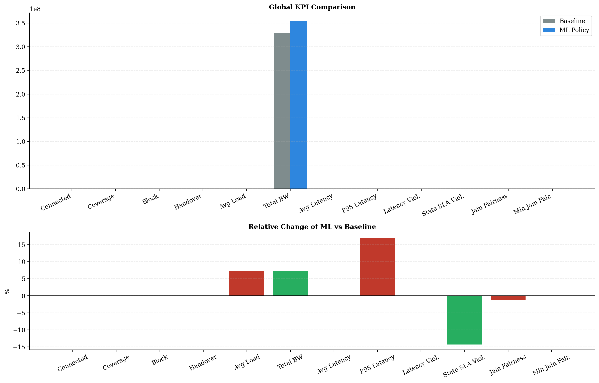
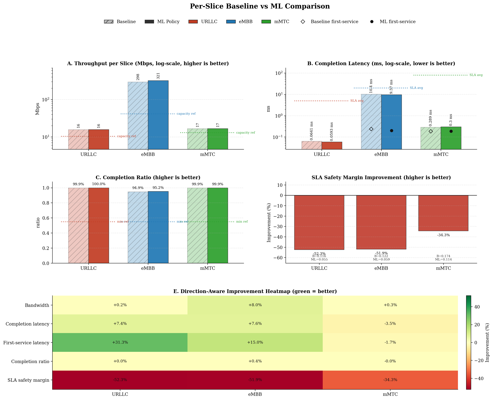
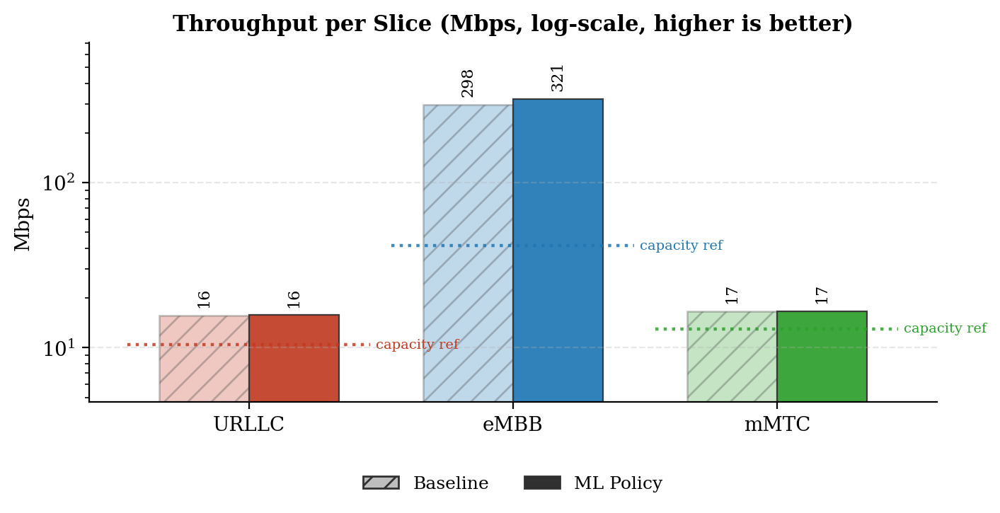
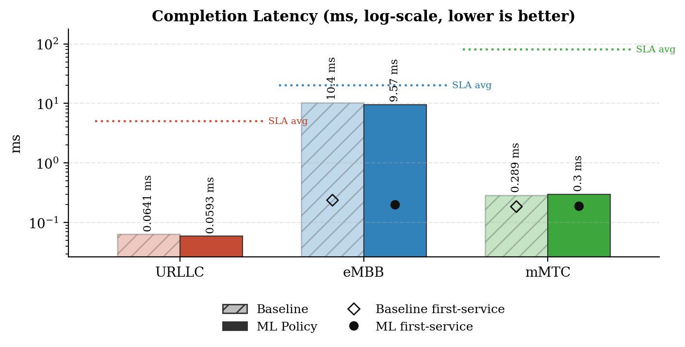
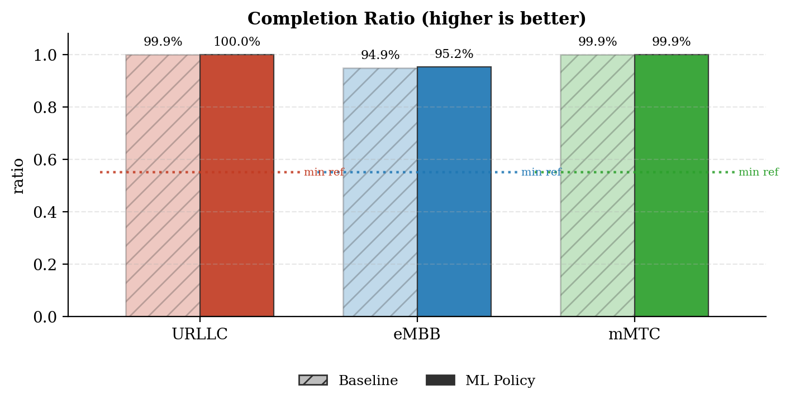
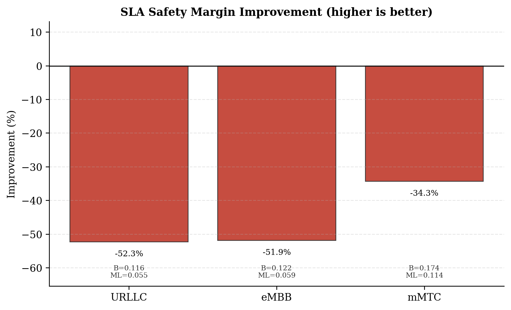
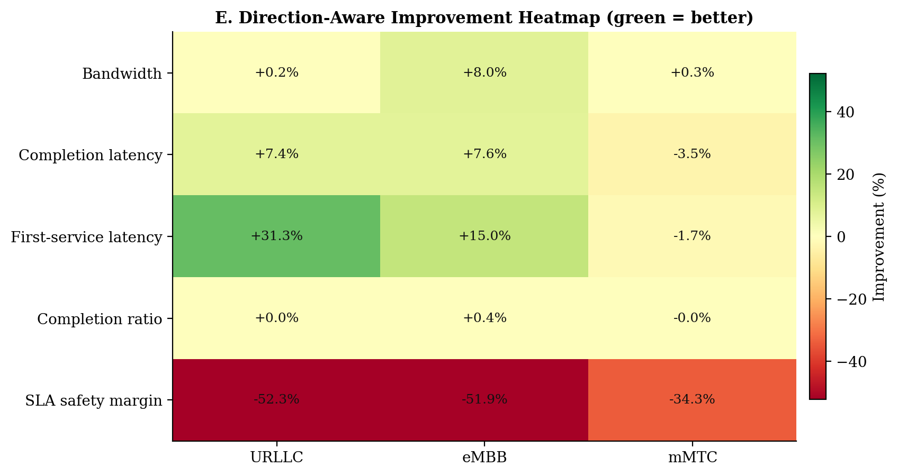
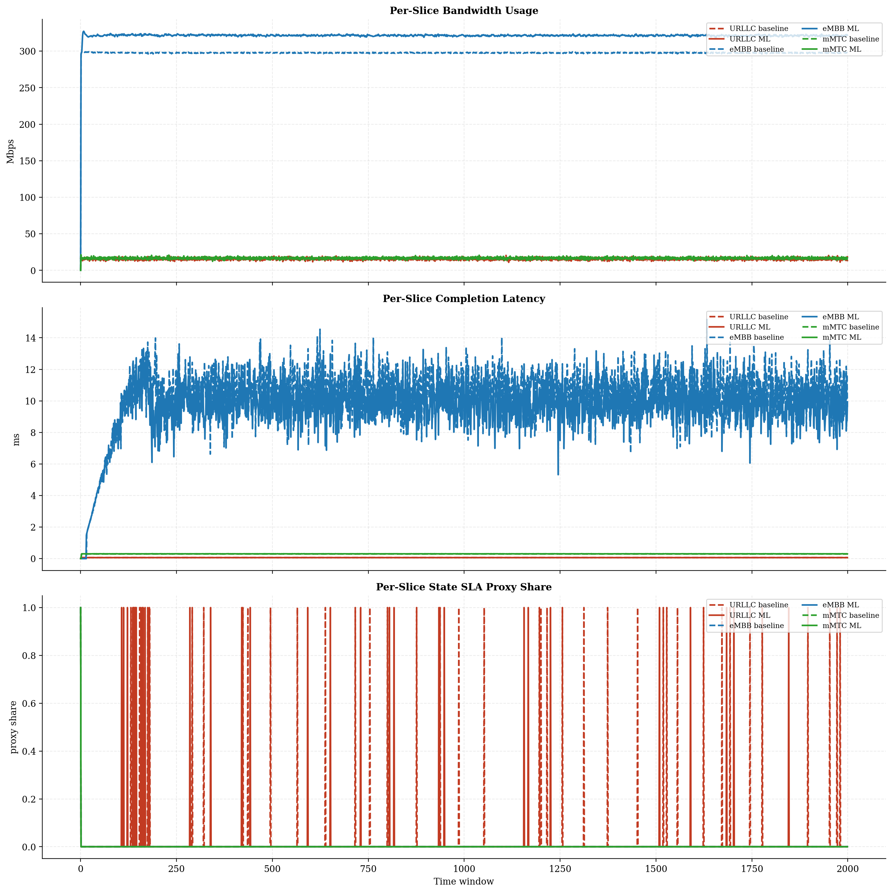
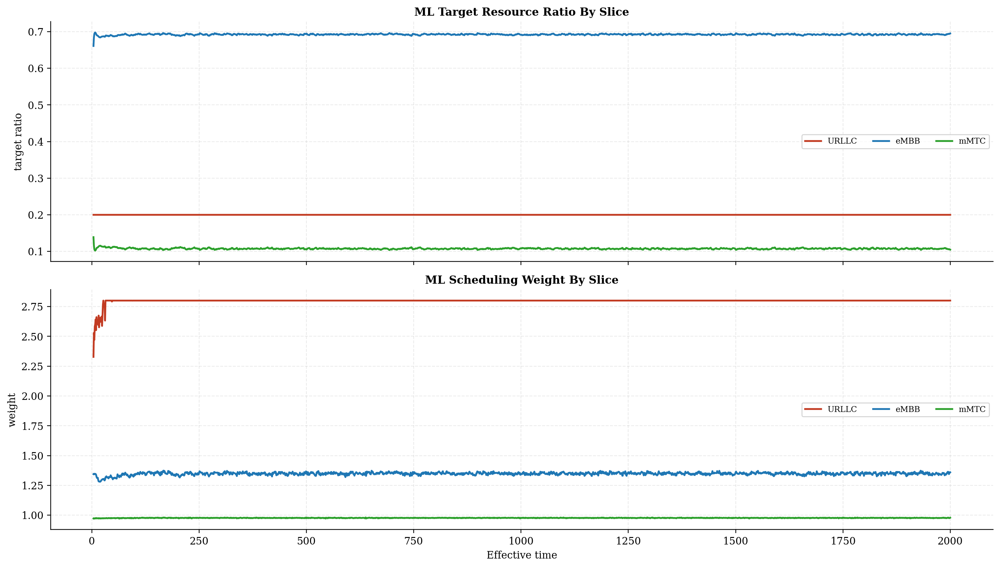
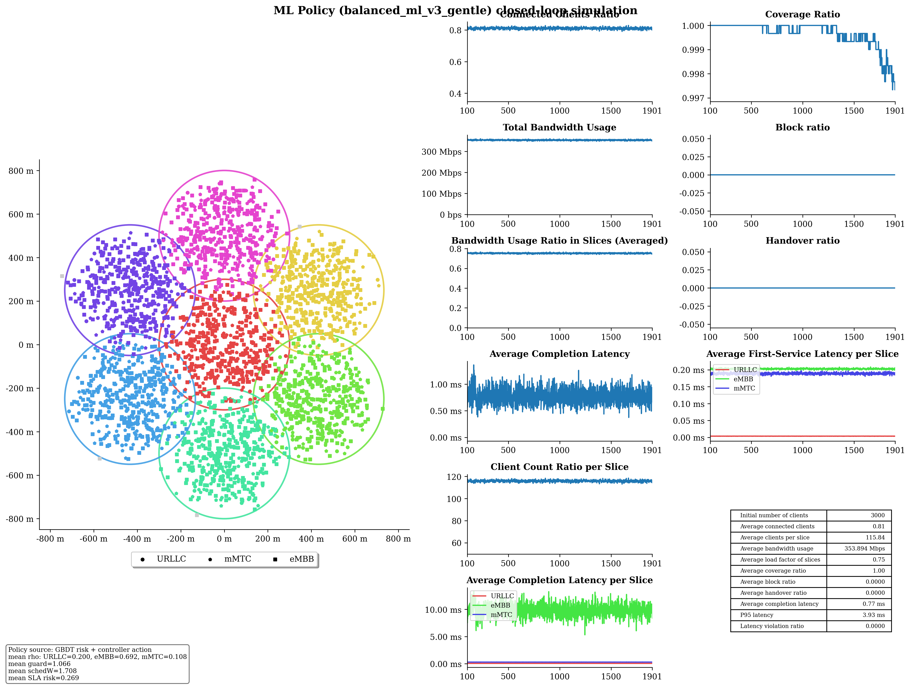

# Baseline vs ML Policy Report

## Run Summary

- Timestamp: `2026-05-08T01:22:46`
- Config: `C:\Users\LENOVO\Downloads\5G-Network-Slicing-main\5G-Network-Slicing-with-GBDT-ML-Policy\slicesim\scenario-light.yml`
- Model: `C:\Users\LENOVO\Downloads\5G-Network-Slicing-main\5G-Network-Slicing-with-GBDT-ML-Policy\models\sla_risk_gbdt`
- Controller type: `gbdt`
- Controller preset: `balanced_ml_v3_gentle`
- Broker enabled: `True`
- Broker preset: `forecasting_balanced`
- Seed: `7`

## Global KPI Comparison

| metric | baseline | ml_policy | delta_ml_minus_baseline | delta_pct |
|---|---|---|---|---|
| connected_clients_ratio | 0.8109 | 0.8104 | -0.0004 | -0.0518 |
| coverage_ratio | 0.9997 | 0.9996 | -0.0001 | -0.0102 |
| block_ratio | 0.0000 | 0.0000 | 0.0000 | 0.0000 |
| handover_ratio | 0.0000 | 0.0000 | 0.0000 | 0.0000 |
| avg_slice_load_ratio | 0.7019 | 0.7525 | 0.0506 | 7.2137 |
| total_bandwidth_usage | 329872017.9779 | 353667901.5655 | 23795883.5876 | 7.2137 |
| avg_latency_ms | 0.7499 | 0.7489 | -0.0010 | -0.1267 |
| p95_latency_ms | 3.2282 | 3.7769 | 0.5486 | 16.9948 |
| latency_violation_ratio | 0.0000 | 0.0000 | 0.0000 | 0.0000 |
| avg_state_sla_violation_share | 0.0070 | 0.0060 | -0.0010 | -14.2857 |
| bandwidth_jain_fairness | 0.4072 | 0.4019 | -0.0054 | -1.3194 |
| bandwidth_jain_fairness_min | 0.3333 | 0.3333 | 0.0000 | 0.0000 |

## Per-Slice Summary

| slice_name | avg_bandwidth_usage_mbps_baseline | avg_bandwidth_usage_mbps_ml | avg_bandwidth_usage_mbps_delta | avg_served_bandwidth_baseline | avg_served_bandwidth_ml | avg_served_bandwidth_delta | avg_completion_latency_ms_baseline | avg_completion_latency_ms_ml | avg_completion_latency_ms_delta | avg_first_service_latency_ms_baseline | avg_first_service_latency_ms_ml | avg_first_service_latency_ms_delta | avg_recorded_first_service_latency_ms_baseline | avg_recorded_first_service_latency_ms_ml | avg_recorded_first_service_latency_ms_delta | avg_bandwidth_share_baseline | avg_bandwidth_share_ml | avg_bandwidth_share_delta | zero_bandwidth_window_share_baseline | zero_bandwidth_window_share_ml | zero_bandwidth_window_share_delta | completion_ratio_baseline | completion_ratio_ml | completion_ratio_delta | completion_latency_violation_ratio_baseline | completion_latency_violation_ratio_ml | completion_latency_violation_ratio_delta | first_service_latency_violation_ratio_baseline | first_service_latency_violation_ratio_ml | first_service_latency_violation_ratio_delta | request_latency_violation_event_ratio_baseline | request_latency_violation_event_ratio_ml | request_latency_violation_event_ratio_delta | avg_state_sla_violation_share_baseline | avg_state_sla_violation_share_ml | avg_state_sla_violation_share_delta | avg_sla_safety_margin_baseline | avg_sla_safety_margin_ml | avg_sla_safety_margin_delta | avg_sla_safety_margin_improvement_pct |
|---|---|---|---|---|---|---|---|---|---|---|---|---|---|---|---|---|---|---|---|---|---|---|---|---|---|---|---|---|---|---|---|---|---|---|---|---|---|---|---|---|
| URLLC | 15.6931 | 15.7252 | 0.0321 | 140089.3951 | 139948.2494 | -141.1456 | 0.0641 | 0.0593 | -0.0047 | 0.0053 | 0.0037 | -0.0017 | 0.0053 | 0.0037 | -0.0017 | 0.0480 | 0.0449 | -0.0031 | 0.0000 | 0.0000 | 0.0000 | 0.9994 | 0.9996 | 0.0001 | 0.0000 | 0.0000 | 0.0000 | 0.0000 | 0.0000 | 0.0000 | 0.0000 | 0.0000 | 0.0000 | 0.0200 | 0.0170 | -0.0030 | 0.1163 | 0.0555 | -0.0608 | -52.3153 |
| eMBB | 297.5421 | 321.2640 | 23.7220 | 157817.0222 | 171936.3044 | 14119.2822 | 10.3558 | 9.5722 | -0.7836 | 0.2379 | 0.2023 | -0.0356 | 0.2384 | 0.2028 | -0.0356 | 0.9016 | 0.9080 | 0.0064 | 0.0005 | 0.0005 | 0.0000 | 0.9487 | 0.9522 | 0.0035 | 0.0000 | 0.0000 | 0.0000 | 0.0000 | 0.0000 | 0.0000 | 0.0000 | 0.0000 | 0.0000 | 0.0005 | 0.0005 | 0.0000 | 0.1220 | 0.0587 | -0.0633 | -51.8900 |
| mMTC | 16.6369 | 16.6787 | 0.0418 | 79968.1251 | 79977.8430 | 9.7178 | 0.2894 | 0.2996 | 0.0102 | 0.1856 | 0.1887 | 0.0031 | 0.1857 | 0.1888 | 0.0031 | 0.0504 | 0.0471 | -0.0033 | 0.0005 | 0.0005 | 0.0000 | 0.9990 | 0.9989 | -0.0000 | 0.0000 | 0.0000 | 0.0000 | 0.0000 | 0.0000 | 0.0000 | 0.0000 | 0.0000 | 0.0000 | 0.0005 | 0.0005 | 0.0000 | 0.1735 | 0.1140 | -0.0596 | -34.3223 |

## Per-Base-Station Summary

| base_station_id | avg_bandwidth_usage_mbps_baseline | avg_bandwidth_usage_mbps_ml | avg_bandwidth_usage_mbps_delta | avg_bandwidth_usage_mbps_delta_pct | avg_capacity_mbps_baseline | avg_capacity_mbps_ml | avg_capacity_mbps_delta | avg_capacity_mbps_delta_pct | avg_load_ratio_baseline | avg_load_ratio_ml | avg_load_ratio_delta | avg_load_ratio_delta_pct | avg_remaining_capacity_ratio_baseline | avg_remaining_capacity_ratio_ml | avg_remaining_capacity_ratio_delta | avg_remaining_capacity_ratio_delta_pct | avg_request_count_per_window_baseline | avg_request_count_per_window_ml | avg_request_count_per_window_delta | avg_request_count_per_window_delta_pct | total_request_count_baseline | total_request_count_ml | total_request_count_delta | total_request_count_delta_pct | avg_requested_usage_mbps_per_window_baseline | avg_requested_usage_mbps_per_window_ml | avg_requested_usage_mbps_per_window_delta | avg_requested_usage_mbps_per_window_delta_pct | avg_clients_seen_per_window_baseline | avg_clients_seen_per_window_ml | avg_clients_seen_per_window_delta | avg_clients_seen_per_window_delta_pct | avg_connected_events_per_window_baseline | avg_connected_events_per_window_ml | avg_connected_events_per_window_delta | avg_connected_events_per_window_delta_pct | avg_disconnected_events_per_window_baseline | avg_disconnected_events_per_window_ml | avg_disconnected_events_per_window_delta | avg_disconnected_events_per_window_delta_pct | avg_state_sla_violation_share_baseline | avg_state_sla_violation_share_ml | avg_state_sla_violation_share_delta | avg_state_sla_violation_share_delta_pct | avg_sla_safety_margin_baseline | avg_sla_safety_margin_ml | avg_sla_safety_margin_delta | avg_sla_safety_margin_delta_pct | avg_sla_breach_count_per_window_baseline | avg_sla_breach_count_per_window_ml | avg_sla_breach_count_per_window_delta | avg_sla_breach_count_per_window_delta_pct |
|---|---|---|---|---|---|---|---|---|---|---|---|---|---|---|---|---|---|---|---|---|---|---|---|---|---|---|---|---|---|---|---|---|---|---|---|---|---|---|---|---|---|---|---|---|---|---|---|---|---|---|---|---|
| BS_0 | 53.3119 | 59.0261 | 5.7142 | 10.7185 | 80.0000 | 80.0000 | 0.0000 | 0.0000 | 0.6664 | 0.7378 | 0.0714 | 10.7185 | 0.3336 | 0.2622 | -0.0714 | -21.4111 | 43.7430 | 44.1370 | 0.3940 | 0.9007 | 87486.0000 | 88274.0000 | 788.0000 | 0.9007 | 54.7834 | 60.7462 | 5.9628 | 10.8843 | 427.9760 | 427.9140 | -0.0620 | -0.0145 | 43.7450 | 44.1375 | 0.3925 | 0.8972 | 43.5670 | 43.9635 | 0.3965 | 0.9101 | 0.0070 | 0.0060 | -0.0010 | -14.2857 | 0.1373 | 0.0760 | -0.0612 | -44.6069 | 0.0210 | 0.0180 | -0.0030 | -14.2857 |
| BS_1 | 46.0239 | 49.0769 | 3.0530 | 6.6335 | 65.0000 | 65.0000 | 0.0000 | 0.0000 | 0.7081 | 0.7550 | 0.0470 | 6.6335 | 0.2919 | 0.2450 | -0.0470 | -16.0887 | 47.8315 | 48.0015 | 0.1700 | 0.3554 | 95663.0000 | 96003.0000 | 340.0000 | 0.3554 | 47.3828 | 50.6772 | 3.2944 | 6.9527 | 428.0150 | 427.7010 | -0.3140 | -0.0734 | 47.8340 | 48.0075 | 0.1735 | 0.3627 | 47.6575 | 47.8335 | 0.1760 | 0.3693 | 0.0070 | 0.0060 | -0.0010 | -14.2857 | 0.1373 | 0.0760 | -0.0612 | -44.6069 | 0.0210 | 0.0180 | -0.0030 | -14.2857 |
| BS_2 | 46.7751 | 49.5989 | 2.8238 | 6.0369 | 65.0000 | 65.0000 | 0.0000 | 0.0000 | 0.7196 | 0.7631 | 0.0434 | 6.0369 | 0.2804 | 0.2369 | -0.0434 | -15.4940 | 55.7160 | 55.5860 | -0.1300 | -0.2333 | 111432.0000 | 111172.0000 | -260.0000 | -0.2333 | 48.0037 | 51.2947 | 3.2911 | 6.8558 | 429.7770 | 426.9560 | -2.8210 | -0.6564 | 55.7195 | 55.5905 | -0.1290 | -0.2315 | 55.5500 | 55.4225 | -0.1275 | -0.2295 | 0.0070 | 0.0060 | -0.0010 | -14.2857 | 0.1373 | 0.0760 | -0.0612 | -44.6069 | 0.0210 | 0.0180 | -0.0030 | -14.2857 |
| BS_3 | 45.9166 | 48.8020 | 2.8854 | 6.2839 | 65.0000 | 65.0000 | 0.0000 | 0.0000 | 0.7064 | 0.7508 | 0.0444 | 6.2839 | 0.2936 | 0.2492 | -0.0444 | -15.1198 | 49.5915 | 50.0270 | 0.4355 | 0.8782 | 99183.0000 | 100054.0000 | 871.0000 | 0.8782 | 47.2753 | 50.5471 | 3.2718 | 6.9208 | 427.1820 | 428.0340 | 0.8520 | 0.1994 | 49.6135 | 50.0425 | 0.4290 | 0.8647 | 49.4345 | 49.8660 | 0.4315 | 0.8729 | 0.0070 | 0.0060 | -0.0010 | -14.2857 | 0.1373 | 0.0760 | -0.0612 | -44.6069 | 0.0210 | 0.0180 | -0.0030 | -14.2857 |
| BS_4 | 46.4604 | 49.4805 | 3.0201 | 6.5003 | 65.0000 | 65.0000 | 0.0000 | 0.0000 | 0.7148 | 0.7612 | 0.0465 | 6.5003 | 0.2852 | 0.2388 | -0.0465 | -16.2899 | 52.6305 | 53.0345 | 0.4040 | 0.7676 | 105261.0000 | 106069.0000 | 808.0000 | 0.7676 | 47.6393 | 51.2081 | 3.5688 | 7.4912 | 428.3275 | 429.0110 | 0.6835 | 0.1596 | 52.6435 | 53.0385 | 0.3950 | 0.7503 | 52.4725 | 52.8680 | 0.3955 | 0.7537 | 0.0070 | 0.0060 | -0.0010 | -14.2857 | 0.1373 | 0.0760 | -0.0612 | -44.6069 | 0.0210 | 0.0180 | -0.0030 | -14.2857 |
| BS_5 | 45.5145 | 48.5224 | 3.0080 | 6.6088 | 65.0000 | 65.0000 | 0.0000 | 0.0000 | 0.7002 | 0.7465 | 0.0463 | 6.6088 | 0.2998 | 0.2535 | -0.0463 | -15.4369 | 44.0365 | 44.4545 | 0.4180 | 0.9492 | 88073.0000 | 88909.0000 | 836.0000 | 0.9492 | 46.7816 | 50.3154 | 3.5338 | 7.5539 | 429.0265 | 429.5605 | 0.5340 | 0.1245 | 44.0430 | 44.4700 | 0.4270 | 0.9695 | 43.8640 | 44.2875 | 0.4235 | 0.9655 | 0.0070 | 0.0060 | -0.0010 | -14.2857 | 0.1373 | 0.0760 | -0.0612 | -44.6069 | 0.0210 | 0.0180 | -0.0030 | -14.2857 |
| BS_6 | 45.8696 | 49.1611 | 3.2915 | 7.1757 | 65.0000 | 65.0000 | 0.0000 | 0.0000 | 0.7057 | 0.7563 | 0.0506 | 7.1757 | 0.2943 | 0.2437 | -0.0506 | -17.2054 | 45.2490 | 45.8435 | 0.5945 | 1.3138 | 90498.0000 | 91687.0000 | 1189.0000 | 1.3138 | 47.2143 | 50.9676 | 3.7533 | 7.9495 | 428.7900 | 429.6115 | 0.8215 | 0.1916 | 45.2530 | 45.8500 | 0.5970 | 1.3192 | 45.0720 | 45.6660 | 0.5940 | 1.3179 | 0.0070 | 0.0060 | -0.0010 | -14.2857 | 0.1373 | 0.0760 | -0.0612 | -44.6069 | 0.0210 | 0.0180 | -0.0030 | -14.2857 |

## Per-Base-Station Slice SLA Summary

| base_station_id | slice_name | avg_bandwidth_usage_mbps_baseline | avg_bandwidth_usage_mbps_ml | avg_bandwidth_usage_mbps_delta | avg_bandwidth_usage_mbps_delta_pct | avg_slice_capacity_mbps_baseline | avg_slice_capacity_mbps_ml | avg_slice_capacity_mbps_delta | avg_slice_capacity_mbps_delta_pct | avg_slice_load_ratio_baseline | avg_slice_load_ratio_ml | avg_slice_load_ratio_delta | avg_slice_load_ratio_delta_pct | avg_remaining_capacity_ratio_baseline | avg_remaining_capacity_ratio_ml | avg_remaining_capacity_ratio_delta | avg_remaining_capacity_ratio_delta_pct | avg_request_count_per_window_baseline | avg_request_count_per_window_ml | avg_request_count_per_window_delta | avg_request_count_per_window_delta_pct | total_request_count_baseline | total_request_count_ml | total_request_count_delta | total_request_count_delta_pct | avg_requested_usage_mbps_per_window_baseline | avg_requested_usage_mbps_per_window_ml | avg_requested_usage_mbps_per_window_delta | avg_requested_usage_mbps_per_window_delta_pct | avg_clients_seen_per_window_baseline | avg_clients_seen_per_window_ml | avg_clients_seen_per_window_delta | avg_clients_seen_per_window_delta_pct | avg_state_sla_violation_share_baseline | avg_state_sla_violation_share_ml | avg_state_sla_violation_share_delta | avg_state_sla_violation_share_delta_pct | avg_sla_safety_margin_baseline | avg_sla_safety_margin_ml | avg_sla_safety_margin_delta | avg_sla_safety_margin_delta_pct | avg_sla_breach_count_per_window_baseline | avg_sla_breach_count_per_window_ml | avg_sla_breach_count_per_window_delta | avg_sla_breach_count_per_window_delta_pct |
|---|---|---|---|---|---|---|---|---|---|---|---|---|---|---|---|---|---|---|---|---|---|---|---|---|---|---|---|---|---|---|---|---|---|---|---|---|---|---|---|---|---|---|---|---|---|
| BS_0 | URLLC | 1.7623 | 1.7689 | 0.0066 | 0.3741 | 14.4000 | 15.9968 | 1.5968 | 11.0889 | 0.1224 | 0.1106 | -0.0118 | -9.6427 | 0.8776 | 0.8894 | 0.0118 | 1.3447 | 12.4970 | 12.6625 | 0.1655 | 1.3243 | 24994.0000 | 25325.0000 | 331.0000 | 1.3243 | 1.7623 | 1.7689 | 0.0066 | 0.3741 | 33.0000 | 33.3725 | 0.3725 | 1.1288 | 0.0200 | 0.0170 | -0.0030 | -15.0000 | 0.1163 | 0.0555 | -0.0608 | -52.3153 | 0.0200 | 0.0170 | -0.0030 | -15.0000 |
| BS_0 | eMBB | 49.3029 | 55.0193 | 5.7163 | 11.5943 | 49.6000 | 55.6628 | 6.0628 | 12.2233 | 0.9940 | 0.9884 | -0.0056 | -0.5657 | 0.0060 | 0.0116 | 0.0056 | 93.8969 | 3.1050 | 3.4145 | 0.3095 | 9.9678 | 6210.0000 | 6829.0000 | 619.0000 | 9.9678 | 50.7734 | 56.7382 | 5.9648 | 11.7480 | 290.7355 | 290.6065 | -0.1290 | -0.0444 | 0.0005 | 0.0005 | 0.0000 | 0.0000 | 0.1220 | 0.0587 | -0.0633 | -51.8900 | 0.0005 | 0.0005 | 0.0000 | 0.0000 |
| BS_0 | mMTC | 2.2466 | 2.2379 | -0.0087 | -0.3879 | 16.0000 | 8.3404 | -7.6596 | -47.8724 | 0.1404 | 0.2686 | 0.1282 | 91.3247 | 0.8596 | 0.7314 | -0.1282 | -14.9177 | 28.1410 | 28.0600 | -0.0810 | -0.2878 | 56282.0000 | 56120.0000 | -162.0000 | -0.2878 | 2.2477 | 2.2391 | -0.0086 | -0.3846 | 104.2405 | 103.9350 | -0.3055 | -0.2931 | 0.0005 | 0.0005 | 0.0000 | 0.0000 | 0.1735 | 0.1140 | -0.0596 | -34.3223 | 0.0005 | 0.0005 | 0.0000 | 0.0000 |
| BS_1 | URLLC | 2.3947 | 2.3990 | 0.0043 | 0.1805 | 10.4000 | 12.9948 | 2.5948 | 24.9500 | 0.2303 | 0.1846 | -0.0456 | -19.8157 | 0.7697 | 0.8154 | 0.0456 | 5.9276 | 17.1075 | 17.1325 | 0.0250 | 0.1461 | 34215.0000 | 34265.0000 | 50.0000 | 0.1461 | 2.3947 | 2.3990 | 0.0043 | 0.1805 | 46.0000 | 45.9515 | -0.0485 | -0.1054 | 0.0200 | 0.0170 | -0.0030 | -15.0000 | 0.1163 | 0.0555 | -0.0608 | -52.3153 | 0.0200 | 0.0170 | -0.0030 | -15.0000 |
| BS_1 | eMBB | 41.3795 | 44.4252 | 3.0457 | 7.3604 | 41.6000 | 45.0195 | 3.4195 | 8.2199 | 0.9947 | 0.9868 | -0.0079 | -0.7981 | 0.0053 | 0.0132 | 0.0079 | 149.7569 | 2.5980 | 2.7665 | 0.1685 | 6.4858 | 5196.0000 | 5533.0000 | 337.0000 | 6.4858 | 42.7370 | 46.0244 | 3.2873 | 7.6920 | 277.0150 | 276.7495 | -0.2655 | -0.0958 | 0.0005 | 0.0005 | 0.0000 | 0.0000 | 0.1220 | 0.0587 | -0.0633 | -51.8900 | 0.0005 | 0.0005 | 0.0000 | 0.0000 |
| BS_1 | mMTC | 2.2497 | 2.2527 | 0.0030 | 0.1334 | 13.0000 | 6.9857 | -6.0143 | -46.2637 | 0.1731 | 0.3230 | 0.1500 | 86.6613 | 0.8269 | 0.6770 | -0.1500 | -18.1359 | 28.1260 | 28.1025 | -0.0235 | -0.0836 | 56252.0000 | 56205.0000 | -47.0000 | -0.0836 | 2.2511 | 2.2539 | 0.0028 | 0.1225 | 105.0000 | 105.0000 | 0.0000 | 0.0000 | 0.0005 | 0.0005 | 0.0000 | 0.0000 | 0.1735 | 0.1140 | -0.0596 | -34.3223 | 0.0005 | 0.0005 | 0.0000 | 0.0000 |
| BS_2 | URLLC | 2.7440 | 2.7117 | -0.0323 | -1.1760 | 10.4000 | 12.9948 | 2.5948 | 24.9500 | 0.2638 | 0.2087 | -0.0551 | -20.8980 | 0.7362 | 0.7913 | 0.0551 | 7.4901 | 19.5815 | 19.3510 | -0.2305 | -1.1771 | 39163.0000 | 38702.0000 | -461.0000 | -1.1771 | 2.7440 | 2.7117 | -0.0323 | -1.1760 | 52.0000 | 51.6270 | -0.3730 | -0.7173 | 0.0200 | 0.0170 | -0.0030 | -15.0000 | 0.1163 | 0.0555 | -0.0608 | -52.3153 | 0.0200 | 0.0170 | -0.0030 | -15.0000 |
| BS_2 | eMBB | 41.3521 | 44.2165 | 2.8644 | 6.9269 | 41.6000 | 44.8278 | 3.2278 | 7.7590 | 0.9940 | 0.9863 | -0.0077 | -0.7755 | 0.0060 | 0.0137 | 0.0077 | 129.3621 | 2.5900 | 2.7915 | 0.2015 | 7.7799 | 5180.0000 | 5583.0000 | 403.0000 | 7.7799 | 42.5794 | 45.9109 | 3.3316 | 7.8243 | 254.3575 | 252.3290 | -2.0285 | -0.7975 | 0.0005 | 0.0005 | 0.0000 | 0.0000 | 0.1220 | 0.0587 | -0.0633 | -51.8900 | 0.0005 | 0.0005 | 0.0000 | 0.0000 |
| BS_2 | mMTC | 2.6790 | 2.6706 | -0.0084 | -0.3131 | 13.0000 | 7.1774 | -5.8226 | -44.7889 | 0.2061 | 0.3728 | 0.1667 | 80.9086 | 0.7939 | 0.6272 | -0.1667 | -21.0009 | 33.5445 | 33.4435 | -0.1010 | -0.3011 | 67089.0000 | 66887.0000 | -202.0000 | -0.3011 | 2.6803 | 2.6721 | -0.0082 | -0.3070 | 123.4195 | 123.0000 | -0.4195 | -0.3399 | 0.0005 | 0.0005 | 0.0000 | 0.0000 | 0.1735 | 0.1140 | -0.0596 | -34.3223 | 0.0005 | 0.0005 | 0.0000 | 0.0000 |
| BS_3 | URLLC | 1.8445 | 1.8448 | 0.0003 | 0.0150 | 10.4000 | 12.9948 | 2.5948 | 24.9500 | 0.1774 | 0.1420 | -0.0354 | -19.9555 | 0.8226 | 0.8580 | 0.0354 | 4.3023 | 13.1855 | 13.1895 | 0.0040 | 0.0303 | 26371.0000 | 26379.0000 | 8.0000 | 0.0303 | 1.8445 | 1.8448 | 0.0003 | 0.0150 | 34.9955 | 35.0000 | 0.0045 | 0.0129 | 0.0200 | 0.0170 | -0.0030 | -15.0000 | 0.1163 | 0.0555 | -0.0608 | -52.3153 | 0.0200 | 0.0170 | -0.0030 | -15.0000 |
| BS_3 | eMBB | 41.3654 | 44.2342 | 2.8688 | 6.9353 | 41.6000 | 44.7990 | 3.1990 | 7.6900 | 0.9944 | 0.9874 | -0.0070 | -0.7043 | 0.0056 | 0.0126 | 0.0070 | 124.1746 | 2.5865 | 2.7725 | 0.1860 | 7.1912 | 5173.0000 | 5545.0000 | 372.0000 | 7.1912 | 42.7225 | 45.9779 | 3.2554 | 7.6199 | 268.2445 | 269.0340 | 0.7895 | 0.2943 | 0.0005 | 0.0005 | 0.0000 | 0.0000 | 0.1220 | 0.0587 | -0.0633 | -51.8900 | 0.0005 | 0.0005 | 0.0000 | 0.0000 |
| BS_3 | mMTC | 2.7067 | 2.7230 | 0.0163 | 0.6012 | 13.0000 | 7.2062 | -5.7938 | -44.5681 | 0.2082 | 0.3785 | 0.1703 | 81.7782 | 0.7918 | 0.6215 | -0.1703 | -21.5045 | 33.8195 | 34.0650 | 0.2455 | 0.7259 | 67639.0000 | 68130.0000 | 491.0000 | 0.7259 | 2.7083 | 2.7244 | 0.0161 | 0.5960 | 123.9420 | 124.0000 | 0.0580 | 0.0468 | 0.0005 | 0.0005 | 0.0000 | 0.0000 | 0.1735 | 0.1140 | -0.0596 | -34.3223 | 0.0005 | 0.0005 | 0.0000 | 0.0000 |
| BS_4 | URLLC | 2.5345 | 2.5607 | 0.0261 | 1.0317 | 10.4000 | 12.9948 | 2.5948 | 24.9500 | 0.2437 | 0.1971 | -0.0466 | -19.1333 | 0.7563 | 0.8029 | 0.0466 | 6.1654 | 18.0380 | 18.3335 | 0.2955 | 1.6382 | 36076.0000 | 36667.0000 | 591.0000 | 1.6382 | 2.5345 | 2.5607 | 0.0261 | 1.0317 | 49.0000 | 48.9990 | -0.0010 | -0.0020 | 0.0200 | 0.0170 | -0.0030 | -15.0000 | 0.1163 | 0.0555 | -0.0608 | -52.3153 | 0.0200 | 0.0170 | -0.0030 | -15.0000 |
| BS_4 | eMBB | 41.3638 | 44.3683 | 3.0045 | 7.2637 | 41.6000 | 44.9009 | 3.3009 | 7.9349 | 0.9943 | 0.9881 | -0.0062 | -0.6254 | 0.0057 | 0.0119 | 0.0062 | 109.5247 | 2.5815 | 2.7620 | 0.1805 | 6.9921 | 5163.0000 | 5524.0000 | 361.0000 | 6.9921 | 42.5414 | 46.0944 | 3.5530 | 8.3518 | 264.0695 | 264.9470 | 0.8775 | 0.3323 | 0.0005 | 0.0005 | 0.0000 | 0.0000 | 0.1220 | 0.0587 | -0.0633 | -51.8900 | 0.0005 | 0.0005 | 0.0000 | 0.0000 |
| BS_4 | mMTC | 2.5621 | 2.5515 | -0.0106 | -0.4144 | 13.0000 | 7.1043 | -5.8957 | -45.3518 | 0.1971 | 0.3597 | 0.1626 | 82.4946 | 0.8029 | 0.6403 | -0.1626 | -20.2494 | 32.0110 | 31.9390 | -0.0720 | -0.2249 | 64022.0000 | 63878.0000 | -144.0000 | -0.2249 | 2.5634 | 2.5530 | -0.0104 | -0.4042 | 115.2580 | 115.0650 | -0.1930 | -0.1675 | 0.0005 | 0.0005 | 0.0000 | 0.0000 | 0.1735 | 0.1140 | -0.0596 | -34.3223 | 0.0005 | 0.0005 | 0.0000 | 0.0000 |
| BS_5 | URLLC | 1.9133 | 1.9016 | -0.0117 | -0.6126 | 10.4000 | 12.9948 | 2.5948 | 24.9500 | 0.1840 | 0.1463 | -0.0376 | -20.4554 | 0.8160 | 0.8537 | 0.0376 | 4.6117 | 13.7240 | 13.6145 | -0.1095 | -0.7979 | 27448.0000 | 27229.0000 | -219.0000 | -0.7979 | 1.9133 | 1.9016 | -0.0117 | -0.6126 | 36.0725 | 36.0000 | -0.0725 | -0.2010 | 0.0200 | 0.0170 | -0.0030 | -15.0000 | 0.1163 | 0.0555 | -0.0608 | -52.3153 | 0.0200 | 0.0170 | -0.0030 | -15.0000 |
| BS_5 | eMBB | 41.3890 | 44.3814 | 2.9925 | 7.2301 | 41.6000 | 45.0349 | 3.4349 | 8.2570 | 0.9949 | 0.9855 | -0.0095 | -0.9522 | 0.0051 | 0.0145 | 0.0095 | 186.7410 | 2.5830 | 2.8045 | 0.2215 | 8.5753 | 5166.0000 | 5609.0000 | 443.0000 | 8.5753 | 42.6550 | 46.1733 | 3.5184 | 8.2484 | 290.7305 | 290.9935 | 0.2630 | 0.0905 | 0.0005 | 0.0005 | 0.0000 | 0.0000 | 0.1220 | 0.0587 | -0.0633 | -51.8900 | 0.0005 | 0.0005 | 0.0000 | 0.0000 |
| BS_5 | mMTC | 2.2122 | 2.2394 | 0.0272 | 1.2303 | 13.0000 | 6.9703 | -6.0297 | -46.3825 | 0.1702 | 0.3218 | 0.1517 | 89.1233 | 0.8298 | 0.6782 | -0.1517 | -18.2759 | 27.7295 | 28.0355 | 0.3060 | 1.1035 | 55459.0000 | 56071.0000 | 612.0000 | 1.1035 | 2.2133 | 2.2405 | 0.0272 | 1.2284 | 102.2235 | 102.5670 | 0.3435 | 0.3360 | 0.0005 | 0.0005 | 0.0000 | 0.0000 | 0.1735 | 0.1140 | -0.0596 | -34.3223 | 0.0005 | 0.0005 | 0.0000 | 0.0000 |
| BS_6 | URLLC | 2.4997 | 2.5384 | 0.0388 | 1.5506 | 10.4000 | 12.9948 | 2.5948 | 24.9500 | 0.2404 | 0.1954 | -0.0450 | -18.7218 | 0.7596 | 0.8046 | 0.0450 | 5.9236 | 17.8830 | 18.0810 | 0.1980 | 1.1072 | 35766.0000 | 36162.0000 | 396.0000 | 1.1072 | 2.4997 | 2.5384 | 0.0388 | 1.5506 | 46.7255 | 47.0000 | 0.2745 | 0.5875 | 0.0200 | 0.0170 | -0.0030 | -15.0000 | 0.1163 | 0.0555 | -0.0608 | -52.3153 | 0.0200 | 0.0170 | -0.0030 | -15.0000 |
| BS_6 | eMBB | 41.3894 | 44.6190 | 3.2297 | 7.8032 | 41.6000 | 45.1645 | 3.5645 | 8.5685 | 0.9949 | 0.9879 | -0.0071 | -0.7087 | 0.0051 | 0.0121 | 0.0071 | 139.2634 | 2.5855 | 2.7715 | 0.1860 | 7.1940 | 5171.0000 | 5543.0000 | 372.0000 | 7.1940 | 42.7330 | 46.4242 | 3.6912 | 8.6377 | 291.3660 | 291.1785 | -0.1875 | -0.0644 | 0.0005 | 0.0005 | 0.0000 | 0.0000 | 0.1220 | 0.0587 | -0.0633 | -51.8900 | 0.0005 | 0.0005 | 0.0000 | 0.0000 |
| BS_6 | mMTC | 1.9806 | 2.0036 | 0.0230 | 1.1624 | 13.0000 | 6.8407 | -6.1593 | -47.3793 | 0.1524 | 0.2934 | 0.1410 | 92.5501 | 0.8476 | 0.7066 | -0.1410 | -16.6347 | 24.7805 | 24.9910 | 0.2105 | 0.8495 | 49561.0000 | 49982.0000 | 421.0000 | 0.8495 | 1.9816 | 2.0050 | 0.0234 | 1.1807 | 90.6985 | 91.4330 | 0.7345 | 0.8098 | 0.0005 | 0.0005 | 0.0000 | 0.0000 | 0.1735 | 0.1140 | -0.0596 | -34.3223 | 0.0005 | 0.0005 | 0.0000 | 0.0000 |

## Resource Allocation Summary

| slice_name | baseline_state_ratio | ml_state_ratio | ml_action_target_ratio_mean | ml_action_target_ratio_min | ml_action_target_ratio_max | ml_scheduling_weight_mean | ml_admission_guard_factor_mean | target_ratio_delta_vs_baseline_state |
|---|---|---|---|---|---|---|---|---|
| URLLC | 0.1629 | 0.1999 | 0.2000 | 0.2000 | 0.2000 | 2.7976 | 1.1472 | 0.0371 |
| eMBB | 0.6371 | 0.6922 | 0.6924 | 0.6582 | 0.7000 | 1.3483 | 1.0437 | 0.0552 |
| mMTC | 0.2000 | 0.1078 | 0.1076 | 0.1000 | 0.1418 | 0.9771 | 1.0082 | -0.0924 |

## Visual Comparison

### Global KPI View

### Per-Slice View

### Per-Slice Panel Images

#### Throughput per Slice

#### Latency per Slice

#### Completion Ratio

#### SLA Safety Margin Improvement

#### Improvement Heatmap

### Per-Slice Time-Series View

### ML Action Distribution

### ML Policy Simulation Snapshot

## Metric Notes

- `avg_state_sla_violation_share` is the per-slice state-level SLA violation ratio averaged from simulator state frames.
- `avg_sla_safety_margin` is the average distance to the active SLA boundary. Higher is better; negative means violation.
- `avg_sla_safety_margin_improvement_pct` is `(ML margin - baseline margin) / abs(baseline margin) * 100`.
- `request_latency_violation_event_ratio`, `completion_latency_violation_ratio`, and `first_service_latency_violation_ratio` are client-level latency-only metrics.
- A latency value of `0` can mean no recorded latency event for that slice/window. Check `completion_ratio` and request/completion counts before interpreting it as perfect latency.
- `bandwidth_jain_fairness` is Jain's fairness index over per-slice bandwidth usage per time window. Higher is more balanced, with `1.0` meaning equal usage across slices.

## Trade-off Notes

- URLLC completion latency changed by -0.00 ms and SLA safety margin changed by -0.0608 (-52.3%).
- eMBB average bandwidth usage changed by 23.722 Mbps and completion ratio changed by 0.0035.
- mMTC first-service latency changed by 0.00 ms and completion ratio changed by -0.0000.
- URLLC recorded first-service latency changed by -0.00 ms on windows with actual first-service events.
- Classic trade-off snapshot: if URLLC improved by 0.00 ms in latency, eMBB bandwidth moved by 23.722 Mbps.

## Artifacts

- Baseline raw states: `C:\Users\LENOVO\Downloads\5G-Network-Slicing-main\5G-Network-Slicing-with-GBDT-ML-Policy\FINAL_OUTPUT_light_seed7_20260508_005344\baseline_run\baseline_states.csv`
- ML raw states: `C:\Users\LENOVO\Downloads\5G-Network-Slicing-main\5G-Network-Slicing-with-GBDT-ML-Policy\FINAL_OUTPUT_light_seed7_20260508_005344\ml_run\online_states_raw.csv`
- ML broker forecasts: `C:\Users\LENOVO\Downloads\5G-Network-Slicing-main\5G-Network-Slicing-with-GBDT-ML-Policy\FINAL_OUTPUT_light_seed7_20260508_005344\ml_run\online_broker_forecasts.csv`
- ML broker feedback: `C:\Users\LENOVO\Downloads\5G-Network-Slicing-main\5G-Network-Slicing-with-GBDT-ML-Policy\FINAL_OUTPUT_light_seed7_20260508_005344\ml_run\online_broker_feedback.csv`
- Comparison CSV (global): `C:\Users\LENOVO\Downloads\5G-Network-Slicing-main\5G-Network-Slicing-with-GBDT-ML-Policy\FINAL_OUTPUT_light_seed7_20260508_005344\global_kpi_comparison.csv`
- Comparison CSV (per-slice): `C:\Users\LENOVO\Downloads\5G-Network-Slicing-main\5G-Network-Slicing-with-GBDT-ML-Policy\FINAL_OUTPUT_light_seed7_20260508_005344\per_slice_comparison.csv`
- Comparison CSV (per-base-station): `C:\Users\LENOVO\Downloads\5G-Network-Slicing-main\5G-Network-Slicing-with-GBDT-ML-Policy\FINAL_OUTPUT_light_seed7_20260508_005344\per_base_station_comparison.csv`
- Comparison CSV (per-base-station-slice): `C:\Users\LENOVO\Downloads\5G-Network-Slicing-main\5G-Network-Slicing-with-GBDT-ML-Policy\FINAL_OUTPUT_light_seed7_20260508_005344\per_base_station_slice_comparison.csv`
- Resource allocation CSV: `C:\Users\LENOVO\Downloads\5G-Network-Slicing-main\5G-Network-Slicing-with-GBDT-ML-Policy\FINAL_OUTPUT_light_seed7_20260508_005344\resource_allocation_summary.csv`
- ML action time-series CSV: `C:\Users\LENOVO\Downloads\5G-Network-Slicing-main\5G-Network-Slicing-with-GBDT-ML-Policy\FINAL_OUTPUT_light_seed7_20260508_005344\ml_action_ratio_timeseries.csv`
- Global KPI plot: `C:\Users\LENOVO\Downloads\5G-Network-Slicing-main\5G-Network-Slicing-with-GBDT-ML-Policy\FINAL_OUTPUT_light_seed7_20260508_005344\baseline_vs_ml_global_kpis.png`
- Per-slice bar plot: `C:\Users\LENOVO\Downloads\5G-Network-Slicing-main\5G-Network-Slicing-with-GBDT-ML-Policy\FINAL_OUTPUT_light_seed7_20260508_005344\baseline_vs_ml_per_slice_bars.png`
- Per-slice vector plot (SVG): `C:\Users\LENOVO\Downloads\5G-Network-Slicing-main\5G-Network-Slicing-with-GBDT-ML-Policy\FINAL_OUTPUT_light_seed7_20260508_005344\baseline_vs_ml_per_slice_bars.svg`
- Per-slice panel plot (Throughput per Slice): `C:\Users\LENOVO\Downloads\5G-Network-Slicing-main\5G-Network-Slicing-with-GBDT-ML-Policy\FINAL_OUTPUT_light_seed7_20260508_005344\baseline_vs_ml_per_slice_bars_throughput.png`
- Per-slice panel plot (Latency per Slice): `C:\Users\LENOVO\Downloads\5G-Network-Slicing-main\5G-Network-Slicing-with-GBDT-ML-Policy\FINAL_OUTPUT_light_seed7_20260508_005344\baseline_vs_ml_per_slice_bars_latency.png`
- Per-slice panel plot (Completion Ratio): `C:\Users\LENOVO\Downloads\5G-Network-Slicing-main\5G-Network-Slicing-with-GBDT-ML-Policy\FINAL_OUTPUT_light_seed7_20260508_005344\baseline_vs_ml_per_slice_bars_completion_ratio.png`
- Per-slice panel plot (SLA Safety Margin Improvement): `C:\Users\LENOVO\Downloads\5G-Network-Slicing-main\5G-Network-Slicing-with-GBDT-ML-Policy\FINAL_OUTPUT_light_seed7_20260508_005344\baseline_vs_ml_per_slice_bars_sla_margin_improvement.png`
- Per-slice panel plot (Improvement Heatmap): `C:\Users\LENOVO\Downloads\5G-Network-Slicing-main\5G-Network-Slicing-with-GBDT-ML-Policy\FINAL_OUTPUT_light_seed7_20260508_005344\baseline_vs_ml_per_slice_bars_improvement_heatmap.png`
- Per-slice time-series plot: `C:\Users\LENOVO\Downloads\5G-Network-Slicing-main\5G-Network-Slicing-with-GBDT-ML-Policy\FINAL_OUTPUT_light_seed7_20260508_005344\baseline_vs_ml_timeseries.png`
- ML action distribution plot: `C:\Users\LENOVO\Downloads\5G-Network-Slicing-main\5G-Network-Slicing-with-GBDT-ML-Policy\FINAL_OUTPUT_light_seed7_20260508_005344\ml_action_distribution.png`
- ML policy simulation graph: `C:\Users\LENOVO\Downloads\5G-Network-Slicing-main\5G-Network-Slicing-with-GBDT-ML-Policy\FINAL_OUTPUT_light_seed7_20260508_005344\ml_run\ml_policy_simulation.png`
