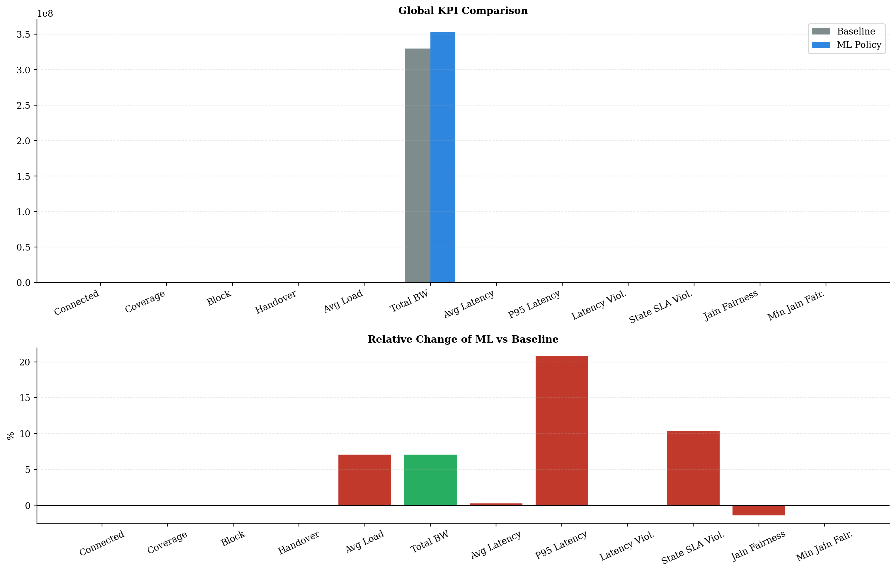
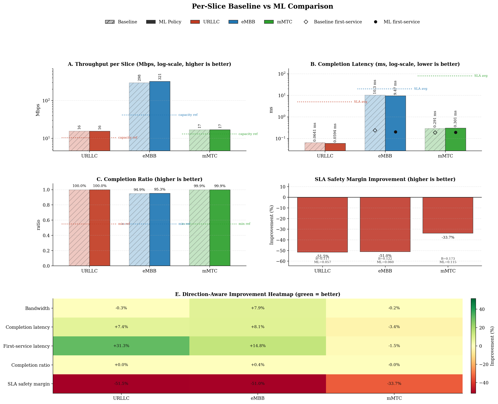
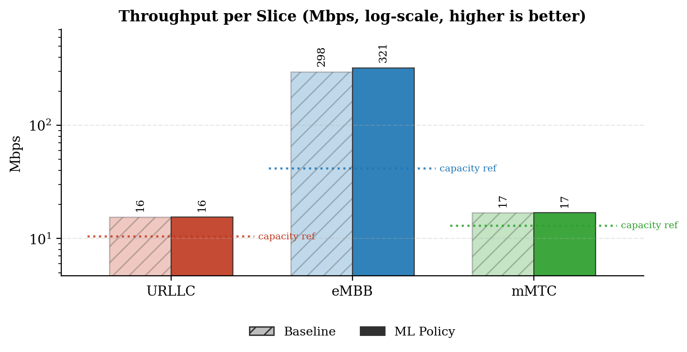
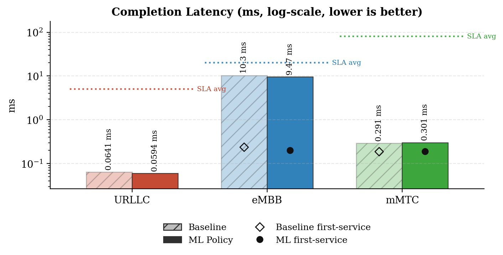
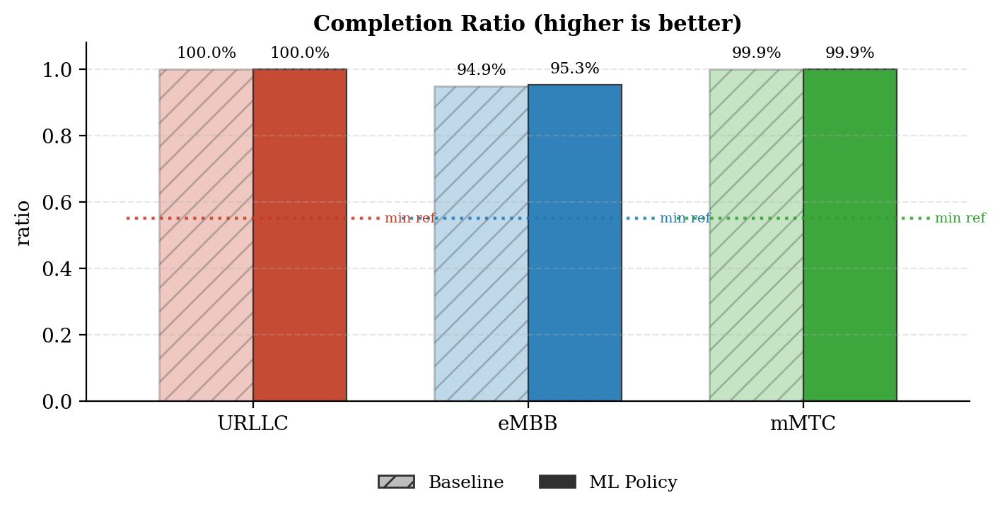
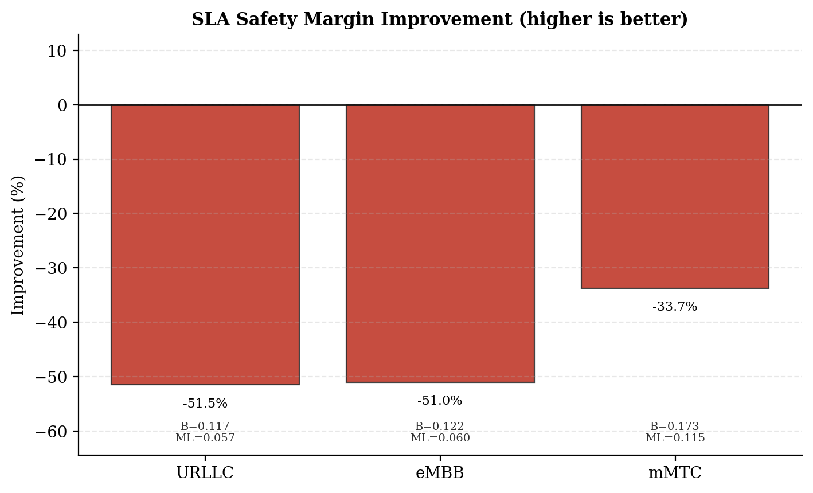
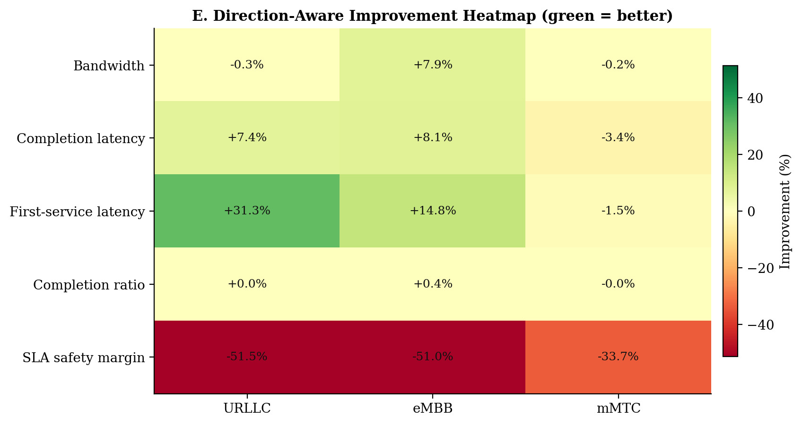
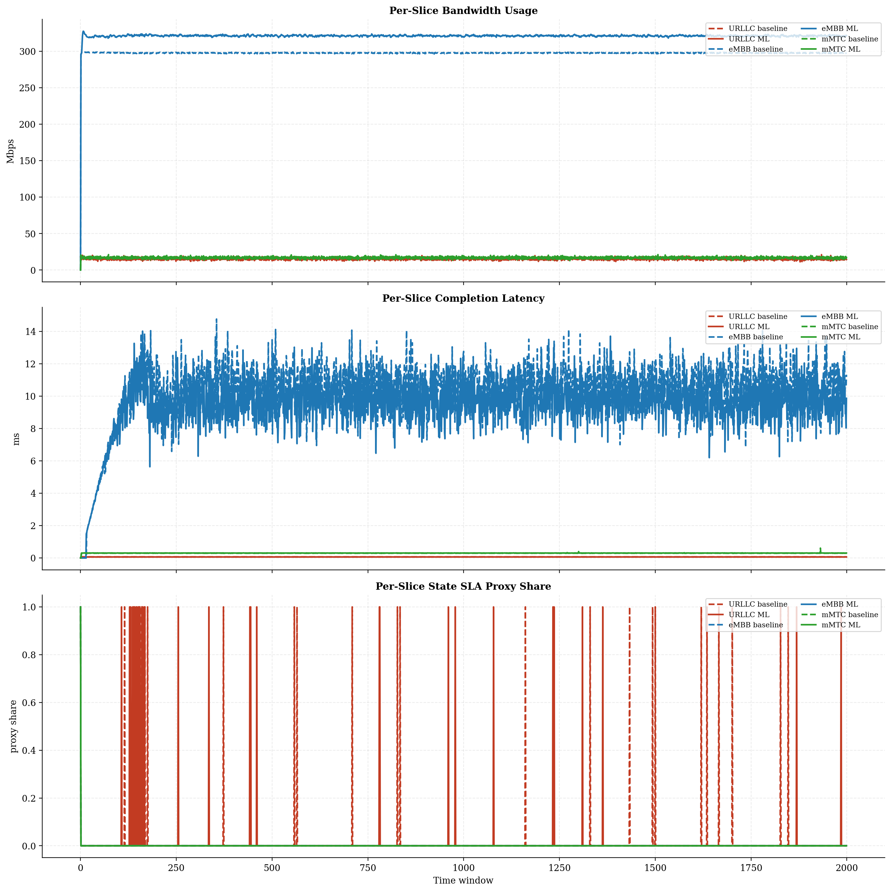
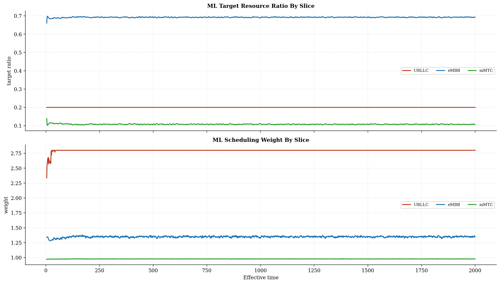
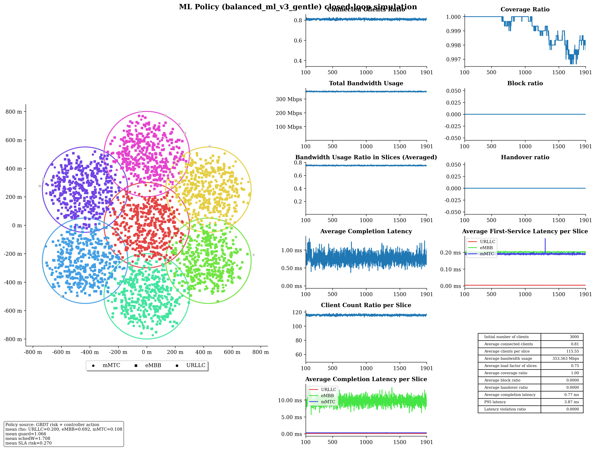

# Baseline vs ML Policy Report

## Run Summary

- Timestamp: `2026-05-08T20:22:46`
- Config: `C:\Users\LENOVO\Downloads\5G-Network-Slicing-main\5G-Network-Slicing-with-GBDT-ML-Policy\slicesim\scenario-light.yml`
- Model: `C:\Users\LENOVO\Downloads\5G-Network-Slicing-main\5G-Network-Slicing-with-GBDT-ML-Policy\models\sla_risk_gbdt`
- Controller type: `gbdt`
- Controller preset: `balanced_ml_v3_gentle`
- Broker enabled: `True`
- Broker preset: `forecasting_balanced`
- Seed: `999`

## Global KPI Comparison

| metric | baseline | ml_policy | delta_ml_minus_baseline | delta_pct |
|---|---|---|---|---|
| connected_clients_ratio | 0.8094 | 0.8085 | -0.0009 | -0.1092 |
| coverage_ratio | 0.9990 | 0.9992 | 0.0001 | 0.0150 |
| block_ratio | 0.0000 | 0.0000 | 0.0000 | 0.0000 |
| handover_ratio | 0.0000 | 0.0000 | 0.0000 | 0.0000 |
| avg_slice_load_ratio | 0.7021 | 0.7518 | 0.0497 | 7.0737 |
| total_bandwidth_usage | 329987926.1991 | 353330291.5588 | 23342365.3598 | 7.0737 |
| avg_latency_ms | 0.7459 | 0.7478 | 0.0019 | 0.2586 |
| p95_latency_ms | 3.1028 | 3.7495 | 0.6467 | 20.8415 |
| latency_violation_ratio | 0.0000 | 0.0000 | 0.0000 | 0.0000 |
| avg_state_sla_violation_share | 0.0048 | 0.0053 | 0.0005 | 10.3448 |
| bandwidth_jain_fairness | 0.4075 | 0.4019 | -0.0057 | -1.3909 |
| bandwidth_jain_fairness_min | 0.3333 | 0.3333 | 0.0000 | 0.0000 |

## Per-Slice Summary

| slice_name | avg_bandwidth_usage_mbps_baseline | avg_bandwidth_usage_mbps_ml | avg_bandwidth_usage_mbps_delta | avg_served_bandwidth_baseline | avg_served_bandwidth_ml | avg_served_bandwidth_delta | avg_completion_latency_ms_baseline | avg_completion_latency_ms_ml | avg_completion_latency_ms_delta | avg_first_service_latency_ms_baseline | avg_first_service_latency_ms_ml | avg_first_service_latency_ms_delta | avg_recorded_first_service_latency_ms_baseline | avg_recorded_first_service_latency_ms_ml | avg_recorded_first_service_latency_ms_delta | avg_bandwidth_share_baseline | avg_bandwidth_share_ml | avg_bandwidth_share_delta | zero_bandwidth_window_share_baseline | zero_bandwidth_window_share_ml | zero_bandwidth_window_share_delta | completion_ratio_baseline | completion_ratio_ml | completion_ratio_delta | completion_latency_violation_ratio_baseline | completion_latency_violation_ratio_ml | completion_latency_violation_ratio_delta | first_service_latency_violation_ratio_baseline | first_service_latency_violation_ratio_ml | first_service_latency_violation_ratio_delta | request_latency_violation_event_ratio_baseline | request_latency_violation_event_ratio_ml | request_latency_violation_event_ratio_delta | avg_state_sla_violation_share_baseline | avg_state_sla_violation_share_ml | avg_state_sla_violation_share_delta | avg_sla_safety_margin_baseline | avg_sla_safety_margin_ml | avg_sla_safety_margin_delta | avg_sla_safety_margin_improvement_pct |
|---|---|---|---|---|---|---|---|---|---|---|---|---|---|---|---|---|---|---|---|---|---|---|---|---|---|---|---|---|---|---|---|---|---|---|---|---|---|---|---|---|
| URLLC | 15.5454 | 15.5015 | -0.0439 | 139876.2687 | 139888.4412 | 12.1725 | 0.0641 | 0.0594 | -0.0048 | 0.0054 | 0.0037 | -0.0017 | 0.0054 | 0.0037 | -0.0017 | 0.0475 | 0.0443 | -0.0032 | 0.0000 | 0.0000 | 0.0000 | 0.9995 | 0.9995 | 0.0000 | 0.0000 | 0.0000 | 0.0000 | 0.0000 | 0.0000 | 0.0000 | 0.0000 | 0.0000 | 0.0000 | 0.0135 | 0.0150 | 0.0015 | 0.1168 | 0.0567 | -0.0601 | -51.4883 |
| eMBB | 297.5315 | 320.9573 | 23.4259 | 158633.6965 | 172671.8419 | 14038.1454 | 10.3020 | 9.4671 | -0.8349 | 0.2368 | 0.2017 | -0.0351 | 0.2373 | 0.2019 | -0.0354 | 0.9012 | 0.9080 | 0.0067 | 0.0005 | 0.0005 | 0.0000 | 0.9493 | 0.9530 | 0.0037 | 0.0000 | 0.0000 | 0.0000 | 0.0000 | 0.0000 | 0.0000 | 0.0000 | 0.0000 | 0.0000 | 0.0005 | 0.0005 | 0.0000 | 0.1217 | 0.0596 | -0.0621 | -51.0266 |
| mMTC | 16.9110 | 16.8714 | -0.0396 | 80087.3970 | 80027.5979 | -59.7991 | 0.2913 | 0.3013 | 0.0100 | 0.1874 | 0.1903 | 0.0029 | 0.1875 | 0.1904 | 0.0029 | 0.0512 | 0.0477 | -0.0035 | 0.0005 | 0.0005 | 0.0000 | 0.9990 | 0.9990 | -0.0000 | 0.0000 | 0.0000 | 0.0000 | 0.0000 | 0.0000 | 0.0000 | 0.0000 | 0.0000 | 0.0000 | 0.0005 | 0.0005 | 0.0000 | 0.1733 | 0.1148 | -0.0584 | -33.7230 |

## Per-Base-Station Summary

| base_station_id | avg_bandwidth_usage_mbps_baseline | avg_bandwidth_usage_mbps_ml | avg_bandwidth_usage_mbps_delta | avg_bandwidth_usage_mbps_delta_pct | avg_capacity_mbps_baseline | avg_capacity_mbps_ml | avg_capacity_mbps_delta | avg_capacity_mbps_delta_pct | avg_load_ratio_baseline | avg_load_ratio_ml | avg_load_ratio_delta | avg_load_ratio_delta_pct | avg_remaining_capacity_ratio_baseline | avg_remaining_capacity_ratio_ml | avg_remaining_capacity_ratio_delta | avg_remaining_capacity_ratio_delta_pct | avg_request_count_per_window_baseline | avg_request_count_per_window_ml | avg_request_count_per_window_delta | avg_request_count_per_window_delta_pct | total_request_count_baseline | total_request_count_ml | total_request_count_delta | total_request_count_delta_pct | avg_requested_usage_mbps_per_window_baseline | avg_requested_usage_mbps_per_window_ml | avg_requested_usage_mbps_per_window_delta | avg_requested_usage_mbps_per_window_delta_pct | avg_clients_seen_per_window_baseline | avg_clients_seen_per_window_ml | avg_clients_seen_per_window_delta | avg_clients_seen_per_window_delta_pct | avg_connected_events_per_window_baseline | avg_connected_events_per_window_ml | avg_connected_events_per_window_delta | avg_connected_events_per_window_delta_pct | avg_disconnected_events_per_window_baseline | avg_disconnected_events_per_window_ml | avg_disconnected_events_per_window_delta | avg_disconnected_events_per_window_delta_pct | avg_state_sla_violation_share_baseline | avg_state_sla_violation_share_ml | avg_state_sla_violation_share_delta | avg_state_sla_violation_share_delta_pct | avg_sla_safety_margin_baseline | avg_sla_safety_margin_ml | avg_sla_safety_margin_delta | avg_sla_safety_margin_delta_pct | avg_sla_breach_count_per_window_baseline | avg_sla_breach_count_per_window_ml | avg_sla_breach_count_per_window_delta | avg_sla_breach_count_per_window_delta_pct |
|---|---|---|---|---|---|---|---|---|---|---|---|---|---|---|---|---|---|---|---|---|---|---|---|---|---|---|---|---|---|---|---|---|---|---|---|---|---|---|---|---|---|---|---|---|---|---|---|---|---|---|---|---|
| BS_0 | 54.4259 | 59.9194 | 5.4935 | 10.0936 | 80.0000 | 80.0000 | 0.0000 | 0.0000 | 0.6803 | 0.7490 | 0.0687 | 10.0936 | 0.3197 | 0.2510 | -0.0687 | -21.4808 | 54.2445 | 54.9945 | 0.7500 | 1.3826 | 108489.0000 | 109989.0000 | 1500.0000 | 1.3826 | 55.6538 | 61.4094 | 5.7556 | 10.3418 | 429.5705 | 429.7275 | 0.1570 | 0.0365 | 54.2470 | 54.9970 | 0.7500 | 1.3826 | 54.0825 | 54.8290 | 0.7465 | 1.3803 | 0.0048 | 0.0053 | 0.0005 | 10.3448 | 0.1372 | 0.0770 | -0.0602 | -43.8756 | 0.0145 | 0.0160 | 0.0015 | 10.3448 |
| BS_1 | 46.2597 | 49.1176 | 2.8580 | 6.1781 | 65.0000 | 65.0000 | 0.0000 | 0.0000 | 0.7117 | 0.7557 | 0.0440 | 6.1781 | 0.2883 | 0.2443 | -0.0440 | -15.2504 | 50.8555 | 50.6575 | -0.1980 | -0.3893 | 101711.0000 | 101315.0000 | -396.0000 | -0.3893 | 47.6534 | 50.7561 | 3.1027 | 6.5109 | 428.7525 | 428.2270 | -0.5255 | -0.1226 | 50.8585 | 50.6610 | -0.1975 | -0.3883 | 50.6890 | 50.4855 | -0.2035 | -0.4015 | 0.0048 | 0.0053 | 0.0005 | 10.3448 | 0.1372 | 0.0770 | -0.0602 | -43.8756 | 0.0145 | 0.0160 | 0.0015 | 10.3448 |
| BS_2 | 46.1101 | 49.0603 | 2.9502 | 6.3982 | 65.0000 | 65.0000 | 0.0000 | 0.0000 | 0.7094 | 0.7548 | 0.0454 | 6.3982 | 0.2906 | 0.2452 | -0.0454 | -15.6180 | 49.1640 | 49.7205 | 0.5565 | 1.1319 | 98328.0000 | 99441.0000 | 1113.0000 | 1.1319 | 47.4193 | 50.7643 | 3.3450 | 7.0541 | 427.7700 | 429.2625 | 1.4925 | 0.3489 | 49.1715 | 49.7255 | 0.5540 | 1.1267 | 49.0025 | 49.5540 | 0.5515 | 1.1255 | 0.0048 | 0.0053 | 0.0005 | 10.3448 | 0.1372 | 0.0770 | -0.0602 | -43.8756 | 0.0145 | 0.0160 | 0.0015 | 10.3448 |
| BS_3 | 45.8800 | 48.5995 | 2.7195 | 5.9274 | 65.0000 | 65.0000 | 0.0000 | 0.0000 | 0.7058 | 0.7477 | 0.0418 | 5.9274 | 0.2942 | 0.2523 | -0.0418 | -14.2233 | 50.2060 | 50.1360 | -0.0700 | -0.1394 | 100412.0000 | 100272.0000 | -140.0000 | -0.1394 | 47.3579 | 50.2558 | 2.8979 | 6.1191 | 428.3020 | 428.2335 | -0.0685 | -0.0160 | 50.2125 | 50.1380 | -0.0745 | -0.1484 | 50.0415 | 49.9665 | -0.0750 | -0.1499 | 0.0048 | 0.0053 | 0.0005 | 10.3448 | 0.1372 | 0.0770 | -0.0602 | -43.8756 | 0.0145 | 0.0160 | 0.0015 | 10.3448 |
| BS_4 | 46.5053 | 49.5379 | 3.0326 | 6.5209 | 65.0000 | 65.0000 | 0.0000 | 0.0000 | 0.7155 | 0.7621 | 0.0467 | 6.5209 | 0.2845 | 0.2379 | -0.0467 | -16.3970 | 51.9185 | 51.9850 | 0.0665 | 0.1281 | 103837.0000 | 103970.0000 | 133.0000 | 0.1281 | 47.8191 | 51.2902 | 3.4711 | 7.2589 | 428.3615 | 428.4080 | 0.0465 | 0.0109 | 51.9265 | 51.9900 | 0.0635 | 0.1223 | 51.7560 | 51.8250 | 0.0690 | 0.1333 | 0.0048 | 0.0053 | 0.0005 | 10.3448 | 0.1372 | 0.0770 | -0.0602 | -43.8756 | 0.0145 | 0.0160 | 0.0015 | 10.3448 |
| BS_5 | 45.5106 | 48.7512 | 3.2405 | 7.1204 | 65.0000 | 65.0000 | 0.0000 | 0.0000 | 0.7002 | 0.7500 | 0.0499 | 7.1204 | 0.2998 | 0.2500 | -0.0499 | -16.6272 | 42.4735 | 42.5260 | 0.0525 | 0.1236 | 84947.0000 | 85052.0000 | 105.0000 | 0.1236 | 47.0636 | 50.6562 | 3.5926 | 7.6336 | 427.3435 | 427.0605 | -0.2830 | -0.0662 | 42.4805 | 42.5495 | 0.0690 | 0.1624 | 42.3035 | 42.3715 | 0.0680 | 0.1607 | 0.0048 | 0.0053 | 0.0005 | 10.3448 | 0.1372 | 0.0770 | -0.0602 | -43.8756 | 0.0145 | 0.0160 | 0.0015 | 10.3448 |
| BS_6 | 45.2963 | 48.3444 | 3.0481 | 6.7291 | 65.0000 | 65.0000 | 0.0000 | 0.0000 | 0.6969 | 0.7438 | 0.0469 | 6.7291 | 0.3031 | 0.2562 | -0.0469 | -15.4694 | 42.1730 | 41.8845 | -0.2885 | -0.6841 | 84346.0000 | 83769.0000 | -577.0000 | -0.6841 | 46.8254 | 50.1090 | 3.2836 | 7.0124 | 426.9990 | 426.6285 | -0.3705 | -0.0868 | 42.1980 | 41.9005 | -0.2975 | -0.7050 | 42.0200 | 41.7195 | -0.3005 | -0.7151 | 0.0048 | 0.0053 | 0.0005 | 10.3448 | 0.1372 | 0.0770 | -0.0602 | -43.8756 | 0.0145 | 0.0160 | 0.0015 | 10.3448 |

## Per-Base-Station Slice SLA Summary

| base_station_id | slice_name | avg_bandwidth_usage_mbps_baseline | avg_bandwidth_usage_mbps_ml | avg_bandwidth_usage_mbps_delta | avg_bandwidth_usage_mbps_delta_pct | avg_slice_capacity_mbps_baseline | avg_slice_capacity_mbps_ml | avg_slice_capacity_mbps_delta | avg_slice_capacity_mbps_delta_pct | avg_slice_load_ratio_baseline | avg_slice_load_ratio_ml | avg_slice_load_ratio_delta | avg_slice_load_ratio_delta_pct | avg_remaining_capacity_ratio_baseline | avg_remaining_capacity_ratio_ml | avg_remaining_capacity_ratio_delta | avg_remaining_capacity_ratio_delta_pct | avg_request_count_per_window_baseline | avg_request_count_per_window_ml | avg_request_count_per_window_delta | avg_request_count_per_window_delta_pct | total_request_count_baseline | total_request_count_ml | total_request_count_delta | total_request_count_delta_pct | avg_requested_usage_mbps_per_window_baseline | avg_requested_usage_mbps_per_window_ml | avg_requested_usage_mbps_per_window_delta | avg_requested_usage_mbps_per_window_delta_pct | avg_clients_seen_per_window_baseline | avg_clients_seen_per_window_ml | avg_clients_seen_per_window_delta | avg_clients_seen_per_window_delta_pct | avg_state_sla_violation_share_baseline | avg_state_sla_violation_share_ml | avg_state_sla_violation_share_delta | avg_state_sla_violation_share_delta_pct | avg_sla_safety_margin_baseline | avg_sla_safety_margin_ml | avg_sla_safety_margin_delta | avg_sla_safety_margin_delta_pct | avg_sla_breach_count_per_window_baseline | avg_sla_breach_count_per_window_ml | avg_sla_breach_count_per_window_delta | avg_sla_breach_count_per_window_delta_pct |
|---|---|---|---|---|---|---|---|---|---|---|---|---|---|---|---|---|---|---|---|---|---|---|---|---|---|---|---|---|---|---|---|---|---|---|---|---|---|---|---|---|---|---|---|---|---|
| BS_0 | URLLC | 2.4578 | 2.4765 | 0.0187 | 0.7613 | 14.4000 | 15.9968 | 1.5968 | 11.0889 | 0.1707 | 0.1548 | -0.0159 | -9.2922 | 0.8293 | 0.8452 | 0.0159 | 1.9124 | 17.5620 | 17.6995 | 0.1375 | 0.7829 | 35124.0000 | 35399.0000 | 275.0000 | 0.7829 | 2.4578 | 2.4765 | 0.0187 | 0.7613 | 47.8260 | 48.1870 | 0.3610 | 0.7548 | 0.0135 | 0.0150 | 0.0015 | 11.1111 | 0.1168 | 0.0567 | -0.0601 | -51.4883 | 0.0135 | 0.0150 | 0.0015 | 11.1111 |
| BS_0 | eMBB | 49.2703 | 54.7315 | 5.4612 | 11.0841 | 49.6000 | 55.4221 | 5.8221 | 11.7382 | 0.9934 | 0.9875 | -0.0059 | -0.5904 | 0.0066 | 0.0125 | 0.0059 | 88.2175 | 3.0415 | 3.4240 | 0.3825 | 12.5760 | 6083.0000 | 6848.0000 | 765.0000 | 12.5760 | 50.4971 | 56.2199 | 5.7228 | 11.3328 | 258.0665 | 256.7810 | -1.2855 | -0.4981 | 0.0005 | 0.0005 | 0.0000 | 0.0000 | 0.1217 | 0.0596 | -0.0621 | -51.0266 | 0.0005 | 0.0005 | 0.0000 | 0.0000 |
| BS_0 | mMTC | 2.6978 | 2.7114 | 0.0136 | 0.5050 | 16.0000 | 8.5811 | -7.4189 | -46.3684 | 0.1686 | 0.3165 | 0.1478 | 87.6818 | 0.8314 | 0.6835 | -0.1478 | -17.7826 | 33.6410 | 33.8710 | 0.2300 | 0.6837 | 67282.0000 | 67742.0000 | 460.0000 | 0.6837 | 2.6988 | 2.7130 | 0.0141 | 0.5234 | 123.6780 | 124.7595 | 1.0815 | 0.8744 | 0.0005 | 0.0005 | 0.0000 | 0.0000 | 0.1733 | 0.1148 | -0.0584 | -33.7230 | 0.0005 | 0.0005 | 0.0000 | 0.0000 |
| BS_1 | URLLC | 2.4226 | 2.3897 | -0.0329 | -1.3587 | 10.4000 | 12.9948 | 2.5948 | 24.9500 | 0.2329 | 0.1839 | -0.0490 | -21.0426 | 0.7671 | 0.8161 | 0.0490 | 6.3903 | 17.3005 | 17.0860 | -0.2145 | -1.2398 | 34601.0000 | 34172.0000 | -429.0000 | -1.2398 | 2.4226 | 2.3897 | -0.0329 | -1.3587 | 45.8945 | 45.8540 | -0.0405 | -0.0882 | 0.0135 | 0.0150 | 0.0015 | 11.1111 | 0.1168 | 0.0567 | -0.0601 | -51.4883 | 0.0135 | 0.0150 | 0.0015 | 11.1111 |
| BS_1 | eMBB | 41.3587 | 44.2688 | 2.9101 | 7.0363 | 41.6000 | 44.9205 | 3.3205 | 7.9821 | 0.9942 | 0.9855 | -0.0087 | -0.8796 | 0.0058 | 0.0145 | 0.0087 | 150.7345 | 2.6055 | 2.7725 | 0.1670 | 6.4095 | 5211.0000 | 5545.0000 | 334.0000 | 6.4095 | 42.7513 | 45.9056 | 3.1542 | 7.3781 | 269.0330 | 269.4470 | 0.4140 | 0.1539 | 0.0005 | 0.0005 | 0.0000 | 0.0000 | 0.1217 | 0.0596 | -0.0621 | -51.0266 | 0.0005 | 0.0005 | 0.0000 | 0.0000 |
| BS_1 | mMTC | 2.4784 | 2.4592 | -0.0192 | -0.7756 | 13.0000 | 7.0847 | -5.9153 | -45.5027 | 0.1906 | 0.3477 | 0.1571 | 82.3851 | 0.8094 | 0.6523 | -0.1571 | -19.4062 | 30.9495 | 30.7990 | -0.1505 | -0.4863 | 61899.0000 | 61598.0000 | -301.0000 | -0.4863 | 2.4795 | 2.4608 | -0.0187 | -0.7535 | 113.8250 | 112.9260 | -0.8990 | -0.7898 | 0.0005 | 0.0005 | 0.0000 | 0.0000 | 0.1733 | 0.1148 | -0.0584 | -33.7230 | 0.0005 | 0.0005 | 0.0000 | 0.0000 |
| BS_2 | URLLC | 2.3499 | 2.3466 | -0.0033 | -0.1416 | 10.4000 | 12.9948 | 2.5948 | 24.9500 | 0.2260 | 0.1806 | -0.0454 | -20.0711 | 0.7740 | 0.8194 | 0.0454 | 5.8590 | 16.7820 | 16.7840 | 0.0020 | 0.0119 | 33564.0000 | 33568.0000 | 4.0000 | 0.0119 | 2.3499 | 2.3466 | -0.0033 | -0.1416 | 44.9700 | 45.0185 | 0.0485 | 0.1078 | 0.0135 | 0.0150 | 0.0015 | 11.1111 | 0.1168 | 0.0567 | -0.0601 | -51.4883 | 0.0135 | 0.0150 | 0.0015 | 11.1111 |
| BS_2 | eMBB | 41.3731 | 44.2986 | 2.9255 | 7.0709 | 41.6000 | 44.9491 | 3.3491 | 8.0508 | 0.9945 | 0.9855 | -0.0091 | -0.9104 | 0.0055 | 0.0145 | 0.0091 | 166.0234 | 2.5890 | 2.7760 | 0.1870 | 7.2229 | 5178.0000 | 5552.0000 | 374.0000 | 7.2229 | 42.6810 | 46.0014 | 3.3204 | 7.7796 | 273.2895 | 273.5470 | 0.2575 | 0.0942 | 0.0005 | 0.0005 | 0.0000 | 0.0000 | 0.1217 | 0.0596 | -0.0621 | -51.0266 | 0.0005 | 0.0005 | 0.0000 | 0.0000 |
| BS_2 | mMTC | 2.3871 | 2.4152 | 0.0281 | 1.1767 | 13.0000 | 7.0561 | -5.9439 | -45.7224 | 0.1836 | 0.3428 | 0.1592 | 86.7095 | 0.8164 | 0.6572 | -0.1592 | -19.5029 | 29.7930 | 30.1605 | 0.3675 | 1.2335 | 59586.0000 | 60321.0000 | 735.0000 | 1.2335 | 2.3884 | 2.4163 | 0.0279 | 1.1697 | 109.5105 | 110.6970 | 1.1865 | 1.0835 | 0.0005 | 0.0005 | 0.0000 | 0.0000 | 0.1733 | 0.1148 | -0.0584 | -33.7230 | 0.0005 | 0.0005 | 0.0000 | 0.0000 |
| BS_3 | URLLC | 1.6691 | 1.6447 | -0.0243 | -1.4585 | 10.4000 | 12.9948 | 2.5948 | 24.9500 | 0.1605 | 0.1266 | -0.0339 | -21.1341 | 0.8395 | 0.8734 | 0.0339 | 4.0402 | 11.9695 | 11.7965 | -0.1730 | -1.4453 | 23939.0000 | 23593.0000 | -346.0000 | -1.4453 | 1.6691 | 1.6447 | -0.0243 | -1.4585 | 32.4420 | 32.1180 | -0.3240 | -0.9987 | 0.0135 | 0.0150 | 0.0015 | 11.1111 | 0.1168 | 0.0567 | -0.0601 | -51.4883 | 0.0135 | 0.0150 | 0.0015 | 11.1111 |
| BS_3 | eMBB | 41.3621 | 44.1088 | 2.7467 | 6.6405 | 41.6000 | 44.7313 | 3.1313 | 7.5273 | 0.9943 | 0.9860 | -0.0082 | -0.8279 | 0.0057 | 0.0140 | 0.0082 | 143.9407 | 2.5790 | 2.7980 | 0.2190 | 8.4917 | 5158.0000 | 5596.0000 | 438.0000 | 8.4917 | 42.8385 | 45.7635 | 2.9249 | 6.8278 | 265.1025 | 265.5050 | 0.4025 | 0.1518 | 0.0005 | 0.0005 | 0.0000 | 0.0000 | 0.1217 | 0.0596 | -0.0621 | -51.0266 | 0.0005 | 0.0005 | 0.0000 | 0.0000 |
| BS_3 | mMTC | 2.8488 | 2.8460 | -0.0028 | -0.0993 | 13.0000 | 7.2739 | -5.7261 | -44.0473 | 0.2191 | 0.3919 | 0.1728 | 78.8472 | 0.7809 | 0.6081 | -0.1728 | -22.1278 | 35.6575 | 35.5415 | -0.1160 | -0.3253 | 71315.0000 | 71083.0000 | -232.0000 | -0.3253 | 2.8503 | 2.8476 | -0.0027 | -0.0956 | 130.7575 | 130.6105 | -0.1470 | -0.1124 | 0.0005 | 0.0005 | 0.0000 | 0.0000 | 0.1733 | 0.1148 | -0.0584 | -33.7230 | 0.0005 | 0.0005 | 0.0000 | 0.0000 |
| BS_4 | URLLC | 2.7495 | 2.7577 | 0.0082 | 0.2997 | 10.4000 | 12.9948 | 2.5948 | 24.9500 | 0.2644 | 0.2122 | -0.0521 | -19.7239 | 0.7356 | 0.7878 | 0.0521 | 7.0885 | 19.7130 | 19.7360 | 0.0230 | 0.1167 | 39426.0000 | 39472.0000 | 46.0000 | 0.1167 | 2.7495 | 2.7577 | 0.0082 | 0.2997 | 51.7630 | 51.8820 | 0.1190 | 0.2299 | 0.0135 | 0.0150 | 0.0015 | 11.1111 | 0.1168 | 0.0567 | -0.0601 | -51.4883 | 0.0135 | 0.0150 | 0.0015 | 11.1111 |
| BS_4 | eMBB | 41.3772 | 44.4135 | 3.0363 | 7.3381 | 41.6000 | 44.9909 | 3.3909 | 8.1512 | 0.9946 | 0.9871 | -0.0075 | -0.7555 | 0.0054 | 0.0129 | 0.0075 | 140.3414 | 2.5790 | 2.8120 | 0.2330 | 9.0345 | 5158.0000 | 5624.0000 | 466.0000 | 9.0345 | 42.6900 | 46.1649 | 3.4749 | 8.1399 | 267.5985 | 267.5580 | -0.0405 | -0.0151 | 0.0005 | 0.0005 | 0.0000 | 0.0000 | 0.1217 | 0.0596 | -0.0621 | -51.0266 | 0.0005 | 0.0005 | 0.0000 | 0.0000 |
| BS_4 | mMTC | 2.3786 | 2.3666 | -0.0119 | -0.5023 | 13.0000 | 7.0143 | -5.9857 | -46.0439 | 0.1830 | 0.3379 | 0.1549 | 84.6642 | 0.8170 | 0.6621 | -0.1549 | -18.9596 | 29.6265 | 29.4370 | -0.1895 | -0.6396 | 59253.0000 | 58874.0000 | -379.0000 | -0.6396 | 2.3796 | 2.3676 | -0.0120 | -0.5047 | 109.0000 | 108.9680 | -0.0320 | -0.0294 | 0.0005 | 0.0005 | 0.0000 | 0.0000 | 0.1733 | 0.1148 | -0.0584 | -33.7230 | 0.0005 | 0.0005 | 0.0000 | 0.0000 |
| BS_5 | URLLC | 2.1707 | 2.1786 | 0.0079 | 0.3648 | 10.4000 | 12.9948 | 2.5948 | 24.9500 | 0.2087 | 0.1677 | -0.0410 | -19.6666 | 0.7913 | 0.8323 | 0.0410 | 5.1876 | 15.4965 | 15.5460 | 0.0495 | 0.3194 | 30993.0000 | 31092.0000 | 99.0000 | 0.3194 | 2.1707 | 2.1786 | 0.0079 | 0.3648 | 41.0000 | 41.0000 | 0.0000 | 0.0000 | 0.0135 | 0.0150 | 0.0015 | 11.1111 | 0.1168 | 0.0567 | -0.0601 | -51.4883 | 0.0135 | 0.0150 | 0.0015 | 11.1111 |
| BS_5 | eMBB | 41.3946 | 44.6440 | 3.2495 | 7.8500 | 41.6000 | 45.1901 | 3.5901 | 8.6300 | 0.9951 | 0.9879 | -0.0072 | -0.7219 | 0.0049 | 0.0121 | 0.0072 | 145.4676 | 2.6130 | 2.7890 | 0.1760 | 6.7356 | 5226.0000 | 5578.0000 | 352.0000 | 6.7356 | 42.9468 | 46.5482 | 3.6015 | 8.3859 | 297.0840 | 297.0950 | 0.0110 | 0.0037 | 0.0005 | 0.0005 | 0.0000 | 0.0000 | 0.1217 | 0.0596 | -0.0621 | -51.0266 | 0.0005 | 0.0005 | 0.0000 | 0.0000 |
| BS_5 | mMTC | 1.9453 | 1.9285 | -0.0168 | -0.8657 | 13.0000 | 6.8151 | -6.1849 | -47.5761 | 0.1496 | 0.2834 | 0.1337 | 89.3665 | 0.8504 | 0.7166 | -0.1337 | -15.7263 | 24.3640 | 24.1910 | -0.1730 | -0.7101 | 48728.0000 | 48382.0000 | -346.0000 | -0.7101 | 1.9461 | 1.9294 | -0.0167 | -0.8606 | 89.2595 | 88.9655 | -0.2940 | -0.3294 | 0.0005 | 0.0005 | 0.0000 | 0.0000 | 0.1733 | 0.1148 | -0.0584 | -33.7230 | 0.0005 | 0.0005 | 0.0000 | 0.0000 |
| BS_6 | URLLC | 1.7258 | 1.7076 | -0.0182 | -1.0531 | 10.4000 | 12.9948 | 2.5948 | 24.9500 | 0.1659 | 0.1314 | -0.0345 | -20.7967 | 0.8341 | 0.8686 | 0.0345 | 4.1377 | 12.3150 | 12.1650 | -0.1500 | -1.2180 | 24630.0000 | 24330.0000 | -300.0000 | -1.2180 | 1.7258 | 1.7076 | -0.0182 | -1.0531 | 32.0000 | 31.8130 | -0.1870 | -0.5844 | 0.0135 | 0.0150 | 0.0015 | 11.1111 | 0.1168 | 0.0567 | -0.0601 | -51.4883 | 0.0135 | 0.0150 | 0.0015 | 11.1111 |
| BS_6 | eMBB | 41.3955 | 44.4922 | 3.0967 | 7.4808 | 41.6000 | 45.0754 | 3.4754 | 8.3543 | 0.9951 | 0.9870 | -0.0081 | -0.8099 | 0.0049 | 0.0130 | 0.0081 | 163.9435 | 2.6275 | 2.8215 | 0.1940 | 7.3834 | 5255.0000 | 5643.0000 | 388.0000 | 7.3834 | 42.9235 | 46.2559 | 3.3324 | 7.7635 | 295.9990 | 296.8580 | 0.8590 | 0.2902 | 0.0005 | 0.0005 | 0.0000 | 0.0000 | 0.1217 | 0.0596 | -0.0621 | -51.0266 | 0.0005 | 0.0005 | 0.0000 | 0.0000 |
| BS_6 | mMTC | 2.1750 | 2.1445 | -0.0305 | -1.4011 | 13.0000 | 6.9298 | -6.0702 | -46.6938 | 0.1673 | 0.3099 | 0.1426 | 85.2454 | 0.8327 | 0.6901 | -0.1426 | -17.1279 | 27.2305 | 26.8980 | -0.3325 | -1.2211 | 54461.0000 | 53796.0000 | -665.0000 | -1.2211 | 2.1761 | 2.1455 | -0.0306 | -1.4070 | 99.0000 | 97.9575 | -1.0425 | -1.0530 | 0.0005 | 0.0005 | 0.0000 | 0.0000 | 0.1733 | 0.1148 | -0.0584 | -33.7230 | 0.0005 | 0.0005 | 0.0000 | 0.0000 |

## Resource Allocation Summary

| slice_name | baseline_state_ratio | ml_state_ratio | ml_action_target_ratio_mean | ml_action_target_ratio_min | ml_action_target_ratio_max | ml_scheduling_weight_mean | ml_admission_guard_factor_mean | target_ratio_delta_vs_baseline_state |
|---|---|---|---|---|---|---|---|---|
| URLLC | 0.1629 | 0.1999 | 0.2000 | 0.2000 | 0.2000 | 2.7979 | 1.1473 | 0.0371 |
| eMBB | 0.6371 | 0.6921 | 0.6922 | 0.6573 | 0.7000 | 1.3484 | 1.0435 | 0.0550 |
| mMTC | 0.2000 | 0.1080 | 0.1078 | 0.1000 | 0.1427 | 0.9773 | 1.0080 | -0.0922 |

## Visual Comparison

### Global KPI View

### Per-Slice View

### Per-Slice Panel Images

#### Throughput per Slice

#### Latency per Slice

#### Completion Ratio

#### SLA Safety Margin Improvement

#### Improvement Heatmap

### Per-Slice Time-Series View

### ML Action Distribution

### ML Policy Simulation Snapshot

## Metric Notes

- `avg_state_sla_violation_share` is the per-slice state-level SLA violation ratio averaged from simulator state frames.
- `avg_sla_safety_margin` is the average distance to the active SLA boundary. Higher is better; negative means violation.
- `avg_sla_safety_margin_improvement_pct` is `(ML margin - baseline margin) / abs(baseline margin) * 100`.
- `request_latency_violation_event_ratio`, `completion_latency_violation_ratio`, and `first_service_latency_violation_ratio` are client-level latency-only metrics.
- A latency value of `0` can mean no recorded latency event for that slice/window. Check `completion_ratio` and request/completion counts before interpreting it as perfect latency.
- `bandwidth_jain_fairness` is Jain's fairness index over per-slice bandwidth usage per time window. Higher is more balanced, with `1.0` meaning equal usage across slices.

## Trade-off Notes

- URLLC completion latency changed by -0.00 ms and SLA safety margin changed by -0.0601 (-51.5%).
- eMBB average bandwidth usage changed by 23.426 Mbps and completion ratio changed by 0.0037.
- mMTC first-service latency changed by 0.00 ms and completion ratio changed by -0.0000.
- URLLC recorded first-service latency changed by -0.00 ms on windows with actual first-service events.
- Classic trade-off snapshot: if URLLC improved by 0.00 ms in latency, eMBB bandwidth moved by 23.426 Mbps.

## Artifacts

- Baseline raw states: `C:\Users\LENOVO\Downloads\5G-Network-Slicing-main\5G-Network-Slicing-with-GBDT-ML-Policy\FINAL_OUTPUT_light_seed999_20260508_180957\baseline_run\baseline_states.csv`
- ML raw states: `C:\Users\LENOVO\Downloads\5G-Network-Slicing-main\5G-Network-Slicing-with-GBDT-ML-Policy\FINAL_OUTPUT_light_seed999_20260508_180957\ml_run\online_states_raw.csv`
- ML broker forecasts: `C:\Users\LENOVO\Downloads\5G-Network-Slicing-main\5G-Network-Slicing-with-GBDT-ML-Policy\FINAL_OUTPUT_light_seed999_20260508_180957\ml_run\online_broker_forecasts.csv`
- ML broker feedback: `C:\Users\LENOVO\Downloads\5G-Network-Slicing-main\5G-Network-Slicing-with-GBDT-ML-Policy\FINAL_OUTPUT_light_seed999_20260508_180957\ml_run\online_broker_feedback.csv`
- Comparison CSV (global): `C:\Users\LENOVO\Downloads\5G-Network-Slicing-main\5G-Network-Slicing-with-GBDT-ML-Policy\FINAL_OUTPUT_light_seed999_20260508_180957\global_kpi_comparison.csv`
- Comparison CSV (per-slice): `C:\Users\LENOVO\Downloads\5G-Network-Slicing-main\5G-Network-Slicing-with-GBDT-ML-Policy\FINAL_OUTPUT_light_seed999_20260508_180957\per_slice_comparison.csv`
- Comparison CSV (per-base-station): `C:\Users\LENOVO\Downloads\5G-Network-Slicing-main\5G-Network-Slicing-with-GBDT-ML-Policy\FINAL_OUTPUT_light_seed999_20260508_180957\per_base_station_comparison.csv`
- Comparison CSV (per-base-station-slice): `C:\Users\LENOVO\Downloads\5G-Network-Slicing-main\5G-Network-Slicing-with-GBDT-ML-Policy\FINAL_OUTPUT_light_seed999_20260508_180957\per_base_station_slice_comparison.csv`
- Resource allocation CSV: `C:\Users\LENOVO\Downloads\5G-Network-Slicing-main\5G-Network-Slicing-with-GBDT-ML-Policy\FINAL_OUTPUT_light_seed999_20260508_180957\resource_allocation_summary.csv`
- ML action time-series CSV: `C:\Users\LENOVO\Downloads\5G-Network-Slicing-main\5G-Network-Slicing-with-GBDT-ML-Policy\FINAL_OUTPUT_light_seed999_20260508_180957\ml_action_ratio_timeseries.csv`
- Global KPI plot: `C:\Users\LENOVO\Downloads\5G-Network-Slicing-main\5G-Network-Slicing-with-GBDT-ML-Policy\FINAL_OUTPUT_light_seed999_20260508_180957\baseline_vs_ml_global_kpis.png`
- Per-slice bar plot: `C:\Users\LENOVO\Downloads\5G-Network-Slicing-main\5G-Network-Slicing-with-GBDT-ML-Policy\FINAL_OUTPUT_light_seed999_20260508_180957\baseline_vs_ml_per_slice_bars.png`
- Per-slice vector plot (SVG): `C:\Users\LENOVO\Downloads\5G-Network-Slicing-main\5G-Network-Slicing-with-GBDT-ML-Policy\FINAL_OUTPUT_light_seed999_20260508_180957\baseline_vs_ml_per_slice_bars.svg`
- Per-slice panel plot (Throughput per Slice): `C:\Users\LENOVO\Downloads\5G-Network-Slicing-main\5G-Network-Slicing-with-GBDT-ML-Policy\FINAL_OUTPUT_light_seed999_20260508_180957\baseline_vs_ml_per_slice_bars_throughput.png`
- Per-slice panel plot (Latency per Slice): `C:\Users\LENOVO\Downloads\5G-Network-Slicing-main\5G-Network-Slicing-with-GBDT-ML-Policy\FINAL_OUTPUT_light_seed999_20260508_180957\baseline_vs_ml_per_slice_bars_latency.png`
- Per-slice panel plot (Completion Ratio): `C:\Users\LENOVO\Downloads\5G-Network-Slicing-main\5G-Network-Slicing-with-GBDT-ML-Policy\FINAL_OUTPUT_light_seed999_20260508_180957\baseline_vs_ml_per_slice_bars_completion_ratio.png`
- Per-slice panel plot (SLA Safety Margin Improvement): `C:\Users\LENOVO\Downloads\5G-Network-Slicing-main\5G-Network-Slicing-with-GBDT-ML-Policy\FINAL_OUTPUT_light_seed999_20260508_180957\baseline_vs_ml_per_slice_bars_sla_margin_improvement.png`
- Per-slice panel plot (Improvement Heatmap): `C:\Users\LENOVO\Downloads\5G-Network-Slicing-main\5G-Network-Slicing-with-GBDT-ML-Policy\FINAL_OUTPUT_light_seed999_20260508_180957\baseline_vs_ml_per_slice_bars_improvement_heatmap.png`
- Per-slice time-series plot: `C:\Users\LENOVO\Downloads\5G-Network-Slicing-main\5G-Network-Slicing-with-GBDT-ML-Policy\FINAL_OUTPUT_light_seed999_20260508_180957\baseline_vs_ml_timeseries.png`
- ML action distribution plot: `C:\Users\LENOVO\Downloads\5G-Network-Slicing-main\5G-Network-Slicing-with-GBDT-ML-Policy\FINAL_OUTPUT_light_seed999_20260508_180957\ml_action_distribution.png`
- ML policy simulation graph: `C:\Users\LENOVO\Downloads\5G-Network-Slicing-main\5G-Network-Slicing-with-GBDT-ML-Policy\FINAL_OUTPUT_light_seed999_20260508_180957\ml_run\ml_policy_simulation.png`
